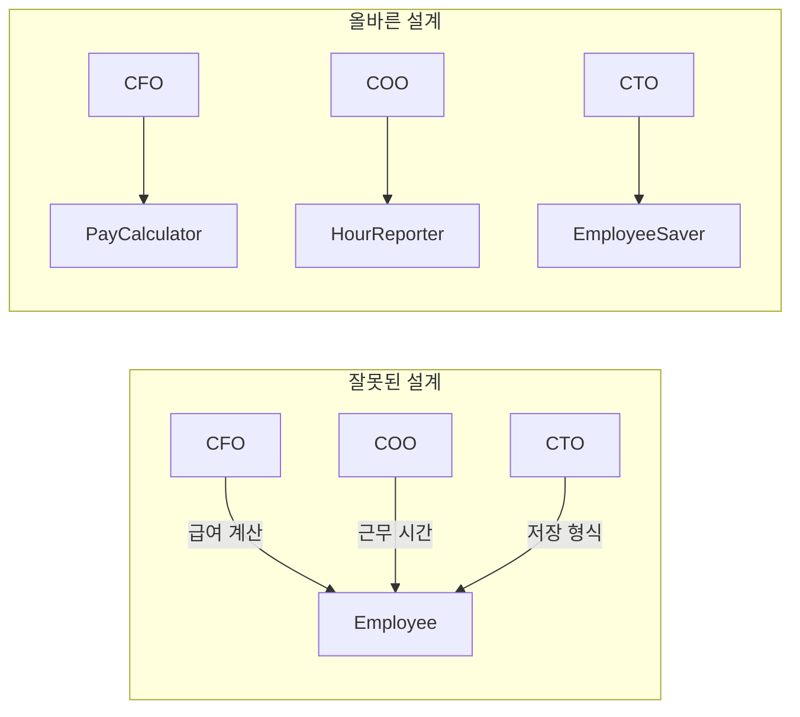
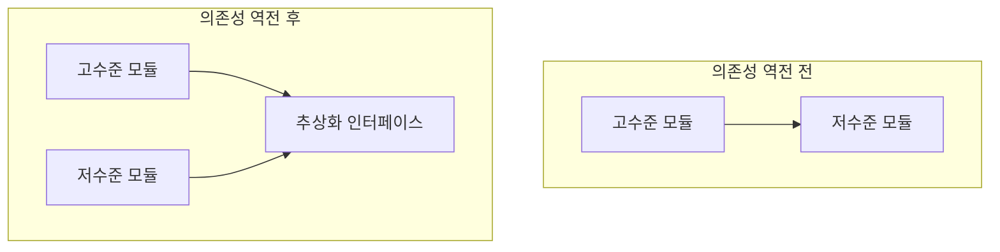
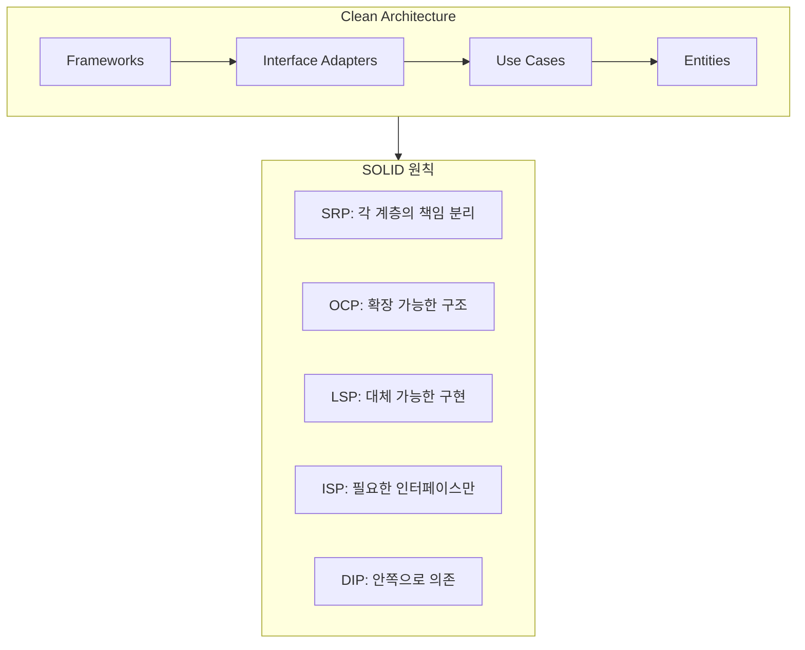

SOLID 원칙은 객체 지향 설계의 기초가 되는 다섯 가지 원칙이다. 이 원칙들은 2000년대 초반 Robert C. Martin에 의해 체계화되었으며, 오늘날 소프트웨어 개발자들에게 필수적인 지식이 되었다.

## SOLID의 탄생

### 원칙들의 기원

SOLID의 각 원칙은 서로 다른 시기에 서로 다른 사람들에 의해 제안되었다:

| 원칙 | 제안자 | 시기 |
|------|--------|------|
| SRP | Robert C. Martin | 2003 |
| OCP | Bertrand Meyer | 1988 |
| LSP | Barbara Liskov | 1988 |
| ISP | Robert C. Martin | 1996 |
| DIP | Robert C. Martin | 1996 |

### SOLID 약어의 탄생

2004년경, Michael Feathers는 이 다섯 가지 원칙의 첫 글자를 따서 **SOLID**라는 약어를 제안했다. 마틴은 이 약어를 채택하여 널리 알렸다.

```
S - Single Responsibility Principle (단일 책임 원칙)
O - Open-Closed Principle (개방-폐쇄 원칙)
L - Liskov Substitution Principle (리스코프 치환 원칙)
I - Interface Segregation Principle (인터페이스 분리 원칙)
D - Dependency Inversion Principle (의존성 역전 원칙)
```

## SOLID의 목적

### 중간 수준의 소프트웨어 구조

마틴은 SOLID 원칙이 **중간 수준(mid-level)**의 소프트웨어 구조에 적용된다고 말한다. 여기서 중간 수준이란:

- **클래스** 수준
- **모듈** 수준  
- **함수를 어떻게 클래스로 묶을 것인가**

이 수준의 설계가 잘 되면:

1. **변경에 유연**해진다
2. **이해하기 쉬워**진다
3. **재사용이 가능**해진다


### 좋은 벽돌이 좋은 건물을 만든다

마틴은 비유를 사용한다:

> "좋은 벽돌을 사용해도 건물의 아키텍처를 엉망으로 만들 수 있다. 그래서 컴포넌트 원칙이 필요하다. 하지만 형편없는 벽돌로는 좋은 건물을 지을 수 없다."

SOLID는 **좋은 벽돌(클래스, 모듈)**을 만드는 방법이다.

## 다섯 가지 원칙 개요

### SRP: 단일 책임 원칙

> 각 모듈은 **하나의 액터**에 대해서만 책임져야 한다.

흔히 "클래스는 하나의 일만 해야 한다"라고 오해되지만, 실제 의미는 **변경의 이유가 하나여야 한다**는 것이다.



### OCP: 개방-폐쇄 원칙

> 소프트웨어 엔터티는 **확장에는 열려** 있어야 하고, **수정에는 닫혀** 있어야 한다.

기존 코드를 수정하지 않고도 새로운 기능을 추가할 수 있어야 한다.

```java
// OCP 적용 전 - 수정에 열려있음
class ReportGenerator {
    void generate(String type) {
        if (type.equals("PDF")) { /* PDF 생성 */ }
        else if (type.equals("Excel")) { /* Excel 생성 */ }
        // 새 형식 추가 시 이 코드 수정 필요
    }
}

// OCP 적용 후 - 확장에 열려있음
interface ReportFormat {
    void generate(Report report);
}

class PdfFormat implements ReportFormat { /* ... */ }
class ExcelFormat implements ReportFormat { /* ... */ }
// 새 형식: 기존 코드 수정 없이 새 클래스 추가
```

### LSP: 리스코프 치환 원칙

> **하위 타입**은 **상위 타입**을 대체할 수 있어야 한다.

Barbara Liskov가 1988년 정의한 이 원칙은, 상속 관계에서 하위 클래스가 상위 클래스의 계약을 지켜야 한다는 것이다.

```java
// LSP 위반
class Rectangle {
    void setWidth(int w) { this.width = w; }
    void setHeight(int h) { this.height = h; }
}

class Square extends Rectangle {
    void setWidth(int w) { 
        this.width = w; 
        this.height = w;  // 정사각형이므로 높이도 같이 변경
    }
    // 부모와 다른 행동 → LSP 위반!
}
```

### ISP: 인터페이스 분리 원칙

> 클라이언트는 자신이 **사용하지 않는 메서드**에 의존하지 않아야 한다.

큰 인터페이스보다 작고 구체적인 인터페이스가 낫다.

```java
// ISP 위반 - 뚱뚱한 인터페이스
interface Worker {
    void work();
    void eat();
    void sleep();
}

// ISP 적용 - 분리된 인터페이스
interface Workable { void work(); }
interface Eatable { void eat(); }
interface Sleepable { void sleep(); }
```

### DIP: 의존성 역전 원칙

> 고수준 모듈은 저수준 모듈에 의존해서는 안 된다. 둘 다 **추상화**에 의존해야 한다.

이 원칙은 Clean Architecture의 핵심이다.



## SOLID와 Clean Architecture

SOLID 원칙들은 Clean Architecture의 기반이 된다:

| 원칙 | Clean Architecture에서의 역할 |
|------|------------------------------|
| SRP | 컴포넌트가 하나의 액터에 대해서만 책임 |
| OCP | 플러그인 아키텍처, 확장 가능한 구조 |
| LSP | 인터페이스와 구현의 대체 가능성 |
| ISP | 필요한 인터페이스만 노출 |
| DIP | 의존성이 안쪽으로만 향함 |



## 왜 SOLID를 배워야 하는가?

### 변경에 대한 내성

소프트웨어의 본질은 **변경**이다. SOLID 원칙을 따르면:
- 변경의 영향 범위가 줄어든다
- 예측 가능한 방식으로 확장된다
- 기존 코드를 건드리지 않고 기능 추가 가능

### 테스트 용이성

SOLID를 따르는 코드는:
- 모듈별로 독립적 테스트 가능
- Mock 객체로 대체 용이
- 단위 테스트 작성이 쉬움

### 재사용성

잘 분리된 모듈은:
- 다른 프로젝트에서 재사용 가능
- 조합하여 새로운 기능 구현 가능

## 다음 장에서는

다음 장부터 각 원칙을 하나씩 깊이 있게 살펴본다. 먼저 **SRP: 단일 책임 원칙**부터 시작한다. 이 원칙은 가장 이해하기 쉬워 보이지만, 가장 많이 오해받는 원칙이기도 하다.

## 핵심 요약

| 항목 | 내용 |
|------|------|
| SOLID | 5가지 객체 지향 설계 원칙 |
| 목적 | 변경에 유연하고, 이해하기 쉽고, 재사용 가능한 모듈 |
| 적용 수준 | 중간 수준 (클래스, 모듈) |
| Clean Architecture 연결 | 모든 원칙이 아키텍처의 기반 |

> **"SOLID 원칙은 벽돌을 벽과 방으로 배치하는 방법을 알려준다."**
> — Robert C. Martin
