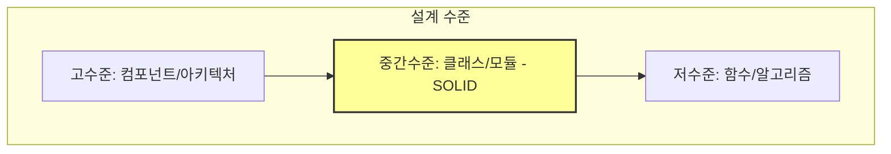
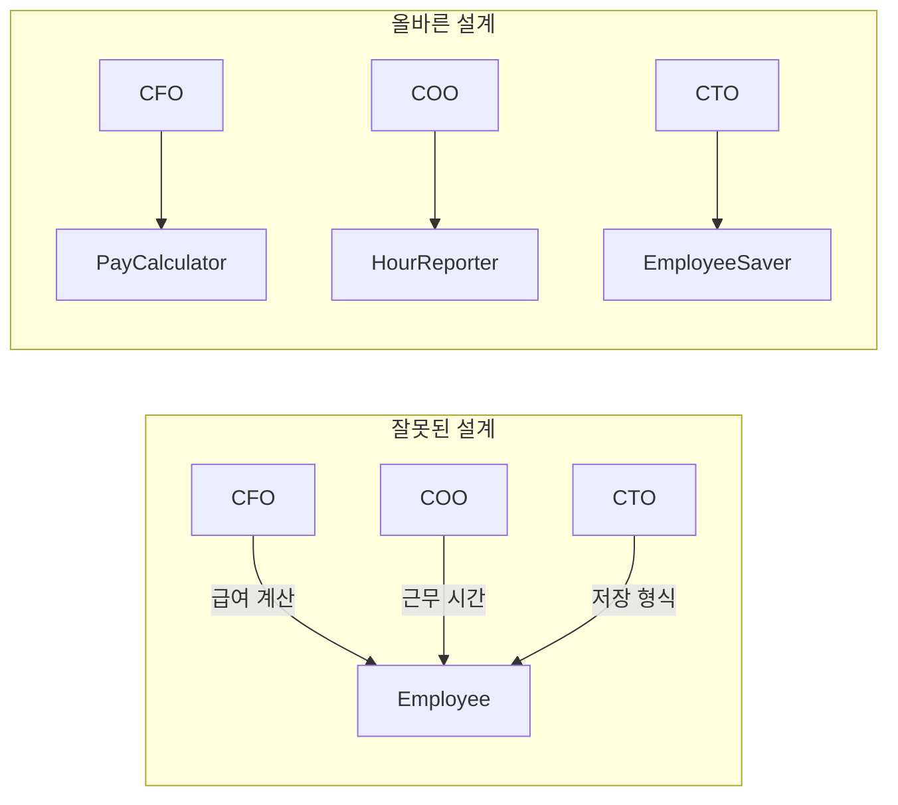
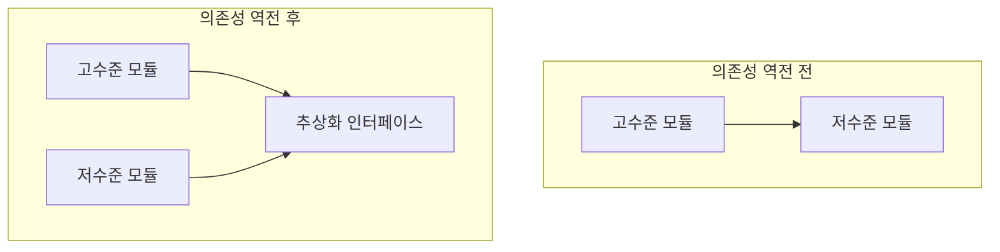
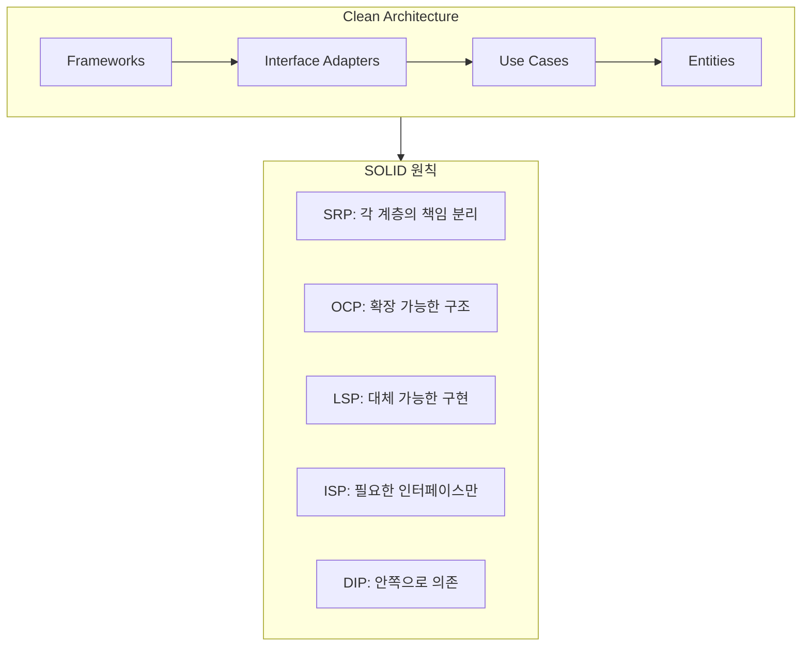

SOLID 원칙은 객체 지향 설계의 기초가 되는 다섯 가지 원칙이다. 이 원칙들은 2000년대 초반 Robert C. Martin에 의해 체계화되었으며, 오늘날 소프트웨어 개발자들에게 필수적인 지식이 되었다.

## SOLID의 탄생

### 원칙들의 기원

SOLID의 각 원칙은 서로 다른 시기에 서로 다른 사람들에 의해 제안되었다:

| 원칙 | 제안자 | 시기 |
|------|--------|------|
| SRP | Robert C. Martin | 2003 |
| OCP | Bertrand Meyer | 1988 |
| LSP | Barbara Liskov | 1987/1994 |
| ISP | Robert C. Martin | 1996 |
| DIP | Robert C. Martin | 1996 |

### SOLID 약어의 탄생

2004년경, Michael Feathers는 이 다섯 가지 원칙의 첫 글자를 따서 **SOLID**라는 약어를 제안했다. 마틴은 이 약어를 채택하여 널리 알렸다.

```
S - Single Responsibility Principle (단일 책임 원칙)
O - Open-Closed Principle (개방-폐쇄 원칙)
L - Liskov Substitution Principle (리스코프 치환 원칙)
I - Interface Segregation Principle (인터페이스 분리 원칙)
D - Dependency Inversion Principle (의존성 역전 원칙)
```

## SOLID의 목적

### 중간 수준의 소프트웨어 구조

마틴은 SOLID 원칙이 **중간 수준(mid-level)**의 소프트웨어 구조에 적용된다고 말한다. 여기서 중간 수준이란:

- **클래스** 수준
- **모듈** 수준  
- **함수를 어떻게 클래스로 묶을 것인가**

이 수준의 설계가 잘 되면:

1. **변경에 유연**해진다
2. **이해하기 쉬워**진다
3. **재사용이 가능**해진다


```mermaid
flowchart TB
    subgraph Levels [설계 수준]
        H[고수준: 컴포넌트/아키텍처]
        M[중간수준: 클래스/모듈 - SOLID]
        L[저수준: 함수/알고리즘]
    end
    
    H --> M --> L
    
    style M fill:#ff9,stroke:#333,stroke-width:2px
```

### 좋은 벽돌이 좋은 건물을 만든다

마틴은 이렇게 비유한다: 좋은 벽돌을 사용해도 건물의 아키텍처를 엉망으로 만들 수 있다. 그래서 컴포넌트 원칙이 필요하다. 하지만 형편없는 벽돌로는 좋은 건물을 지을 수 없다(Martin, *Clean Architecture*, 2017). SOLID는 **좋은 벽돌(클래스, 모듈)**을 만드는 방법이다.

## 다섯 가지 원칙 개요

### SRP: 단일 책임 원칙

> 각 모듈은 **하나의 액터**에 대해서만 책임져야 한다.

흔히 "클래스는 하나의 일만 해야 한다"라고 오해되지만, 실제 의미는 **변경의 이유가 하나여야 한다**는 것이다.


```mermaid
flowchart LR
    subgraph Bad [잘못된 설계]
        C1[Employee]
        A1[CFO]
        A2[COO]
        A3[CTO]
        A1 -->|급여 계산| C1
        A2 -->|근무 시간| C1
        A3 -->|저장 형식| C1
    end
    
    subgraph Good [올바른 설계]
        C2[PayCalculator]
        C3[HourReporter]
        C4[EmployeeSaver]
        B1[CFO] --> C2
        B2[COO] --> C3
        B3[CTO] --> C4
    end
```

### OCP: 개방-폐쇄 원칙

> 소프트웨어 엔터티는 **확장에는 열려** 있어야 하고, **수정에는 닫혀** 있어야 한다.

기존 코드를 수정하지 않고도 새로운 기능을 추가할 수 있어야 한다. 예를 들어 보고서 생성기가 `if (type.equals("PDF")) ... else if (type.equals("Excel"))`처럼 형식을 분기하면, 새 형식을 추가할 때마다 이 메서드 자체를 고쳐야 한다. 형식을 `ReportFormat` 인터페이스로 추상화하면 기존 코드를 건드리지 않고 새 구현 클래스만 추가하면 된다. 이 리팩터링의 전체 과정과 Strategy·Template Method 등 구체적인 적용 패턴은 16장(OCP: 개방-폐쇄 원칙)에서 자세히 다룬다.

### LSP: 리스코프 치환 원칙

> **하위 타입**은 **상위 타입**을 대체할 수 있어야 한다.

Barbara Liskov가 1987년 제시하고 1994년 정식화한 이 원칙은, 상속 관계에서 하위 클래스가 상위 클래스의 계약을 지켜야 한다는 것이다. 대표적인 반례가 `Rectangle`을 상속한 `Square`다. `Square`는 `setWidth()`를 오버라이드하면서 높이까지 함께 바꾸는데, 이는 "너비와 높이는 독립적으로 설정된다"는 `Rectangle`의 계약을 깬다. `Rectangle`을 사용하도록 작성된 클라이언트 코드에 `Square`를 넣으면 예상과 다른 결과가 나온다. 정사각형/직사각형 문제의 전체 분석과 계약에 의한 설계는 17장(LSP: 리스코프 치환 원칙)에서 자세히 다룬다.

### ISP: 인터페이스 분리 원칙

> 클라이언트는 자신이 **사용하지 않는 메서드**에 의존하지 않아야 한다.

큰 인터페이스보다 작고 구체적인 인터페이스가 낫다.

```java
// ISP 위반 - 뚱뚱한 인터페이스
interface Worker {
    void work();
    void eat();
    void sleep();
}

// ISP 적용 - 분리된 인터페이스
interface Workable { void work(); }
interface Eatable { void eat(); }
interface Sleepable { void sleep(); }
```

로봇처럼 먹지도 자지도 않는 클라이언트가 있다면, `Workable`만 구현하면 된다. 뚱뚱한 `Worker` 인터페이스였다면 사용하지도 않을 `eat()`·`sleep()`까지 억지로 구현해야 했을 것이다.

### DIP: 의존성 역전 원칙

> 고수준 모듈은 저수준 모듈에 의존해서는 안 된다. 둘 다 **추상화**에 의존해야 한다.

이 원칙은 Clean Architecture의 핵심이다.


```mermaid
flowchart TB
    subgraph Before [의존성 역전 전]
        H1[고수준 모듈]
        L1[저수준 모듈]
        H1 --> L1
    end
    
    subgraph After [의존성 역전 후]
        H2[고수준 모듈]
        I[추상화 인터페이스]
        L2[저수준 모듈]
        H2 --> I
        L2 --> I
    end
```

역전 전에는 고수준 모듈이 저수준 모듈을 직접 가리켜, 저수준 모듈이 바뀌면 고수준 모듈도 함께 바뀐다. 역전 후에는 두 모듈 모두 인터페이스를 가리키고, 저수준 모듈의 화살표만 방향이 뒤바뀐다 — 이 화살표 방향의 역전이 원칙의 이름이 된 이유다.

## SOLID와 Clean Architecture

SOLID 원칙들은 Clean Architecture의 기반이 된다:

| 원칙 | Clean Architecture에서의 역할 |
|------|------------------------------|
| SRP | 컴포넌트가 하나의 액터에 대해서만 책임 |
| OCP | 플러그인 아키텍처, 확장 가능한 구조 |
| LSP | 인터페이스와 구현의 대체 가능성 |
| ISP | 필요한 인터페이스만 노출 |
| DIP | 의존성이 안쪽으로만 향함 |


```mermaid
flowchart TB
    subgraph CleanArch [Clean Architecture]
        E[Entities]
        U[Use Cases]
        I[Interface Adapters]
        F[Frameworks]
        
        F --> I --> U --> E
    end
    
    subgraph SOLID [SOLID 원칙]
        SRP[SRP: 각 계층의 책임 분리]
        OCP[OCP: 확장 가능한 구조]
        LSP[LSP: 대체 가능한 구현]
        ISP[ISP: 필요한 인터페이스만]
        DIP[DIP: 안쪽으로 의존]
    end
    
    CleanArch --> SOLID
```

## 왜 SOLID를 배워야 하는가?

다섯 원칙이 공략하는 대상은 서로 다르지만, 궁극적으로는 하나의 목표로 수렴한다 — 소프트웨어의 본질인 **변경**을 다루는 비용을 낮추는 것이다.

### 변경에 대한 내성

SOLID 원칙을 지키는 코드는 한 곳의 변경이 예측 불가능한 곳까지 번지지 않는다. SRP·OCP가 변경의 영향 범위를 좁히고, DIP가 그 범위를 안쪽(비즈니스 로직)이 아닌 바깥쪽(세부사항)으로 밀어낸다. 그 결과:
- 변경의 영향 범위가 줄어든다
- 예측 가능한 방식으로 확장된다
- 기존 코드를 건드리지 않고 기능 추가 가능

### 테스트 용이성

인터페이스에 의존하는 코드(DIP·ISP)는 실제 구현 대신 테스트용 대역으로 손쉽게 바꿔 끼울 수 있다. SOLID를 따르는 코드는:
- 모듈별로 독립적 테스트 가능
- Mock 객체로 대체 용이
- 단위 테스트 작성이 쉬움

### 재사용성

책임이 명확히 분리된 모듈(SRP)은 그 자체로 다른 맥락에 옮겨 써도 부작용이 적다. 잘 분리된 모듈은:
- 다른 프로젝트에서 재사용 가능
- 조합하여 새로운 기능 구현 가능

## 비판적 시각

SOLID는 만능 규칙이 아니다. 다섯 원칙을 기계적으로 전부 적용하면 오히려 클래스와 인터페이스 수만 늘어나는 과잉 설계로 이어질 수 있다 — 예를 들어 구현체가 하나뿐인 클래스에 무조건 인터페이스를 씌우는 것은 ISP·DIP의 오용이다. 마틴 본인도 SOLID를 "언제나 지켜야 할 법"이 아니라 "판단을 돕는 도구"로 제시한다. 원칙을 적용하기 전에 "이 유연성에 실제로 비용을 지불할 가치가 있는가"를 먼저 물어야 한다.

## 학습 목표

이 장을 읽은 후 다음을 할 수 있어야 한다.

- SOLID 다섯 원칙이 각각 언제, 누구에 의해 제안되었는지 설명할 수 있다.
- SOLID가 "중간 수준"에 적용된다는 말이 고수준(아키텍처)·저수준(알고리즘)과 어떻게 다른지 설명할 수 있다.
- SOLID를 기계적으로 적용하는 것과 상황에 맞게 적용하는 것의 차이를 사례로 설명할 수 있다.

## 참고 자료

- Martin, R. C. (2017). *Clean Architecture: A Craftsman's Guide to Software Structure and Design*. Prentice Hall.
- Martin, R. C. (2003). *Agile Software Development: Principles, Patterns, and Practices*. Prentice Hall. — SRP 정식화.
- Meyer, B. (1988). *Object-Oriented Software Construction*. Prentice Hall. — OCP 최초 제시.
- Liskov, B., & Wing, J. (1994). "A Behavioral Notion of Subtyping". *ACM TOPLAS*, 16(6). — LSP 정식화.
- Martin, R. C. (1996). "The Interface Segregation Principle". *C++ Report*. — ISP 정식화.
- Martin, R. C. (1996). "The Dependency Inversion Principle". *C++ Report*. — DIP 정식화.
- Feathers, M. — SOLID 약어를 다섯 원칙의 앞글자로 처음 제안한 것으로 알려져 있다(원 출처는 개별 논문이 아닌 커뮤니티 구전으로, Martin이 여러 강연·저작에서 이를 인정한 바 있다).

## 다음 장에서는

다음 장부터 각 원칙을 하나씩 깊이 있게 살펴본다. 먼저 **SRP: 단일 책임 원칙**부터 시작한다. 이 원칙은 가장 이해하기 쉬워 보이지만, 가장 많이 오해받는 원칙이기도 하다.

## 핵심 요약

| 항목 | 내용 |
|------|------|
| SOLID | 5가지 객체 지향 설계 원칙 |
| 목적 | 변경에 유연하고, 이해하기 쉽고, 재사용 가능한 모듈 |
| 적용 수준 | 중간 수준 (클래스, 모듈) |
| Clean Architecture 연결 | 모든 원칙이 아키텍처의 기반 |

마틴은 이렇게 요약한다: SOLID 원칙은 벽돌을 벽과 방으로 배치하는 방법을 알려준다(Martin, *Clean Architecture*, 2017).
