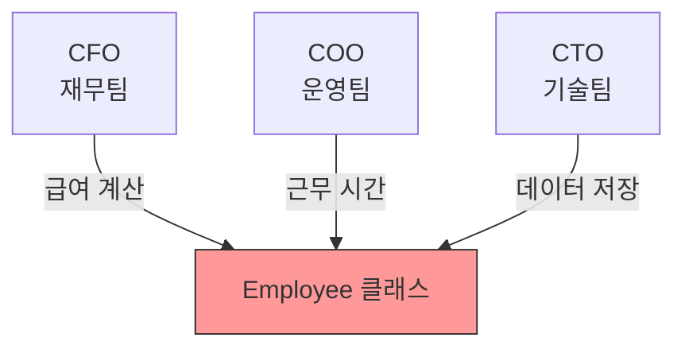
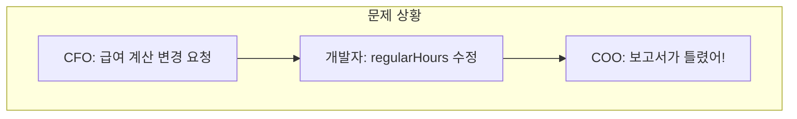
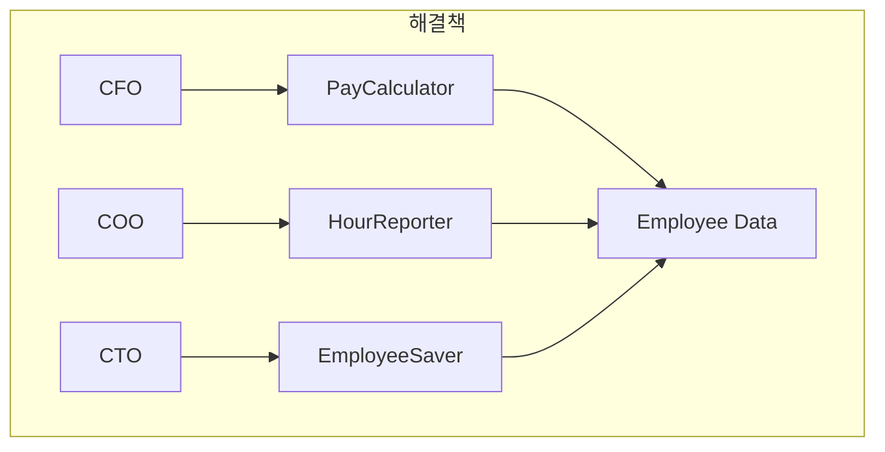
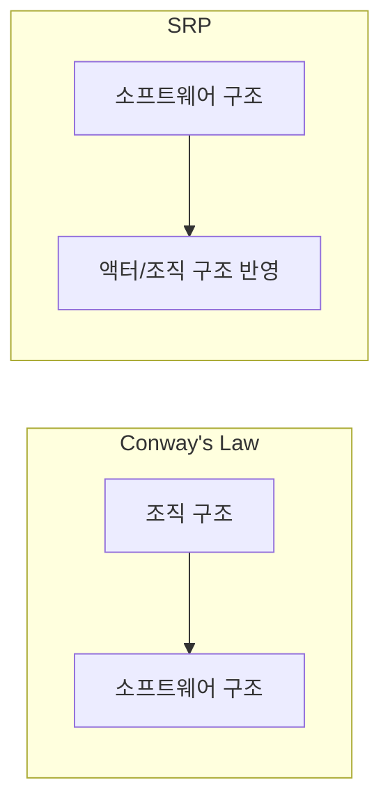

SOLID의 첫 번째 원칙인 **SRP(Single Responsibility Principle)**는 가장 이해하기 쉬워 보이지만, 가장 많이 오해받는 원칙이기도 하다. "클래스는 하나의 일만 해야 한다"라는 설명은 SRP의 의미를 왜곡한다.

## 흔한 오해

### "하나의 일만 해야 한다?"

많은 개발자들이 SRP를 다음과 같이 이해한다:

> "모듈은 하나의 일만 해야 한다"

이것은 **함수**에 적용되는 원칙이다. 함수는 확실히 하나의 일만 해야 한다. 그러나 이것이 SRP는 아니다.

### SRP의 진짜 의미

마틴은 SRP를 다음과 같이 정의한다:

> **"모듈은 하나의, 오직 하나의 액터에 대해서만 책임져야 한다."**

여기서 **액터(Actor)**란 그 모듈의 변경을 요청하는 **사람들의 집단**이다.

## 액터(Actor)란?

### 변경의 원천

액터는 시스템에 변경을 요청하는 이해관계자 그룹이다:

- **CFO (재무 책임자)**: 급여 계산 방식 변경 요청
- **COO (운영 책임자)**: 근무 시간 보고 방식 변경 요청
- **CTO (기술 책임자)**: 데이터 저장 형식 변경 요청

### 왜 액터가 중요한가?

서로 다른 액터는 **서로 다른 이유로** 변경을 요청한다. 하나의 모듈이 여러 액터에게 책임지면, 한 액터의 변경이 다른 액터에게 영향을 줄 수 있다.

## Employee 예제

마틴은 Employee 클래스 예제로 SRP를 설명한다:

```java
// SRP 위반 - 여러 액터에게 책임
public class Employee {
    public Money calculatePay() { /* CFO */ }
    public Hours reportHours() { /* COO */ }
    public void save() { /* CTO */ }
}
```



이 클래스는 세 명의 액터에게 책임진다. 문제가 발생하는 두 가지 시나리오를 살펴보자.

### 문제 1: 우발적 중복 (Accidental Duplication)

`calculatePay()`와 `reportHours()` 모두 **정규 근무 시간**을 계산해야 한다고 가정하자. 개발자는 중복을 피하기 위해 `regularHours()` 메서드를 만든다:

```java
public class Employee {
    public Money calculatePay() {
        // ...
        int hours = regularHours();  // 공유 메서드 사용
        // ...
    }
    
    public Hours reportHours() {
        // ...
        int hours = regularHours();  // 공유 메서드 사용
        // ...
    }
    
    private int regularHours() {
        // 정규 근무 시간 계산
    }
}
```

문제 발생:

1. CFO 팀이 급여 계산 방식 변경을 요청
2. 개발자가 `regularHours()` 수정
3. COO 팀의 `reportHours()` 도 영향받음
4. 잘못된 근무 시간 보고서 생성



### 문제 2: 병합 충돌 (Merge Conflict)

다른 팀들이 동시에 Employee 클래스를 수정하면:

```
[CTO 팀 브랜치]
class Employee {
    // save() 메서드 수정
    + public void save() { /* 새 저장 형식 */ }
}

[CFO 팀 브랜치]
class Employee {
    // calculatePay() 메서드 수정
    + public Money calculatePay() { /* 새 계산법 */ }
}
```

두 브랜치를 병합할 때 충돌이 발생하고, 실수로 서로의 변경사항을 덮어쓸 위험이 있다.

## 해결책

### 클래스 분리

SRP를 적용하려면, 각 액터에 대응하는 별도의 클래스를 만든다:

```java
// 급여 계산 - CFO 액터
public class PayCalculator {
    public Money calculatePay(Employee employee) { /* ... */ }
}

// 근무 시간 보고 - COO 액터
public class HourReporter {
    public Hours reportHours(Employee employee) { /* ... */ }
}

// 직원 데이터 저장 - CTO 액터
public class EmployeeSaver {
    public void save(Employee employee) { /* ... */ }
}

// 데이터 구조만 갖는 Employee
public class Employee {
    private String name;
    private EmployeeId id;
    // getter/setter만...
}
```



### 퍼사드 패턴

클래스가 너무 많아지면 **퍼사드(Facade)**를 사용한다:

```java
// 퍼사드 - 여러 클래스를 하나의 인터페이스로
public class EmployeeFacade {
    private PayCalculator payCalculator;
    private HourReporter hourReporter;
    private EmployeeSaver employeeSaver;
    
    public Money calculatePay() {
        return payCalculator.calculatePay();
    }
    
    public Hours reportHours() {
        return hourReporter.reportHours();
    }
    
    public void save() {
        employeeSaver.save();
    }
}
```

사용하는 쪽에서는 퍼사드만 알면 된다. 내부 구현은 숨겨진다.

## Conway's Law와 SRP

### Conway's Law

1968년, 멜빈 콘웨이(Melvin Conway)는 다음과 같은 법칙을 발표했다:

> "시스템을 설계하는 조직은 그 조직의 커뮤니케이션 구조를 복제한 구조를 갖는 설계를 만들어낸다."

### SRP와의 관계

SRP는 Conway's Law의 **역(inverse)**이라고 볼 수 있다:

- **Conway's Law**: 조직 구조 → 소프트웨어 구조
- **SRP**: 소프트웨어 구조 → 조직 구조에 맞춰야 함



즉, **각 모듈은 특정 팀(액터)에 의해서만 수정되어야 한다**.

## SRP 적용하기

### 1. 액터 식별

먼저 시스템의 액터들을 식별한다:
- 누가 이 기능의 변경을 요청할 것인가?
- 어떤 팀이 이 코드를 소유할 것인가?

### 2. 책임 분리

각 액터에 대응하는 모듈을 만든다:
- 한 모듈 = 한 액터의 요구사항
- 액터 간 코드 공유 최소화

### 3. 인터페이스 정의

필요하다면 퍼사드나 인터페이스로 묶는다:
- 사용하는 쪽의 편의를 위해
- 내부 구현 숨김

## 잘못된 SRP 적용

### 과도한 분리

SRP를 잘못 이해하면, 모든 메서드를 별도 클래스로 분리하는 실수를 한다:

```java
// 과도한 분리 - 이건 SRP가 아님
class NameGetter { String getName() { ... } }
class NameSetter { void setName(String name) { ... } }
class AgeGetter { int getAge() { ... } }
// ...
```

SRP는 **액터** 기준이지, **메서드** 기준이 아니다.

### 언제 분리하지 말아야 하는가?

- 같은 액터가 사용하는 관련 기능들
- 항상 함께 변경되는 기능들
- 공유해도 다른 액터에 영향이 없는 유틸리티

## 컴포넌트 수준의 SRP

SRP는 클래스뿐 아니라 **컴포넌트** 수준에서도 적용된다:

| 수준 | 원칙 | 의미 |
|------|------|------|
| 함수 | 하나의 일 | 함수는 하나의 작업만 |
| 클래스/모듈 | SRP | 하나의 액터에게만 책임 |
| 컴포넌트 | CCP | 같은 이유로 변경되는 것들을 묶음 |

다음 파트에서 다룰 **공통 폐쇄 원칙(CCP)**은 컴포넌트 수준의 SRP라고 볼 수 있다.

## 핵심 요약

| 항목 | 내용 |
|------|------|
| 원칙 | 모듈은 하나의 액터에게만 책임져야 한다 |
| 액터 | 변경을 요청하는 사람들의 집단 |
| 문제 | 우발적 중복, 병합 충돌 |
| 해결 | 책임 분리, 퍼사드 패턴 |
| 연결 | Conway's Law |

> **"SRP는 '변경의 이유'에 관한 것이다. 하나의 모듈을 변경해야 하는 이유는 하나여야 한다."**
> — Robert C. Martin

## 다음 장에서는

다음 장에서는 **OCP: 개방-폐쇄 원칙**을 다룬다. 이 원칙은 "확장에는 열리고, 수정에는 닫혀야 한다"는 것으로, 소프트웨어 아키텍처의 핵심 목표와 직결된다.
