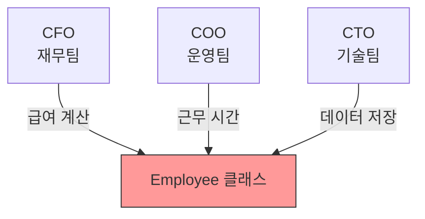
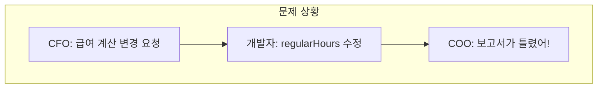
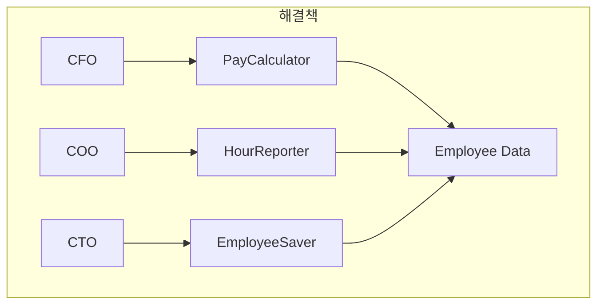
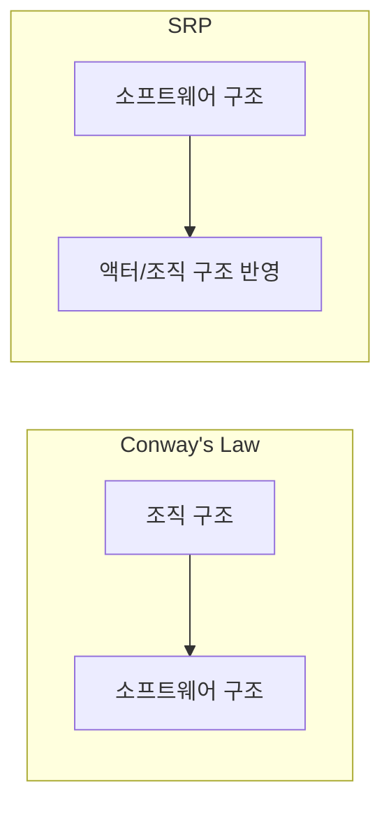

SOLID의 첫 번째 원칙인 **SRP(Single Responsibility Principle)**는 가장 이해하기 쉬워 보이지만, 가장 많이 오해받는 원칙이기도 하다. "클래스는 하나의 일만 해야 한다"라는 설명은 SRP의 의미를 왜곡한다.

## 흔한 오해

### "하나의 일만 해야 한다?"

많은 개발자들이 SRP를 다음과 같이 이해한다:

> "모듈은 하나의 일만 해야 한다"

이것은 **함수**에 적용되는 원칙이다. 함수는 확실히 하나의 일만 해야 한다. 그러나 이것이 SRP는 아니다.

### SRP의 진짜 의미

마틴은 SRP를 다음과 같이 정의한다:

> **"모듈은 하나의, 오직 하나의 액터에 대해서만 책임져야 한다."**

여기서 **액터(Actor)**란 그 모듈의 변경을 요청하는 **사람들의 집단**이다.

## 액터(Actor)란?

### 변경의 원천

액터는 시스템에 변경을 요청하는 이해관계자 그룹이다:

- **CFO (재무 책임자)**: 급여 계산 방식 변경 요청
- **COO (운영 책임자)**: 근무 시간 보고 방식 변경 요청
- **CTO (기술 책임자)**: 데이터 저장 형식 변경 요청

### 왜 액터가 중요한가?

서로 다른 액터는 **서로 다른 이유로** 변경을 요청한다. 하나의 모듈이 여러 액터에게 책임지면, 한 액터의 변경이 다른 액터에게 영향을 줄 수 있다.

## Employee 예제

마틴은 Employee 클래스 예제로 SRP를 설명한다:

```java
record Money(int cents) {}
record Hours(int value) {}

// SRP 위반 - 여러 액터에게 책임
public class Employee {
    private int regularHoursWorked;
    private int hourlyRateCents;

    public Money calculatePay() {              // CFO 액터
        return new Money(regularHoursWorked * hourlyRateCents);
    }
    public Hours reportHours() {                // COO 액터
        return new Hours(regularHoursWorked);
    }
    public void save() {                        // CTO 액터
        // 데이터베이스에 저장
    }
}
```


```mermaid
flowchart TB
    E[Employee 클래스]
    
    CFO[CFO</br>재무팀] -->|급여 계산| E
    COO[COO</br>운영팀] -->|근무 시간| E
    CTO[CTO</br>기술팀] -->|데이터 저장| E
    
    style E fill:#f99,stroke:#333
```

이 클래스는 세 명의 액터에게 책임진다. 문제가 발생하는 두 가지 시나리오를 살펴보자.

### 문제 1: 우발적 중복 (Accidental Duplication)

`calculatePay()`와 `reportHours()` 모두 **정규 근무 시간**을 계산해야 한다고 가정하자. 개발자는 중복을 피하기 위해 `regularHours()` 메서드를 만든다:

```java
public class Employee {
    private int rawHoursLogged;
    private int hourlyRateCents;

    public Money calculatePay() {
        int hours = regularHours();  // 공유 메서드 사용
        return new Money(hours * hourlyRateCents);
    }
    
    public Hours reportHours() {
        int hours = regularHours();  // 공유 메서드 사용
        return new Hours(hours);
    }
    
    private int regularHours() {
        return Math.min(rawHoursLogged, 40);  // 정규 근무 시간 계산
    }
}
```

문제 발생:

1. CFO 팀이 급여 계산 방식 변경을 요청
2. 개발자가 `regularHours()` 수정
3. COO 팀의 `reportHours()` 도 영향받음
4. 잘못된 근무 시간 보고서 생성


```mermaid
flowchart TB
    subgraph Problem [문제 상황]
        CFO[CFO: 급여 계산 변경 요청]
        DEV[개발자: regularHours 수정]
        COO[COO: 보고서가 틀렸어!]
        
        CFO --> DEV
        DEV --> COO
    end
```

### 문제 2: 병합 충돌 (Merge Conflict)

다른 팀들이 동시에 Employee 클래스를 수정하면:

```
[CTO 팀 브랜치]
class Employee {
    // save() 메서드 수정
    + public void save() { /* 새 저장 형식 */ }
}

[CFO 팀 브랜치]
class Employee {
    // calculatePay() 메서드 수정
    + public Money calculatePay() { /* 새 계산법 */ }
}
```

두 브랜치를 병합할 때 충돌이 발생하고, 실수로 서로의 변경사항을 덮어쓸 위험이 있다.

## 해결책

### 클래스 분리

SRP를 적용하려면, 각 액터에 대응하는 별도의 클래스를 만든다:

각 클래스는 별도 파일(`PayCalculator.java`, `HourReporter.java`, `EmployeeSaver.java`, `Employee.java`)로 나뉘므로, 아래 4개 블록은 각각 독립된 파일이라고 가정하고 읽는다.

```java
// Employee.java - 데이터 구조만 갖는 Employee
public class Employee {
    private final EmployeeId id;
    private final int regularHours;
    private final int hourlyRateCents;

    public Employee(EmployeeId id, int regularHours, int hourlyRateCents) {
        this.id = id;
        this.regularHours = regularHours;
        this.hourlyRateCents = hourlyRateCents;
    }

    public int getRegularHours() { return regularHours; }
    public int getHourlyRateCents() { return hourlyRateCents; }
}

record EmployeeId(String value) {}
```

```java
// PayCalculator.java - 급여 계산, CFO 액터
public class PayCalculator {
    public Money calculatePay(Employee employee) {
        return new Money(employee.getRegularHours() * employee.getHourlyRateCents());
    }
}
```

```java
// HourReporter.java - 근무 시간 보고, COO 액터
public class HourReporter {
    public Hours reportHours(Employee employee) {
        return new Hours(employee.getRegularHours());
    }
}
```

```java
// EmployeeSaver.java - 직원 데이터 저장, CTO 액터
public class EmployeeSaver {
    public void save(Employee employee) {
        // 데이터베이스에 저장
    }
}
```


```mermaid
flowchart TB
    subgraph Solution [해결책]
        E[Employee Data]
        PC[PayCalculator]
        HR[HourReporter]
        ES[EmployeeSaver]
        
        CFO --> PC
        COO --> HR
        CTO --> ES
        
        PC --> E
        HR --> E
        ES --> E
    end
```

### 퍼사드 패턴

클래스가 너무 많아지면 **퍼사드(Facade)**를 사용한다:

```java
// 퍼사드 - 여러 클래스를 하나의 인터페이스로
public class EmployeeFacade {
    private final Employee employee;
    private final PayCalculator payCalculator;
    private final HourReporter hourReporter;
    private final EmployeeSaver employeeSaver;

    public EmployeeFacade(Employee employee, PayCalculator payCalculator,
                           HourReporter hourReporter, EmployeeSaver employeeSaver) {
        this.employee = employee;
        this.payCalculator = payCalculator;
        this.hourReporter = hourReporter;
        this.employeeSaver = employeeSaver;
    }

    public Money calculatePay() {
        return payCalculator.calculatePay(employee);
    }
    
    public Hours reportHours() {
        return hourReporter.reportHours(employee);
    }
    
    public void save() {
        employeeSaver.save(employee);
    }
}
```

사용하는 쪽에서는 퍼사드만 알면 된다. 내부 구현은 숨겨진다.

## Conway's Law와 SRP

### Conway's Law

1968년, 멜빈 콘웨이(Melvin Conway)는 다음과 같은 법칙을 발표했다:

> "시스템을 설계하는 조직은 그 조직의 커뮤니케이션 구조를 복제한 구조를 갖는 설계를 만들어낸다."

### SRP와의 관계

SRP는 Conway's Law의 **역(inverse)**이라고 볼 수 있다:

- **Conway's Law**: 조직 구조 → 소프트웨어 구조
- **SRP**: 소프트웨어 구조 → 조직 구조에 맞춰야 함


```mermaid
flowchart LR
    subgraph Conway [Conway's Law]
        O1[조직 구조] --> S1[소프트웨어 구조]
    end
    
    subgraph SRP [SRP]
        S2[소프트웨어 구조] --> O2[액터/조직 구조 반영]
    end
```

즉, **각 모듈은 특정 팀(액터)에 의해서만 수정되어야 한다**.

## SRP 적용하기

SRP를 실제 코드에 적용하는 과정은 세 단계로 이어진다 — 누가 변경을 요청하는지 알아내고, 그 기준으로 코드를 나누고, 나뉜 결과를 다시 편리하게 묶는다.

### 1. 액터 식별

가장 먼저 할 일은 코드가 아니라 조직을 들여다보는 것이다. 코드를 나누는 기준은 기술적 편의가 아니라 "누가 이 변경을 요청하는가"이기 때문이다.

- 누가 이 기능의 변경을 요청할 것인가?
- 어떤 팀이 이 코드를 소유할 것인가?

### 2. 책임 분리

액터를 식별했다면, 각 액터에 대응하는 모듈을 만든다. 이때 목표는 액터 수만큼 클래스를 만드는 것 자체가 아니라, 한 클래스가 두 액터의 변경 요청을 동시에 받는 상황을 없애는 것이다.

- 한 모듈 = 한 액터의 요구사항
- 액터 간 코드 공유 최소화

### 3. 인터페이스 정의

분리된 클래스가 많아지면 호출하는 쪽이 여러 객체를 일일이 다뤄야 하는 불편이 생긴다. 필요하다면 앞서 본 퍼사드나 인터페이스로 묶어, 액터별 분리라는 내부 구조를 유지하면서도 호출부는 하나의 진입점만 알면 되게 만든다.

- 사용하는 쪽의 편의를 위해
- 내부 구현 숨김

## 잘못된 SRP 적용

### 과도한 분리

SRP를 잘못 이해하면, 모든 메서드를 별도 클래스로 분리하는 실수를 한다:

```java
// 과도한 분리 - 이건 SRP가 아님
class NameGetter { String getName() { ... } }
class NameSetter { void setName(String name) { ... } }
class AgeGetter { int getAge() { ... } }
// ...
```

SRP는 **액터** 기준이지, **메서드** 기준이 아니다.

### 언제 분리하지 말아야 하는가?

- **같은 액터가 사용하는 관련 기능들** — 한 액터의 변경 요청이 항상 함께 적용되는 기능이라면, 나누는 순간 오히려 같은 변경을 두 곳에 반영해야 하는 번거로움만 생긴다.
- **항상 함께 변경되는 기능들** — 실제 변경 이력을 보고, 두 메서드가 매번 같은 커밋에서 같이 바뀌었다면 이미 하나의 책임으로 묶여 있다는 신호다. 억지로 나누면 두 파일을 오가며 수정해야 한다.
- **공유해도 다른 액터에 영향이 없는 유틸리티** — 문자열 포매팅, 날짜 계산처럼 특정 액터에 속하지 않는 순수 함수는 여러 클래스가 공유해도 SRP 위반이 아니다. 액터 간 결합이 생기는 것은 "비즈니스 결정"이 공유될 때뿐이다.

## 컴포넌트 수준의 SRP

SRP는 클래스뿐 아니라 **컴포넌트** 수준에서도 적용된다 — "하나의 변경 이유"라는 기준 자체는 그대로 유지한 채, 적용 범위만 함수→클래스→컴포넌트로 넓어지는 것이다.

| 수준 | 원칙 | 의미 |
|------|------|------|
| 함수 | 하나의 일 | 함수는 하나의 작업만 |
| 클래스/모듈 | SRP | 하나의 액터에게만 책임 |
| 컴포넌트 | CCP | 같은 이유로 변경되는 것들을 묶음 |

다음 파트에서 다룰 **공통 폐쇄 원칙(CCP)**은 컴포넌트 수준의 SRP라고 볼 수 있다.

## 핵심 요약

| 항목 | 내용 |
|------|------|
| 원칙 | 모듈은 하나의 액터에게만 책임져야 한다 |
| 액터 | 변경을 요청하는 사람들의 집단 |
| 문제 | 우발적 중복, 병합 충돌 |
| 해결 | 책임 분리, 퍼사드 패턴 |
| 연결 | Conway's Law |

마틴은 이렇게 요약한다: SRP는 '변경의 이유'에 관한 것이다. 하나의 모듈을 변경해야 하는 이유는 하나여야 한다(Martin, *Clean Architecture*, 2017).

## 학습 목표

이 장을 읽은 후 다음을 할 수 있어야 한다.

- "클래스는 하나의 일만 해야 한다"는 통념과 "하나의 액터에게만 책임진다"는 실제 SRP 정의를 구분해 설명할 수 있다.
- 우발적 중복과 병합 충돌이 SRP 위반에서 어떻게 발생하는지 코드로 설명할 수 있다.
- SRP를 과도하게 적용해 메서드 단위로 클래스를 쪼개는 실수를 식별하고 교정할 수 있다.

## 참고 문헌

- Robert C. Martin, 『Clean Architecture: A Craftsman's Guide to Software Structure and Design』(2017), 7장 — 이 글의 원전
- Robert C. Martin, 『Agile Software Development: Principles, Patterns, and Practices』(2003) — SRP가 처음 정식화된 책
- Robert C. Martin, ["The Single Responsibility Principle"](https://blog.cleancoder.com/uncle-bob/2014/05/08/SingleReponsibilityPrinciple.html) (2014) — 저자가 직접 오해를 교정하는 글
- Melvin E. Conway, ["How Do Committees Invent?"](https://www.melconway.com/Home/Committees_Paper.html) (1968) — Conway's Law의 원 논문

## 다음 장에서는

다음 장에서는 **OCP: 개방-폐쇄 원칙**을 다룬다. 이 원칙은 "확장에는 열리고, 수정에는 닫혀야 한다"는 것으로, 소프트웨어 아키텍처의 핵심 목표와 직결된다.
