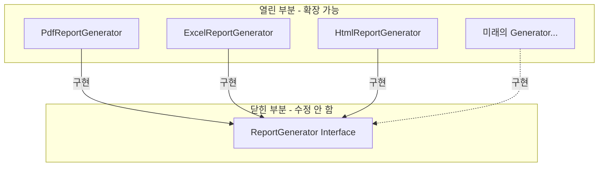
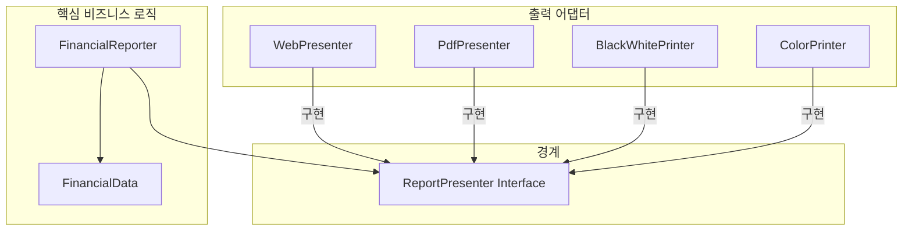
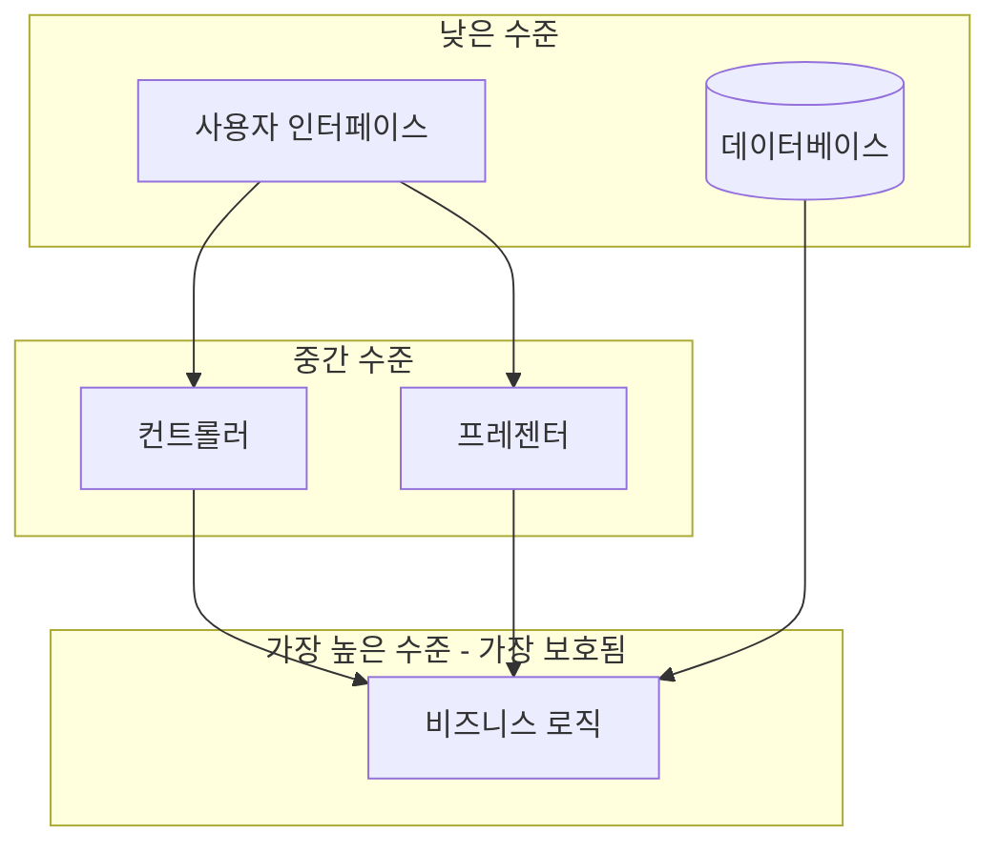
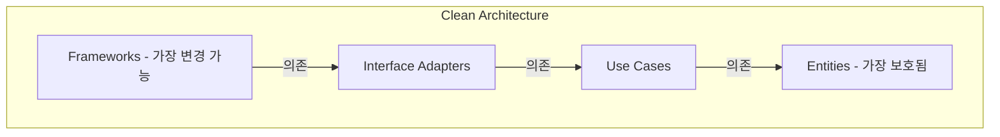
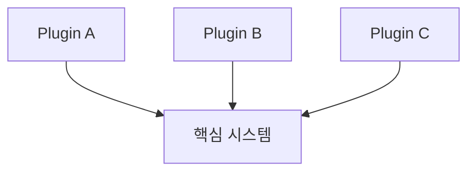

**OCP(Open-Closed Principle)**는 1988년 Bertrand Meyer가 "Object-Oriented Software Construction"에서 처음 제안했다. 마틴은 이 원칙이 **소프트웨어 아키텍처를 연구하는 근본적인 이유**라고 말한다.

## OCP의 정의

> **"소프트웨어 개체(클래스, 모듈, 함수 등)는 확장에 대해 열려 있어야 하고, 수정에 대해 닫혀 있어야 한다."**
> — Bertrand Meyer, 1988

### 두 가지 의미

- **확장에 열림 (Open for Extension)**: 새로운 기능을 추가할 수 있어야 한다
- **수정에 닫힘 (Closed for Modification)**: 기존 코드를 변경하지 않아야 한다

언뜻 보면 모순처럼 보인다. 새 기능을 추가하면서 기존 코드를 수정하지 않는다니?

## 어떻게 가능한가?

### 추상화의 힘

비밀은 **추상화(Abstraction)**에 있다. 인터페이스나 추상 클래스를 통해:

1. 고정된 부분(인터페이스)은 **닫혀** 있음
2. 변하는 부분(구현)은 **열려** 있음

```java
// 닫힌 부분 - 수정하지 않음
interface ReportGenerator {
    void generate(Report report);
}

// 열린 부분 - 확장 가능
class PdfReportGenerator implements ReportGenerator {
    public void generate(Report report) { /* PDF 생성 */ }
}

class ExcelReportGenerator implements ReportGenerator {
    public void generate(Report report) { /* Excel 생성 */ }
}

// 새 형식 추가 - 기존 코드 수정 없음!
class HtmlReportGenerator implements ReportGenerator {
    public void generate(Report report) { /* HTML 생성 */ }
}
```



## 재무 보고서 예제

마틴은 재무 보고서 시스템 예제를 사용한다.

### 요구사항

- 재무 데이터를 웹 페이지에 표시
- 나중에 PDF, 흑백 프린터, 컬러 프린터 출력 추가 예정

### 잘못된 설계

```java
// OCP 위반 - 새 형식마다 코드 수정 필요
class FinancialReporter {
    void report(String format, FinancialData data) {
        if (format.equals("WEB")) {
            // 웹 페이지 생성
        } else if (format.equals("PDF")) {
            // PDF 생성
        } else if (format.equals("PRINT_BW")) {
            // 흑백 인쇄
        }
        // 새 형식 추가 시 이 코드 수정 필요!
    }
}
```

### OCP를 적용한 설계



```java
// OCP 적용
interface ReportPresenter {
    void present(FinancialData data);
}

class FinancialReporter {
    private ReportPresenter presenter;
    
    FinancialReporter(ReportPresenter presenter) {
        this.presenter = presenter;
    }
    
    void report(FinancialData data) {
        // 비즈니스 로직...
        presenter.present(data);  // 출력 방식은 주입된 presenter가 결정
    }
}

// 새 출력 형식 추가 - FinancialReporter 수정 없음!
class GreenBarPresenter implements ReportPresenter {
    public void present(FinancialData data) { /* 녹색 바 인쇄 */ }
}
```

## 아키텍처 수준의 OCP

OCP는 클래스 수준을 넘어 **아키텍처 수준**에서 더 큰 의미를 가진다.

### 컴포넌트 계층화



**수준이 높을수록 변경으로부터 보호받는다.**

### 방향 제어 (Directional Control)

의존성의 방향을 제어하여 보호한다:

- A가 B에 의존하면, B의 변경이 A에 영향
- 따라서 중요한 것이 덜 중요한 것에 의존하면 안 됨
- **의존성 역전**으로 방향을 제어

### 정보 은닉 (Information Hiding)

불필요한 정보는 숨긴다:

- `Controller`가 `Interactor`의 내부를 알 필요 없음
- `Presenter`가 `Controller`를 알 필요 없음
- **이행적 의존성(Transitive Dependency)** 제거

## OCP가 아키텍처의 근본인 이유

마틴은 말한다:

> "OCP는 시스템의 아키텍처를 떠받치는 원동력 중 하나다."

### 좋은 아키텍처의 목표

- 기능 추가 시 **기존 코드 변경 최소화**
- 영향 범위 **예측 가능**
- **확장 비용 최소화**

OCP를 따르면 이 목표를 달성할 수 있다.

### Clean Architecture와 OCP

Clean Architecture의 동심원 구조는 OCP의 구현이다:



- **안쪽**: 높은 수준의 정책, 변경으로부터 보호
- **바깥쪽**: 세부사항, 변경 가능
- **의존성**: 바깥에서 안으로만

## OCP 적용 패턴

### 1. Strategy 패턴

런타임에 알고리즘을 교체:

```java
interface SortStrategy {
    void sort(int[] array);
}

class QuickSort implements SortStrategy { /* ... */ }
class MergeSort implements SortStrategy { /* ... */ }

class Sorter {
    private SortStrategy strategy;
    
    void sort(int[] array) {
        strategy.sort(array);  // 전략에 위임
    }
}
```

### 2. Template Method 패턴

알고리즘의 골격은 고정, 세부 단계는 확장:

```java
abstract class ReportGenerator {
    // 템플릿 메서드 - 고정
    final void generate() {
        prepareData();
        formatReport();
        output();
    }
    
    abstract void formatReport();  // 확장 포인트
    abstract void output();        // 확장 포인트
    
    void prepareData() { /* 공통 로직 */ }
}
```

### 3. Plugin 아키텍처

핵심에 플러그인을 꽂는 구조:



## OCP의 한계

### 완벽한 OCP는 불가능

모든 변경에 대해 닫혀 있는 것은 불가능하다. 어떤 변경은 기존 코드 수정이 불가피하다.

### 전략적 폐쇄

**가장 가능성 높은 변경**에 대해 닫아야 한다:

1. 과거에 자주 변경된 것
2. 비즈니스에서 변경을 예고한 것
3. 경험에 기반한 예측

### 첫 번째 탄환

마틴은 말한다:

> "우리는 '첫 번째 탄환'을 맞는다. 그리고 그 후에 리팩토링한다."

완벽한 예측은 불가능하다. 변경이 발생하면 그때 OCP를 적용하여 미래의 유사한 변경에 대비한다.

## 핵심 요약

| 항목 | 내용 |
|------|------|
| 정의 | 확장에 열리고, 수정에 닫힘 |
| 방법 | 추상화, 인터페이스, 다형성 |
| 아키텍처 연결 | 의존성 역전, 계층화 |
| 목표 | 변경 영향 최소화 |
| 패턴 | Strategy, Template Method, Plugin |

> **"OCP의 목표는 시스템을 확장하기 쉬운 동시에 변경으로 인해 시스템이 너무 많은 영향을 받지 않도록 하는 데 있다."**
> — Robert C. Martin

## 다음 장에서는

다음 장에서는 **LSP: 리스코프 치환 원칙**을 다룬다. 이 원칙은 Barbara Liskov가 1988년에 정의한 것으로, 하위 타입이 상위 타입을 올바르게 대체할 수 있어야 한다는 것을 말한다.
