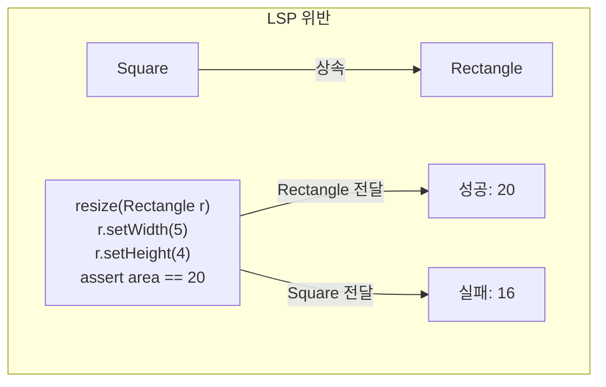
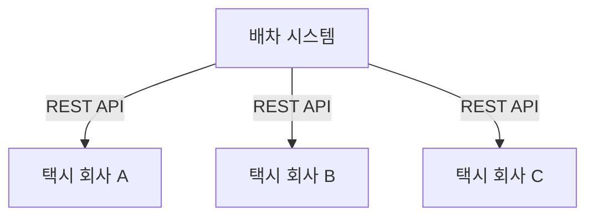
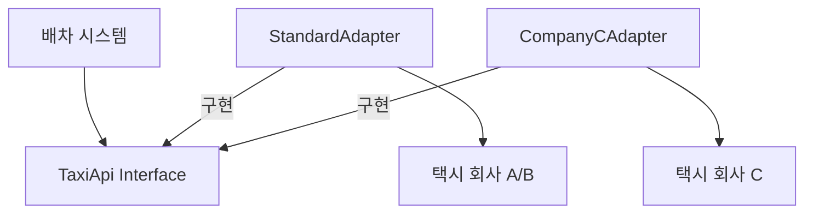

**LSP(Liskov Substitution Principle)**는 1988년 Barbara Liskov가 정의한 원칙이다. 처음에는 상속에 관한 원칙으로 보이지만, 실제로는 인터페이스와 구현에 관한 더 넓은 설계 원칙이다.

## LSP의 정의

### Barbara Liskov의 원래 정의 (1988)

> "S형의 객체 o1 각각에 대응하는 T형 객체 o2가 있고, T로 정의된 모든 프로그램 P에서 o2를 o1으로 치환해도 P의 행동이 변하지 않으면, S는 T의 하위 타입이다."

쉽게 말하면:

> **"부모 타입을 사용하는 곳에 자식 타입을 넣어도 프로그램이 올바르게 동작해야 한다."**

### 행위의 일관성

LSP의 핵심은 **행위의 일관성**이다. 하위 타입은:

- 상위 타입의 **모든 기대**를 충족해야 한다
- 상위 타입의 **계약**을 지켜야 한다
- 상위 타입 대신 사용해도 **문제가 없어야** 한다

## 정사각형/직사각형 문제

LSP를 설명할 때 가장 유명한 예제다.

### 직관적이지만 잘못된 상속

수학적으로 정사각형은 직사각형의 특수한 경우다. 그래서 다음과 같이 설계하는 것이 자연스러워 보인다:

```java
class Rectangle {
    protected int width;
    protected int height;
    
    public void setWidth(int w) { width = w; }
    public void setHeight(int h) { height = h; }
    public int getArea() { return width * height; }
}

class Square extends Rectangle {
    @Override
    public void setWidth(int w) {
        width = w;
        height = w;  // 정사각형이므로 높이도 같이 변경
    }
    
    @Override
    public void setHeight(int h) {
        width = h;  // 정사각형이므로 너비도 같이 변경
        height = h;
    }
}
```

### 문제 발생

```java
// Rectangle을 사용하는 코드
void resize(Rectangle r) {
    r.setWidth(5);
    r.setHeight(4);
    assert r.getArea() == 20;  // Rectangle이면 성공
}

// Square를 전달하면?
Square s = new Square();
resize(s);  // 실패! s.getArea() == 16
```



### 왜 위반인가?

`Rectangle`의 **계약**은 다음과 같다:
- `setWidth()`는 너비만 변경
- `setHeight()`는 높이만 변경
- 둘은 독립적

`Square`는 이 계약을 위반한다. 따라서 `Square`는 `Rectangle`의 **올바른 하위 타입이 아니다**.

### 해결책

```java
// 공통 인터페이스 사용
interface Shape {
    int getArea();
}

class Rectangle implements Shape {
    // 너비, 높이 독립적
}

class Square implements Shape {
    // 한 변의 길이만
}
```

`Square`와 `Rectangle`은 별개의 타입으로, 공통 인터페이스만 공유한다.

## LSP는 상속에만 적용되지 않는다

### 인터페이스 구현에도 적용

LSP는 `extends` 뿐 아니라 `implements`에도 적용된다:

```java
interface License {
    void calcFee();
}

class PersonalLicense implements License { /* ... */ }
class BusinessLicense implements License { /* ... */ }
```

`License`를 사용하는 코드에서 `PersonalLicense`와 `BusinessLicense`를 치환해도 문제가 없어야 한다.

### 덕 타이핑에도 적용

타입이 명시되지 않는 동적 언어에서도 LSP는 적용된다:

```python
# Python - 덕 타이핑
def process(payment):
    payment.pay()  # pay() 메서드만 있으면 됨

# LSP: pay()를 구현한 어떤 객체든 치환 가능해야 함
```

## 아키텍처 수준의 LSP

### 택시 배차 시스템 예제

마틴은 택시 배차 시스템 예제를 사용한다.

#### 요구사항

여러 택시 회사의 REST API를 호출하여 배차:

```
# 표준 REST API
GET /driver/{driverId}
POST /dispatch/{driverId}
```



#### LSP 위반

택시 회사 C가 다른 API를 사용한다면?

```
# 택시 회사 C의 API (다름!)
GET /driver/{driverId}/info
POST /pickupRequest/{driverId}/destination/{address}
```

이제 배차 시스템은 **특별 처리**가 필요하다:

```java
void dispatch(String driverId, TaxiCompany company) {
    if (company.equals("CompanyC")) {
        // 특별 처리
        callCompanyCApi(driverId);
    } else {
        // 표준 처리
        callStandardApi(driverId);
    }
}
```

### 문제점

- **if 문 추가**: 새 택시 회사마다 조건 추가
- **버그 위험**: 특별 처리 누락 시 버그
- **확장성 저하**: OCP 위반

### 해결책

```java
// 어댑터로 표준화
interface TaxiApi {
    Driver getDriver(String driverId);
    void dispatch(String driverId);
}

class StandardTaxiAdapter implements TaxiApi { /* 표준 API */ }
class CompanyCAdapter implements TaxiApi { /* C 전용 API → 표준 변환 */ }

class DispatchService {
    void dispatch(String driverId, TaxiApi api) {
        api.dispatch(driverId);  // 어떤 구현이든 동일하게 동작
    }
}
```



## 계약에 의한 설계 (Design by Contract)

### 사전 조건 (Precondition)

메서드 호출 전에 만족해야 하는 조건:

```java
// 사전 조건: amount > 0
void withdraw(int amount) {
    if (amount <= 0) throw new IllegalArgumentException();
    // ...
}
```

**LSP**: 하위 타입은 사전 조건을 **더 약하게** 할 수 있지만, **더 강하게** 하면 안 된다.

### 사후 조건 (Postcondition)

메서드 실행 후 만족해야 하는 조건:

```java
// 사후 조건: balance가 amount만큼 감소
void withdraw(int amount) {
    int oldBalance = balance;
    // ...
    assert balance == oldBalance - amount;
}
```

**LSP**: 하위 타입은 사후 조건을 **더 강하게** 할 수 있지만, **더 약하게** 하면 안 된다.

### 불변식 (Invariant)

객체가 항상 만족해야 하는 조건:

```java
// 불변식: balance >= 0
class Account {
    private int balance;
    // 모든 메서드가 이 조건을 유지해야 함
}
```

**LSP**: 하위 타입은 상위 타입의 불변식을 **반드시 유지**해야 한다.

## LSP 위반 징후

코드에서 다음이 보이면 LSP 위반을 의심하라:

### 1. 타입 체크

```java
if (obj instanceof Square) {
    // Square 특별 처리
}
```

### 2. 빈 구현

```java
class Bird {
    void fly() { /* ... */ }
}

class Penguin extends Bird {
    void fly() { 
        // 아무것도 안 함 - 펭귄은 못 남
    }
}
```

### 3. 예외 던지기

```java
class ReadOnlyList extends ArrayList {
    void add(Object o) {
        throw new UnsupportedOperationException();
    }
}
```

## 핵심 요약

| 항목 | 내용 |
|------|------|
| 정의 | 하위 타입은 상위 타입을 대체할 수 있어야 함 |
| 핵심 | 행위의 일관성, 계약 준수 |
| 적용 범위 | 상속, 인터페이스, REST API 등 |
| 위반 징후 | 타입 체크, 빈 구현, 예외 던지기 |

> **"LSP는 아키텍처 수준까지 확장할 수 있고, 반드시 확장해야만 한다. 치환 가능성을 조금이라도 위배하면 시스템 아키텍처가 특별한 메커니즘으로 오염되기 때문이다."**
> — Robert C. Martin

## 다음 장에서는

다음 장에서는 **ISP: 인터페이스 분리 원칙**을 다룬다. 이 원칙은 클라이언트가 사용하지 않는 메서드에 의존하지 않도록 인터페이스를 분리해야 한다는 것을 말한다.
