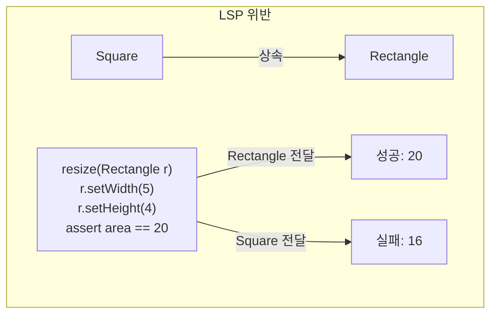
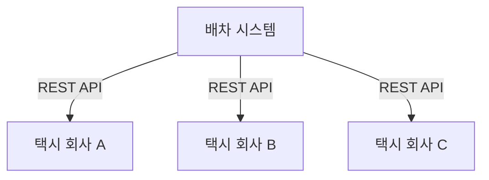
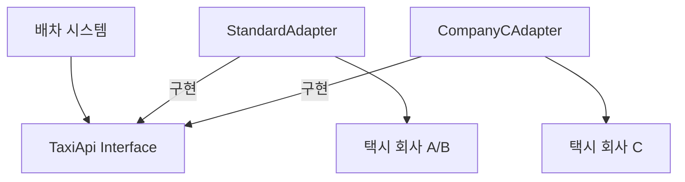

**LSP(Liskov Substitution Principle)**는 Barbara Liskov가 1987년 OOPSLA 키노트에서 처음 제시하고, 1994년 지넷 윙(Jeannette Wing)과의 공저 논문("A Behavioral Notion of Subtyping")에서 형식적으로 정식화한 원칙이다. 처음에는 상속에 관한 원칙으로 보이지만, 실제로는 인터페이스와 구현에 관한 더 넓은 설계 원칙이다.

## LSP의 정의

### Barbara Liskov의 원래 정의 (1994)

> "S형의 객체 o1 각각에 대응하는 T형 객체 o2가 있고, T로 정의된 모든 프로그램 P에서 o2를 o1으로 치환해도 P의 행동이 변하지 않으면, S는 T의 하위 타입이다."

쉽게 말하면:

> **"부모 타입을 사용하는 곳에 자식 타입을 넣어도 프로그램이 올바르게 동작해야 한다."**

### 행위의 일관성

LSP의 핵심은 **행위의 일관성**이다. 하위 타입은:

- 상위 타입의 **모든 기대**를 충족해야 한다
- 상위 타입의 **계약**을 지켜야 한다
- 상위 타입 대신 사용해도 **문제가 없어야** 한다

## 정사각형/직사각형 문제

LSP를 설명할 때 가장 유명한 예제다.

### 직관적이지만 잘못된 상속

수학적으로 정사각형은 직사각형의 특수한 경우다. 그래서 다음과 같이 설계하는 것이 자연스러워 보인다:

```java
class Rectangle {
    protected int width;
    protected int height;
    
    public void setWidth(int w) { width = w; }
    public void setHeight(int h) { height = h; }
    public int getArea() { return width * height; }
}

class Square extends Rectangle {
    @Override
    public void setWidth(int w) {
        width = w;
        height = w;  // 정사각형이므로 높이도 같이 변경
    }
    
    @Override
    public void setHeight(int h) {
        width = h;  // 정사각형이므로 너비도 같이 변경
        height = h;
    }
}
```

### 문제 발생

`Rectangle`을 사용하도록 작성된 클라이언트 코드는 "너비와 높이를 각각 설정하면, 넓이는 그 둘을 곱한 값이 된다"는 계약을 신뢰한다. 그런데 `Square`는 `setWidth()`를 호출하는 순간 높이까지 같이 바뀌므로, 이 클라이언트 코드가 기대한 결과가 나오지 않는다. 문제는 `Square`가 수학적으로 틀렸다는 데 있지 않다 — `Rectangle`의 인스턴스가 어디서 와도 똑같이 동작해야 한다는 가정이 깨진다는 데 있다.

```java
// Rectangle을 사용하는 코드
void resize(Rectangle r) {
    r.setWidth(5);
    r.setHeight(4);
    assert r.getArea() == 20;  // Rectangle이면 성공
}

// Square를 전달하면?
Square s = new Square();
resize(s);  // 실패! s.getArea() == 16
```


```mermaid
flowchart TB
    subgraph Problem [LSP 위반]
        R[Rectangle]
        S[Square]
        S -->|상속| R
        
        Code["resize(Rectangle r)</br>r.setWidth(5)</br>r.setHeight(4)</br>assert area == 20"]
        
        Code -->|Rectangle 전달| OK[성공: 20]
        Code -->|Square 전달| FAIL[실패: 16]
    end
```

### 왜 위반인가?

`Rectangle`의 **계약**은 다음과 같다:
- `setWidth()`는 너비만 변경
- `setHeight()`는 높이만 변경
- 둘은 독립적

`Square`는 이 계약을 위반한다. 따라서 `Square`는 `Rectangle`의 **올바른 하위 타입이 아니다**.

### 해결책

```java
// 공통 인터페이스 사용
interface Shape {
    int getArea();
}

class Rectangle implements Shape {
    // 너비, 높이 독립적
}

class Square implements Shape {
    // 한 변의 길이만
}
```

`Square`와 `Rectangle`은 별개의 타입으로, 공통 인터페이스만 공유한다.

## LSP는 상속에만 적용되지 않는다

### 인터페이스 구현에도 적용

LSP는 `extends` 뿐 아니라 `implements`에도 적용된다:

```java
interface License {
    Money calcFee();
}

record Money(int cents) {}

class PersonalLicense implements License {
    private static final int BASE_FEE_CENTS = 5_000;

    @Override
    public Money calcFee() {
        return new Money(BASE_FEE_CENTS);
    }
}

class BusinessLicense implements License {
    private final int employeeCount;

    BusinessLicense(int employeeCount) {
        this.employeeCount = employeeCount;
    }

    @Override
    public Money calcFee() {
        return new Money(20_000 + employeeCount * 1_000);
    }
}
```

`License`를 사용하는 코드에서 `PersonalLicense`와 `BusinessLicense`를 치환해도 문제가 없어야 한다. 두 구현 모두 "요금은 0 이상"이라는 상위 계약을 지키고, 어느 쪽을 넣어도 호출자는 `calcFee()`가 예외 없이 `Money`를 반환한다고 신뢰할 수 있다.

### 덕 타이핑에도 적용

타입이 명시되지 않는 동적 언어에서도 LSP는 적용된다:

```python
# Python - 덕 타이핑
def process(payment):
    payment.pay()  # pay() 메서드만 있으면 됨

# LSP: pay()를 구현한 어떤 객체든 치환 가능해야 함
```

## 아키텍처 수준의 LSP

### 택시 배차 시스템 예제

마틴은 택시 배차 시스템 예제를 사용한다.

#### 요구사항

여러 택시 회사의 REST API를 호출하여 배차:

```text
# 표준 REST API
GET /driver/{driverId}
POST /dispatch/{driverId}
```


```mermaid
flowchart TB
    D[배차 시스템]
    
    T1[택시 회사 A]
    T2[택시 회사 B]
    T3[택시 회사 C]
    
    D -->|REST API| T1
    D -->|REST API| T2
    D -->|REST API| T3
```

#### LSP 위반

택시 회사 C가 다른 API를 사용한다면?

```text
# 택시 회사 C의 API (다름!)
GET /driver/{driverId}/info
POST /pickupRequest/{driverId}/destination/{address}
```

이제 배차 시스템은 **특별 처리**가 필요하다:

```java
void dispatch(String driverId, TaxiCompany company) {
    if (company.equals("CompanyC")) {
        // 특별 처리
        callCompanyCApi(driverId);
    } else {
        // 표준 처리
        callStandardApi(driverId);
    }
}
```

### 문제점

- **if 문 추가**: 새 택시 회사마다 조건 추가
- **버그 위험**: 특별 처리 누락 시 버그
- **확장성 저하**: OCP 위반

### 해결책

```java
import java.util.Map;

// 어댑터로 표준화
record Driver(String id, String name, String pickupAddress) {}

interface TaxiApi {
    Driver getDriver(String driverId);
    void dispatch(String driverId);
}

class StandardTaxiAdapter implements TaxiApi {
    private final Map<String, Driver> registry;

    StandardTaxiAdapter(Map<String, Driver> registry) {
        this.registry = registry;
    }

    @Override
    public Driver getDriver(String driverId) {
        return registry.get(driverId);  // GET /driver/{driverId} 응답을 그대로 사용
    }

    @Override
    public void dispatch(String driverId) {
        System.out.println("POST /dispatch/" + driverId);  // 표준 API 그대로 호출
    }
}

class CompanyCAdapter implements TaxiApi {
    private final Map<String, Driver> registry;

    CompanyCAdapter(Map<String, Driver> registry) {
        this.registry = registry;
    }

    @Override
    public Driver getDriver(String driverId) {
        return registry.get(driverId);  // GET /driver/{driverId}/info 응답을 표준 Driver로 변환
    }

    @Override
    public void dispatch(String driverId) {
        String address = registry.get(driverId).pickupAddress();
        // 표준 dispatch(driverId)를 C사 전용 POST /pickupRequest/{driverId}/destination/{address}로 변환
        System.out.println("POST /pickupRequest/" + driverId + "/destination/" + address);
    }
}

class DispatchService {
    void dispatch(String driverId, TaxiApi api) {
        api.dispatch(driverId);  // 어떤 구현이든 동일하게 동작
    }
}
```


```mermaid
flowchart TB
    D[배차 시스템]
    I[TaxiApi Interface]
    
    A1[StandardAdapter]
    A2[CompanyCAdapter]
    
    T1[택시 회사 A/B]
    T2[택시 회사 C]
    
    D --> I
    A1 -->|구현| I
    A2 -->|구현| I
    A1 --> T1
    A2 --> T2
```

`TaxiApi` 인터페이스로 표준화하면 `DispatchService`의 `if` 분기가 사라진다. 새 택시 회사가 합류해도 `DispatchService`는 전혀 수정하지 않고, `TaxiApi`를 구현하는 어댑터만 하나 더 추가하면 된다 — 각 어댑터는 자기 회사의 API 응답을 `TaxiApi` 계약에 맞게 변환할 책임만 지므로, 어떤 어댑터를 넣어도 `DispatchService`는 동일하게 동작한다.

## 계약에 의한 설계 (Design by Contract)

### 사전 조건 (Precondition)

사전 조건은 메서드를 호출하기 **전에** 호출자가 보장해야 하는 조건이다. 하위 타입이 사전 조건을 더 강하게 요구하면(예: 상위 타입은 `amount > 0`만 요구했는데 하위 타입은 `amount > 100`을 요구하면), 상위 타입 기준으로 유효했던 호출이 하위 타입에서는 실패한다. 반대로 사전 조건을 더 약하게 완화하는 것은 안전하다 — 호출자가 원래 계약보다 더 관대한 대우를 받을 뿐이다.

```java
// 사전 조건: amount > 0
void withdraw(int amount) {
    if (amount <= 0) throw new IllegalArgumentException();
    // ...
}
```

**LSP**: 하위 타입은 사전 조건을 **더 약하게** 할 수 있지만, **더 강하게** 하면 안 된다.

### 사후 조건 (Postcondition)

사후 조건은 메서드 실행이 끝난 **후** 호출자에게 보장되는 조건이다. 하위 타입이 사후 조건을 더 약하게 완화하면(예: "balance가 정확히 amount만큼 줄어든다"던 약속이 "대략 줄어든다"로 느슨해지면), 그 보장을 신뢰한 호출자 코드가 깨진다. 반대로 사후 조건을 더 강하게 만족시키는 것은 안전하다 — 호출자가 기대한 것보다 더 확실한 결과를 받을 뿐이다.

```java
// 사후 조건: balance가 amount만큼 감소
void withdraw(int amount) {
    int oldBalance = balance;
    // ...
    assert balance == oldBalance - amount;
}
```

**LSP**: 하위 타입은 사후 조건을 **더 강하게** 할 수 있지만, **더 약하게** 하면 안 된다.

### 불변식 (Invariant)

불변식은 객체의 생명주기 내내, 어떤 메서드를 호출하더라도 항상 참이어야 하는 조건이다. 사전·사후 조건이 개별 메서드 호출에 대한 계약이라면, 불변식은 객체 전체에 대한 계약이다. 하위 타입이 새 메서드를 추가하면서 이 불변식을 깨는 경로를 하나라도 열어 두면, 그 객체를 상위 타입으로 다루는 모든 코드가 암묵적으로 의존하던 전제가 무너진다.

```java
// 불변식: balance >= 0
class Account {
    private int balance;
    // 모든 메서드가 이 조건을 유지해야 함
}
```

**LSP**: 하위 타입은 상위 타입의 불변식을 **반드시 유지**해야 한다.

## LSP 위반 징후

코드에서 다음이 보이면 LSP 위반을 의심하라:

### 1. 타입 체크

호출하는 쪽이 `instanceof`로 구체 타입을 구분해 분기한다는 것은, 하위 타입들을 상위 타입 하나로 동일하게 다룰 수 없다는 뜻이다. 이미 다형성이 깨졌고, 새 하위 타입이 추가될 때마다 이 분기문도 함께 늘어난다.

```java
if (obj instanceof Square) {
    // Square 특별 처리
}
```

### 2. 빈 구현

상위 타입이 약속한 동작을 하위 타입이 아무 일도 하지 않는 메서드로 대체하면, 호출자는 여전히 그 동작이 일어났다고 믿고 다음 로직을 진행한다. 컴파일은 되지만 실행 결과는 계약과 어긋난다.

```java
class Bird {
    void fly() { /* ... */ }
}

class Penguin extends Bird {
    void fly() { 
        // 아무것도 안 함 - 펭귄은 못 남
    }
}
```

### 3. 예외 던지기

상위 타입의 메서드가 항상 정상 종료한다고 가정한 호출자 코드 앞에서, 하위 타입이 갑자기 `UnsupportedOperationException`을 던지면 호출자는 대비하지 못한 실패를 만난다. 사전 조건을 하위 타입이 몰래 강화한 경우다.

```java
class ReadOnlyList extends ArrayList {
    void add(Object o) {
        throw new UnsupportedOperationException();
    }
}
```

## 흔한 오해

LSP를 처음 접하면 "상속을 쓰지 말라는 원칙"으로 오해하기 쉽다. 그러나 LSP는 상속 자체를 금지하지 않는다. 하위 타입이 상위 타입의 계약(사전 조건을 강화하지 않고, 사후 조건과 불변식을 지키는 것)을 지키는 한 상속은 여전히 유효한 도구다. 정사각형/직사각형 문제도 "상속을 쓰지 말라"가 아니라 "계약이 다른 타입을 억지로 상속 관계로 묶지 말라"는 교훈에 가깝다. 또 다른 오해는 LSP를 컴파일러가 검증해 주는 정적 타입 규칙으로 착각하는 것이다. 사전 조건·사후 조건·불변식은 타입 시그니처에 드러나지 않는 의미론적 계약이므로, 대부분의 언어에서 컴파일러는 이를 검사하지 못한다. LSP 준수는 결국 설계자가 계약을 문서화하고 코드 리뷰·테스트로 지키는 수밖에 없다.

## 핵심 요약

| 항목 | 내용 |
|------|------|
| 정의 | 하위 타입은 상위 타입을 대체할 수 있어야 함 |
| 핵심 | 행위의 일관성, 계약 준수 |
| 적용 범위 | 상속, 인터페이스, REST API 등 |
| 위반 징후 | 타입 체크, 빈 구현, 예외 던지기 |

로버트 마틴은 LSP가 클래스 설계에 그치지 않고 아키텍처 수준까지 확장되어야 한다고 말한다. 치환 가능성을 조금이라도 위배하면 그 예외를 처리하기 위한 특별한 메커니즘이 시스템 곳곳에 스며들어, 결국 아키텍처 전체가 오염되기 때문이다(Martin, 『Clean Architecture』, 2017, 9장).

## 학습 목표

이 장을 읽은 후 다음을 스스로 점검한다.

- LSP의 정의(1994년 Liskov & Wing 논문)를 "치환 가능성"이라는 말로 풀어 설명할 수 있는가?
- 정사각형/직사각형 문제가 왜 LSP 위반인지, 구체적으로 어떤 계약이 깨지는지 지적할 수 있는가?
- 사전 조건·사후 조건·불변식이라는 세 가지 계약 규칙을 각각 예를 들어 설명할 수 있는가?
- 코드에서 `instanceof` 타입 체크, 빈 구현, 예상치 못한 예외 던지기를 LSP 위반의 징후로 식별할 수 있는가?
- LSP가 상속 관계가 없는 인터페이스·REST API 설계에도 왜 적용되는지 설명할 수 있는가?

## 판단 기준

새 하위 타입이나 구현체를 추가할 때 다음을 확인한다.

- 상위 타입의 사전 조건을 하위 타입이 더 강하게 요구하지 않는가?
- 상위 타입의 사후 조건과 불변식을 하위 타입이 그대로 유지하는가?
- 상위 타입을 사용하는 기존 코드를 하나도 수정하지 않고, 새 하위 타입으로 바꿔 끼울 수 있는가?
- 하위 타입에서만 예외를 던지거나, 메서드를 빈 구현으로 남기지 않았는가?

## 참고 자료

- Barbara Liskov, "Data Abstraction and Hierarchy", OOPSLA 1987 키노트 — LSP 개념이 처음 제시된 발표.
- Barbara H. Liskov, Jeannette M. Wing, ["A Behavioral Notion of Subtyping"](https://www.cs.cmu.edu/~wing/publications/LiskovWing94.pdf), ACM Transactions on Programming Languages and Systems, 1994 — 사전 조건·사후 조건·불변식 규칙을 포함한 정식 정의.
- Robert C. Martin, 『Clean Architecture』, 2017 — 14~17장 인용의 원 출처.

## 다음 장에서는

다음 장에서는 **ISP: 인터페이스 분리 원칙**을 다룬다. 이 원칙은 클라이언트가 사용하지 않는 메서드에 의존하지 않도록 인터페이스를 분리해야 한다는 것을 말한다.
