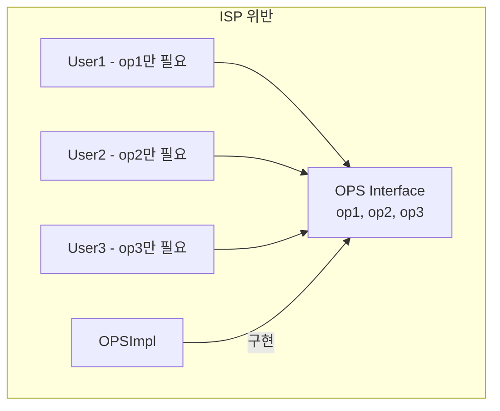
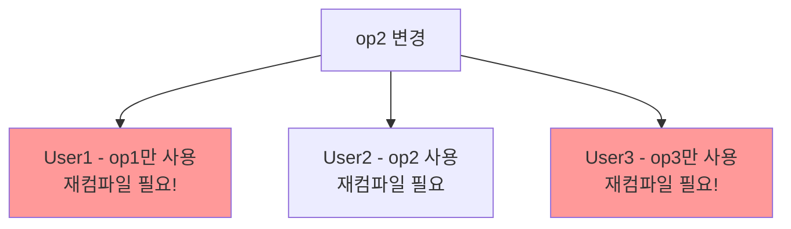
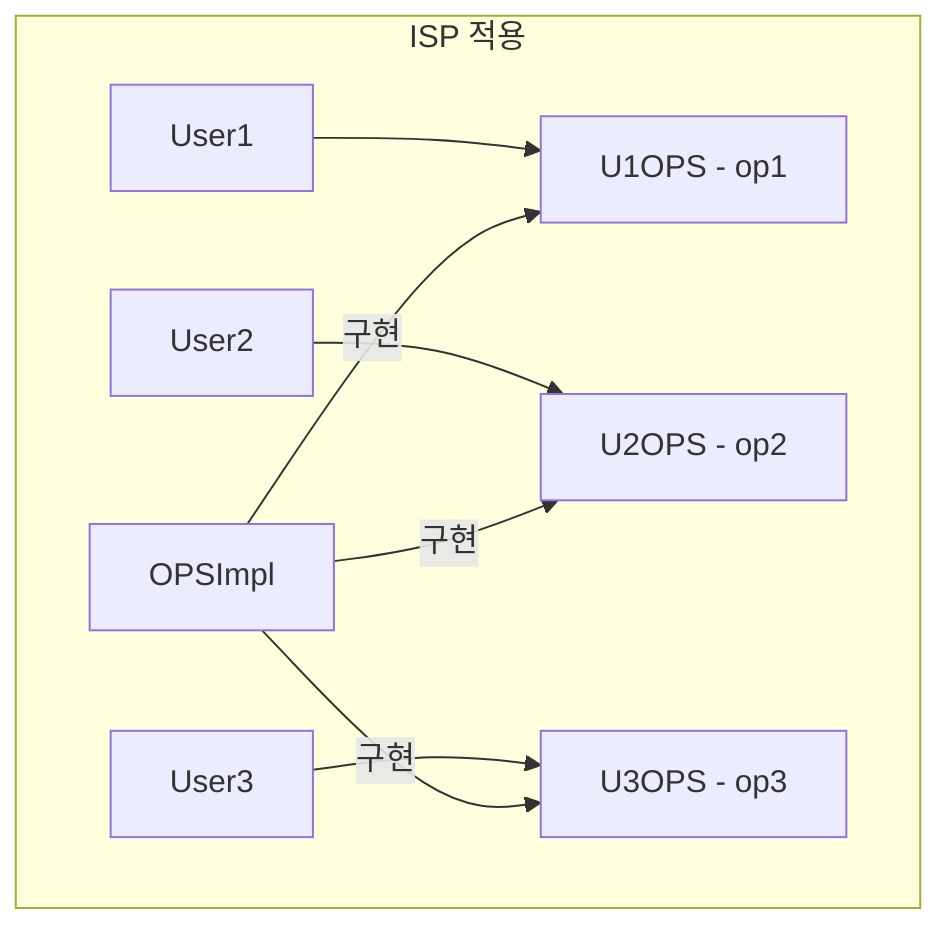
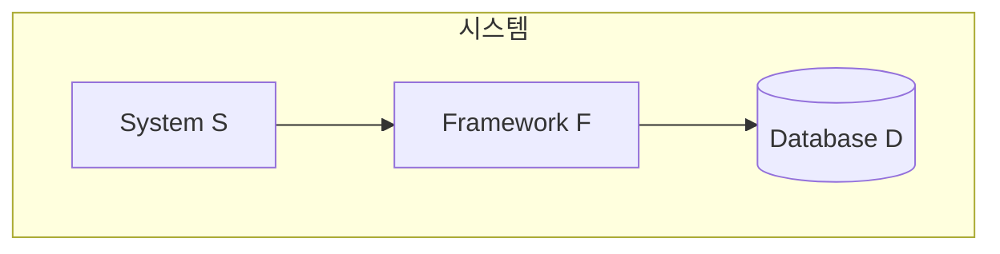
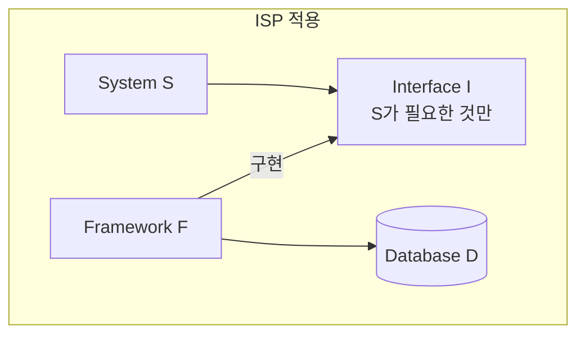

**ISP(Interface Segregation Principle)**는 1996년 Robert C. Martin이 Xerox 컨설팅 중에 발견한 원칙이다. 이 원칙은 불필요한 의존성으로 인한 문제를 해결하기 위해 **인터페이스를 분리**해야 한다고 말한다.

## ISP의 정의

> **"클라이언트는 자신이 사용하지 않는 메서드에 의존하지 않아야 한다."**

### 뚱뚱한 인터페이스의 문제

하나의 인터페이스에 많은 메서드가 있으면:

1. 사용하지 않는 메서드에도 **의존**하게 됨
2. 사용하지 않는 메서드의 변경에도 **영향**받음
3. **재컴파일, 재배포** 필요

## OPS 예제

마틴은 OPS(Operations) 인터페이스 예제를 사용한다.

### 문제 상황

```java
// 뚱뚱한 인터페이스
interface OPS {
    void op1();
    void op2();
    void op3();
}

class OPSImpl implements OPS {
    public void op1() { /* ... */ }
    public void op2() { /* ... */ }
    public void op3() { /* ... */ }
}
```

세 명의 사용자가 있다:
- **User1**: op1()만 사용
- **User2**: op2()만 사용
- **User3**: op3()만 사용



### 문제점

`op2()`의 시그니처가 변경되면:
- **User1**도 재컴파일 (사용하지 않는데!)
- **User3**도 재컴파일 (사용하지 않는데!)



### 해결책: 인터페이스 분리

```java
// 분리된 인터페이스
interface U1OPS {
    void op1();
}

interface U2OPS {
    void op2();
}

interface U3OPS {
    void op3();
}

class OPSImpl implements U1OPS, U2OPS, U3OPS {
    public void op1() { /* ... */ }
    public void op2() { /* ... */ }
    public void op3() { /* ... */ }
}
```



이제 `op2()` 변경 시:
- **User1**: 영향 없음
- **User2**: 재컴파일 필요
- **User3**: 영향 없음

## 정적 타입 언어 vs 동적 타입 언어

### 정적 타입 언어 (Java, C++, C#)

인터페이스 변경 시 **재컴파일, 재배포** 필요:

```java
// Java - 인터페이스 의존성이 명시적
import com.example.OPS;  // 컴파일 시 의존성 발생

class User1 {
    private OPS ops;  // OPS의 모든 메서드에 의존
}
```

ISP가 **특히 중요**하다.

### 동적 타입 언어 (Python, Ruby, JavaScript)

런타임에 메서드를 찾으므로 **컴파일 의존성이 없음**:

```python
# Python - 덕 타이핑
class User1:
    def use(self, ops):
        ops.op1()  # op1만 있으면 됨
```

그러나 **개념적으로는** 여전히 중요하다. 불필요한 의존성은 코드 이해와 유지보수를 어렵게 만든다.

## 아키텍처 수준의 ISP

ISP는 클래스 수준을 넘어 **아키텍처 수준**에서도 적용된다.

### 프레임워크 의존성



시스템 S가 프레임워크 F에 의존하고, F가 데이터베이스 D에 의존한다면:

- D의 변경 → F 영향 → **S도 영향**
- S는 D를 직접 사용하지 않는데도!

### 불필요한 이행적 의존성

```java
// S가 F에 의존
import com.framework.F;

// F가 D에 의존
// S는 D를 모르지만, D 변경 시 S도 재배포 필요!
```

### 해결책

필요한 것만 의존하도록 **인터페이스 분리**:



S는 I에만 의존. D 변경은 S에 **영향 없음**.

## ISP 적용 전략

### 1. 역할 인터페이스 (Role Interface)

클라이언트의 **역할**에 따라 인터페이스 분리:

```java
// 역할 기반 인터페이스
interface Readable {
    String read();
}

interface Writable {
    void write(String data);
}

interface Seekable {
    void seek(int position);
}

// 필요한 역할만 구현
class FileStream implements Readable, Writable, Seekable { /* ... */ }
class NetworkStream implements Readable, Writable { /* ... */ }  // Seekable 필요 없음
class ReadOnlyFile implements Readable { /* ... */ }  // 읽기만
```

### 2. 클라이언트 전용 인터페이스

각 클라이언트를 위한 **전용 인터페이스**:

```java
// 클라이언트별 인터페이스
interface AdminOperations {
    void createUser();
    void deleteUser();
    void resetPassword();
}

interface UserOperations {
    void viewProfile();
    void updateProfile();
}

interface GuestOperations {
    void viewPublicContent();
}
```

### 3. 인터페이스 상속

작은 인터페이스를 **조합**:

```java
interface BasicOperations {
    void op1();
}

interface AdvancedOperations extends BasicOperations {
    void op2();
    void op3();
}

// 기본 사용자
class BasicUser {
    void use(BasicOperations ops) { /* ... */ }
}

// 고급 사용자
class AdvancedUser {
    void use(AdvancedOperations ops) { /* ... */ }
}
```

## ISP vs SRP

| 원칙 | 초점 | 기준 |
|------|------|------|
| SRP | **변경의 이유** | 액터 (누가 변경 요청) |
| ISP | **사용하는 것** | 클라이언트 (누가 사용) |

둘 다 **응집도**와 **결합도**에 관한 원칙이지만, 관점이 다르다:

- **SRP**: 내부 관점 - 모듈이 왜 변경되는가?
- **ISP**: 외부 관점 - 클라이언트가 무엇을 사용하는가?

## 실제 예시: Java의 인터페이스

### 나쁜 예: java.util.Collection

```java
interface Collection<E> {
    boolean add(E e);
    boolean remove(Object o);
    boolean contains(Object o);
    int size();
    void clear();
    Iterator<E> iterator();
    // ... 15개 이상의 메서드
}
```

모든 컬렉션이 모든 메서드를 의미 있게 구현하지는 않는다. 예: `ImmutableList`의 `add()`는 예외를 던진다.

### 좋은 예: 분리된 인터페이스

```java
interface Iterable<E> {
    Iterator<E> iterator();
}

interface Sized {
    int size();
}

interface Readable<E> extends Iterable<E>, Sized {
    boolean contains(Object o);
}

interface Writable<E> {
    boolean add(E e);
    boolean remove(Object o);
    void clear();
}
```

## 핵심 요약

| 항목 | 내용 |
|------|------|
| 정의 | 클라이언트는 사용하지 않는 것에 의존하지 않아야 함 |
| 문제 | 불필요한 재컴파일, 재배포, 변경 영향 |
| 해결 | 인터페이스 분리, 역할 기반 인터페이스 |
| 적용 범위 | 클래스, 모듈, 아키텍처 수준 |

> **"필요 이상으로 많은 것을 포함하는 모듈에 의존하는 것은 해로운 일이다. 소스 코드 의존성의 경우 불필요한 재컴파일과 재배포를 강제하기 때문이다."**
> — Robert C. Martin

## 다음 장에서는

다음 장에서는 **DIP: 의존성 역전 원칙**을 다룬다. 이 원칙은 Clean Architecture의 핵심이며, 고수준 모듈이 저수준 모듈에 의존하지 않고 추상화에 의존해야 한다는 것을 말한다.
