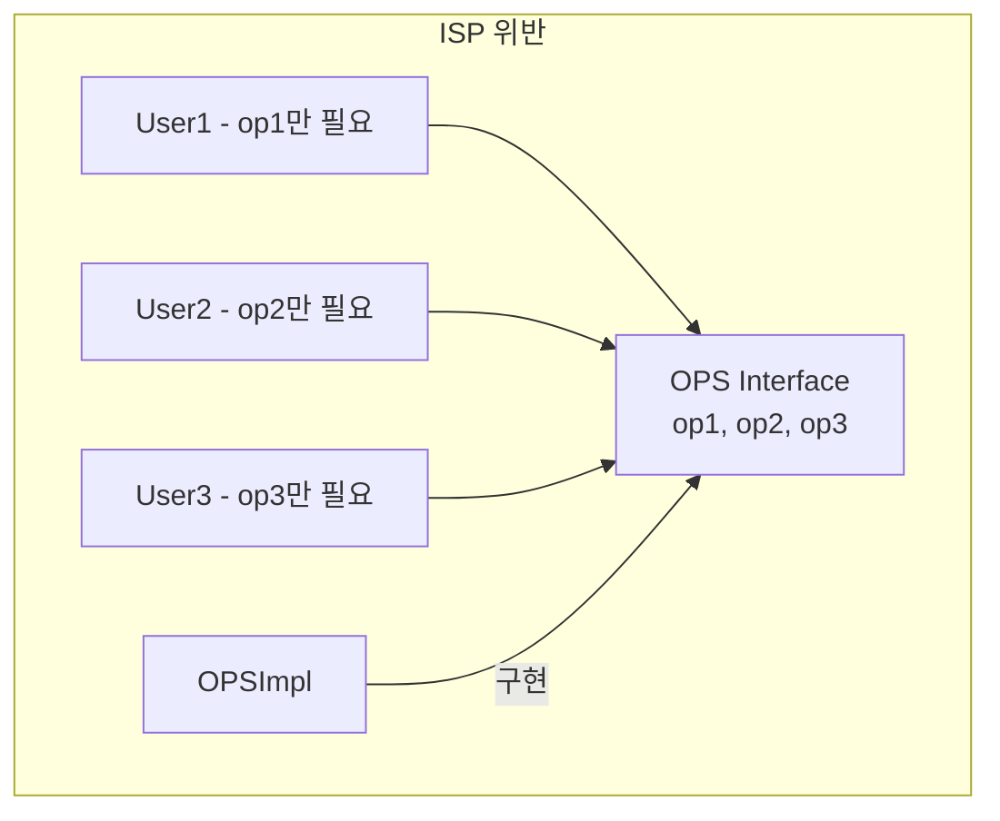
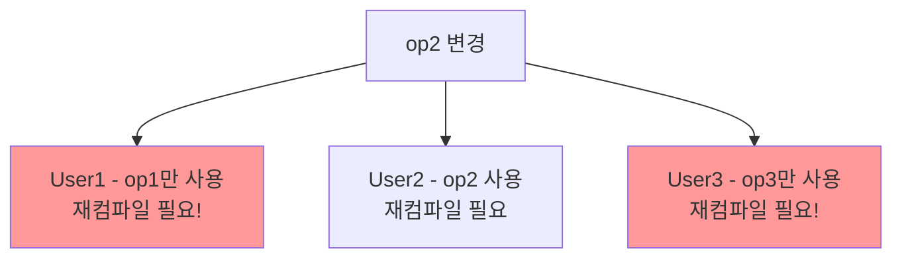
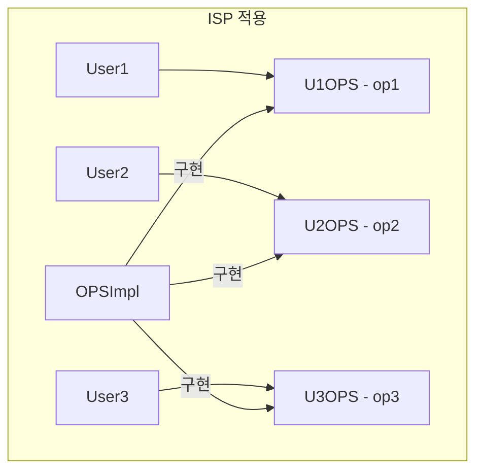
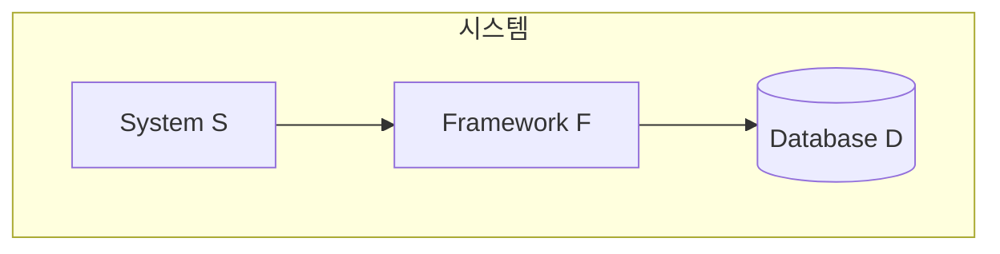
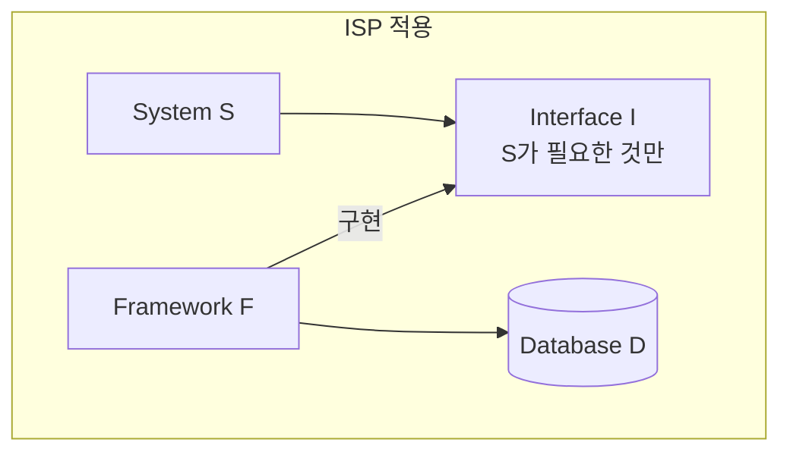

**ISP(Interface Segregation Principle)**는 1996년 Robert C. Martin이 Xerox 컨설팅 중에 발견한 원칙이다(Martin, 『Clean Architecture』, 2017, 10장). 이 원칙은 불필요한 의존성으로 인한 문제를 해결하기 위해 **인터페이스를 분리**해야 한다고 말한다.

## ISP의 정의

> **"클라이언트는 자신이 사용하지 않는 메서드에 의존하지 않아야 한다."**

### 뚱뚱한 인터페이스의 문제

하나의 인터페이스에 많은 메서드가 있으면 세 가지 문제가 연쇄적으로 발생한다.

1. 사용하지 않는 메서드에도 **의존**하게 됨 — 클라이언트는 자신이 호출하지 않는 메서드의 시그니처까지 소스 코드 의존성으로 떠안는다.
2. 사용하지 않는 메서드의 변경에도 **영향**받음 — 다른 클라이언트가 쓰는 메서드가 바뀌어도, 나와 무관한 변경 때문에 내 코드가 재컴파일 대상이 된다.
3. **재컴파일, 재배포** 필요 — 정적 타입 언어에서는 인터페이스 파일이 바뀌면 그 인터페이스를 import하는 모든 클라이언트가 다시 컴파일·배포되어야 한다.

## OPS 예제

마틴은 OPS(Operations) 인터페이스 예제를 사용한다.

### 문제 상황

```java
// 뚱뚱한 인터페이스
interface OPS {
    void op1();
    void op2();
    void op3();
}

class OPSImpl implements OPS {
    public void op1() { System.out.println("op1 실행"); }
    public void op2() { System.out.println("op2 실행"); }
    public void op3() { System.out.println("op3 실행"); }
}
```

세 명의 사용자가 있다:
- **User1**: op1()만 사용
- **User2**: op2()만 사용
- **User3**: op3()만 사용


```mermaid
flowchart TB
    subgraph Problem [ISP 위반]
        U1[User1 - op1만 필요]
        U2[User2 - op2만 필요]
        U3[User3 - op3만 필요]
        
        OPS[OPS Interface</br>op1, op2, op3]
        IMPL[OPSImpl]
        
        U1 --> OPS
        U2 --> OPS
        U3 --> OPS
        IMPL -->|구현| OPS
    end
```

### 문제점

`op2()`의 시그니처가 변경되면:
- **User1**도 재컴파일 (사용하지 않는데!)
- **User3**도 재컴파일 (사용하지 않는데!)


```mermaid
flowchart TB
    Change[op2 변경]
    
    U1[User1 - op1만 사용</br>재컴파일 필요!]
    U2[User2 - op2 사용</br>재컴파일 필요]
    U3[User3 - op3만 사용</br>재컴파일 필요!]
    
    Change --> U1
    Change --> U2
    Change --> U3
    
    style U1 fill:#f99
    style U3 fill:#f99
```

### 해결책: 인터페이스 분리

```java
// 분리된 인터페이스
interface U1OPS {
    void op1();
}

interface U2OPS {
    void op2();
}

interface U3OPS {
    void op3();
}

class OPSImpl implements U1OPS, U2OPS, U3OPS {
    public void op1() { System.out.println("op1 실행"); }
    public void op2() { System.out.println("op2 실행"); }
    public void op3() { System.out.println("op3 실행"); }
}
```


```mermaid
flowchart TB
    subgraph Solution [ISP 적용]
        U1[User1]
        U2[User2]
        U3[User3]
        
        I1[U1OPS - op1]
        I2[U2OPS - op2]
        I3[U3OPS - op3]
        
        IMPL[OPSImpl]
        
        U1 --> I1
        U2 --> I2
        U3 --> I3
        
        IMPL -->|구현| I1
        IMPL -->|구현| I2
        IMPL -->|구현| I3
    end
```

이제 `op2()` 변경 시:
- **User1**: 영향 없음
- **User2**: 재컴파일 필요
- **User3**: 영향 없음

## 정적 타입 언어 vs 동적 타입 언어

### 정적 타입 언어 (Java, C++, C#)

정적 타입 언어에서는 `import`나 `#include`로 가져온 타입의 전체 시그니처가 컴파일 단위의 일부가 된다. `User1`이 `OPS` 타입의 필드를 선언하는 순간, `op1()`만 쓰더라도 `op2()`·`op3()`의 시그니처까지 컴파일 의존성으로 묶인다. 그래서 인터페이스 변경 시 **재컴파일, 재배포**가 필요하다:

```java
// Java - 인터페이스 의존성이 명시적
import com.example.OPS;  // 컴파일 시 의존성 발생

class User1 {
    private OPS ops;  // OPS의 모든 메서드에 의존
}
```

컴파일 의존성이 눈에 보이는 형태로 강제되기 때문에, 정적 타입 언어에서는 ISP가 **특히 중요**하다.

### 동적 타입 언어 (Python, Ruby, JavaScript)

동적 타입 언어는 런타임에 메서드를 찾는 덕 타이핑을 쓰므로, 클라이언트는 호출하는 메서드만 실제로 존재하면 된다. `User1`은 `op1()`을 가진 어떤 객체든 받을 수 있어, 컴파일 시점의 의존성 자체가 없다:

```python
# Python - 덕 타이핑
class User1:
    def use(self, ops):
        ops.op1()  # op1만 있으면 됨
```

그러나 **개념적으로는** 여전히 중요하다. 컴파일러가 강제하지 않을 뿐, "이 클라이언트가 실제로 무엇을 쓰는지"는 여전히 읽는 사람이 추론해야 하는 정보다. 뚱뚱한 객체를 전달받으면 그 객체가 제공하는 수십 개 메서드 중 실제로 쓰이는 것이 무엇인지 코드를 끝까지 읽어야 알 수 있어, 불필요한 의존성은 컴파일 여부와 무관하게 코드 이해와 유지보수를 어렵게 만든다.

## 아키텍처 수준의 ISP

ISP는 클래스 수준을 넘어 **아키텍처 수준**에서도 적용된다.

### 프레임워크 의존성


```mermaid
flowchart TB
    subgraph System [시스템]
        S[System S]
        F[Framework F]
        D[(Database D)]
        
        S --> F
        F --> D
    end
```

시스템 S가 프레임워크 F에 의존하고, F가 데이터베이스 D에 의존한다면:

- D의 변경 → F 영향 → **S도 영향**
- S는 D를 직접 사용하지 않는데도!

### 불필요한 이행적 의존성

```java
// S가 F에 의존
import com.framework.F;

// F가 D에 의존
// S는 D를 모르지만, D 변경 시 S도 재배포 필요!
```

### 해결책

필요한 것만 의존하도록 **인터페이스 분리**:


```mermaid
flowchart TB
    subgraph Solution [ISP 적용]
        S[System S]
        I[Interface I</br>S가 필요한 것만]
        F[Framework F]
        D[(Database D)]
        
        S --> I
        F -->|구현| I
        F --> D
    end
```

S는 I에만 의존. D 변경은 S에 **영향 없음**.

## ISP 적용 전략

### 1. 역할 인터페이스 (Role Interface)

클라이언트의 **역할**에 따라 인터페이스 분리:

```java
// 역할 기반 인터페이스
interface Readable {
    String read();
}

interface Writable {
    void write(String data);
}

interface Seekable {
    void seek(int position);
}

// 필요한 역할만 구현
class FileStream implements Readable, Writable, Seekable {
    private final StringBuilder buffer = new StringBuilder();
    private int position;

    public String read() { return buffer.substring(position); }
    public void write(String data) { buffer.append(data); }
    public void seek(int position) { this.position = position; }
}

class NetworkStream implements Readable, Writable {  // Seekable 필요 없음
    private final StringBuilder buffer = new StringBuilder();

    public String read() { return buffer.toString(); }
    public void write(String data) { buffer.append(data); }
}

class ReadOnlyFile implements Readable {  // 읽기만
    private final String content;

    ReadOnlyFile(String content) { this.content = content; }
    public String read() { return content; }
}
```

역할 인터페이스는 "이 타입이 무엇을 할 수 있는가"를 여러 개의 작은 계약으로 쪼갠다. `NetworkStream`처럼 위치 이동 개념이 없는 스트림은 애초에 `Seekable`을 구현하지 않으면 되므로, "지원하지 않는 연산은 예외를 던진다" 같은 LSP 위반 코드를 쓸 필요가 없다. 다만 역할이 지나치게 세분화되면 한 클래스가 구현해야 할 인터페이스 목록이 길어지므로, 실제로 독립적으로 조합되는 역할만 나누는 것이 좋다.

### 2. 클라이언트 전용 인터페이스

각 클라이언트를 위한 **전용 인터페이스**:

```java
// 클라이언트별 인터페이스
interface AdminOperations {
    void createUser();
    void deleteUser();
    void resetPassword();
}

interface UserOperations {
    void viewProfile();
    void updateProfile();
}

interface GuestOperations {
    void viewPublicContent();
}
```

역할 인터페이스가 "기능 단위"로 나눈다면, 클라이언트 전용 인터페이스는 애초부터 "이 인터페이스를 쓸 사용자 그룹"을 기준으로 나눈다. `AdminOperations`가 바뀌어도 `GuestOperations`만 의존하는 코드는 재컴파일 대상이 아니다. 사용자 역할이 코드베이스 전반에 이미 명확히 구분돼 있는 시스템(권한 체계가 있는 서비스 등)에서 특히 잘 맞는다.

### 3. 인터페이스 상속

작은 인터페이스를 **조합**:

```java
interface BasicOperations {
    void op1();
}

interface AdvancedOperations extends BasicOperations {
    void op2();
    void op3();
}

// 기본 사용자
class BasicUser {
    void use(BasicOperations ops) { ops.op1(); }
}

// 고급 사용자
class AdvancedUser {
    void use(AdvancedOperations ops) {
        ops.op1();
        ops.op2();
        ops.op3();
    }
}
```

`AdvancedOperations`가 `BasicOperations`를 확장하므로, 고급 기능이 필요한 클라이언트는 상위 인터페이스 하나만 의존하면 기본·고급 연산을 모두 쓸 수 있다. 반면 기본 기능만 필요한 클라이언트는 `BasicOperations`만 알면 되어 `op2()`·`op3()`의 변경에 영향받지 않는다. 계층이 깊어질수록(3단계 이상) 어떤 인터페이스가 어떤 메서드를 포함하는지 추적하기 어려워지므로, 상속 깊이는 2단계 안팎으로 유지하는 것이 실용적이다.

## ISP vs SRP

| 원칙 | 초점 | 기준 |
|------|------|------|
| SRP | **변경의 이유** | 액터 (누가 변경 요청) |
| ISP | **사용하는 것** | 클라이언트 (누가 사용) |

둘 다 **응집도**와 **결합도**에 관한 원칙이지만, 관점이 다르다:

- **SRP**: 내부 관점 - 모듈이 왜 변경되는가?
- **ISP**: 외부 관점 - 클라이언트가 무엇을 사용하는가?

분리된 인터페이스는 의존성 주입(DI) 프레임워크와도 잘 맞는다. `Readable`·`Writable`처럼 역할이 좁을수록 "이 클라이언트에는 어떤 구현체를 주입해야 하는가"가 명확해지고, 테스트에서는 필요한 역할의 목(mock)만 만들면 된다. 인터페이스 자체가 좁고 이름이 명확하면, 그 인터페이스를 보는 것만으로 클라이언트가 실제로 무엇을 필요로 하는지 알 수 있어 별도 문서 없이도 사용 의도가 드러난다 — 잘 분리된 인터페이스는 그 자체로 살아있는 문서 역할을 한다.

## 실제 예시: Java의 인터페이스

### 나쁜 예: java.util.Collection

`java.util.Collection`은 읽기 연산(`size()`, `contains()`, `iterator()`)과 쓰기 연산(`add()`, `remove()`, `clear()`)을 하나의 인터페이스에 모두 담고 있다. 읽기 전용 컬렉션을 만들려는 클라이언트도 이 인터페이스를 구현하는 한 쓰기 메서드 시그니처까지 떠안아야 한다.

```java
import java.util.Iterator;

interface Collection<E> {
    boolean add(E e);
    boolean remove(Object o);
    boolean contains(Object o);
    int size();
    void clear();
    Iterator<E> iterator();
    // ... 15개 이상의 메서드
}
```

모든 컬렉션이 모든 메서드를 의미 있게 구현하지는 않는다. 예: `ImmutableList`의 `add()`는 예외를 던진다. 이는 상위 계약("추가하면 컬렉션에 반영된다")을 지키지 못하는 것이므로, ISP 위반이 LSP 위반으로 이어지는 전형적인 사례다.

### 좋은 예: 분리된 인터페이스

읽기·쓰기·순회·크기 조회를 각각 별도 인터페이스로 나누면, `ImmutableList`는 `Writable`을 구현하지 않는 것만으로 "쓰기를 지원하지 않는다"는 사실을 타입 시스템에 드러낼 수 있다. 더 이상 `add()`를 예외로 막을 필요가 없다 — 애초에 그 메서드가 타입에 존재하지 않기 때문이다.

```java
import java.util.Iterator;

interface Iterable<E> {
    Iterator<E> iterator();
}

interface Sized {
    int size();
}

interface Readable<E> extends Iterable<E>, Sized {
    boolean contains(Object o);
}

interface Writable<E> {
    boolean add(E e);
    boolean remove(Object o);
    void clear();
}
```

읽기 전용 클라이언트는 `Readable`만 알면 되고, 쓰기 기능이 필요한 클라이언트만 `Writable`을 추가로 의존한다. 인터페이스 분리가 예외 던지기라는 LSP 위반을 근본적으로 제거한 셈이다.

## 흔한 오해

ISP를 "인터페이스는 항상 메서드 하나만 가져야 한다"는 규칙으로 오해하는 경우가 있다. 그러나 ISP의 기준은 메서드 개수가 아니라 **클라이언트별 사용 패턴**이다. 여러 클라이언트가 항상 같은 메서드 집합을 함께 사용한다면, 그 메서드들을 굳이 별도 인터페이스로 쪼갤 이유가 없다. 반대로 클라이언트마다 사용하는 부분이 겹치지 않는데 하나의 인터페이스로 묶여 있다면, 그것이 ISP가 지적하는 "뚱뚱한 인터페이스"다. 또 다른 오해는 동적 타입 언어에서는 ISP가 무의미하다는 생각이다. 컴파일 의존성은 사라지지만, 불필요한 메서드에 대한 개념적 의존은 여전히 코드를 읽고 테스트하기 어렵게 만든다.

## 핵심 요약

| 항목 | 내용 |
|------|------|
| 정의 | 클라이언트는 사용하지 않는 것에 의존하지 않아야 함 |
| 문제 | 불필요한 재컴파일, 재배포, 변경 영향 |
| 해결 | 인터페이스 분리, 역할 기반 인터페이스 |
| 적용 범위 | 클래스, 모듈, 아키텍처 수준 |

마틴은 필요 이상으로 많은 것을 포함하는 모듈에 의존하는 것은 해로운 일이라고 말한다. 소스 코드 의존성의 경우 불필요한 재컴파일과 재배포를 강제하기 때문이다(Martin, 『Clean Architecture』, 2017, 10장).

## 학습 목표

이 장을 읽은 후 다음을 스스로 점검한다.

- "뚱뚱한 인터페이스"가 왜 문제인지 재컴파일·재배포 관점에서 설명할 수 있는가?
- OPS 예제에서 인터페이스 분리 전후로 `op2()` 변경의 영향 범위가 어떻게 달라지는지 설명할 수 있는가?
- ISP와 SRP가 각각 "무엇을 기준으로" 응집도를 판단하는지 구분할 수 있는가?
- 정적 타입 언어와 동적 타입 언어에서 ISP의 중요도가 왜 다른지 설명할 수 있는가?
- 역할 인터페이스, 클라이언트 전용 인터페이스, 인터페이스 상속 세 가지 분리 전략의 차이를 구분할 수 있는가?

## 판단 기준

인터페이스를 설계하거나 검토할 때 다음을 확인한다.

- 이 인터페이스를 구현하는 클래스 중 일부 메서드를 빈 구현이나 예외로 처리하는 경우가 있는가? (LSP 위반과 동시에 ISP 위반일 가능성이 높다)
- 인터페이스의 메서드 중 일부만 사용하는 클라이언트가 존재하는가?
- 인터페이스 변경이 그 변경과 무관한 클라이언트의 재컴파일을 강제하는가?
- 인터페이스를 클라이언트의 역할 단위로 쪼갰을 때 오히려 인터페이스 수가 과도하게 늘어나 관리 비용이 더 커지지는 않는가?

### 과도한 인터페이스 분리

ISP도 SRP와 마찬가지로 과유불급이다. 메서드 하나마다 인터페이스를 하나씩 만들면(예: `Op1able`, `Op2able`, `Op3able`처럼 쪼개고, 실제로는 항상 셋을 함께 쓰는 클라이언트만 존재한다면), 인터페이스 수가 클래스 수를 넘어서고 어떤 조합이 유효한지 파악하기 위해 여러 파일을 오가야 한다. 항상 함께 쓰이는 메서드들을 억지로 나누면 ISP가 해결하려던 "불필요한 의존성" 문제 대신 "과도한 간접 계층"이라는 새 문제가 생긴다. 판단 기준은 "메서드가 몇 개인가"가 아니라 "실제로 서로 다른 클라이언트가 서로 다른 부분집합을 쓰는가"다 — 모든 클라이언트가 같은 메서드 집합을 함께 쓴다면 나눌 이유가 없다.

## 참고 자료

- Robert C. Martin, 『Clean Architecture』, 2017, 10장 — ISP의 OPS 예제와 아키텍처 수준 적용의 원 출처.
- Robert C. Martin, "The Interface Segregation Principle", C++ Report, 1996 — ISP를 처음 정식화한 원 논문.

## 다음 장에서는

다음 장에서는 **DIP: 의존성 역전 원칙**을 다룬다. 이 원칙은 Clean Architecture의 핵심이며, 고수준 모듈이 저수준 모듈에 의존하지 않고 추상화에 의존해야 한다는 것을 말한다.
