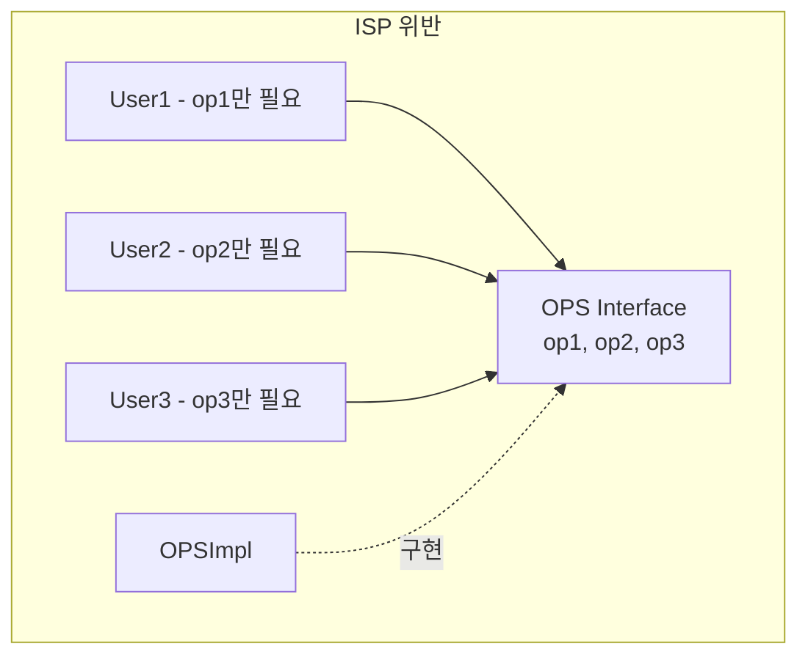
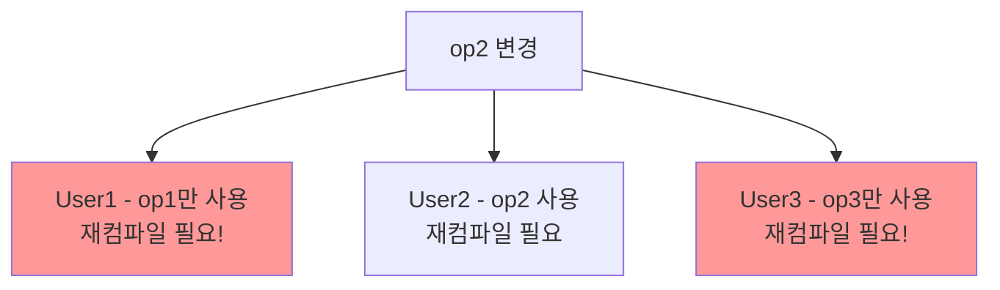
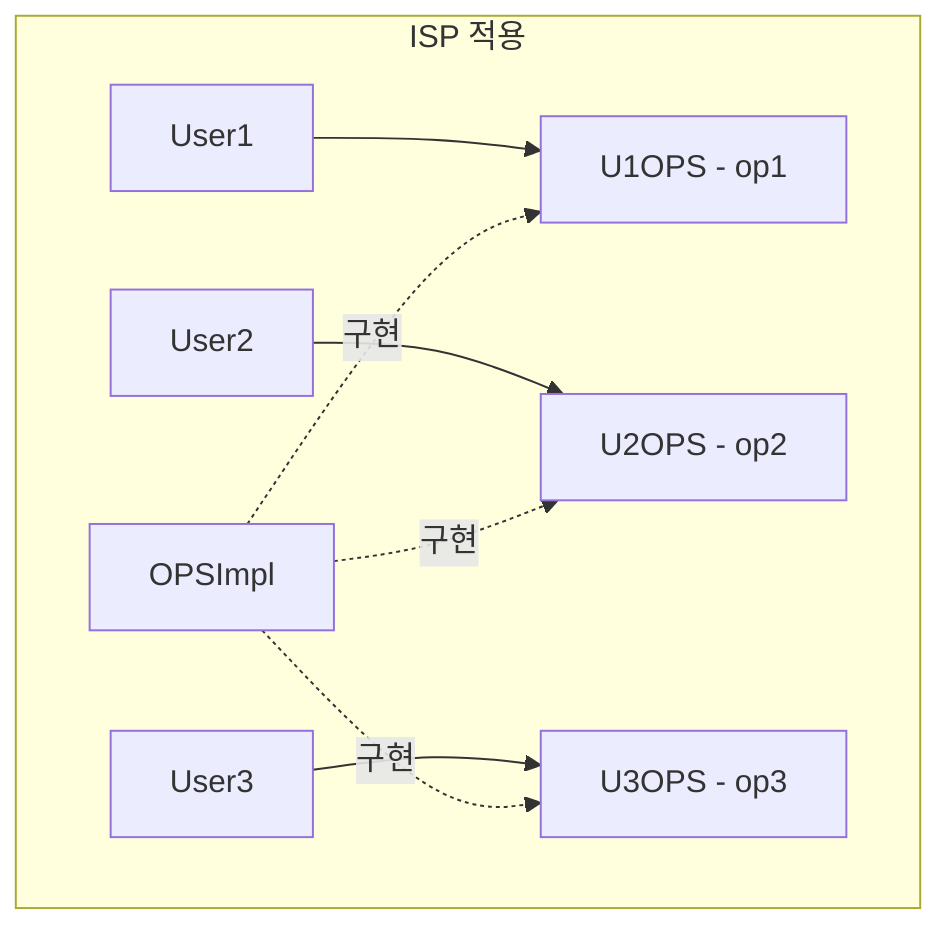
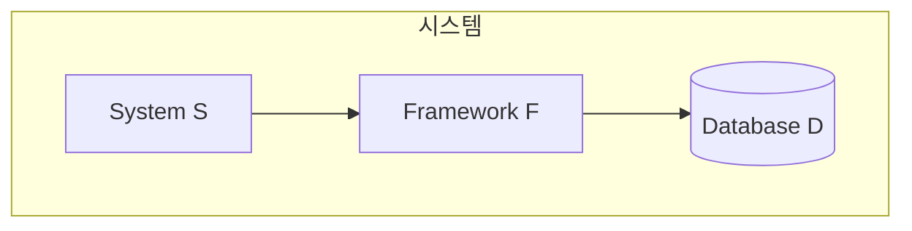
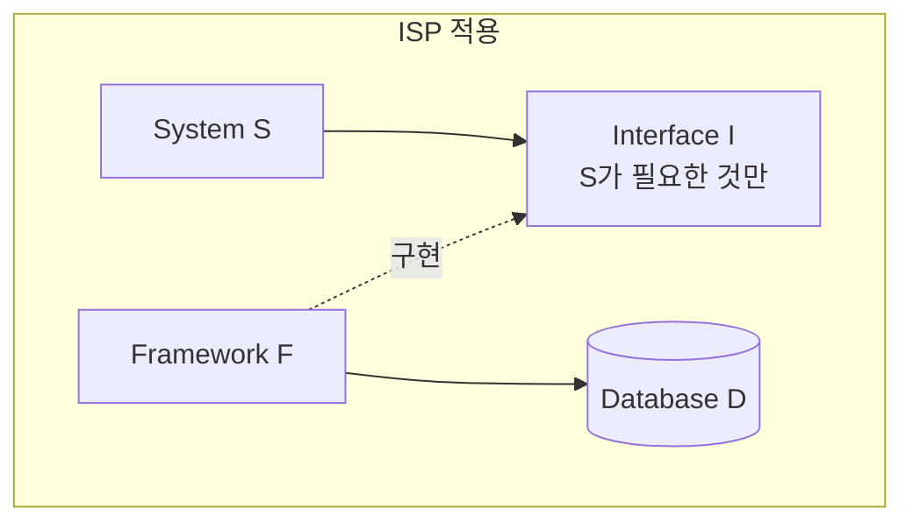

<strong>ISP(Interface Segregation Principle)</strong>는 Robert C. Martin이 Xerox 컨설팅 경험을 바탕으로 정식화한 원칙이다(Martin, "The Interface Segregation Principle", C++ Report, 1996). 이 원칙은 불필요한 의존성으로 인한 문제를 해결하기 위해 **인터페이스를 분리**해야 한다고 말한다.

원 논문이 든 사례는 Xerox의 새 프린터 시스템이었다. 스테이플러 작업, 팩스 작업, 인쇄 작업이 모두 하나의 `Job` 클래스에 쌓이면서, 어떤 작업 유형의 요구사항이 바뀌어도 `Job`에 의존하는 모든 코드가 함께 재컴파일·재배포되는 상태에 이르렀다. 개별 작업의 로직이 잘못됐던 것이 아니라, **서로 다른 클라이언트가 서로 다른 부분집합만 쓰는데도 하나의 타입으로 묶여 있었던 것**이 문제였다. 이후 이 원칙은 『Clean Architecture』(2017) 10장에서 아키텍처 수준까지 확장된다.

## ISP의 정의

> **"클라이언트는 자신이 사용하지 않는 인터페이스에 의존하도록 강제되어서는 안 된다."**
> (Clients should not be forced to depend upon interfaces that they do not use.)
>
> — Robert C. Martin, "The Interface Segregation Principle", C++ Report, 1996

### 뚱뚱한 인터페이스의 문제

하나의 인터페이스에 많은 메서드가 있으면 세 가지 문제가 연쇄적으로 발생한다.

1. 사용하지 않는 메서드에도 **의존**하게 됨 — 클라이언트는 자신이 호출하지 않는 메서드의 시그니처까지 소스 코드 의존성으로 떠안는다.
2. 사용하지 않는 메서드의 변경에도 **영향**받음 — 다른 클라이언트가 쓰는 메서드가 바뀌어도, 나와 무관한 변경 때문에 내 코드가 재컴파일 대상이 된다.
3. **재컴파일, 재배포** 필요 — 정적 타입 언어에서는 인터페이스 파일이 바뀌면 그 인터페이스를 import하는 모든 클라이언트가 다시 컴파일·배포되어야 한다.

## OPS 예제

마틴은 OPS(Operations) 인터페이스 예제를 사용한다.

### 문제 상황

```java
// 뚱뚱한 인터페이스
interface OPS {
    void op1();
    void op2();
    void op3();
}

class OPSImpl implements OPS {
    public void op1() { System.out.println("op1 실행"); }
    public void op2() { System.out.println("op2 실행"); }
    public void op3() { System.out.println("op3 실행"); }
}
```

세 명의 사용자가 있다:
- **User1**: op1()만 사용
- **User2**: op2()만 사용
- **User3**: op3()만 사용


```mermaid
flowchart TB
    subgraph Problem [ISP 위반]
        U1[User1 - op1만 필요]
        U2[User2 - op2만 필요]
        U3[User3 - op3만 필요]
        
        OPS[OPS Interface</br>op1, op2, op3]
        IMPL[OPSImpl]
        
        U1 --> OPS
        U2 --> OPS
        U3 --> OPS
        IMPL -.->|구현| OPS
    end
```

### 문제점

재컴파일이 왜 전파되는지는 컴파일러가 무엇을 의존성으로 보는지에서 나온다. `User1`은 `op1()`만 호출하지만, `OPS` 타입을 선언한 순간 컴파일러는 `OPS`의 **선언 전체**를 읽어야 `User1`을 검증할 수 있다. 따라서 `op2()`의 시그니처가 바뀌면 `OPS`의 선언이 바뀌고, 그 선언을 읽는 모든 번역 단위가 낡은 것으로 표시된다. 호출하지 않는 메서드라도 같은 파일에 있다는 이유만으로 영향권에 들어오는 것이다.

`op2()`의 시그니처가 변경되면:
- **User1**도 재컴파일 (사용하지 않는데!)
- **User3**도 재컴파일 (사용하지 않는데!)


```mermaid
flowchart TB
    Change[op2 변경]
    
    U1[User1 - op1만 사용</br>재컴파일 필요!]
    U2[User2 - op2 사용</br>재컴파일 필요]
    U3[User3 - op3만 사용</br>재컴파일 필요!]
    
    Change --> U1
    Change --> U2
    Change --> U3
    
    style U1 fill:#f99
    style U3 fill:#f99
```

### 해결책: 인터페이스 분리

앞의 전파 경로를 끊으려면 클라이언트가 읽어야 하는 선언 자체를 줄여야 한다. 구현 클래스를 쪼갤 필요는 없다 — `OPSImpl`은 그대로 두고, **클라이언트가 바라보는 창을 여러 개로 나누는 것**으로 충분하다. 각 사용자가 자신이 실제로 호출하는 연산만 담은 인터페이스에 의존하면, 다른 연산의 시그니처가 바뀌어도 그 선언을 읽지 않으므로 재컴파일 대상에서 빠진다.

```java
// 분리된 인터페이스
interface U1OPS {
    void op1();
}

interface U2OPS {
    void op2();
}

interface U3OPS {
    void op3();
}

class OPSImpl implements U1OPS, U2OPS, U3OPS {
    public void op1() { System.out.println("op1 실행"); }
    public void op2() { System.out.println("op2 실행"); }
    public void op3() { System.out.println("op3 실행"); }
}
```


```mermaid
flowchart TB
    subgraph Solution [ISP 적용]
        U1[User1]
        U2[User2]
        U3[User3]
        
        I1[U1OPS - op1]
        I2[U2OPS - op2]
        I3[U3OPS - op3]
        
        IMPL[OPSImpl]
        
        U1 --> I1
        U2 --> I2
        U3 --> I3
        
        IMPL -.->|구현| I1
        IMPL -.->|구현| I2
        IMPL -.->|구현| I3
    end
```

이제 `op2()` 변경 시:
- **User1**: 영향 없음
- **User2**: 재컴파일 필요
- **User3**: 영향 없음

## 정적 타입 언어 vs 동적 타입 언어

### 정적 타입 언어 (Java, C++, C#)

정적 타입 언어에서는 `import`나 `#include`로 가져온 타입의 전체 시그니처가 컴파일 단위의 일부가 된다. `User1`이 `OPS` 타입의 필드를 선언하는 순간, `op1()`만 쓰더라도 `op2()`·`op3()`의 시그니처까지 컴파일 의존성으로 묶인다. 그래서 인터페이스 변경 시 **재컴파일, 재배포**가 필요하다:

```java
// Java - 인터페이스 의존성이 명시적
interface OPS {
    void op1();
    void op2();
    void op3();
}

class User1 {
    private OPS ops;  // op1만 쓰지만 OPS 선언 전체에 의존

    void run() { ops.op1(); }
}
```

컴파일 의존성이 눈에 보이는 형태로 강제되기 때문에, 정적 타입 언어에서는 ISP가 **특히 중요**하다.

### 동적 타입 언어 (Python, Ruby, JavaScript)

동적 타입 언어는 런타임에 메서드를 찾는 덕 타이핑을 쓰므로, 클라이언트는 호출하는 메서드만 실제로 존재하면 된다. `User1`은 `op1()`을 가진 어떤 객체든 받을 수 있어, 컴파일 시점의 의존성 자체가 없다:

```python
# Python - 덕 타이핑
class User1:
    def use(self, ops):
        ops.op1()  # op1만 있으면 됨
```

그러나 **개념적으로는** 여전히 중요하다. 컴파일러가 강제하지 않을 뿐, "이 클라이언트가 실제로 무엇을 쓰는지"는 여전히 읽는 사람이 추론해야 하는 정보다. 뚱뚱한 객체를 전달받으면 그 객체가 제공하는 수십 개 메서드 중 실제로 쓰이는 것이 무엇인지 코드를 끝까지 읽어야 알 수 있어, 불필요한 의존성은 컴파일 여부와 무관하게 코드 이해와 유지보수를 어렵게 만든다.

## 아키텍처 수준의 ISP

ISP는 클래스 수준을 넘어 **아키텍처 수준**에서도 적용된다.

### 프레임워크 의존성


```mermaid
flowchart TB
    subgraph System [시스템]
        S[System S]
        F[Framework F]
        D[(Database D)]
        
        S --> F
        F --> D
    end
```

시스템 S가 프레임워크 F에 의존하고, F가 데이터베이스 D에 의존한다면:

- D의 변경 → F 영향 → **S도 영향**
- S는 D를 직접 사용하지 않는데도!

이 구도는 추상적인 기호가 아니라 흔한 실무 배치다. 업무 로직(S)이 ORM 프레임워크(F)를 통해 데이터에 접근하고, 그 프레임워크가 특정 데이터베이스 드라이버(D)에 묶여 있는 경우가 그렇다. 업무 로직은 SQL 방언이나 드라이버 버전을 직접 다루지 않지만, 프레임워크가 드라이버 타입을 자신의 공개 API에 노출하고 있다면 드라이버 교체가 업무 로직의 재빌드로 번진다. 클래스 수준에서 "쓰지 않는 메서드에 묶인다"가 배포 단위 수준에서는 "쓰지 않는 컴포넌트에 묶인다"로 나타나는 것이다.

### 불필요한 이행적 의존성

문제는 F가 D를 사용한다는 사실 자체가 아니라, **F의 공개 인터페이스가 D의 타입을 드러낸다**는 데 있다. 아래 코드에서 `Framework.query()`가 `Database` 타입을 반환하는 순간, `System`은 `Database`를 한 번도 언급하지 않았음에도 그 타입의 선언을 읽어야 컴파일된다.

```java
// D: 저수준 데이터베이스
class Database {
    String fetch(String sql) { return "row"; }
}

// F: D의 타입을 공개 API에 노출하는 프레임워크
class Framework {
    private final Database db = new Database();
    Database query() { return db; }   // 반환 타입이 D를 드러낸다
}

// S: D를 직접 쓰지 않지만 D의 선언에 묶인다
class System {
    private final Framework framework = new Framework();

    String run() {
        Database db = framework.query();  // 여기서 D가 S의 의존성이 된다
        return db.fetch("SELECT 1");
    }
}
```

### 해결책

해법은 S가 필요로 하는 연산만 담은 인터페이스 I를 **S 쪽에 두고**, F가 그것을 구현하게 하는 것이다. 이러면 I의 선언에는 D의 타입이 등장하지 않으므로 S가 읽어야 할 선언에서 D가 사라진다. 의존성의 화살표 방향이 뒤집히는 것이 아니라, S가 읽어야 하는 **선언의 범위**가 좁아지는 것이 핵심이다. 이 아이디어를 의존성 방향 자체를 뒤집는 데까지 밀고 나간 것이 다음 장의 DIP다.

필요한 것만 의존하도록 **인터페이스 분리**:


```mermaid
flowchart TB
    subgraph Solution [ISP 적용]
        S[System S]
        I[Interface I</br>S가 필요한 것만]
        F[Framework F]
        D[(Database D)]
        
        S --> I
        F -.->|구현| I
        F --> D
    end
```

S는 I에만 의존. D 변경은 S에 **영향 없음**.

## ISP 적용 전략

### 1. 역할 인터페이스 (Role Interface)

역할 인터페이스는 타입이 가진 능력을 "무엇을 할 수 있는가" 단위로 쪼갠다. 파일 스트림은 읽기·쓰기·위치 이동을 모두 지원하지만 네트워크 스트림은 위치 이동이 없고, 읽기 전용 파일은 읽기만 가능하다. 이 차이를 하나의 뚱뚱한 인터페이스로 묶으면 지원하지 않는 연산을 예외로 막아야 하지만, 능력별로 나누면 애초에 구현하지 않는 것으로 표현된다.

```java
// 역할 기반 인터페이스
interface Readable {
    String read();
}

interface Writable {
    void write(String data);
}

interface Seekable {
    void seek(int position);
}

// 필요한 역할만 구현
class FileStream implements Readable, Writable, Seekable {
    private final StringBuilder buffer = new StringBuilder();
    private int position;

    public String read() { return buffer.substring(position); }
    public void write(String data) { buffer.append(data); }
    public void seek(int position) { this.position = position; }
}

class NetworkStream implements Readable, Writable {  // Seekable 필요 없음
    private final StringBuilder buffer = new StringBuilder();

    public String read() { return buffer.toString(); }
    public void write(String data) { buffer.append(data); }
}

class ReadOnlyFile implements Readable {  // 읽기만
    private final String content;

    ReadOnlyFile(String content) { this.content = content; }
    public String read() { return content; }
}
```

역할 인터페이스는 "이 타입이 무엇을 할 수 있는가"를 여러 개의 작은 계약으로 쪼갠다. `NetworkStream`처럼 위치 이동 개념이 없는 스트림은 애초에 `Seekable`을 구현하지 않으면 되므로, "지원하지 않는 연산은 예외를 던진다" 같은 LSP 위반 코드를 쓸 필요가 없다. 다만 역할이 지나치게 세분화되면 한 클래스가 구현해야 할 인터페이스 목록이 길어지므로, 실제로 독립적으로 조합되는 역할만 나누는 것이 좋다.

### 2. 클라이언트 전용 인터페이스

역할 인터페이스가 "능력"으로 나눈다면, 클라이언트 전용 인터페이스는 "누가 쓰는가"로 나눈다. 같은 사용자 관리 기능이라도 관리자·일반 사용자·비로그인 방문자가 접근하는 연산의 집합은 서로 겹치지 않는다. 권한 체계가 이미 코드베이스에 드러나 있는 시스템이라면 그 경계를 그대로 인터페이스 경계로 삼는 것이 자연스럽다.

```java
// 클라이언트별 인터페이스
interface AdminOperations {
    void createUser();
    void deleteUser();
    void resetPassword();
}

interface UserOperations {
    void viewProfile();
    void updateProfile();
}

interface GuestOperations {
    void viewPublicContent();
}
```

역할 인터페이스가 "기능 단위"로 나눈다면, 클라이언트 전용 인터페이스는 애초부터 "이 인터페이스를 쓸 사용자 그룹"을 기준으로 나눈다. `AdminOperations`가 바뀌어도 `GuestOperations`만 의존하는 코드는 재컴파일 대상이 아니다. 사용자 역할이 코드베이스 전반에 이미 명확히 구분돼 있는 시스템(권한 체계가 있는 서비스 등)에서 특히 잘 맞는다.

### 3. 인터페이스 상속

앞의 두 전략이 인터페이스를 나누는 방법이라면, 인터페이스 상속은 나눈 것을 다시 **쌓는** 방법이다. 기본 연산만 필요한 클라이언트와 고급 연산까지 쓰는 클라이언트가 계층 관계에 있을 때, 상위 인터페이스가 하위 인터페이스를 확장하게 하면 고급 클라이언트는 인터페이스 하나만 의존하면서도 전체 연산을 쓸 수 있다.

```java
interface BasicOperations {
    void op1();
}

interface AdvancedOperations extends BasicOperations {
    void op2();
    void op3();
}

// 기본 사용자
class BasicUser {
    void use(BasicOperations ops) { ops.op1(); }
}

// 고급 사용자
class AdvancedUser {
    void use(AdvancedOperations ops) {
        ops.op1();
        ops.op2();
        ops.op3();
    }
}
```

`AdvancedOperations`가 `BasicOperations`를 확장하므로, 고급 기능이 필요한 클라이언트는 상위 인터페이스 하나만 의존하면 기본·고급 연산을 모두 쓸 수 있다. 반면 기본 기능만 필요한 클라이언트는 `BasicOperations`만 알면 되어 `op2()`·`op3()`의 변경에 영향받지 않는다. 계층이 깊어질수록(3단계 이상) 어떤 인터페이스가 어떤 메서드를 포함하는지 추적하기 어려워지므로, 상속 깊이는 2단계 안팎으로 유지하는 것이 실용적이다.

## ISP vs SRP

| 원칙 | 초점 | 기준 |
|------|------|------|
| SRP | **변경의 이유** | 액터 (누가 변경 요청) |
| ISP | **사용하는 것** | 클라이언트 (누가 사용) |

둘 다 **응집도**와 **결합도**에 관한 원칙이지만, 관점이 다르다:

- **SRP**: 내부 관점 - 모듈이 왜 변경되는가?
- **ISP**: 외부 관점 - 클라이언트가 무엇을 사용하는가?

분리된 인터페이스는 의존성 주입(DI) 프레임워크와도 잘 맞는다. `Readable`·`Writable`처럼 역할이 좁을수록 "이 클라이언트에는 어떤 구현체를 주입해야 하는가"가 명확해지고, 테스트에서는 필요한 역할의 목(mock)만 만들면 된다. 인터페이스 자체가 좁고 이름이 명확하면, 그 인터페이스를 보는 것만으로 클라이언트가 실제로 무엇을 필요로 하는지 알 수 있어 별도 문서 없이도 사용 의도가 드러난다 — 잘 분리된 인터페이스는 그 자체로 살아있는 문서 역할을 한다.

## 실제 예시: Java의 인터페이스

### 나쁜 예: java.util.Collection

`java.util.Collection`은 읽기 연산(`size()`, `contains()`, `iterator()`)과 쓰기 연산(`add()`, `remove()`, `clear()`)을 하나의 인터페이스에 모두 담고 있다. 읽기 전용 컬렉션을 만들려는 클라이언트도 이 인터페이스를 구현하는 한 쓰기 메서드 시그니처까지 떠안아야 한다.

```java
import java.util.Iterator;

interface Collection<E> {
    boolean add(E e);
    boolean remove(Object o);
    boolean contains(Object o);
    int size();
    void clear();
    Iterator<E> iterator();
    // ... 15개 이상의 메서드
}
```

모든 컬렉션이 모든 메서드를 의미 있게 구현하지는 않는다. 예를 들어 Guava의 `ImmutableList`나 `List.of()`가 반환하는 불변 리스트는 `add()` 호출에 `UnsupportedOperationException`을 던진다. 이는 상위 계약("추가하면 컬렉션에 반영된다")을 지키지 못하는 것이므로, ISP 위반이 LSP 위반으로 이어지는 전형적인 사례다.

### 좋은 예: 분리된 인터페이스

읽기·쓰기·순회·크기 조회를 각각 별도 인터페이스로 나누면, `ImmutableList`는 `Writable`을 구현하지 않는 것만으로 "쓰기를 지원하지 않는다"는 사실을 타입 시스템에 드러낼 수 있다. 더 이상 `add()`를 예외로 막을 필요가 없다 — 애초에 그 메서드가 타입에 존재하지 않기 때문이다.

```java
import java.util.Iterator;

interface Iterable<E> {
    Iterator<E> iterator();
}

interface Sized {
    int size();
}

interface Readable<E> extends Iterable<E>, Sized {
    boolean contains(Object o);
}

interface Writable<E> {
    boolean add(E e);
    boolean remove(Object o);
    void clear();
}
```

읽기 전용 클라이언트는 `Readable`만 알면 되고, 쓰기 기능이 필요한 클라이언트만 `Writable`을 추가로 의존한다. 인터페이스 분리가 예외 던지기라는 LSP 위반을 근본적으로 제거한 셈이다.

## 흔한 오해

ISP를 "인터페이스는 항상 메서드 하나만 가져야 한다"는 규칙으로 오해하는 경우가 있다. 그러나 ISP의 기준은 메서드 개수가 아니라 **클라이언트별 사용 패턴**이다. 여러 클라이언트가 항상 같은 메서드 집합을 함께 사용한다면, 그 메서드들을 굳이 별도 인터페이스로 쪼갤 이유가 없다. 반대로 클라이언트마다 사용하는 부분이 겹치지 않는데 하나의 인터페이스로 묶여 있다면, 그것이 ISP가 지적하는 "뚱뚱한 인터페이스"다.

이 기준을 놓치고 메서드 하나마다 인터페이스를 하나씩 만들면(예: `Op1able`, `Op2able`, `Op3able`로 쪼갰는데 실제로는 항상 셋을 함께 쓰는 클라이언트만 존재한다면), 인터페이스 수가 클래스 수를 넘어서고 어떤 조합이 유효한지 파악하려고 여러 파일을 오가야 한다. ISP가 해결하려던 "불필요한 의존성" 대신 "과도한 간접 계층"이라는 새 문제가 생기는 것이다. 인터페이스 수가 늘어나는데 그중 단독으로 쓰이는 것이 없다면 분리가 지나쳤다는 신호로 본다.

두 번째 오해는 인터페이스를 쪼개면 구현 클래스도 함께 쪼개야 한다는 생각이다. ISP는 **구현이 아니라 클라이언트가 바라보는 창**에 관한 원칙이다. 앞의 OPS 예제에서 `OPSImpl`은 분리 전후로 전혀 달라지지 않았고, 단지 `U1OPS`·`U2OPS`·`U3OPS` 세 인터페이스를 함께 구현할 뿐이다. 구현을 억지로 쪼개면 원래 하나였던 상태를 여러 객체가 나눠 갖게 되어 오히려 응집도가 떨어진다.

세 번째 오해는 동적 타입 언어에는 ISP가 필요 없다는 생각이다. 덕 타이핑에서는 컴파일 의존성이 생기지 않으므로 재컴파일 전파라는 증상은 사라진다. 그러나 앞서 본 대로 뚱뚱한 객체를 넘겨받으면 그 객체의 어떤 메서드가 실제로 쓰이는지 호출부를 끝까지 읽어야 알 수 있고, 테스트에서도 쓰지 않는 메서드까지 갖춘 대역을 만들어야 한다. 컴파일러가 강제하지 않을 뿐 설계 문제는 그대로 남는다.

## 핵심 요약

| 항목 | 내용 |
|------|------|
| 정의 | 클라이언트는 사용하지 않는 것에 의존하지 않아야 함 |
| 문제 | 불필요한 재컴파일, 재배포, 변경 영향 |
| 해결 | 인터페이스 분리, 역할 기반 인터페이스 |
| 적용 범위 | 클래스, 모듈, 아키텍처 수준 |

마틴은 필요 이상으로 많은 것을 포함하는 모듈에 의존하는 것은 해로운 일이라고 말한다. 소스 코드 의존성의 경우 불필요한 재컴파일과 재배포를 강제하기 때문이다(Martin, 『Clean Architecture』, 2017, 10장).

## 학습 목표

이 장의 목표는 세 가지다. 첫째, 뚱뚱한 인터페이스가 왜 재컴파일과 재배포를 전파시키는지를 컴파일러가 읽는 선언 범위로 설명할 수 있어야 한다. 둘째, 역할 인터페이스·클라이언트 전용 인터페이스·인터페이스 상속이라는 세 가지 분리 전략을 상황에 따라 구분해 고를 수 있어야 한다. 셋째, ISP를 SRP와 혼동하지 않고 "누가 사용하는가"라는 외부 관점의 원칙으로 다룰 수 있어야 한다. 아래 항목으로 스스로 점검한다.

- "뚱뚱한 인터페이스"가 왜 문제인지 재컴파일·재배포 관점에서 설명할 수 있는가?
- OPS 예제에서 인터페이스 분리 전후로 `op2()` 변경의 영향 범위가 어떻게 달라지는지 설명할 수 있는가?
- ISP와 SRP가 각각 "무엇을 기준으로" 응집도를 판단하는지 구분할 수 있는가?
- 정적 타입 언어와 동적 타입 언어에서 ISP의 중요도가 왜 다른지 설명할 수 있는가?
- 역할 인터페이스, 클라이언트 전용 인터페이스, 인터페이스 상속 세 가지 분리 전략의 차이를 구분할 수 있는가?

## 판단 기준

실무에서 ISP 위반은 대개 두 가지 징후로 드러난다. 하나는 구현 클래스가 일부 메서드를 빈 구현이나 예외로 처리하는 경우이고, 다른 하나는 무관한 변경이 재컴파일을 강제하는 경우다. 반대로 분리가 지나쳤는지는 인터페이스 수가 늘어나는데 단독으로 쓰이는 것이 없는지로 판단한다. 아래 항목으로 확인한다.

- 이 인터페이스를 구현하는 클래스 중 일부 메서드를 빈 구현이나 예외로 처리하는 경우가 있는가? (LSP 위반과 동시에 ISP 위반일 가능성이 높다)
- 인터페이스의 메서드 중 일부만 사용하는 클라이언트가 존재하는가?
- 인터페이스 변경이 그 변경과 무관한 클라이언트의 재컴파일을 강제하는가?
- 인터페이스를 클라이언트의 역할 단위로 쪼갰을 때 오히려 인터페이스 수가 과도하게 늘어나 관리 비용이 더 커지지는 않는가?

## 참고 자료

- Robert C. Martin, 『Clean Architecture』, 2017, 10장 — ISP의 OPS 예제와 아키텍처 수준 적용의 원 출처.
- Robert C. Martin, "The Interface Segregation Principle", C++ Report, 1996 — ISP를 처음 정식화한 원 논문.

## 다음 장에서는

다음 장에서는 **DIP: 의존성 역전 원칙**을 다룬다. 이 원칙은 Clean Architecture의 핵심이며, 고수준 모듈이 저수준 모듈에 의존하지 않고 추상화에 의존해야 한다는 것을 말한다.
