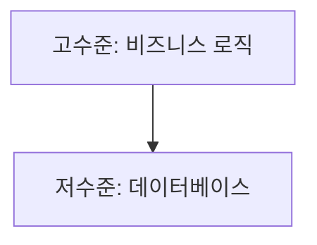
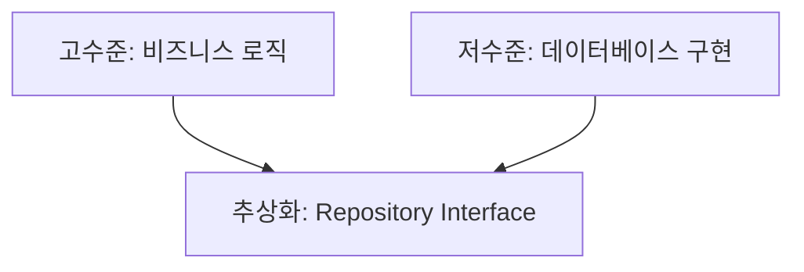
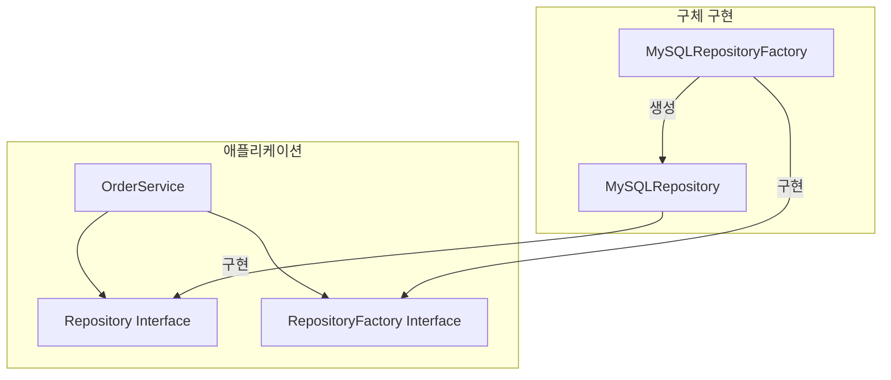
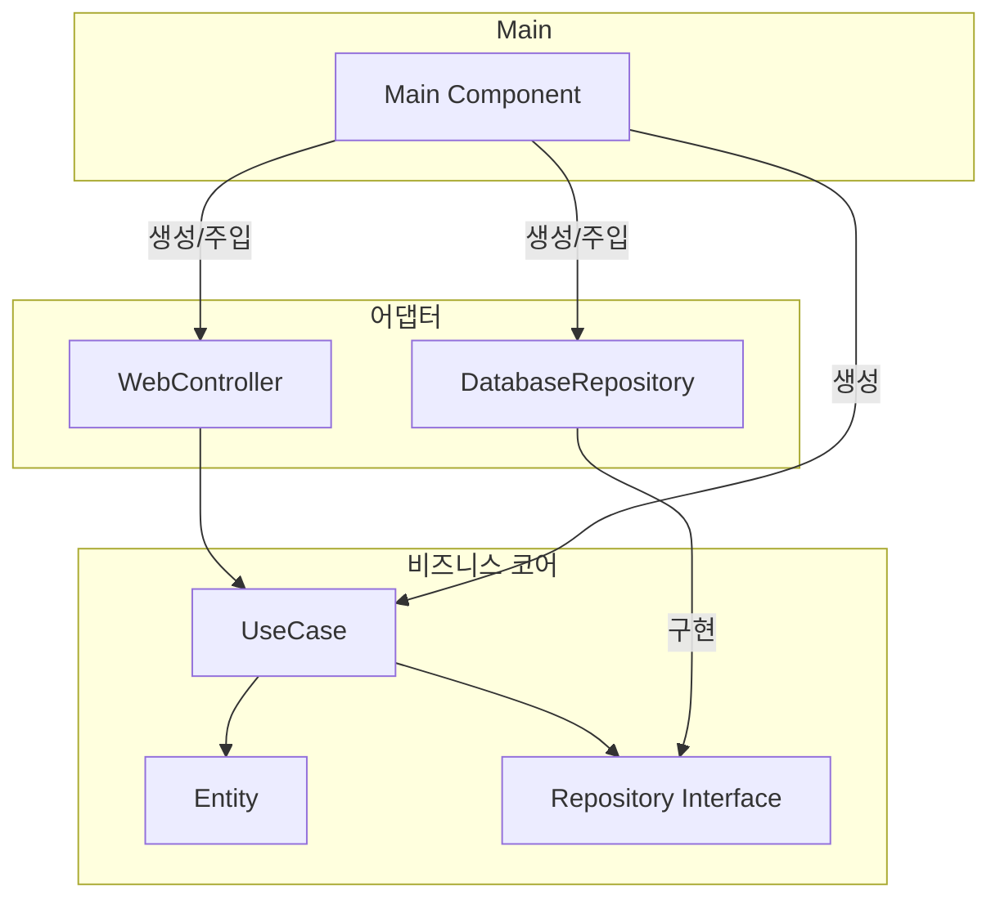
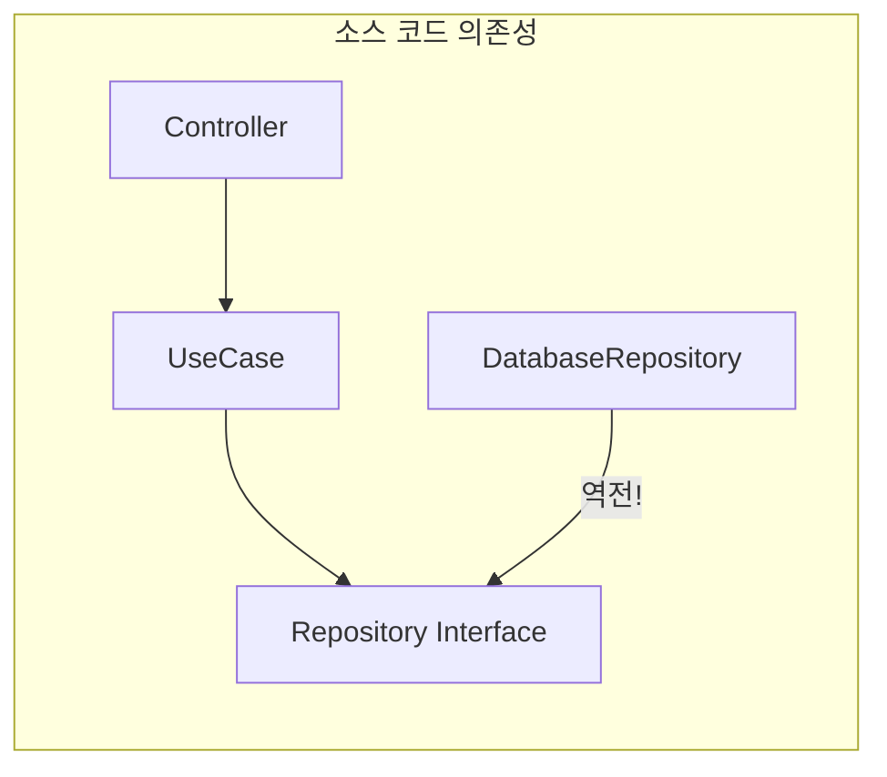
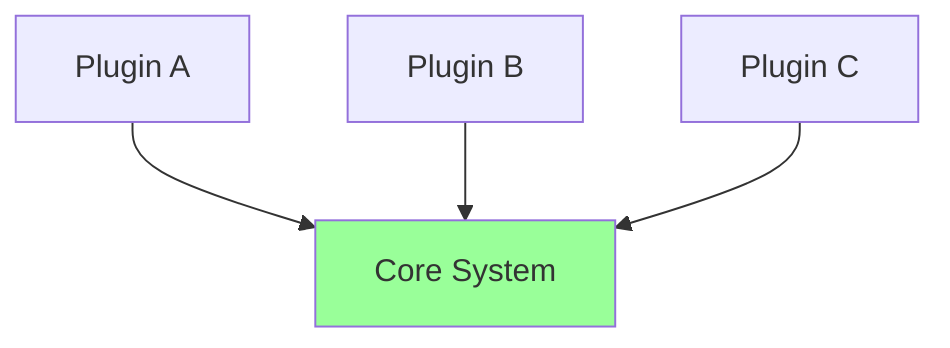
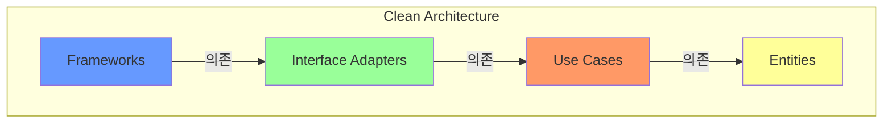

**DIP(Dependency Inversion Principle)**는 SOLID 원칙 중 가장 중요하며, Clean Architecture의 **핵심 원칙**이다. 이 원칙은 소스 코드 의존성이 추상화를 향해야 하며, 구체적인 것을 향해서는 안 된다고 말한다.

## DIP의 정의

> **"고수준 모듈은 저수준 모듈에 의존해서는 안 된다. 둘 다 추상화에 의존해야 한다."**
>
> **"추상화는 구체적인 것에 의존해서는 안 된다. 구체적인 것이 추상화에 의존해야 한다."**

### 전통적인 의존성 방향

전통적으로 고수준 모듈이 저수준 모듈에 의존한다:



비즈니스 로직이 데이터베이스에 의존하면:
- 데이터베이스 변경 → 비즈니스 로직도 변경
- 데이터베이스 없이 테스트 어려움

### 역전된 의존성

DIP를 적용하면 의존성이 **역전**된다:



- 비즈니스 로직은 인터페이스에 의존
- 데이터베이스 구현도 인터페이스에 의존
- **둘 다 추상화에 의존**

## 안정된 추상화

### 왜 추상화에 의존해야 하는가?

**추상화는 구체화보다 변경이 적다.**

```java
// 추상화 - 안정적
interface Repository {
    void save(Entity entity);
    Entity findById(String id);
}

// 구체화 - 변경 가능
class MySQLRepository implements Repository { /* ... */ }
class MongoDBRepository implements Repository { /* ... */ }
class InMemoryRepository implements Repository { /* ... */ }
```

인터페이스(`Repository`)는:
- **무엇**을 하는지 정의
- 변경 이유가 적음
- 안정적

구체 클래스는:
- **어떻게** 하는지 구현
- 기술 변경으로 자주 바뀜
- 변동성 있음

### 규칙

마틴은 DIP를 위한 코딩 실천법을 제시한다:

1. **변동성이 큰 구체 클래스를 참조하지 마라**
2. **변동성이 큰 구체 클래스로부터 파생하지 마라**
3. **구체 함수를 오버라이드하지 마라**
4. **구체적이며 변동성이 큰 것의 이름을 언급하지 마라**

## 팩토리 패턴

### 문제: 구체 클래스 생성

인터페이스에 의존하더라도, **객체를 생성**할 때는 구체 클래스를 알아야 한다:

```java
// 문제: 구체 클래스 직접 참조
class OrderService {
    private Repository repository;
    
    OrderService() {
        this.repository = new MySQLRepository();  // 구체 클래스!
    }
}
```

### 해결: 추상 팩토리

**팩토리**를 사용하여 생성을 추상화:

```java
// 팩토리 인터페이스
interface RepositoryFactory {
    Repository createRepository();
}

// 구체 팩토리
class MySQLRepositoryFactory implements RepositoryFactory {
    public Repository createRepository() {
        return new MySQLRepository();
    }
}

// 비즈니스 로직 - 구체 클래스 모름
class OrderService {
    private Repository repository;
    
    OrderService(RepositoryFactory factory) {
        this.repository = factory.createRepository();
    }
}
```



### 의존성 주입 (Dependency Injection)

더 간단한 방법은 **의존성 주입**:

```java
// 의존성 주입 - 외부에서 구체 객체 주입
class OrderService {
    private Repository repository;
    
    OrderService(Repository repository) {  // 인터페이스 타입으로 주입
        this.repository = repository;
    }
}

// 사용 (main 또는 DI 프레임워크)
Repository repo = new MySQLRepository();  // 구체 클래스는 여기서만
OrderService service = new OrderService(repo);
```

## 아키텍처 경계와 DIP

### 의존성 역전의 실제



- **Core**: 추상화에만 의존
- **Adapter**: 추상화를 구현, Core에 의존
- **Main**: 모든 구체 클래스를 알고 조립

### Main 컴포넌트의 역할

**Main**은 DIP의 **예외**다:

```java
// Main - 구체 클래스를 알아도 됨
public class Main {
    public static void main(String[] args) {
        // 구체 클래스 생성
        Repository repo = new MySQLRepository();
        
        // 의존성 주입
        OrderService service = new OrderService(repo);
        
        // 컨트롤러 생성
        OrderController controller = new OrderController(service);
        
        // 서버 시작
        new Server(controller).start();
    }
}
```

Main은 가장 낮은 수준의 정책이다. 모든 것에 의존하지만, 아무것도 Main에 의존하지 않는다.

## 소스 코드 의존성 vs 제어 흐름

### 제어 흐름 (Control Flow)

런타임에 실행이 흐르는 방향:

```
Controller → UseCase → Repository → Database
```

### 소스 코드 의존성

컴파일 시점의 의존 방향:



**제어 흐름**과 **소스 코드 의존성**이 반대 방향일 수 있다. 이것이 **의존성 역전**이다.

## DIP가 중요한 이유

### 1. 테스트 용이성

```java
// Mock으로 쉽게 테스트
@Test
void testOrderService() {
    Repository mockRepo = mock(Repository.class);
    OrderService service = new OrderService(mockRepo);
    
    service.placeOrder(order);
    
    verify(mockRepo).save(order);
}
```

### 2. 유연성

```java
// 쉽게 구현 교체
Repository repo = isProduction() 
    ? new MySQLRepository() 
    : new InMemoryRepository();
```

### 3. 독립적 개발

- 인터페이스만 정의하면 팀별로 독립 개발 가능
- 비즈니스 로직 팀과 인프라 팀이 병렬 작업

### 4. 플러그인 아키텍처



## Clean Architecture와 DIP

Clean Architecture는 DIP의 **대규모 적용**이다:



모든 의존성이 **안쪽으로** 향한다:
- Frameworks → Interface Adapters → Use Cases → Entities
- 가장 안정된 것(Entities)이 가장 많은 의존을 받음
- 가장 변동성 큰 것(Frameworks)이 가장 많이 의존함

## 핵심 요약

| 항목 | 내용 |
|------|------|
| 정의 | 고수준과 저수준 모두 추상화에 의존 |
| 핵심 | 변동성 있는 구체화가 아닌 안정된 추상화에 의존 |
| 도구 | 인터페이스, 추상 클래스, 팩토리, 의존성 주입 |
| 예외 | Main 컴포넌트 (모든 구체를 알고 조립) |

> **"DIP 위반을 모두 없앨 수는 없지만, 위반하는 클래스의 수를 줄일 수는 있다. 구체적인 것에 의존하는 코드는 Main 같은 적은 수의 컴포넌트에 집중시킨다."**
> — Robert C. Martin

## SOLID를 마치며

다섯 가지 SOLID 원칙은 **모듈 수준**의 설계 원칙이다:

| 원칙 | 핵심 |
|------|------|
| SRP | 하나의 액터에게만 책임 |
| OCP | 확장에 열리고, 수정에 닫힘 |
| LSP | 하위 타입은 상위 타입을 대체 가능 |
| ISP | 사용하지 않는 것에 의존하지 않음 |
| DIP | 추상화에 의존 |

다음 파트에서는 이 원칙들을 **컴포넌트 수준**으로 확장한 **컴포넌트 원칙**을 다룬다.
