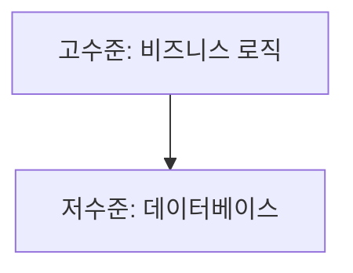
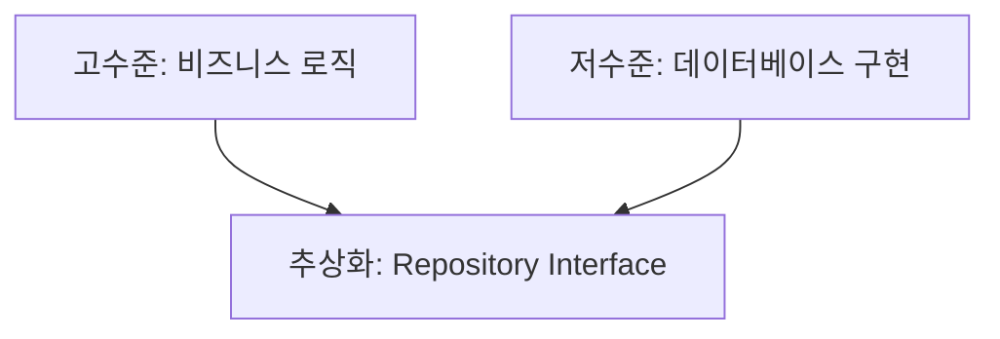
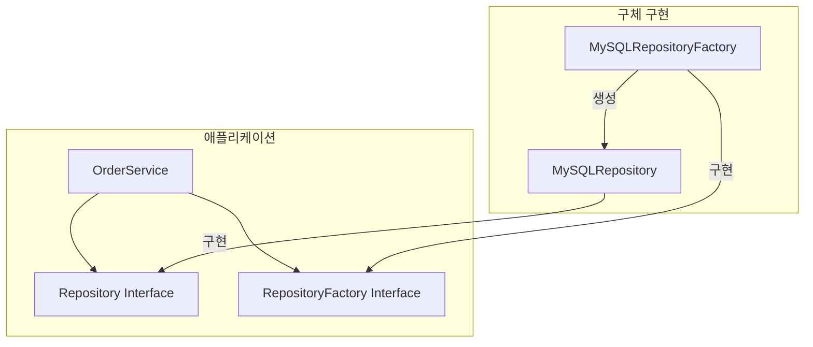
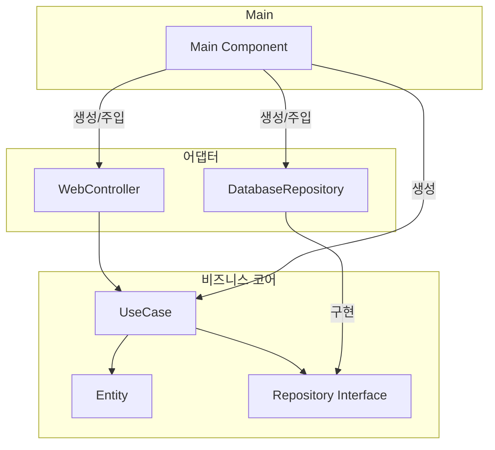
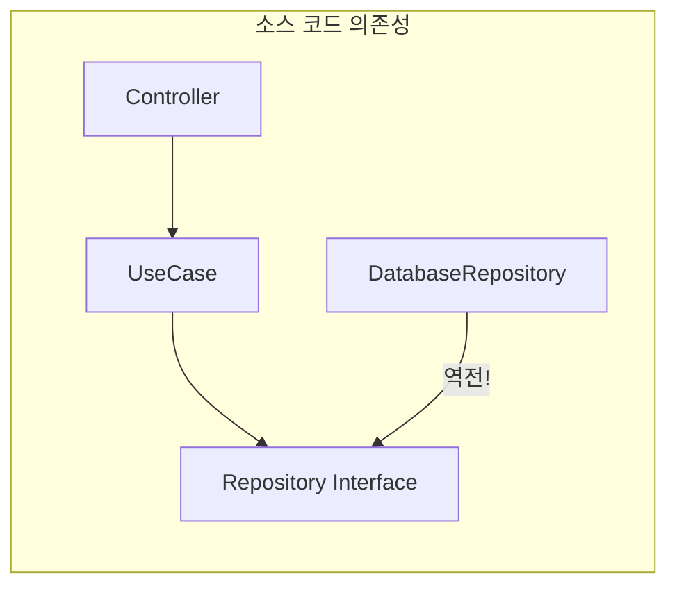
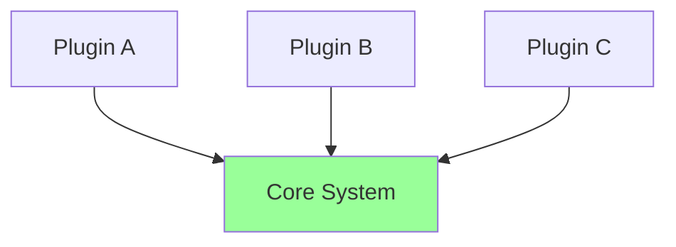
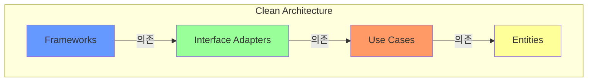

**DIP(Dependency Inversion Principle)**는 SOLID 원칙 중 가장 중요하며, Clean Architecture의 **핵심 원칙**이다. 이 원칙은 소스 코드 의존성이 추상화를 향해야 하며, 구체적인 것을 향해서는 안 된다고 말한다.

## DIP의 정의

> **"고수준 모듈은 저수준 모듈에 의존해서는 안 된다. 둘 다 추상화에 의존해야 한다."**
>
> **"추상화는 구체적인 것에 의존해서는 안 된다. 구체적인 것이 추상화에 의존해야 한다."**
> — Robert C. Martin, 『Clean Architecture』, 2017, 11장

### 전통적인 의존성 방향

전통적으로 고수준 모듈이 저수준 모듈에 의존한다:


```mermaid
flowchart TB
    H[고수준: 비즈니스 로직]
    L[저수준: 데이터베이스]
    H --> L
```

비즈니스 로직이 데이터베이스에 의존하면:
- 데이터베이스 변경 → 비즈니스 로직도 변경
- 데이터베이스 없이 테스트 어려움

### 역전된 의존성

DIP를 적용하면 의존성이 **역전**된다:


```mermaid
flowchart TB
    H[고수준: 비즈니스 로직]
    I[추상화: Repository Interface]
    L[저수준: 데이터베이스 구현]
    
    H --> I
    L --> I
```

- 비즈니스 로직은 인터페이스에 의존
- 데이터베이스 구현도 인터페이스에 의존
- **둘 다 추상화에 의존**

## 안정된 추상화

### 왜 추상화에 의존해야 하는가?

**추상화는 구체화보다 변경이 적다.**

```java
import java.util.HashMap;
import java.util.Map;

record Entity(String id, String data) {}

// 추상화 - 안정적
interface Repository {
    void save(Entity entity);
    Entity findById(String id);
}

// 구체화 - 변경 가능: JDBC로 MySQL에 직접 저장/조회
class MySQLRepository implements Repository {
    private final Map<String, Entity> table = new HashMap<>();

    public void save(Entity entity) { table.put(entity.id(), entity); }
    public Entity findById(String id) { return table.get(id); }
}

// 구체화 - 변경 가능: 문서 컬렉션에 저장/조회
class MongoDBRepository implements Repository {
    private final Map<String, Entity> collection = new HashMap<>();

    public void save(Entity entity) { collection.put(entity.id(), entity); }
    public Entity findById(String id) { return collection.get(id); }
}

// 구체화 - 변경 가능: 테스트용 인메모리 저장
class InMemoryRepository implements Repository {
    private final Map<String, Entity> store = new HashMap<>();

    public void save(Entity entity) { store.put(entity.id(), entity); }
    public Entity findById(String id) { return store.get(id); }
}
```

인터페이스(`Repository`)는:
- **무엇**을 하는지 정의
- 변경 이유가 적음
- 안정적

구체 클래스는:
- **어떻게** 하는지 구현
- 기술 변경으로 자주 바뀜
- 변동성 있음

### 규칙

마틴은 DIP를 위한 코딩 실천법을 제시한다:

1. **변동성이 큰 구체 클래스를 참조하지 마라** — 대신 추상 인터페이스를 참조한다. 정적 타입 언어에서는 `new` 연산자 사용도 이 규칙의 예외적 위반이므로 팩토리로 감싼다.
2. **변동성이 큰 구체 클래스로부터 파생하지 마라** — 상속은 소스 코드 의존성 중 가장 강력하고 되돌리기 어려운 결합이다. 변동성이 큰 클래스를 상속하면 그 변경이 그대로 전파된다.
3. **구체 함수를 오버라이드하지 마라** — 구체 함수를 오버라이드하면 원래 함수가 호출한 다른 구체 함수들과도 결합이 생긴다. 오버라이드가 필요하면 그 함수는 애초에 추상이어야 한다는 신호다.
4. **구체적이며 변동성이 큰 것의 이름을 언급하지 마라** — 변수·매개변수·필드 타입, `import`/`#include` 어디에도 변동성이 큰 구체 클래스 이름이 등장하지 않아야 소스 코드 의존성이 추상화로만 향한다.

## 팩토리 패턴

### 문제: 구체 클래스 생성

인터페이스에 의존하더라도, **객체를 생성**할 때는 반드시 구체 클래스 이름을 어딘가에 적어야 한다. `OrderService` 생성자 안에서 `new MySQLRepository()`를 호출하면, `OrderService`는 필드 타입은 `Repository`를 쓰면서도 생성 시점에는 `MySQLRepository`라는 변동성 큰 이름을 직접 참조하게 되어 규칙 4("변동성이 큰 것의 이름을 언급하지 마라")를 위반한다:

```java
// 문제: 구체 클래스 직접 참조
class OrderService {
    private Repository repository;
    
    OrderService() {
        this.repository = new MySQLRepository();  // 구체 클래스!
    }
}
```

### 해결: 추상 팩토리

**팩토리**를 사용하면 구체 클래스 이름을 아는 책임을 별도 클래스로 옮길 수 있다. `OrderService`는 이제 `RepositoryFactory` 인터페이스만 알고, 어떤 팩토리 구현체가 주입되느냐에 따라 실제로 생성되는 `Repository`가 달라진다 — 구체 클래스 이름은 `MySQLRepositoryFactory` 안에만 등장한다:

```java
// 팩토리 인터페이스
interface RepositoryFactory {
    Repository createRepository();
}

// 구체 팩토리
class MySQLRepositoryFactory implements RepositoryFactory {
    public Repository createRepository() {
        return new MySQLRepository();
    }
}

// 비즈니스 로직 - 구체 클래스 모름
class OrderService {
    private Repository repository;
    
    OrderService(RepositoryFactory factory) {
        this.repository = factory.createRepository();
    }
}
```


```mermaid
flowchart TB
    subgraph Application [애플리케이션]
        OS[OrderService]
        RI[Repository Interface]
        FI[RepositoryFactory Interface]
        OS --> RI
        OS --> FI
    end
    
    subgraph Concrete [구체 구현]
        MR[MySQLRepository]
        MF[MySQLRepositoryFactory]
        MR -->|구현| RI
        MF -->|구현| FI
        MF -->|생성| MR
    end
```

### 의존성 주입 (Dependency Injection)

더 간단한 방법은 **의존성 주입**:

```java
// 의존성 주입 - 외부에서 구체 객체 주입
class OrderService {
    private final Repository repository;
    
    OrderService(Repository repository) {  // 인터페이스 타입으로 주입
        this.repository = repository;
    }

    void save(Entity order) {
        repository.save(order);
    }
}

// 사용 (main 또는 DI 프레임워크)
class Bootstrap {
    public static void main(String[] args) {
        Repository repo = new MySQLRepository();  // 구체 클래스는 여기서만
        OrderService service = new OrderService(repo);
    }
}
```

## 아키텍처 경계와 DIP

### 의존성 역전의 실제


```mermaid
flowchart TB
    subgraph Core [비즈니스 코어]
        UC[UseCase]
        E[Entity]
        RI[Repository Interface]
        UC --> E
        UC --> RI
    end
    
    subgraph Adapter [어댑터]
        DB[DatabaseRepository]
        WEB[WebController]
        
        DB -->|구현| RI
        WEB --> UC
    end
    
    subgraph Main [Main]
        M[Main Component]
        M -->|생성/주입| DB
        M -->|생성/주입| WEB
        M -->|생성| UC
    end
```

- **Core**: 추상화에만 의존
- **Adapter**: 추상화를 구현, Core에 의존
- **Main**: 모든 구체 클래스를 알고 조립

### Main 컴포넌트의 역할

**Main**은 DIP의 **예외**다. 어딘가는 반드시 `Repository` 인터페이스와 `MySQLRepository` 구체 클래스를 둘 다 알고 연결해야 하는데, 그 역할을 시스템 전체에서 Main 하나로 몰아준다. Main 바깥의 모든 코드는 인터페이스만 알면 되므로, 구체 클래스에 대한 의존이 Main이라는 한 지점에 격리된다:

```java
// Main - 구체 클래스를 알아도 됨
public class Main {
    public static void main(String[] args) {
        // 구체 클래스 생성
        Repository repo = new MySQLRepository();
        
        // 의존성 주입
        OrderService service = new OrderService(repo);
        
        // 컨트롤러 생성
        OrderController controller = new OrderController(service);
        
        // 서버 시작
        new Server(controller).start();
    }
}
```

Main은 가장 낮은 수준의 정책이다. 모든 것에 의존하지만, 아무것도 Main에 의존하지 않는다.

## 소스 코드 의존성 vs 제어 흐름

### 제어 흐름 (Control Flow)

런타임에 실행이 흐르는 방향:

```text
Controller → UseCase → Repository → Database
```

### 소스 코드 의존성

컴파일 시점의 의존 방향:


```mermaid
flowchart LR
    subgraph Compile [소스 코드 의존성]
        C[Controller]
        U[UseCase]
        RI[Repository Interface]
        DB[DatabaseRepository]
        
        C --> U
        U --> RI
        DB -->|역전!| RI
    end
```

**제어 흐름**과 **소스 코드 의존성**이 반대 방향일 수 있다. 이것이 **의존성 역전**이다.

## DIP의 탄생 배경

DIP는 1996년 마틴이 C++ Report에 발표한 논문에서 정식화됐다. 당시 절차적 설계 방식으로 작성된 시스템에서는 고수준 정책 모듈이 저수준 구현 모듈을 소스 코드에서 직접 `#include`하는 것이 표준적인 관행이었다 — 예를 들어 결제 승인 로직이 특정 은행 API 클라이언트 헤더를 직접 포함하는 식이다. 이 구조에서는 저수준 모듈(은행 API 클라이언트)이 바뀔 때마다 그 API를 호출하는 모든 고수준 모듈이 함께 재컴파일돼야 했고, 고수준 정책을 단위 테스트하려 해도 실제 저수준 구현 없이는 컴파일조차 되지 않았다. 마틴은 객체 지향 언어의 다형성을 이용해 이 의존 방향을 뒤집을 수 있음을 보이고, 이를 DIP로 정식화했다.

## DIP가 중요한 이유

### 1. 테스트 용이성

`OrderService`가 `Repository` 인터페이스에만 의존하면, 테스트 코드는 실제 데이터베이스 대신 `Repository`를 흉내 내는 목(mock) 객체를 주입할 수 있다. 데이터베이스 연결·트랜잭션 없이도 `OrderService`의 로직만 독립적으로 검증할 수 있는 것은, DIP가 만들어낸 "구체 클래스로부터의 독립" 덕분이다.

```java
import org.junit.jupiter.api.Test;
import static org.mockito.Mockito.mock;
import static org.mockito.Mockito.verify;

// Mock으로 쉽게 테스트
class OrderServiceTest {
    @Test
    void testOrderService() {
        Repository mockRepo = mock(Repository.class);
        OrderService service = new OrderService(mockRepo);
        Entity order = new Entity("order-1", "주문 데이터");

        service.save(order);

        verify(mockRepo).save(order);
    }
}
```

### 2. 유연성

같은 이유로, 운영 환경과 테스트 환경에서 서로 다른 구현체를 아무 코드 변경 없이 갈아 끼울 수 있다. `OrderService`는 자신이 `MySQLRepository`를 쓰는지 `InMemoryRepository`를 쓰는지 전혀 모른다.

```java
class Bootstrap {
    // 쉽게 구현 교체
    static Repository createRepository(boolean isProduction) {
        return isProduction
            ? new MySQLRepository()
            : new InMemoryRepository();
    }
}
```

### 3. 독립적 개발

- 인터페이스만 정의하면 팀별로 독립 개발 가능
- 비즈니스 로직 팀과 인프라 팀이 병렬 작업

### 4. 플러그인 아키텍처

DIP를 극단까지 밀어붙이면, 핵심 시스템이 플러그인의 존재조차 몰라도 되는 구조가 된다. 플러그인은 핵심이 정의한 인터페이스를 구현할 뿐이고, 핵심은 그 인터페이스만 참조한다. 새 플러그인을 추가해도 핵심 시스템의 소스 코드는 전혀 바뀌지 않는다 — DIP·OCP·플러그인 아키텍처가 결국 같은 목표를 서로 다른 각도에서 달성하는 방법임을 보여준다.


```mermaid
flowchart TB
    Core[Core System]
    
    P1[Plugin A]
    P2[Plugin B]
    P3[Plugin C]
    
    P1 --> Core
    P2 --> Core
    P3 --> Core
    
    style Core fill:#9f9
```

## Clean Architecture와 DIP

Clean Architecture는 DIP의 **대규모 적용**이다:


```mermaid
flowchart TB
    subgraph Clean [Clean Architecture]
        E[Entities]
        U[Use Cases]
        I[Interface Adapters]
        F[Frameworks]
    end
    
    F -->|의존| I
    I -->|의존| U
    U -->|의존| E
    
    style E fill:#ff9
    style U fill:#f96
    style I fill:#9f9
    style F fill:#69f
```

모든 의존성이 **안쪽으로** 향한다:
- Frameworks → Interface Adapters → Use Cases → Entities
- 가장 안정된 것(Entities)이 가장 많은 의존을 받음
- 가장 변동성 큰 것(Frameworks)이 가장 많이 의존함

## 흔한 오해

DIP를 "모든 클래스에 인터페이스를 만들어야 한다"는 규칙으로 오해하기 쉽다. 그러나 DIP가 겨냥하는 것은 **변동성이 큰** 구체 클래스다. `String`이나 `List` 같은 안정된 라이브러리 타입까지 인터페이스로 감싸면, 실제로는 절대 교체되지 않을 구현체를 위해 매번 인터페이스 정의·구현체·조립 코드 세 곳을 오가야 하는 비용만 늘어난다. 극단적인 경우 한 프로젝트에 `UserRepository`/`UserRepositoryImpl`처럼 구현체가 단 하나뿐인 인터페이스가 수십 개 쌓이는데, 이런 인터페이스는 테스트 대역으로 교체된 적도 없고 앞으로도 그럴 계획이 없다면 사실상 죽은 추상화다. 이런 경우는 인터페이스를 걷어내고 구체 클래스를 직접 참조하는 편이 오히려 더 읽기 쉽다. 또 다른 오해는 DIP를 지키면 Main 같은 조립 지점도 사라져야 한다고 생각하는 것이다. 마틴은 오히려 그 반대를 말한다 — 구체 클래스에 대한 의존을 완전히 없앨 수는 없으므로, 그 의존을 Main처럼 적은 수의 컴포넌트에 의도적으로 몰아넣어야 한다. DIP는 의존을 0으로 만드는 원칙이 아니라, 의존의 위치를 통제하는 원칙이다.

## 핵심 요약

| 항목 | 내용 |
|------|------|
| 정의 | 고수준과 저수준 모두 추상화에 의존 |
| 핵심 | 변동성 있는 구체화가 아닌 안정된 추상화에 의존 |
| 도구 | 인터페이스, 추상 클래스, 팩토리, 의존성 주입 |
| 예외 | Main 컴포넌트 (모든 구체를 알고 조립) |

마틴은 DIP 위반을 모두 없앨 수는 없지만 위반하는 클래스의 수는 줄일 수 있다고 말한다. 구체적인 것에 의존하는 코드를 Main 같은 적은 수의 컴포넌트에 집중시키는 것이 현실적인 목표다(Martin, 『Clean Architecture』, 2017, 11장).

## 학습 목표

이 장을 읽은 후 다음을 스스로 점검한다.

- 전통적 의존성 방향과 DIP가 적용된 "역전된" 의존성 방향의 차이를 다이어그램 없이 말로 설명할 수 있는가?
- 팩토리 패턴과 의존성 주입이 각각 어떻게 구체 클래스 생성을 추상화하는지 구분할 수 있는가?
- "제어 흐름"과 "소스 코드 의존성"이 서로 다른 방향을 가질 수 있다는 것을 예를 들어 설명할 수 있는가?
- Main 컴포넌트가 왜 DIP의 예외로 허용되는지 설명할 수 있는가?
- Clean Architecture의 동심원 구조가 DIP를 어떻게 대규모로 적용한 것인지 설명할 수 있는가?

## 판단 기준

코드에서 새 의존성을 추가할 때 다음을 확인한다.

- 이 의존성이 향하는 대상이 자주 바뀌는 구체 클래스인가, 안정된 추상화인가?
- 구체 클래스를 직접 `new`로 생성하는 지점이 비즈니스 로직 안에 있는가, 아니면 Main/팩토리처럼 의도된 조립 지점에 몰려 있는가?
- 이 클래스를 테스트할 때 실제 데이터베이스·외부 API 없이 목(mock)으로 대체할 수 있는가?
- 상위 수준 정책 코드에 하위 수준 기술(특정 DB, 프레임워크)의 이름이 등장하는가?

## 참고 자료

- Robert C. Martin, 『Clean Architecture』, 2017, 11장 — DIP의 코딩 실천법과 아키텍처 수준 적용의 원 출처.
- Robert C. Martin, "The Dependency Inversion Principle", C++ Report, 1996 — DIP를 처음 정식화한 원 논문.

## SOLID를 마치며

다섯 가지 SOLID 원칙은 **모듈 수준**의 설계 원칙이다:

| 원칙 | 핵심 |
|------|------|
| SRP | 하나의 액터에게만 책임 |
| OCP | 확장에 열리고, 수정에 닫힘 |
| LSP | 하위 타입은 상위 타입을 대체 가능 |
| ISP | 사용하지 않는 것에 의존하지 않음 |
| DIP | 추상화에 의존 |

다음 파트에서는 이 원칙들을 **컴포넌트 수준**으로 확장한 **컴포넌트 원칙**을 다룬다.
