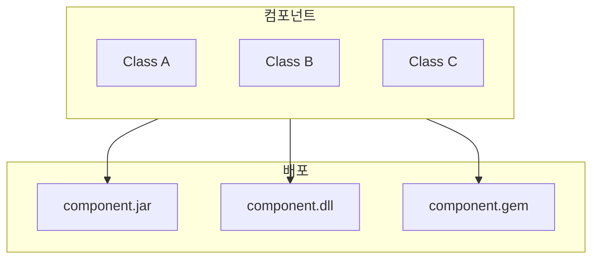
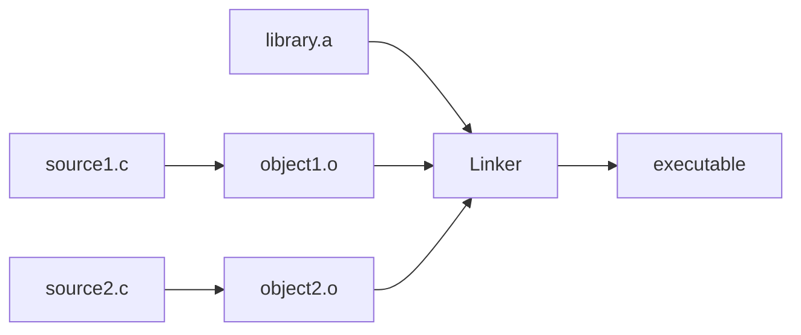
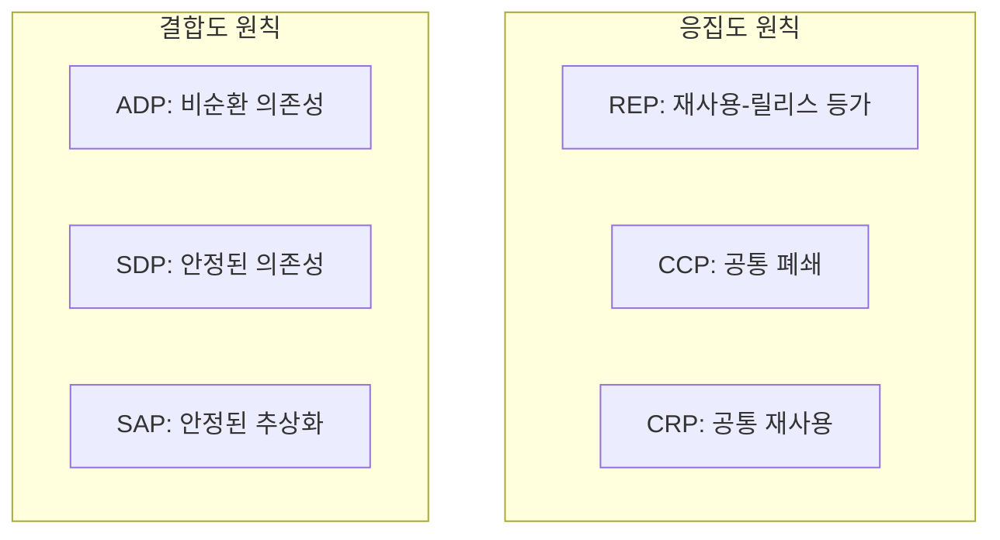
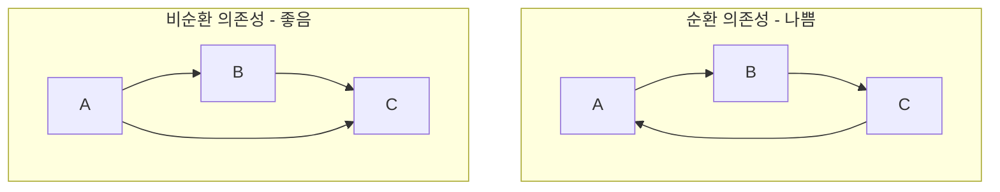

SOLID 원칙이 벽돌(클래스, 모듈)을 만드는 방법이라면, **컴포넌트 원칙**은 벽돌을 벽과 방으로 조합하는 방법이다. 이 파트에서는 컴포넌트가 무엇인지, 그리고 어떻게 좋은 컴포넌트를 설계하는지 다룬다.

## 컴포넌트란?

> **컴포넌트는 배포의 단위다.**

컴포넌트는 시스템의 일부로 배포할 수 있는 가장 작은 단위다:

- **Java**: jar 파일
- **.NET**: dll 파일
- **Ruby**: gem 파일
- **JavaScript**: npm 패키지
- **Python**: pip 패키지



### 컴포넌트의 특성

- **독립적으로 배포 가능**: 다른 컴포넌트와 별개로 배포
- **독립적으로 개발 가능**: 다른 팀이 개발 가능
- **버전 관리**: 개별 버전 부여 가능

## 컴포넌트의 역사

### 초기 시대: 단일 프로그램

1950-60년대, 프로그램은 단일 실행 파일이었다. 모든 코드가 하나로 묶여 있었다.

### 라이브러리의 등장

프로그래머들은 자주 사용하는 함수들을 **라이브러리**로 분리했다. 문제는 이 라이브러리를 **어디에 배치할 것인가**였다.

```
메모리 레이아웃 (초기)
┌─────────────────┐
│ 애플리케이션    │ ← 고정 주소
├─────────────────┤
│ 라이브러리      │ ← 고정 주소
├─────────────────┤
│ 빈 공간         │
└─────────────────┘
```

라이브러리 크기가 커지면, 메모리 재배치가 필요했다. 이는 매우 번거로운 작업이었다.

### 재배치 가능한 바이너리

해결책은 **재배치 가능한 바이너리(Relocatable Binary)**였다. 컴파일러가 상대 주소로 코드를 생성하고, 링커가 실제 주소로 변환했다.



### 동적 링킹

다음 발전은 **동적 링킹(Dynamic Linking)**이었다:

- **정적 링킹**: 컴파일 시점에 라이브러리 코드 포함
- **동적 링킹**: 런타임에 라이브러리 로드

```
// 동적 링킹
애플리케이션 → libfoo.so (런타임에 로드)
            → libbar.dll (런타임에 로드)
```

동적 링킹 덕분에:
- 여러 프로그램이 같은 라이브러리 공유
- 라이브러리 업데이트가 쉬움
- 실행 파일 크기 감소

## 컴포넌트 원칙의 필요성

컴포넌트를 어떻게 설계해야 할까?

### 두 가지 관점

1. **응집도(Cohesion)**: 어떤 클래스들을 컴포넌트에 **포함**시킬 것인가?
2. **결합도(Coupling)**: 컴포넌트들을 어떻게 **연결**할 것인가?



## 응집도 원칙

### REP (Reuse/Release Equivalence Principle)

> "재사용의 단위는 릴리스의 단위와 같다."

컴포넌트에 포함된 클래스와 모듈은:
- 함께 릴리스될 수 있어야 함
- 버전 번호를 공유
- 동일한 릴리스 문서 공유

### CCP (Common Closure Principle)

> "동일한 이유로, 동일한 시점에 변경되는 클래스를 같은 컴포넌트로 묶어라."

SRP의 컴포넌트 버전:
- 컴포넌트는 하나의 변경 이유만 가짐
- 변경이 필요할 때 **하나의 컴포넌트만** 수정

### CRP (Common Reuse Principle)

> "함께 재사용되는 클래스들은 같은 컴포넌트에 포함시켜라."

ISP의 컴포넌트 버전:
- 함께 재사용되지 않는 것은 분리
- 불필요한 의존성 방지

## 결합도 원칙

### ADP (Acyclic Dependencies Principle)

> "컴포넌트 의존성 그래프에 순환이 있으면 안 된다."



### SDP (Stable Dependencies Principle)

> "안정성의 방향으로 의존하라."

변경이 어려운(안정된) 컴포넌트에 의존해야 함.

### SAP (Stable Abstractions Principle)

> "안정된 컴포넌트는 추상적이어야 한다."

안정된 컴포넌트가 구체적이면 확장이 어려움. 추상화로 유연성 확보.

## SOLID와 컴포넌트 원칙의 관계

| SOLID | 컴포넌트 원칙 | 관계 |
|-------|-------------|------|
| SRP | CCP | 변경 이유 분리 |
| OCP | SDP + SAP | 안정된 추상화로 확장 |
| LSP | - | 컴포넌트 내 적용 |
| ISP | CRP | 불필요한 의존성 제거 |
| DIP | SDP + SAP | 추상화에 의존 |

## 다음 장에서는

다음 장에서는 먼저 **컴포넌트의 역사**를 더 자세히 다룬다. 링커와 로더의 발전이 어떻게 현대의 컴포넌트 개념으로 이어졌는지 살펴본다.

## 핵심 요약

| 항목 | 내용 |
|------|------|
| 컴포넌트 | 배포의 단위 (jar, dll, gem 등) |
| 응집도 원칙 | REP, CCP, CRP - 무엇을 포함할 것인가 |
| 결합도 원칙 | ADP, SDP, SAP - 어떻게 연결할 것인가 |
| 목표 | 독립적 개발, 배포, 유지보수 |

> **"컴포넌트 원칙은 SOLID 원칙을 컴포넌트 수준으로 확장한 것이다."**
> — Robert C. Martin
