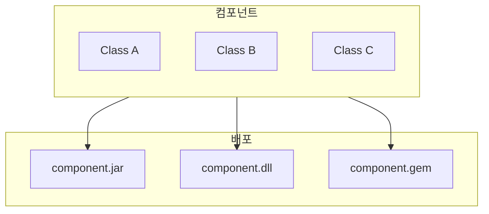
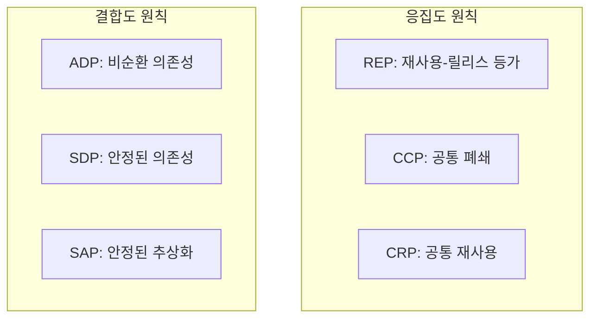
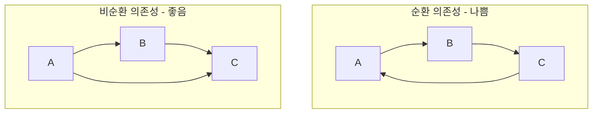

SOLID 원칙이 벽돌(클래스, 모듈)을 만드는 방법이라면, **컴포넌트 원칙**은 벽돌을 벽과 방으로 조합하는 방법이다. 이 파트에서는 컴포넌트가 무엇인지, 그리고 어떻게 좋은 컴포넌트를 설계하는지 다룬다.

## 컴포넌트란?

> **컴포넌트는 배포의 단위다.**

컴포넌트는 시스템의 일부로 배포할 수 있는 가장 작은 단위다. 언어·플랫폼마다 이 단위를 부르는 이름과 파일 형식이 다를 뿐, "독립적으로 빌드하고 배포할 수 있는 코드 묶음"이라는 본질은 같다:

- **Java**: jar 파일
- **.NET**: dll 파일
- **Ruby**: gem 파일
- **JavaScript**: npm 패키지
- **Python**: pip 패키지

```mermaid
flowchart TB
    subgraph Component [컴포넌트]
        direction TB
        C1[Class A]
        C2[Class B]
        C3[Class C]
    end
    
    subgraph Deploy [배포]
        JAR[component.jar]
        DLL[component.dll]
        GEM[component.gem]
    end
    
    Component --> JAR
    Component --> DLL
    Component --> GEM
```

### 컴포넌트의 특성

컴포넌트라는 단위가 성립하려면 세 가지 성질이 함께 필요하다. 하나라도 빠지면 "배포 가능한 파일"일 뿐 이 장에서 말하는 컴포넌트는 아니다.

- **독립적으로 배포 가능**: 다른 컴포넌트와 별개로 배포 — 이 성질이 없으면 애초에 컴포넌트로 나눌 이유가 없다.
- **독립적으로 개발 가능**: 다른 팀이 개발 가능 — 배포는 독립적인데 개발은 서로의 코드를 계속 참조해야 한다면, 조직적으로는 여전히 하나의 덩어리다.
- **버전 관리**: 개별 버전 부여 가능 — 어떤 컴포넌트가 어떤 버전의 다른 컴포넌트와 호환되는지 추적할 수 있어야, 독립적 배포가 실제로 안전하게 이뤄진다.

이 원칙들은 특정 기술 스택에 종속되지 않는다. Java의 모듈 시스템(jar)이든 C++의 정적/동적 라이브러리든, Linux의 공유 오브젝트(.so)로 배포되든 Docker 컨테이너로 패키징되든, 모두 같은 응집도·결합도 질문(무엇을 캡슐화할 것인가, 어떤 API를 외부에 노출할 것인가)에 답해야 하는 시스템 설계 문제다. 컴포넌트 경계가 잘 잡혀 있으면 부수적으로 단위 테스트를 컴포넌트별로 격리하기 쉽고, 각 컴포넌트가 노출하는 API만 문서화하면 되므로 유지보수 문서 작성 부담도 줄어든다. 이 원리를 백엔드 시스템에 실제로 적용하는 방법은 22·23장에서 구체적인 리팩토링 예제로 다룬다.

## 컴포넌트의 역사(개요)

컴포넌트라는 개념은 처음부터 존재하지 않았다. 초기(1950-60년대 무렵)에는 프로그램이 하나의 실행 파일로 통째로 묶여 있었고, 라이브러리를 분리해 쓰기 시작하면서 "이 라이브러리를 메모리 어디에 둘 것인가"라는 문제가 생겼다. 이 문제는 재배치 가능한 바이너리(컴파일러가 상대 주소로 코드를 생성하고 링커가 실제 주소로 변환하는 방식)로 해결됐고, 이후 동적 링킹이 등장하면서 여러 프로그램이 라이브러리를 공유하고 실행 파일 크기를 줄일 수 있게 됐다. 이 발전 과정 각 단계의 구체적인 문제와 해결책은 21장(컴포넌트: 배포 단위)에서 자세히 다룬다.

## 컴포넌트 원칙의 필요성

컴포넌트를 어떻게 설계해야 할까?

### 두 가지 관점

컴포넌트 설계 질문은 크게 두 가지로 나뉜다. 하나는 컴포넌트 "안"의 문제고, 다른 하나는 컴포넌트 "사이"의 문제다.

1. **응집도(Cohesion)**: 어떤 클래스들을 컴포넌트에 **포함**시킬 것인가? — 다음 장(22장)에서 REP·CCP·CRP 세 원칙으로 다룬다.
2. **결합도(Coupling)**: 컴포넌트들을 어떻게 **연결**할 것인가? — 23장에서 ADP·SDP·SAP 세 원칙으로 다룬다.

```mermaid
flowchart TB
    subgraph Cohesion [응집도 원칙]
        REP[REP: 재사용-릴리스 등가]
        CCP[CCP: 공통 폐쇄]
        CRP[CRP: 공통 재사용]
    end
    
    subgraph Coupling [결합도 원칙]
        ADP[ADP: 비순환 의존성]
        SDP[SDP: 안정된 의존성]
        SAP[SAP: 안정된 추상화]
    end
```

## 응집도 원칙

응집도 원칙 세 가지(REP·CCP·CRP)는 모두 "어떤 클래스들을 한 컴포넌트에 넣을 것인가"라는 같은 질문에 답하지만, 서로 다른 각도에서 접근한다.

### REP (Reuse/Release Equivalence Principle)

> "재사용의 단위는 릴리스의 단위와 같다."

누군가 이 컴포넌트를 재사용하려면, 그 컴포넌트는 독립적으로 릴리스될 수 있어야 한다. 릴리스되지 않는 코드 묶음은 재사용의 단위가 될 수 없다. 그래서 컴포넌트에 포함된 클래스와 모듈은 함께 릴리스될 수 있어야 하고, 하나의 버전 번호와 릴리스 문서를 공유해야 한다 — 일부 클래스만 새 버전이고 나머지는 이전 버전인 상태는 애초에 존재할 수 없다.

### CCP (Common Closure Principle)

> "동일한 이유로, 동일한 시점에 변경되는 클래스를 같은 컴포넌트로 묶어라."

SRP가 클래스에게 "하나의 액터에게만 책임지라"고 요구했듯, CCP는 컴포넌트에게 같은 것을 요구한다. 컴포넌트가 하나의 변경 이유만 가지면, 그 변경이 필요할 때 **하나의 컴포넌트만** 수정하면 되고 다른 컴포넌트는 영향을 받지 않는다 — 여러 액터의 요구가 한 컴포넌트에 뒤섞여 있으면, 한 액터의 변경이 다른 액터가 쓰는 부분까지 재빌드·재배포하게 만든다.

### CRP (Common Reuse Principle)

> "함께 재사용되는 클래스들은 같은 컴포넌트에 포함시켜라."

ISP가 클라이언트에게 사용하지 않는 메서드까지 의존하게 만들지 말라고 했듯, CRP는 컴포넌트 의존자에게 같은 것을 요구한다. 함께 재사용되지 않는 클래스가 한 컴포넌트에 섞여 있으면, 그중 일부만 쓰는 클라이언트도 나머지 클래스의 변경에 발목이 잡힌다 — 그래서 CRP는 그런 클래스를 애초에 분리해 불필요한 의존성을 막는다.

## 결합도 원칙

결합도 원칙 세 가지(ADP·SDP·SAP)는 컴포넌트를 어떻게 나눌지가 아니라, 이미 나뉜 컴포넌트들을 어떤 방향으로 의존하게 배치할지를 다룬다.

### ADP (Acyclic Dependencies Principle)

> "컴포넌트 의존성 그래프에 순환이 있으면 안 된다."

컴포넌트를 독립적으로 릴리스하려면, 그 컴포넌트가 의존하는 것들이 먼저 릴리스되어 있어야 한다. `A`가 `B`에, `B`가 `C`에, `C`가 다시 `A`에 의존하는 순환이 있으면 셋 중 어느 것도 먼저 릴리스할 수 없다 — 릴리스하려면 자신이 의존하는 것이 이미 존재해야 하는데, 순환 안에서는 그 조건을 만족하는 시작점이 없기 때문이다. 이 원칙과 나머지 두 원칙(SDP·SAP)의 실제 리팩토링 예제는 23장에서 자세히 다룬다.

```mermaid
flowchart TB
    subgraph Bad [순환 의존성 - 나쁨]
        A1[A] --> B1[B]
        B1 --> C1[C]
        C1 --> A1
    end
    
    subgraph Good [비순환 의존성 - 좋음]
        A2[A] --> B2[B]
        B2 --> C2[C]
        A2 --> C2
    end
```

### SDP (Stable Dependencies Principle)

> "안정성의 방향으로 의존하라."

여기서 "안정되다"는 것은 변경이 어렵다는 뜻이 아니라, 많은 컴포넌트가 의존하고 있어서 변경했을 때 영향을 받는 범위가 크다는 뜻이다. 자주 바뀌는(불안정한) 컴포넌트가 안정된 컴포넌트에 의존하는 것은 괜찮지만, 그 반대 — 변경이 어려운 컴포넌트가 자주 바뀌는 컴포넌트에 의존하는 것 — 는 안정된 쪽까지 변경에 휘말리게 만든다.

### SAP (Stable Abstractions Principle)

> "안정된 컴포넌트는 추상적이어야 한다."

SDP만 지키면 새로운 문제가 생긴다. 안정된 컴포넌트가 구체 클래스 위주라면, 많은 것이 의존하는데도 확장하기 어려운 이중고에 빠진다. 추상 클래스와 인터페이스로 구성하면 안정성은 유지하면서도 새 구현을 추가하는 방식으로 확장할 수 있다 — OCP를 컴포넌트 단위로 적용한 것과 같다.

## SOLID와 컴포넌트 원칙의 관계

SOLID는 원래 객체 지향(OOP) 클래스 설계를 위한 원칙이었다. 응집도·결합도 원칙은 그 SOLID를 컴포넌트라는 더 큰 단위로 그대로 확장한 것이다:

| SOLID | 컴포넌트 원칙 | 관계 |
|-------|-------------|------|
| SRP | CCP | 변경 이유 분리 |
| OCP | SDP + SAP | 안정된 추상화로 확장 |
| LSP | - | 컴포넌트 내 적용 |
| ISP | CRP | 불필요한 의존성 제거 |
| DIP | SDP + SAP | 추상화에 의존 |

## 흔한 오해

"컴포넌트"를 그저 "패키지" 또는 "폴더"와 같은 말로 오해하기 쉽다. 그러나 이 장에서 말하는 컴포넌트는 **독립적으로 배포 가능한 단위**라는 조건을 반드시 만족해야 한다. 같은 저장소 안에서 패키지로만 나뉘어 있고 여전히 하나의 실행 파일로 함께 빌드·배포된다면, 그것은 논리적 구획일 뿐 이 장이 다루는 컴포넌트가 아니다. 또 다른 오해는 컴포넌트를 잘게 쪼갤수록 무조건 좋다는 생각이다. 응집도 원칙(REP·CCP·CRP)과 결합도 원칙(ADP·SDP·SAP)이 서로 다른, 때로는 상반된 방향을 요구하기 때문에 컴포넌트 설계는 균형의 문제이지 "작을수록 좋다"는 단순 규칙이 아니다.

## 학습 목표

이 장을 읽은 후 다음을 스스로 점검한다.

- 컴포넌트가 "배포의 단위"로 정의되는 이유와, 단순한 패키지 구획과 무엇이 다른지 설명할 수 있는가?
- 컴포넌트 설계 질문이 응집도(무엇을 포함할 것인가)와 결합도(어떻게 연결할 것인가) 두 축으로 나뉘는 이유를 설명할 수 있는가?
- REP·CCP·CRP가 각각 SRP·ISP의 컴포넌트 버전이라는 대응 관계를 설명할 수 있는가?
- SDP가 요구하는 "안정성의 방향"과 SAP가 요구하는 "추상화"가 왜 함께 필요한지 설명할 수 있는가?

## 판단 기준

이 클래스들을 별도 컴포넌트로 분리할지 판단할 때 다음을 확인한다.

- 이 클래스들이 REP·CCP·CRP 중 어느 것을 가장 강하게 만족하는가? (예: 항상 함께 변경된다면 CCP가 분리의 핵심 근거)
- 분리했을 때 응집도 원칙 중 하나를 얻는 대신 다른 하나를 희생하지는 않는가? (22장에서 다루는 "세 원칙의 장력")
- 이 컴포넌트가 다른 컴포넌트들보다 안정적이어야 하는가, 아니면 자주 바뀌어야 하는가? 그 위치에 맞게 추상화 수준을 설계했는가?

## 참고 자료

- Robert C. Martin, 『Clean Architecture』, 2017 — 컴포넌트 정의(12장), 응집도 원칙 REP·CCP·CRP(13장), 결합도 원칙 ADP·SDP·SAP(14장)의 원 출처.

## 다음 장에서는

다음 장에서는 먼저 **컴포넌트의 역사**를 더 자세히 다룬다. 링커와 로더의 발전이 어떻게 현대의 컴포넌트 개념으로 이어졌는지 살펴본다.

## 핵심 요약

| 항목 | 내용 |
|------|------|
| 컴포넌트 | 배포의 단위 (jar, dll, gem 등) |
| 응집도 원칙 | REP, CCP, CRP - 무엇을 포함할 것인가 |
| 결합도 원칙 | ADP, SDP, SAP - 어떻게 연결할 것인가 |
| 목표 | 독립적 개발, 배포, 유지보수 |

마틴은 컴포넌트 원칙을 SOLID 원칙을 컴포넌트 수준으로 확장한 것이라고 요약한다(Martin, 『Clean Architecture』, 2017, 12장).
