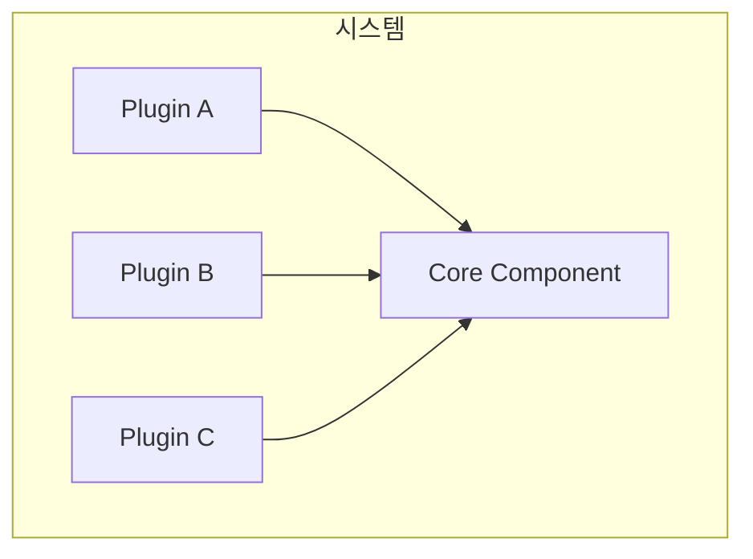
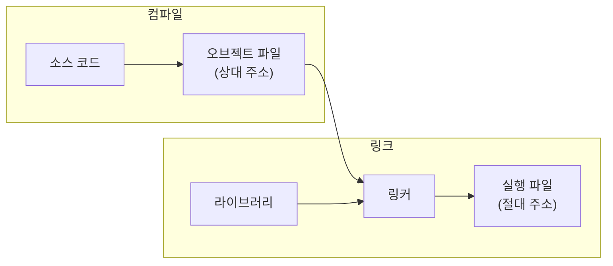
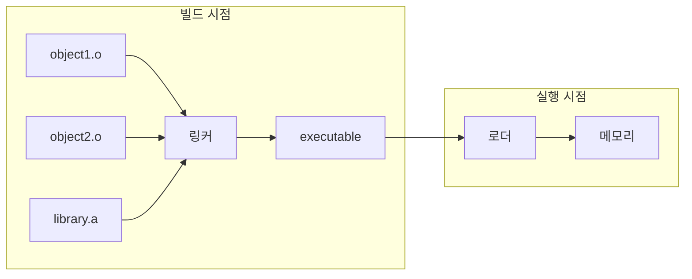
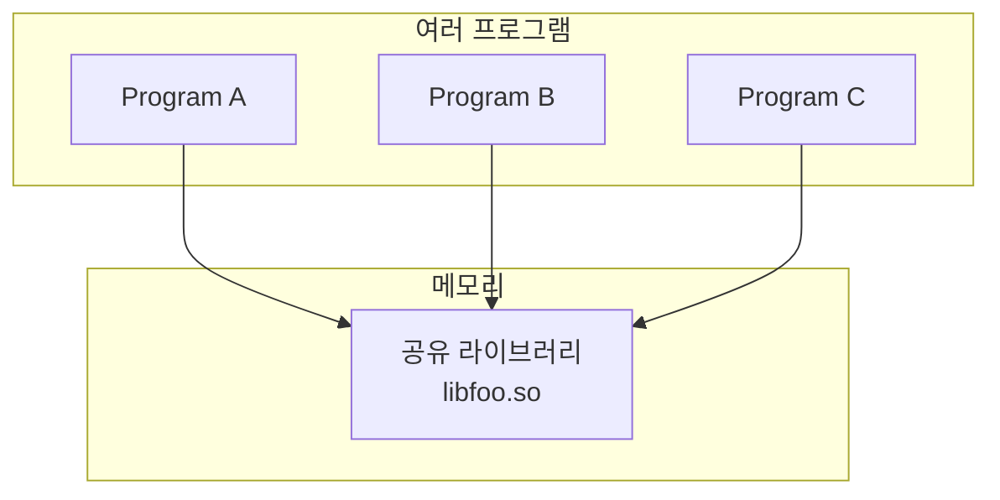
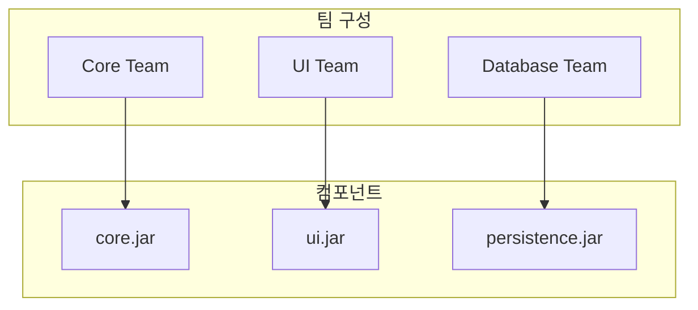

컴포넌트는 **배포의 단위**다. Java에서는 jar 파일, .NET에서는 dll 파일, Ruby에서는 gem 파일이다. 컴파일형 언어에서는 바이너리 파일의 묶음이고, 인터프리터형 언어에서는 소스 파일의 묶음이다.

## 컴포넌트의 정의

> **"컴포넌트는 시스템의 일부로 배포할 수 있는 가장 작은 단위다."**

### 플러그인 아키텍처

잘 설계된 컴포넌트는 **독립적으로 배포 가능**하다. 이것은 **독립적으로 개발 가능**하다는 의미이기도 하다.



이러한 플러그인 아키텍처는 컴포넌트 개념의 발전 덕분에 가능해졌다.

## 컴포넌트의 역사

### 초기: 단일 프로그램 시대

1940-50년대, 프로그램은 단순했다:

1. 프로그래머가 이진 코드를 직접 작성
2. 종이 테이프나 카드에 펀칭
3. 컴퓨터에 로드
4. 실행

```
초기 프로그래밍
┌────────────────────────┐
│ 000100 00001 00010     │ ← 이진 코드 직접 작성
│ 000101 00011 00100     │
│ ...                    │
└────────────────────────┘
```

라이브러리? 다른 프로그램에서 복사해서 붙여넣기!

### 라이브러리와 메모리 문제

프로그램이 커지면서 **라이브러리**가 등장했다. 자주 사용하는 함수들을 모아둔 것이다.

문제: 라이브러리를 **어디에 배치**할 것인가?

```
메모리 레이아웃 예시
┌────────────────┐ 0x0000
│ 운영체제       │
├────────────────┤ 0x1000
│ 애플리케이션   │ ← 고정 주소에서 시작
├────────────────┤ 0x3000
│ 라이브러리     │ ← 애플리케이션 뒤에 배치
├────────────────┤ 0x5000
│ 빈 공간        │
└────────────────┘ 0xFFFF
```

### 재배치 문제

애플리케이션이나 라이브러리가 커지면?

```
문제 상황
┌────────────────┐ 0x0000
│ 운영체제       │
├────────────────┤ 0x1000
│ 애플리케이션   │ ← 커졌다!
│ (커진 버전)    │
├────────────────┤ 0x4000  ← 원래 0x3000이었는데
│ 라이브러리     │    라이브러리 시작 주소 변경!
├────────────────┤ 0x6000
│ 빈 공간        │
└────────────────┘
```

라이브러리의 모든 **절대 주소**를 다시 계산해야 했다. 엄청나게 번거로운 작업!

### 해결책: 재배치 가능한 바이너리

1960년대, **재배치 가능한 바이너리(Relocatable Binary)**가 등장했다.



**핵심 아이디어**:
1. 컴파일러가 **상대 주소**로 코드 생성
2. 링커가 여러 오브젝트 파일을 묶으면서 **절대 주소**로 변환
3. 메모리 배치가 바뀌어도 링커만 다시 실행하면 됨

### 링커의 역할

```
오브젝트 파일 (상대 주소)
┌─────────────────────┐
│ CALL 0x0010         │ ← "함수 A를 호출" (상대 주소)
│ JUMP 0x0050         │ ← "여기로 점프" (상대 주소)
└─────────────────────┘

링커 후 (절대 주소)
┌─────────────────────┐
│ CALL 0x3010         │ ← 실제 메모리 주소
│ JUMP 0x3050         │ ← 실제 메모리 주소
└─────────────────────┘
```

### 링킹 로더

초기에는 **로더(Loader)**가 링킹도 수행했다:

1. 프로그램 실행 요청
2. 로더가 오브젝트 파일들을 메모리에 로드
3. 주소를 재배치하면서 링킹
4. 실행 시작

문제: 프로그램이 커질수록 **로딩 시간이 길어짐**

### 분리된 링커

해결책: 링킹을 **미리** 수행



빌드 시점에 링킹을 완료하면:
- 로딩 시간 단축
- 실행 파일 크기 증가 (라이브러리 포함)

## 동적 링킹의 등장

### 정적 링킹의 문제

**정적 링킹(Static Linking)**: 빌드 시점에 모든 라이브러리를 실행 파일에 포함

문제:
- 실행 파일 크기 증가
- 라이브러리 업데이트 시 전체 재빌드 필요
- 메모리 낭비 (여러 프로그램이 같은 라이브러리 중복 로드)

### 동적 링킹

**동적 링킹(Dynamic Linking)**: 런타임에 라이브러리 로드



장점:
- 실행 파일 크기 감소
- 라이브러리 업데이트가 쉬움
- 메모리 절약 (공유)
- **플러그인 아키텍처 가능**

### 공유 라이브러리

| 플랫폼 | 파일 형식 | 확장자 |
|--------|----------|--------|
| Unix/Linux | Shared Object | .so |
| Windows | Dynamic Link Library | .dll |
| macOS | Dynamic Library | .dylib |

## 현대의 컴포넌트

### 고수준 언어에서의 컴포넌트

| 언어/플랫폼 | 컴포넌트 형식 | 패키지 관리자 |
|------------|--------------|--------------|
| Java | jar | Maven, Gradle |
| .NET | dll, nupkg | NuGet |
| Ruby | gem | Bundler |
| Python | wheel, egg | pip |
| JavaScript | npm package | npm, yarn |

### 모듈 시스템

현대 언어들은 언어 수준에서 모듈을 지원:

```java
// Java 9+ 모듈 시스템
module com.myapp.core {
    exports com.myapp.core.api;
    requires com.myapp.common;
}
```

```javascript
// ES6 모듈
import { Component } from './Component.js';
export class MyComponent extends Component { }
```

## 컴포넌트가 중요한 이유

### 독립적 개발

각 컴포넌트를 **별도 팀**이 개발 가능:



### 독립적 배포

- 한 컴포넌트만 업데이트 가능
- 전체 시스템 재빌드 불필요
- 빠른 릴리스 주기

### 독립적 테스트

- 컴포넌트별 단위 테스트
- 의존성 Mock으로 격리 테스트

## 핵심 요약

| 시대 | 특징 | 문제 |
|------|------|------|
| 초기 | 단일 프로그램 | 라이브러리 공유 어려움 |
| 1960s | 재배치 가능 바이너리 | 로딩 시간 |
| 1970s | 분리된 링커 | 정적 링킹 비효율 |
| 1980s~ | 동적 링킹 | 버전 호환성 |
| 현대 | 패키지 관리자 | 복잡성 |

> **"컴포넌트 기반 개발은 독립적으로 배포 가능한 단위를 만들어, 시스템의 독립적인 개발과 배포를 가능하게 한다."**
> — Robert C. Martin

## 다음 장에서는

다음 장에서는 **컴포넌트 응집도**를 다룬다. 어떤 클래스들을 하나의 컴포넌트에 묶어야 하는지, REP, CCP, CRP 세 가지 원칙을 살펴본다.
