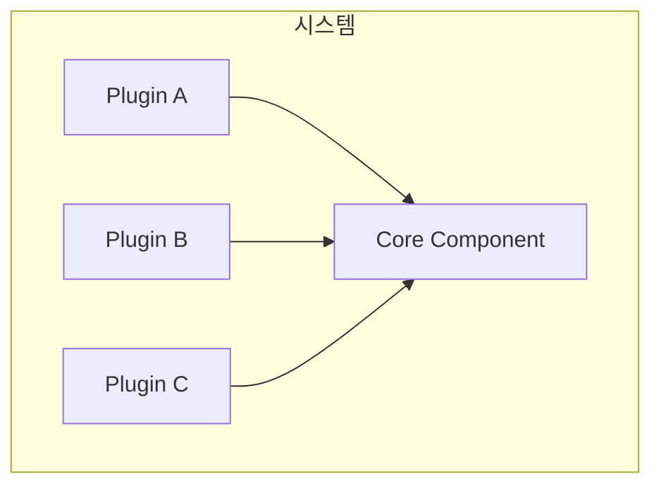
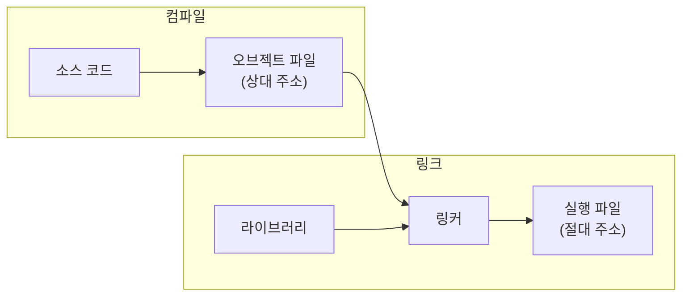
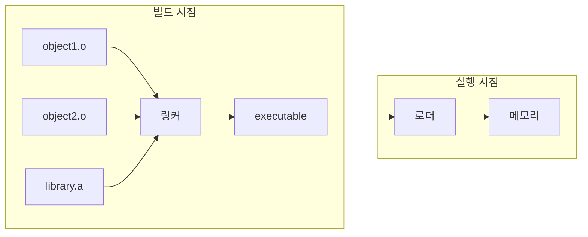
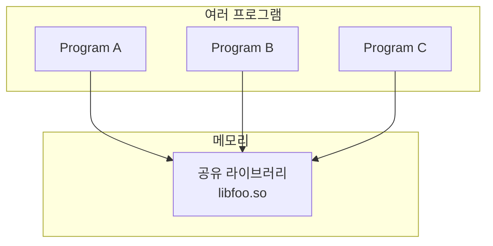
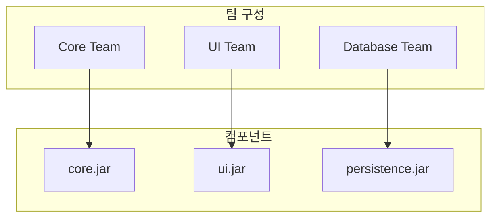

컴포넌트는 **배포의 단위**다. Java에서는 jar 파일, .NET에서는 dll 파일, Ruby에서는 gem 파일이다. 컴파일형 언어에서는 바이너리 파일의 묶음이고, 인터프리터형 언어에서는 소스 파일의 묶음이다.

## 컴포넌트의 정의

> **"컴포넌트는 시스템의 일부로 배포할 수 있는 가장 작은 단위다."**

### 플러그인 아키텍처

잘 설계된 컴포넌트는 **독립적으로 배포 가능**하다. 이것은 **독립적으로 개발 가능**하다는 의미이기도 하다.


```mermaid
flowchart TB
    subgraph System [시스템]
        Core[Core Component]
        P1[Plugin A]
        P2[Plugin B]
        P3[Plugin C]
    end
    
    P1 --> Core
    P2 --> Core
    P3 --> Core
```

이러한 플러그인 아키텍처는 컴포넌트 개념의 발전 덕분에 가능해졌다.

## 컴포넌트의 역사

### 초기: 단일 프로그램 시대

1950-60년대(원 출처는 정확한 연도를 명시하지 않으며, 이하 시대 구분은 대략적인 시기다), 프로그램은 단순했다:

1. 프로그래머가 이진 코드를 직접 작성
2. 종이 테이프나 카드에 펀칭
3. 컴퓨터에 로드
4. 실행

```text
초기 프로그래밍
┌────────────────────────┐
│ 000100 00001 00010     │ ← 이진 코드 직접 작성
│ 000101 00011 00100     │
│ ...                    │
└────────────────────────┘
```

라이브러리? 다른 프로그램에서 복사해서 붙여넣기!

### 라이브러리와 메모리 문제

프로그램이 커지면서 **라이브러리**가 등장했다. 자주 사용하는 함수들을 모아둔 것이다.

문제: 라이브러리를 **어디에 배치**할 것인가?

```text
메모리 레이아웃 예시
┌────────────────┐ 0x0000
│ 운영체제       │
├────────────────┤ 0x1000
│ 애플리케이션   │ ← 고정 주소에서 시작
├────────────────┤ 0x3000
│ 라이브러리     │ ← 애플리케이션 뒤에 배치
├────────────────┤ 0x5000
│ 빈 공간        │
└────────────────┘ 0xFFFF
```

### 재배치 문제

애플리케이션이나 라이브러리가 커지면?

```text
문제 상황
┌────────────────┐ 0x0000
│ 운영체제       │
├────────────────┤ 0x1000
│ 애플리케이션   │ ← 커졌다!
│ (커진 버전)    │
├────────────────┤ 0x4000  ← 원래 0x3000이었는데
│ 라이브러리     │    라이브러리 시작 주소 변경!
├────────────────┤ 0x6000
│ 빈 공간        │
└────────────────┘
```

라이브러리의 모든 **절대 주소**를 다시 계산해야 했다. 엄청나게 번거로운 작업!

### 해결책: 재배치 가능한 바이너리

1960년대, <strong>재배치 가능한 바이너리(Relocatable Binary)</strong>가 등장했다.


```mermaid
flowchart LR
    subgraph Compile [컴파일]
        SRC[소스 코드] --> OBJ["오브젝트 파일</br>(상대 주소)"]
    end
    
    subgraph Link [링크]
        OBJ --> LINKER[링커]
        LIB[라이브러리] --> LINKER
        LINKER --> EXE["실행 파일</br>(절대 주소)"]
    end
```

이 방식이 이전과 다른 점은 주소 계산의 책임을 나누었다는 데 있다.

1. 컴파일러가 **상대 주소**로 코드 생성 — "내가 어디에 배치될지"는 신경 쓰지 않고, "함수 A로부터 몇 바이트 떨어져 있는지"만 기록한다.
2. 링커가 여러 오브젝트 파일을 묶으면서 **절대 주소**로 변환 — 각 오브젝트 파일이 최종적으로 메모리 어디에 놓일지 결정하고, 상대 주소를 실제 주소로 바꿔 채워 넣는다.
3. 메모리 배치가 바뀌어도 링커만 다시 실행하면 됨 — 소스 코드를 다시 컴파일할 필요 없이, 링크 단계만 다시 돌리면 새 메모리 배치에 맞는 실행 파일이 나온다.

### 링커의 역할

```text
오브젝트 파일 (상대 주소)
┌─────────────────────┐
│ CALL 0x0010         │ ← "함수 A를 호출" (상대 주소)
│ JUMP 0x0050         │ ← "여기로 점프" (상대 주소)
└─────────────────────┘

링커 후 (절대 주소)
┌─────────────────────┐
│ CALL 0x3010         │ ← 실제 메모리 주소
│ JUMP 0x3050         │ ← 실제 메모리 주소
└─────────────────────┘
```

### 링킹 로더

초기에는 <strong>로더(Loader)</strong>가 링킹도 수행했다. 즉 "링크"와 "로드"가 분리된 두 단계가 아니라, 프로그램을 실행할 때마다 매번 다시 수행하는 하나의 단계였다:

1. 프로그램 실행 요청
2. 로더가 오브젝트 파일들을 메모리에 로드
3. 주소를 재배치하면서 링킹
4. 실행 시작

이 방식의 문제는 3번 단계다. 프로그램을 실행할 때마다 주소 재배치·링킹 작업을 매번 반복하므로, 프로그램이 커질수록 **로딩 시간이 길어짐** — 어제와 오늘 실행하는 코드가 똑같은데도, 실행할 때마다 같은 링킹 작업을 다시 하는 셈이다.

### 분리된 링커

해결책: 링킹을 **미리** 수행


```mermaid
flowchart LR
    subgraph Build [빌드 시점]
        OBJ1[object1.o]
        OBJ2[object2.o]
        LIB[library.a]
        
        OBJ1 --> LINKER[링커]
        OBJ2 --> LINKER
        LIB --> LINKER
        LINKER --> EXE[executable]
    end
    
    subgraph Run [실행 시점]
        EXE --> LOADER[로더]
        LOADER --> MEM[메모리]
    end
```

빌드 시점에 링킹을 완료하면:
- 로딩 시간 단축
- 실행 파일 크기 증가 (라이브러리 포함)

## 동적 링킹의 등장

### 정적 링킹의 문제

<strong>정적 링킹(Static Linking)</strong>은 빌드 시점에 모든 라이브러리를 실행 파일에 포함시키는 방식이다. 분리된 링커 덕분에 로딩 시간 문제는 해결됐지만, 이번에는 "포함"이라는 방식 자체가 새 문제를 낳는다.

문제:
- 실행 파일 크기 증가 — 라이브러리 코드가 실행 파일 안에 그대로 복사되기 때문이다
- 라이브러리 업데이트 시 전체 재빌드 필요 — 라이브러리만 바뀌어도 그것을 포함한 모든 실행 파일을 다시 링크해야 한다
- 메모리 낭비 (여러 프로그램이 같은 라이브러리 중복 로드) — 프로그램 A와 B가 같은 라이브러리를 쓰더라도, 각자의 실행 파일에 그 코드가 따로 복사되어 메모리에도 따로 올라간다

### 동적 링킹

<strong>동적 링킹(Dynamic Linking)</strong>은 라이브러리 코드를 실행 파일에 포함하는 대신, 런타임에 필요할 때 메모리에 로드해 공유하는 방식이다. 정적 링킹의 세 가지 문제(크기·재빌드·메모리 중복)를 모두 "포함하지 않는다"는 한 가지 변화로 해결한다.


```mermaid
flowchart TB
    subgraph Programs [여러 프로그램]
        P1[Program A]
        P2[Program B]
        P3[Program C]
    end
    
    subgraph Memory [메모리]
        LIB["공유 라이브러리</br>libfoo.so"]
    end
    
    P1 --> LIB
    P2 --> LIB
    P3 --> LIB
```

장점:
- 실행 파일 크기 감소 — 라이브러리 코드가 실행 파일에 복사되지 않고 별도 파일로 남기 때문이다
- 라이브러리 업데이트가 쉬움 — 공유 라이브러리 파일만 교체하면, 그것을 참조하는 모든 프로그램이 다음 실행부터 새 버전을 쓴다
- 메모리 절약 (공유) — 여러 프로그램이 같은 라이브러리를 메모리에 한 번만 올려 공유한다
- **플러그인 아키텍처 가능** — 실행 파일을 다시 빌드하지 않고도 런타임에 새 라이브러리(플러그인)를 로드할 수 있다

### 공유 라이브러리

| 플랫폼 | 파일 형식 | 확장자 |
|--------|----------|--------|
| Unix/Linux | Shared Object | .so |
| Windows | Dynamic Link Library | .dll |
| macOS | Dynamic Library | .dylib |

### 정적 링킹 vs 동적 링킹: 언제 무엇을 쓰는가

동적 링킹이 항상 우월한 것은 아니다. 배포 환경과 목표에 따라 정적 링킹이 여전히 더 나은 선택일 수 있다.

| 상황 | 권장 방식 | 이유 |
|------|---------|------|
| 오프라인·임베디드 환경 | 정적 링킹 | 대상 환경에 공유 라이브러리가 없거나 버전이 다를 수 있음 |
| 여러 프로그램이 같은 런타임 공유 | 동적 링킹 | 메모리·디스크 절약, 보안 패치 일괄 적용 |
| 컨테이너 이미지 최적화 | 정적 링킹 | 의존성 레이어를 줄여 이미지 크기와 시작 시간 단축 |
| 플러그인 아키텍처 필요 | 동적 링킹 | 런타임에 모듈을 교체·추가해야 함 |

## 현대의 컴포넌트

### 고수준 언어에서의 컴포넌트

| 언어/플랫폼 | 컴포넌트 형식 | 패키지 관리자 |
|------------|--------------|--------------|
| Java | jar | Maven, Gradle |
| .NET | dll, nupkg | NuGet |
| Ruby | gem | Bundler |
| Python | wheel, egg | pip |
| JavaScript | npm package | npm, yarn |

### 모듈 시스템

패키지 관리자가 컴포넌트를 배포·설치하는 도구라면, 모듈 시스템은 언어 자체가 "이 코드 묶음의 경계가 어디인지, 무엇을 외부에 공개하는지"를 표현하는 문법이다. 아래 `module-info.java`(Java 9+ 모듈 선언 파일)는 `com.myapp.core` 모듈이 `com.myapp.core.api` 패키지만 외부에 공개하고, `com.myapp.common` 모듈에 의존한다는 것을 컴파일러가 강제할 수 있는 형태로 선언한다:

```java
// module-info.java (Java 9+ 모듈 시스템)
module com.myapp.core {
    exports com.myapp.core.api;
    requires com.myapp.common;
}
```

ES6 모듈은 파일 단위로 공개 범위를 선언한다. `export`가 없는 것은 그 파일 밖에서 `import`할 수 없다:

```javascript
// Component.js
export class Component {}

// MyComponent.js
import { Component } from './Component.js';
export class MyComponent extends Component {}
```

## 컴포넌트가 중요한 이유

### 독립적 개발

각 컴포넌트를 **별도 팀**이 개발 가능:


```mermaid
flowchart TB
    subgraph Teams [팀 구성]
        T1[Core Team]
        T2[UI Team]
        T3[Database Team]
    end
    
    subgraph Components [컴포넌트]
        C1[core.jar]
        C2[ui.jar]
        C3[persistence.jar]
    end
    
    T1 --> C1
    T2 --> C2
    T3 --> C3
```

### 독립적 배포

컴포넌트가 배포 단위로 분리되어 있으면, 변경이 발생한 컴포넌트만 다시 빌드·배포하면 된다.

- 한 컴포넌트만 업데이트 가능
- 전체 시스템 재빌드 불필요
- 빠른 릴리스 주기

### 독립적 테스트

컴포넌트 경계는 테스트 경계와도 자연스럽게 겹친다. 다른 컴포넌트를 실제로 띄우지 않고도, 그 컴포넌트가 제공하는 인터페이스만 Mock으로 대체하면 해당 컴포넌트를 격리된 상태로 검증할 수 있다.

- 컴포넌트별 단위 테스트
- 의존성 Mock으로 격리 테스트

## 흔한 오해

"컴포넌트의 역사"를 단순한 기술 연대기로 오해하기 쉽지만, 이 장의 요점은 각 시대의 해결책이 그 이전 시대의 **구체적인 고통**에서 나왔다는 인과관계에 있다. 재배치 가능한 바이너리는 "라이브러리 위치가 바뀔 때마다 주소를 다시 계산해야 하는 고통"에서, 동적 링킹은 "여러 프로그램이 같은 라이브러리를 중복으로 포함하는 낭비"에서 나왔다. 현대의 패키지 관리자(Maven, npm 등)도 마찬가지로 "버전 호환성을 수동으로 추적하는 고통"에서 나온 해결책이다. 또 다른 오해는 최신 기술일수록 이전 기술을 완전히 대체했다고 보는 것이다. 실제로는 정적 링킹도 여전히 쓰인다(예: 임베디드 시스템, 컨테이너 이미지 최적화) — 동적 링킹이 "항상 더 나은 선택"이 아니라 "특정 문제에 대한 트레이드오프"이기 때문이다.

## 학습 목표

이 장을 읽은 후 다음을 스스로 점검한다.

- 재배치 가능한 바이너리가 해결한 구체적인 문제(메모리 주소 재계산)를 설명할 수 있는가?
- 정적 링킹과 동적 링킹 각각의 장단점을 실행 파일 크기·로딩 시간·업데이트 용이성 관점에서 비교할 수 있는가?
- 컴포넌트의 역사에서 각 시대의 해결책이 이전 시대의 어떤 문제에 대응했는지 설명할 수 있는가?
- 현대 패키지 관리자(Maven, npm 등)가 과거의 링커·로더와 개념적으로 어떻게 연결되는지 설명할 수 있는가?

## 참고 자료

- Robert C. Martin, 『Clean Architecture』, 2017, 12장 — 컴포넌트 역사와 정의의 원 출처.

## 핵심 요약

(아래 시대 구분은 본문에서 근거를 밝힌 순서를 요약한 것이며, 원 출처가 명시하지 않는 정확한 연도가 아니라 대략적인 흐름이다.)

| 시대 | 특징 | 문제 |
|------|------|------|
| 초기 | 단일 프로그램 | 라이브러리 공유 어려움 |
| 재배치 가능 바이너리 등장 | 상대 주소·링커 도입 | 로딩 시간 |
| 분리된 링커 | 빌드 시점 링킹 | 정적 링킹 비효율 |
| 동적 링킹 등장 | 런타임 라이브러리 로드 | 버전 호환성 |
| 현대 | 패키지 관리자 | 복잡성 |

마틴은 컴포넌트 기반 개발이 독립적으로 배포 가능한 단위를 만들어, 시스템의 독립적인 개발과 배포를 가능하게 한다고 요약한다(Martin, 『Clean Architecture』, 2017, 12장).

## 다음 장에서는

다음 장에서는 **컴포넌트 응집도**를 다룬다. 어떤 클래스들을 하나의 컴포넌트에 묶어야 하는지, REP, CCP, CRP 세 가지 원칙을 살펴본다.
