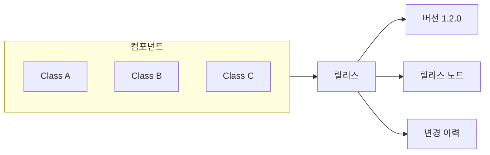
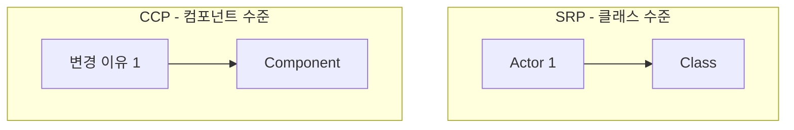
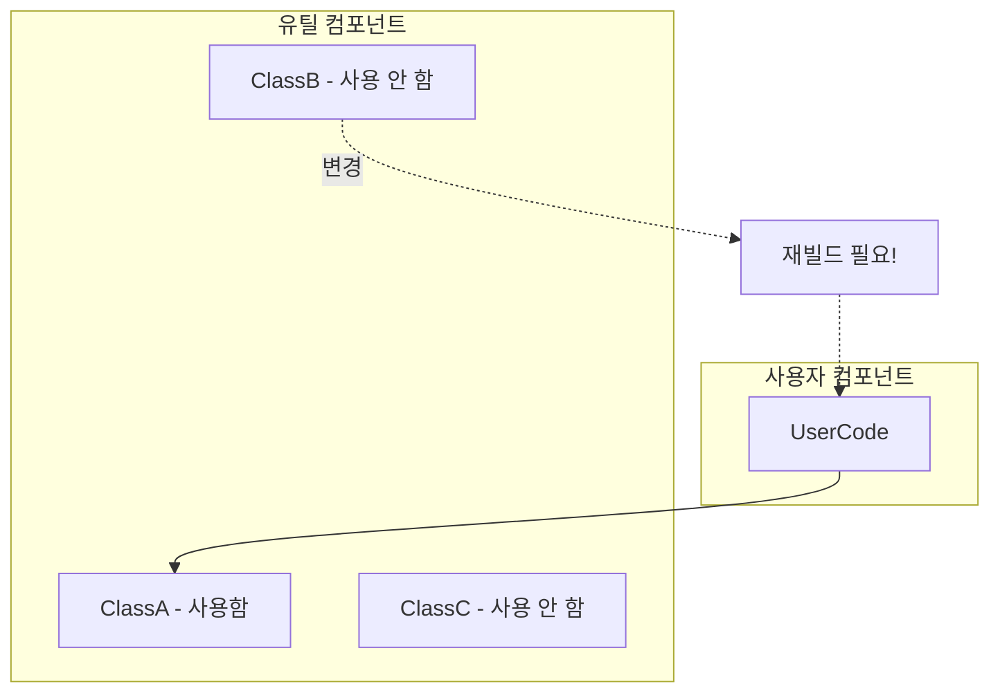
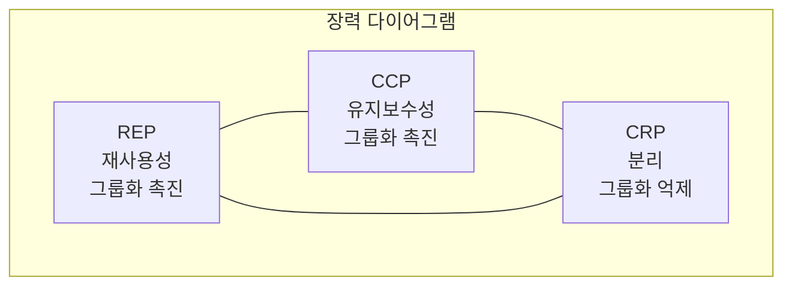
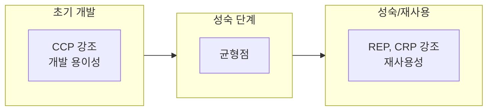
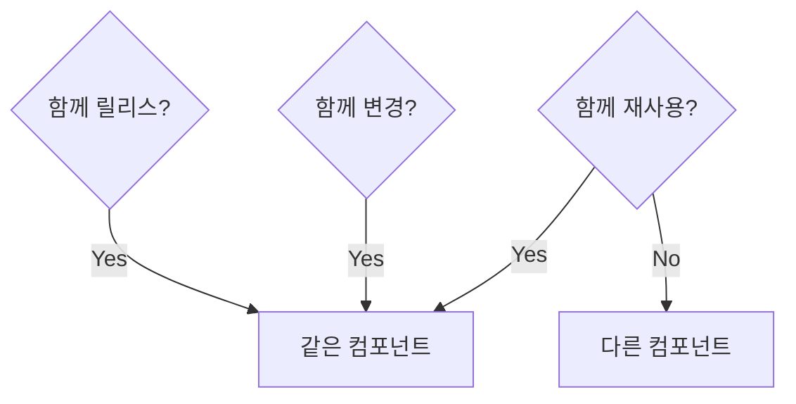

컴포넌트에 **어떤 클래스들을 포함**시켜야 하는가? 이것은 중요한 설계 결정이다. 너무 많이 묶으면 불필요한 의존성이 생기고, 너무 적게 묶으면 관리가 어려워진다. 세 가지 원칙이 이 결정을 도와준다.

## REP: 재사용/릴리스 등가 원칙

> **"재사용의 단위는 릴리스의 단위와 같다."**
> (Reuse/Release Equivalence Principle)

### 의미

컴포넌트로 재사용하려면, 그 컴포넌트를 **릴리스**해야 한다. 릴리스란:

- **버전 번호** 부여
- **릴리스 문서** 제공
- **변경 사항** 공지



### 실천 지침

REP는 다음을 요구한다:

1. **함께 릴리스될 클래스들을 묶어라**
2. **공통 테마나 목적**이 있어야 한다
3. 사용자가 **전체를 재사용**하거나 **전혀 재사용하지 않거나**

### 위반 사례

```java
// 나쁜 예: 관련 없는 클래스들이 한 컴포넌트에
package com.myapp.utils;

public class StringUtils { }      // 문자열 처리
public class DateUtils { }        // 날짜 처리
public class HttpClient { }       // HTTP 통신
public class JsonParser { }       // JSON 파싱
public class EncryptionService {} // 암호화
```

이들은 관련이 없다. 하나를 사용하려면 나머지도 따라온다.

### 좋은 예

```java
// 좋은 예: 관련된 클래스들만
package com.myapp.json;

public class JsonParser { }
public class JsonWriter { }
public class JsonNode { }
public class JsonException { }
```

JSON 처리라는 **공통 테마**로 묶여 있다.

## CCP: 공통 폐쇄 원칙

> **"동일한 이유로, 동일한 시점에 변경되는 클래스들을 같은 컴포넌트로 묶어라."**
> (Common Closure Principle)

### SRP의 컴포넌트 버전

CCP는 **SRP를 컴포넌트 수준으로 확장**한 것이다:

- **SRP**: 클래스는 하나의 변경 이유만 가져야 함
- **CCP**: 컴포넌트는 하나의 변경 이유만 가져야 함



### 목표

변경이 필요할 때:
- **하나의 컴포넌트만** 수정
- 다른 컴포넌트는 **재빌드/재배포 불필요**

### 실천 지침

```java
// 좋은 예: 같은 변경 이유를 가진 클래스들
package com.myapp.billing;

public class Invoice { }           // 청구서
public class InvoiceItem { }       // 청구 항목
public class InvoiceCalculator { } // 청구 계산
public class InvoiceRenderer { }   // 청구서 출력
```

청구 규칙이 바뀌면 → 이 컴포넌트만 수정

### OCP와의 관계

CCP는 **OCP를 보완**한다:

- **OCP**: 변경에 닫혀 있어야 함
- **100% 폐쇄는 불가능**: 어떤 변경은 불가피
- **CCP**: 불가피한 변경을 한 곳에 집중

> "같은 이유로 변경되는 것들을 한 곳에 모아라. 그러면 변경의 영향이 퍼지지 않는다."

## CRP: 공통 재사용 원칙

> **"함께 재사용되지 않는 클래스들을 같은 컴포넌트에 넣지 마라."**
> (Common Reuse Principle)

### ISP의 컴포넌트 버전

CRP는 **ISP를 컴포넌트 수준으로 확장**한 것이다:

- **ISP**: 사용하지 않는 메서드에 의존하지 마라
- **CRP**: 사용하지 않는 클래스에 의존하지 마라

### 불필요한 의존성의 위험



`ClassB`가 변경되면:
- Utils 컴포넌트 전체 재빌드
- **UserCode도 재빌드** (사용하지도 않는데!)

### 실천 지침

```java
// 나쁜 예: 함께 사용되지 않는 클래스들
package com.myapp.utilities;

public class Container { }    // 컬렉션 관련
public class ContainerUtil { }
public class Geometry { }     // 기하학 관련
public class GeometryUtil { }
```

Container를 사용하는 사람은 Geometry가 필요 없다.

```java
// 좋은 예: 분리
package com.myapp.container;
public class Container { }
public class ContainerUtil { }

package com.myapp.geometry;
public class Geometry { }
public class GeometryUtil { }
```

## 세 원칙의 장력

세 원칙은 서로 **긴장 관계**에 있다:



### REP와 CCP: 그룹화 촉진

- **REP**: "재사용되는 것들을 묶어라"
- **CCP**: "함께 변경되는 것들을 묶어라"
- 둘 다 **컴포넌트를 크게** 만드는 경향

### CRP: 그룹화 억제

- **CRP**: "함께 사용되지 않는 것은 분리하라"
- 컴포넌트를 **작게** 만드는 경향

### 균형점 찾기

프로젝트 단계에 따라 균형점이 다르다:



| 단계 | 강조 원칙 | 이유 |
|------|----------|------|
| 초기 개발 | CCP | 빠른 변경, 유지보수 중요 |
| 성숙 단계 | 균형 | 안정성과 유연성 동시 |
| 재사용 중심 | REP, CRP | 재사용 용이성 중요 |

## 실제 적용 예시

### 스프링 프레임워크

Spring은 여러 모듈로 분리되어 있다:

```
spring-core       ← 핵심 유틸리티
spring-beans      ← 빈 관리
spring-context    ← 애플리케이션 컨텍스트
spring-web        ← 웹 기능
spring-data-jpa   ← JPA 지원
```

- **REP**: 각 모듈이 독립적으로 릴리스
- **CCP**: 관련 기능이 한 모듈에
- **CRP**: 웹이 필요 없으면 spring-web 의존 불필요

### 나쁜 예: 모놀리식 유틸

```java
// 모든 유틸리티가 한 곳에
package com.company.utils;

// 수백 개의 유틸리티 클래스...
public class StringUtils { }
public class DateUtils { }
public class FileUtils { }
public class HttpUtils { }
// ...
```

문제:
- DateUtils 변경 → 전체 재빌드
- StringUtils만 필요해도 전체 의존

## 핵심 요약

| 원칙 | 질문 | 효과 |
|------|------|------|
| REP | 함께 릴리스되는가? | 그룹화 촉진 |
| CCP | 함께 변경되는가? | 그룹화 촉진 |
| CRP | 함께 사용되는가? | 그룹화 억제 |



> **"세 원칙은 서로 경쟁한다. REP와 CCP는 포함을, CRP는 배제를 강조한다. 좋은 아키텍트는 이 장력에서 현재 개발팀의 요구에 맞는 균형점을 찾는다."**
> — Robert C. Martin

## 다음 장에서는

다음 장에서는 **컴포넌트 결합**을 다룬다. 컴포넌트들 사이의 의존성을 어떻게 관리할 것인가? ADP, SDP, SAP 세 가지 원칙을 살펴본다.
