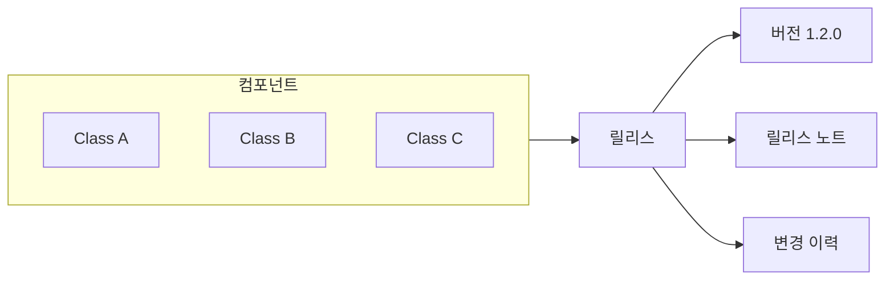
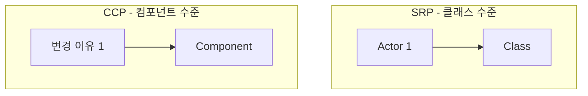
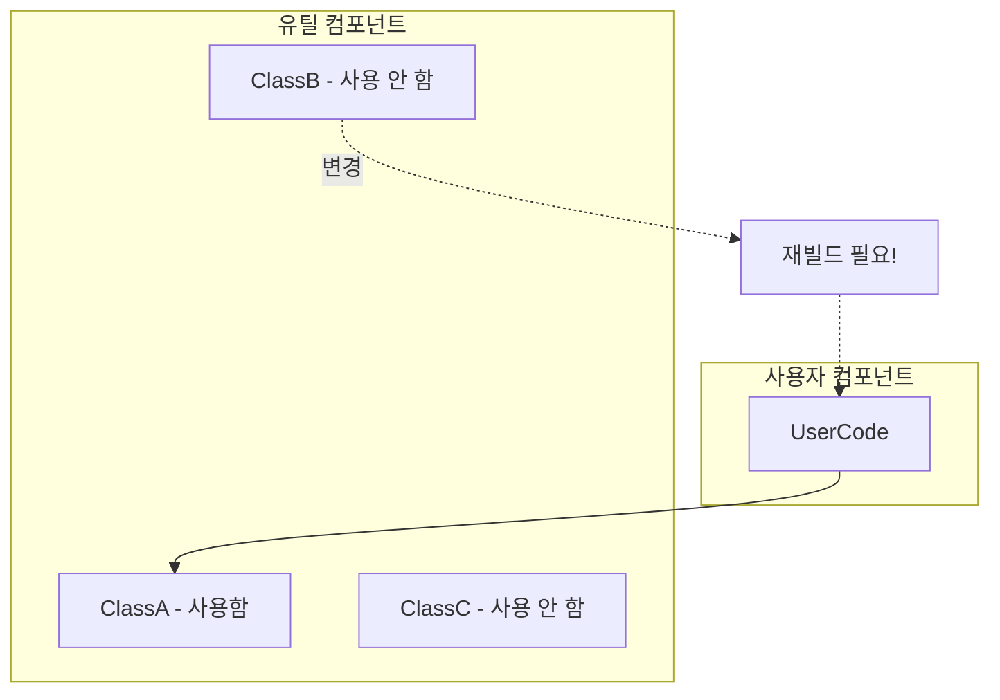
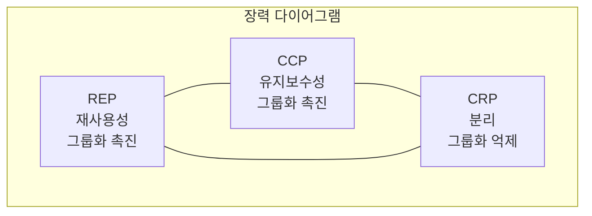
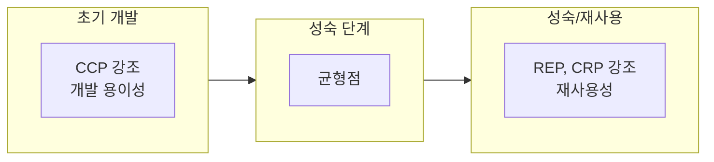

컴포넌트에 **어떤 클래스들을 포함**시켜야 하는가? 이것은 중요한 설계 결정이다. 너무 많이 묶으면 불필요한 의존성이 생기고, 너무 적게 묶으면 관리가 어려워진다. 세 가지 원칙이 이 결정을 도와준다.

## REP: 재사용/릴리스 등가 원칙

> **"재사용의 단위는 릴리스의 단위와 같다."**
> (Reuse/Release Equivalence Principle)

### 의미

컴포넌트로 재사용하려면, 그 컴포넌트를 **릴리스**해야 한다. 릴리스되지 않은 코드는 "누군가 가져다 쓸 수 있는 상태"가 아니라 여전히 원저자의 작업 중인 코드일 뿐이다. 릴리스는 구체적으로 세 가지를 의미한다:

- **버전 번호** 부여 — 사용자가 "지금 쓰는 것이 어떤 시점의 코드인지"를 특정할 수 있어야 한다
- **릴리스 문서** 제공 — 무엇이 바뀌었는지 알려주지 않으면 사용자는 업그레이드 여부를 판단할 수 없다
- **변경 사항** 공지 — 특히 호환성이 깨지는 변경은 사전에 알려야 사용자가 대비할 수 있다


```mermaid
flowchart LR
    subgraph Component [컴포넌트]
        C1[Class A]
        C2[Class B]
        C3[Class C]
    end
    
    Component --> R[릴리스]
    R --> V["버전 1.2.0"]
    R --> D[릴리스 노트]
    R --> CH[변경 이력]
```

### 실천 지침

REP는 다음을 요구한다. 세 항목은 사실 하나의 결론에서 파생된다 — 릴리스는 컴포넌트 전체 단위로 이뤄지므로, 그 안에 담긴 것들도 전체 단위로 다뤄질 수 있어야 한다.

1. **함께 릴리스될 클래스들을 묶어라** — 릴리스 단위와 재사용 단위가 다르면, 사용자는 필요 없는 클래스까지 함께 받아야 한다
2. **공통 테마나 목적**이 있어야 한다 — 테마가 없으면 "왜 이 클래스들이 한 릴리스에 묶여 있는지" 설명할 수 없다
3. 사용자가 **전체를 재사용**하거나 **전혀 재사용하지 않거나** — 일부만 재사용하고 싶은 클래스가 있다면, 그것은 이미 이 컴포넌트에 속하지 말아야 한다는 신호다

### 위반 사례

```java
// 나쁜 예: 관련 없는 클래스들이 한 컴포넌트에
package com.myapp.utils;

public class StringUtils { }      // 문자열 처리
public class DateUtils { }        // 날짜 처리
public class HttpClient { }       // HTTP 통신
public class JsonParser { }       // JSON 파싱
public class EncryptionService {} // 암호화
```

이들은 관련이 없다. 하나를 사용하려면 나머지도 따라온다 — `StringUtils`만 필요한 클라이언트도 이 컴포넌트를 의존하는 순간 `EncryptionService`의 변경(예: 암호화 알고리즘 교체)에 영향을 받는다. "utils"라는 이름 자체가 공통 테마가 없다는 신호인 경우가 많다.

### 좋은 예

```java
// 좋은 예: 관련된 클래스들만
package com.myapp.json;

public class JsonParser { }
public class JsonWriter { }
public class JsonNode { }
public class JsonException { }
```

JSON 처리라는 **공통 테마**로 묶여 있다.

## CCP: 공통 폐쇄 원칙

> **"동일한 이유로, 동일한 시점에 변경되는 클래스들을 같은 컴포넌트로 묶어라."**
> (Common Closure Principle)

### SRP의 컴포넌트 버전

CCP는 **SRP를 컴포넌트 수준으로 확장**한 것이다:

- **SRP**: 클래스는 하나의 변경 이유만 가져야 함
- **CCP**: 컴포넌트는 하나의 변경 이유만 가져야 함


```mermaid
flowchart TB
    subgraph SRP [SRP - 클래스 수준]
        C[Class]
        A1[Actor 1]
        A1 --> C
    end
    
    subgraph CCP [CCP - 컴포넌트 수준]
        COMP[Component]
        R1[변경 이유 1]
        R1 --> COMP
    end
```

### 목표

CCP가 궁극적으로 노리는 효과는 변경의 파급 범위를 줄이는 것이다. 변경이 필요할 때:
- **하나의 컴포넌트만** 수정 — 변경 이유가 하나로 묶여 있으면 그 변경도 한 곳에서 끝난다
- 다른 컴포넌트는 **재빌드/재배포 불필요** — 영향받지 않는 컴포넌트는 손댈 필요조차 없으므로, 릴리스 위험도 그만큼 줄어든다

### 실천 지침

```java
// 좋은 예: 같은 변경 이유를 가진 클래스들
package com.myapp.billing;

import java.math.BigDecimal;
import java.util.List;

public record InvoiceItem(String description, BigDecimal amount) {}

public class Invoice {
    private final List<InvoiceItem> items;

    public Invoice(List<InvoiceItem> items) { this.items = items; }
    public List<InvoiceItem> items() { return items; }
}

public class InvoiceCalculator {
    public BigDecimal total(Invoice invoice) {
        return invoice.items().stream()
            .map(InvoiceItem::amount)
            .reduce(BigDecimal.ZERO, BigDecimal::add);
    }
}

public class InvoiceRenderer {
    public String render(Invoice invoice, BigDecimal total) {
        return "청구 항목 " + invoice.items().size() + "건, 합계 " + total;
    }
}
```

청구 규칙이 바뀌면 → 이 컴포넌트만 수정. `Invoice`·`InvoiceItem`·`InvoiceCalculator`·`InvoiceRenderer`는 서로 다른 클래스지만 "청구 정책"이라는 같은 이유로 함께 변경되므로, CCP 관점에서는 REP가 요구하는 "공통 테마"보다 "공통 변경 이유"가 더 중요한 묶음 기준이 된다.

### OCP와의 관계

CCP는 **OCP를 보완**한다:

- **OCP**: 변경에 닫혀 있어야 함
- **100% 폐쇄는 불가능**: 어떤 변경은 불가피
- **CCP**: 불가피한 변경을 한 곳에 집중

마틴은 같은 이유로 변경되는 것들을 한 곳에 모으면 변경의 영향이 퍼지지 않는다고 설명한다(Martin, 『Clean Architecture』, 2017, 13장).

## CRP: 공통 재사용 원칙

> **"함께 재사용되지 않는 클래스들을 같은 컴포넌트에 넣지 마라."**
> (Common Reuse Principle)

### ISP의 컴포넌트 버전

CRP는 **ISP를 컴포넌트 수준으로 확장**한 것이다:

- **ISP**: 사용하지 않는 메서드에 의존하지 마라
- **CRP**: 사용하지 않는 클래스에 의존하지 마라

### 불필요한 의존성의 위험


```mermaid
flowchart TB
    subgraph User [사용자 컴포넌트]
        UC[UserCode]
    end
    
    subgraph Utils [유틸 컴포넌트]
        A[ClassA - 사용함]
        B[ClassB - 사용 안 함]
        C[ClassC - 사용 안 함]
    end
    
    UC --> A
    
    B -.->|변경| REBUILD[재빌드 필요!]
    REBUILD -.-> UC
```

`ClassB`가 변경되면:
- Utils 컴포넌트 전체 재빌드 — 컴포넌트는 릴리스 단위이므로, 그 안의 클래스 하나만 바뀌어도 컴포넌트 전체를 다시 빌드해야 한다
- **UserCode도 재빌드** (사용하지도 않는데!) — `UserCode`는 `ClassA`만 쓰지만, `ClassA`와 `ClassB`가 같은 컴포넌트에 있다는 이유만으로 `ClassB`의 변경에 발목이 잡힌다

### 실천 지침

```java
// 나쁜 예: 함께 사용되지 않는 클래스들
package com.myapp.utilities;

public class Container { }    // 컬렉션 관련
public class ContainerUtil { }
public class Geometry { }     // 기하학 관련
public class GeometryUtil { }
```

Container를 사용하는 사람은 Geometry가 필요 없다.

```java
// 좋은 예: 분리
package com.myapp.container;
public class Container { }
public class ContainerUtil { }

package com.myapp.geometry;
public class Geometry { }
public class GeometryUtil { }
```

두 패키지로 나누면, `Container`만 쓰는 클라이언트는 `Geometry`가 바뀌어도 재빌드 대상이 아니다. REP·CCP가 "묶어라"라고 말하는 것과 반대로, CRP는 "실제로 함께 쓰이지 않는다면 묶지 마라"라고 제동을 건다.

## 세 원칙의 장력

세 원칙은 서로 **긴장 관계**에 있다:


```mermaid
flowchart TB
    subgraph Triangle [장력 다이어그램]
        REP["REP</br>재사용성</br>그룹화 촉진"]
        CCP["CCP</br>유지보수성</br>그룹화 촉진"]
        CRP["CRP</br>분리</br>그룹화 억제"]
        
        REP --- CCP
        CCP --- CRP
        CRP --- REP
    end
```

### REP와 CCP: 그룹화 촉진

- **REP**: "재사용되는 것들을 묶어라"
- **CCP**: "함께 변경되는 것들을 묶어라"
- 둘 다 **컴포넌트를 크게** 만드는 경향

### CRP: 그룹화 억제

- **CRP**: "함께 사용되지 않는 것은 분리하라"
- 컴포넌트를 **작게** 만드는 경향

### 균형점 찾기

이 균형점이 고정된 값이 아니라는 사실이 중요하다. 프로젝트 초기에는 요구사항 자체가 계속 바뀌므로 "무엇이 함께 재사용될지" 예측하기 어렵고, 그래서 변경 편의성(CCP)이 재사용성(REP·CRP)보다 우선한다. 프로젝트가 성숙해 다른 팀·다른 프로젝트가 이 컴포넌트를 가져다 쓰기 시작하면, 이번에는 릴리스 단위와 재사용 단위를 정교하게 맞추는 것이 더 중요해진다. 프로젝트 단계에 따라 균형점이 이렇게 이동한다:


```mermaid
flowchart LR
    subgraph Early [초기 개발]
        E["CCP 강조</br>개발 용이성"]
    end
    
    subgraph Middle [성숙 단계]
        M["균형점"]
    end
    
    subgraph Mature [성숙/재사용]
        L["REP, CRP 강조</br>재사용성"]
    end
    
    Early --> Middle --> Mature
```

| 단계 | 강조 원칙 | 이유 |
|------|----------|------|
| 초기 개발 | CCP | 빠른 변경, 유지보수 중요 |
| 성숙 단계 | 균형 | 안정성과 유연성 동시 |
| 재사용 중심 | REP, CRP | 재사용 용이성 중요 |

## 실제 적용 예시

실제 백엔드 시스템이나 마이크로서비스 아키텍처에서 도메인별로 모듈을 나눌 때도 근본적으로는 같은 질문(함께 릴리스·변경·재사용되는가)을 던진다. 각 모듈이 인터페이스로 외부에 노출할 API를 명확히 하고 의존성 주입으로 구체 구현을 교체 가능하게 만들어 두면, CRP 위반이 뒤늦게 발견되더라도 리팩토링으로 분리하기 쉽고, 트래픽이 몰리는 모듈만 별도로 확장(scale)할 수 있으며, 무엇보다 각 모듈의 책임이 명확해 코드 가독성도 높아진다.

### 스프링 프레임워크

Spring은 여러 모듈로 분리되어 있다:

```text
spring-core       ← 핵심 유틸리티
spring-beans      ← 빈 관리
spring-context    ← 애플리케이션 컨텍스트
spring-web        ← 웹 기능
spring-data-jpa   ← JPA 지원
```

- **REP**: 각 모듈이 독립적으로 릴리스
- **CCP**: 관련 기능이 한 모듈에
- **CRP**: 웹이 필요 없으면 spring-web 의존 불필요

### 나쁜 예: 모놀리식 유틸

```java
// 모든 유틸리티가 한 곳에
package com.company.utils;

// 수백 개의 유틸리티 클래스...
public class StringUtils { }
public class DateUtils { }
public class FileUtils { }
public class HttpUtils { }
// ...
```

문제:
- DateUtils 변경 → 전체 재빌드
- StringUtils만 필요해도 전체 의존

## 흔한 오해

세 원칙 중 하나만 정답이고 나머지는 부차적이라고 오해하기 쉽다. 그러나 REP·CCP·CRP는 서로 다른 방향으로 당기는 힘이며, 셋 중 하나를 극단까지 밀어붙이면 반드시 다른 하나를 희생시킨다. CCP만 강조해 변경 편의성만 좇으면 컴포넌트가 비대해져 CRP를 위반하고, CRP만 강조해 잘게 쪼개면 사소한 변경에도 여러 컴포넌트를 오가며 수정해야 해 CCP를 위반한다. 또 다른 오해는 이 균형점이 프로젝트 초기에 한 번 정해지면 고정된다는 생각이다. 마틴이 지적하듯 균형점은 프로젝트가 성숙해지면서 이동한다 — 초기에는 변경 속도가, 성숙 단계에서는 재사용성이 더 큰 비중을 차지한다. 다만 CI/CD가 보편화된 오늘날에는 이 균형점 자체가 마틴이 이 원칙을 정립하던 시절보다 REP 쪽에 덜 엄격해질 여지가 있다. 릴리스 비용(빌드·배포 자동화, 버전 관리 도구)이 과거보다 훨씬 낮아졌기 때문에, "릴리스 단위를 신중하게 설계해야 한다"는 REP의 전제가 항상 강하게 작동하지는 않는다 — 다만 이것이 REP 자체가 무의미해졌다는 뜻은 아니고, CCP·CRP와의 상대적 비중이 조정될 수 있다는 뜻이다.

## 학습 목표

이 장을 읽은 후 다음을 스스로 점검한다.

- REP·CCP·CRP가 각각 어떤 질문("함께 릴리스되는가?", "함께 변경되는가?", "함께 재사용되는가?")에 답하는 원칙인지 구분할 수 있는가?
- CCP가 SRP의, CRP가 ISP의 컴포넌트 버전이라는 대응 관계를 설명할 수 있는가?
- REP·CCP(그룹화 촉진)와 CRP(그룹화 억제)가 왜 서로 긴장 관계에 있는지 구체적 사례로 설명할 수 있는가?
- 프로젝트 단계(초기 개발 vs 성숙 단계)에 따라 균형점이 왜 달라지는지 설명할 수 있는가?

## 판단 기준

클래스를 어떤 컴포넌트에 넣을지 판단할 때 다음을 확인한다.

- 이 클래스들이 실제로 같은 릴리스 주기·버전 번호를 공유하는가? (REP)
- 이 클래스들이 과거 변경 이력에서 실제로 함께 수정된 적이 있는가? (CCP)
- 이 컴포넌트를 의존하는 클라이언트가 컴포넌트 내 모든 클래스를 실제로 사용하는가, 일부만 쓰면서 나머지 변경에도 영향을 받는가? (CRP)

세 질문에 대한 답이 상충할 때는 프로젝트 단계를 기준으로 우선순위를 정한다. 아직 요구사항이 자주 바뀌는 **초기 개발 단계**라면 CCP를 우선해 변경이 한 곳에서 끝나도록 하고, 다른 프로젝트에서 이 컴포넌트를 가져다 쓰기 시작하는 **재사용 중심 단계**라면 REP·CRP를 우선해 릴리스 단위와 사용 단위를 정교하게 맞춘다. 초기 단계에서 재사용성까지 미리 최적화하려 들면, 아직 안정되지 않은 경계를 기준으로 컴포넌트를 나누는 셈이라 오히려 잦은 재설계를 부른다.

## 참고 자료

- Robert C. Martin, 『Clean Architecture』, 2017, 13장 — REP·CCP·CRP 원칙과 세 원칙의 장력 개념의 원 출처.

## 핵심 요약

| 원칙 | 질문 | 효과 |
|------|------|------|
| REP | 함께 릴리스되는가? | 그룹화 촉진 |
| CCP | 함께 변경되는가? | 그룹화 촉진 |
| CRP | 함께 사용되는가? | 그룹화 억제 |

마틴은 세 원칙이 서로 경쟁한다고 말한다. REP와 CCP는 포함을, CRP는 배제를 강조하며, 좋은 아키텍트는 이 장력에서 현재 개발팀의 요구에 맞는 균형점을 찾는다(Martin, 『Clean Architecture』, 2017, 13장).

## 다음 장에서는

다음 장에서는 **컴포넌트 결합**을 다룬다. 컴포넌트들 사이의 의존성을 어떻게 관리할 것인가? ADP, SDP, SAP 세 가지 원칙을 살펴본다.
