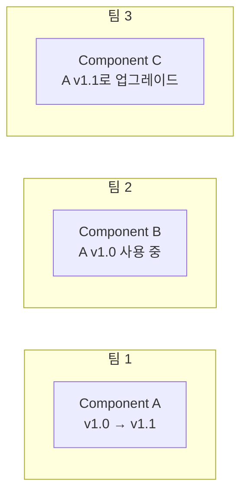
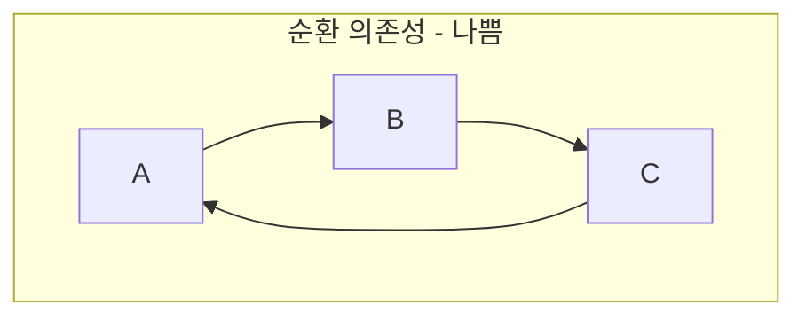
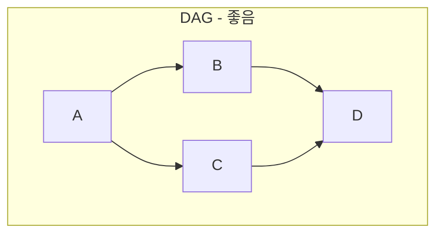
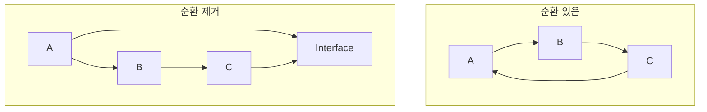
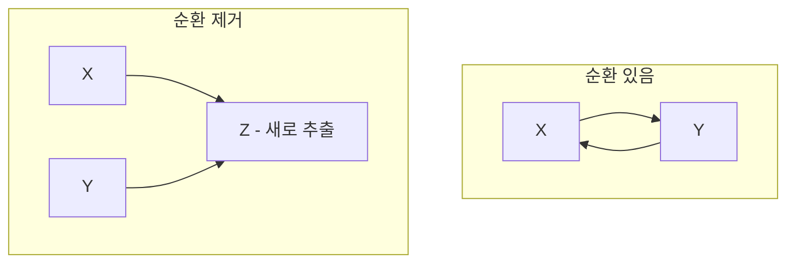
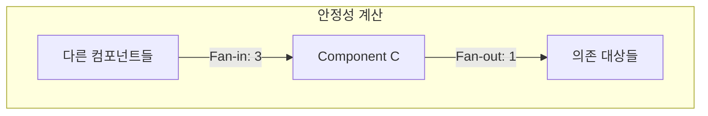
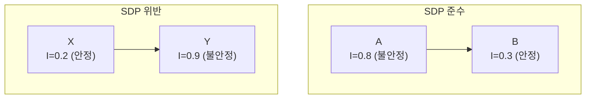
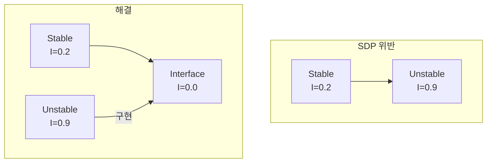
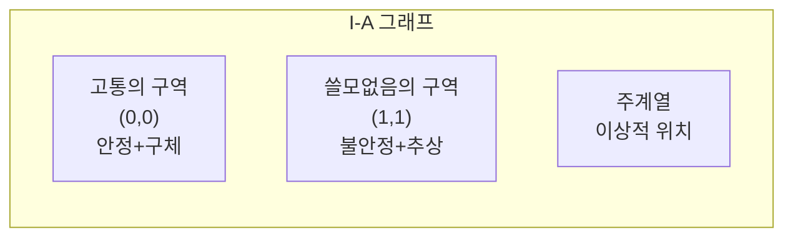
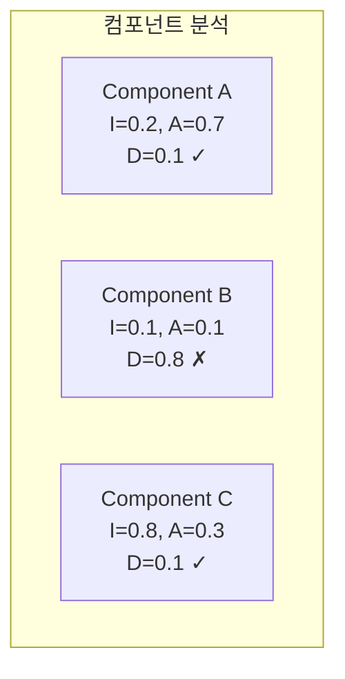

컴포넌트 응집도가 **무엇을 포함할 것인가**에 관한 것이라면, 컴포넌트 결합은 **컴포넌트 간 관계**에 관한 것이다. 이 장에서는 컴포넌트 의존성을 관리하는 세 가지 원칙을 다룬다.

## ADP: 비순환 의존성 원칙

> **"컴포넌트 의존성 그래프에 순환(Cycle)이 있으면 안 된다."**
> (Acyclic Dependencies Principle)

### 아침에 출근했더니 코드가 망가져 있다?

팀 개발에서 흔한 문제:

1. 당신이 무언가를 만들어 퇴근
2. 다음 날 출근했더니 **작동하지 않음**
3. 누군가 당신이 의존하는 코드를 변경함

이것을 "아침 증후군(Morning After Syndrome)"이라고 부른다.

### 해결책 1: 주간 빌드 (Weekly Build)

과거의 해결책:
- 주 4일은 각자 독립 개발
- 금요일에 전체 통합

문제:
- 통합이 갈수록 어려워짐
- 프로젝트가 커지면 금요일 하루로 부족

### 해결책 2: 릴리스 기반 개발

현대적 해결책:
- 각 컴포넌트를 **독립적으로 릴리스**
- 다른 팀은 **준비되면** 새 버전 사용



### 순환 의존성의 문제

이 방식이 작동하려면 **순환 의존성이 없어야** 한다.



순환이 있으면:
- A를 릴리스하려면 C가 필요
- C를 릴리스하려면 B가 필요
- B를 릴리스하려면 A가 필요
- **데드락!**

### DAG (방향성 비순환 그래프)

올바른 의존성 구조는 **DAG(Directed Acyclic Graph)**여야 한다:



### 순환 끊기

순환이 발생하면 두 가지 방법으로 끊는다:

#### 방법 1: 의존성 역전 (DIP)



인터페이스를 도입하여 의존성 방향 역전.

#### 방법 2: 새 컴포넌트 추출



공통 부분을 새 컴포넌트로 추출.

## SDP: 안정된 의존성 원칙

> **"더 안정된 쪽으로 의존하라."**
> (Stable Dependencies Principle)

### 안정성이란?

**안정성(Stability)**: 변경하기 어려운 정도

- **안정된 컴포넌트**: 많은 것이 의존 → 변경 어려움
- **불안정한 컴포넌트**: 의존하는 것이 적음 → 변경 쉬움

### 안정성 메트릭

```
불안정성(I) = Fan-out / (Fan-in + Fan-out)

Fan-in: 이 컴포넌트에 의존하는 외부 클래스 수
Fan-out: 이 컴포넌트가 의존하는 외부 클래스 수
```



- I = 1 / (3 + 1) = 0.25 (안정적)

| I 값 | 의미 |
|------|------|
| I = 0 | 최대 안정 (의존만 받음) |
| I = 1 | 최대 불안정 (의존만 함) |

### SDP 규칙

> **의존하는 컴포넌트의 I 값 ≤ 자신의 I 값**



안정된 컴포넌트가 불안정한 컴포넌트에 의존하면 **SDP 위반**.

### 위반 해결: DIP 적용



## SAP: 안정된 추상화 원칙

> **"안정된 컴포넌트는 추상적이어야 한다."**
> (Stable Abstractions Principle)

### 문제

안정된 컴포넌트(I=0)가 **구체적**이면?
- 변경하기 어려움 (안정적이니까)
- 확장도 어려움 (구체적이니까)
- **경직된 설계**

### 해결: 추상화

안정된 컴포넌트는 **추상 클래스와 인터페이스**로 구성:
- OCP 적용 가능
- 확장에 열림

### 추상화 메트릭

```
추상화 정도(A) = 추상 클래스 및 인터페이스 수 / 전체 클래스 수
```

| A 값 | 의미 |
|------|------|
| A = 0 | 전부 구체 클래스 |
| A = 1 | 전부 추상 클래스/인터페이스 |

### 주계열 (Main Sequence)

I(불안정성)과 A(추상화)를 축으로 그래프를 그린다:



```
A
1 |  쓸모없음의 구역
  |       ↘
  |         주계열
  |       ↗
0 |  고통의 구역
  +------------------
  0                 1  I
```

### 두 가지 위험 구역

#### 고통의 구역 (Zone of Pain)

- 위치: (I=0, A=0) 근처
- 안정적이면서 구체적
- 변경도 어렵고 확장도 어려움
- 예: 데이터베이스 스키마, 구체적 유틸리티

#### 쓸모없음의 구역 (Zone of Uselessness)

- 위치: (I=1, A=1) 근처
- 불안정하면서 추상적
- 아무도 의존하지 않는 추상화
- 쓸모없는 코드

### 이상적 위치: 주계열

**주계열(Main Sequence)**: (0,1)에서 (1,0)을 잇는 선

```
이상적: I + A = 1

예:
- (I=0, A=1): 안정+추상 → 좋음
- (I=1, A=0): 불안정+구체 → 좋음
- (I=0.5, A=0.5): 중간 → 좋음
```

### 주계열로부터의 거리

```
D = |A + I - 1|
```

- D = 0: 주계열 위에 있음 (이상적)
- D > 0: 주계열에서 벗어남 (재검토 필요)

## 종합: 컴포넌트 메트릭 분석



Component B는 고통의 구역에 있다 → 리팩토링 필요.

## 핵심 요약

| 원칙 | 내용 | 해결책 |
|------|------|--------|
| ADP | 순환 의존성 금지 | DIP, 새 컴포넌트 추출 |
| SDP | 안정된 쪽으로 의존 | DIP로 의존성 역전 |
| SAP | 안정된 것은 추상적 | 추상 클래스/인터페이스 |

| 메트릭 | 공식 | 의미 |
|--------|------|------|
| I | Fan-out / (Fan-in + Fan-out) | 불안정성 |
| A | 추상 / 전체 | 추상화 정도 |
| D | \|A + I - 1\| | 주계열 거리 |

> **"좋은 의존성 구조는 변경이 쉽고, 확장이 쉬우며, 순환이 없다."**
> — Robert C. Martin

## 다음 파트에서는

컴포넌트 원칙을 마치고, 다음 파트에서는 드디어 **아키텍처**를 다룬다. 지금까지 배운 모든 원칙이 어떻게 시스템 수준의 아키텍처로 통합되는지 살펴본다.
