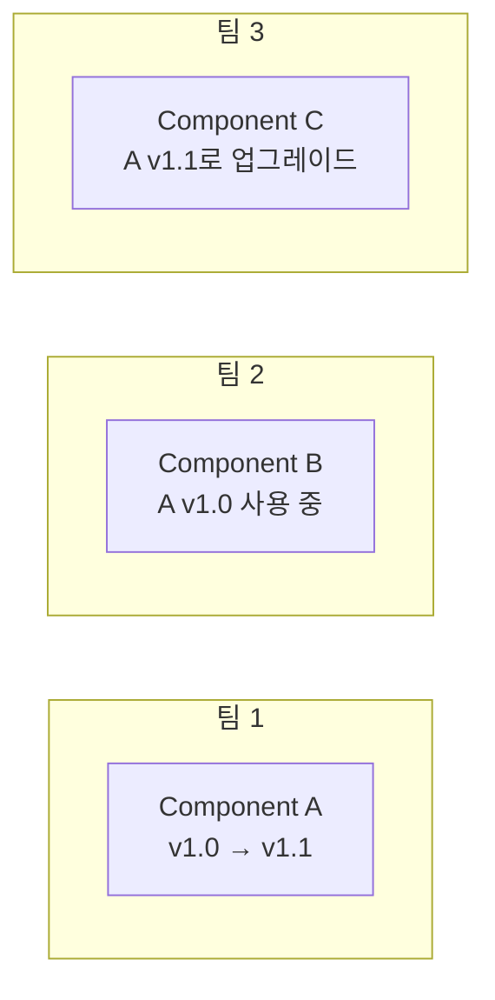
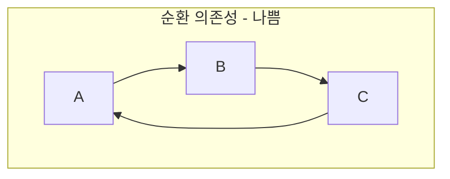
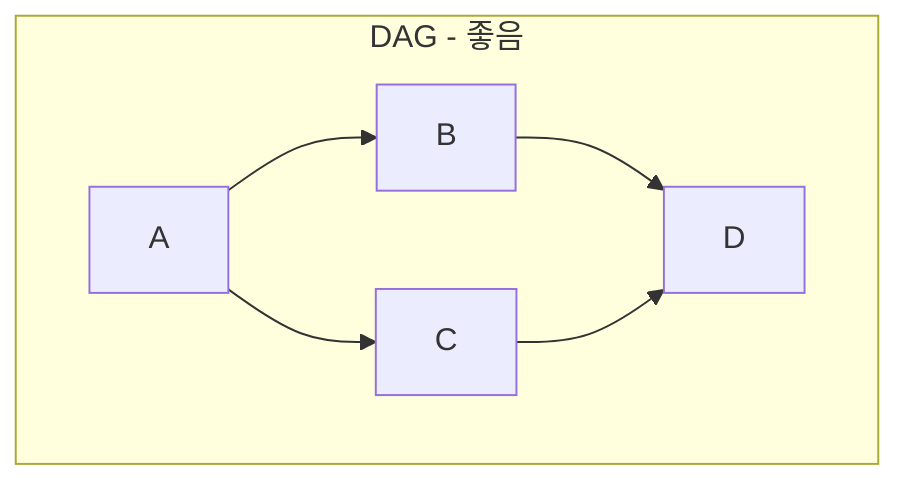
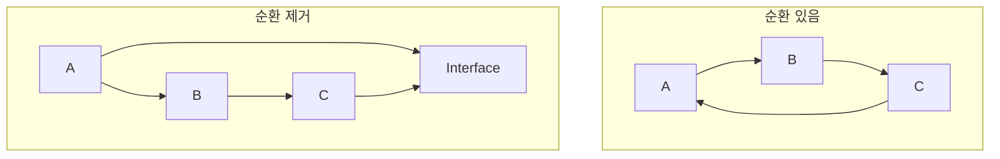
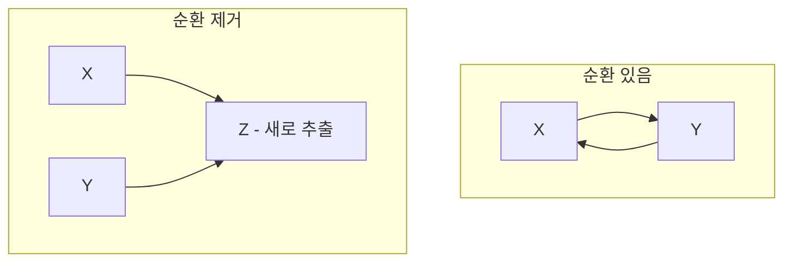
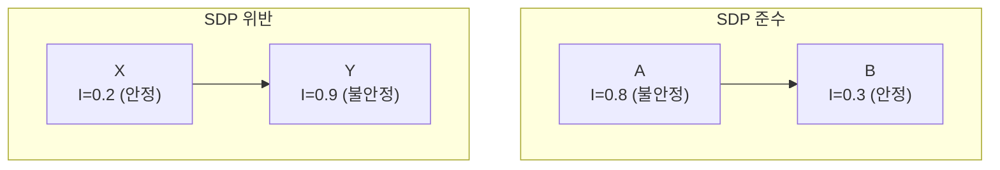
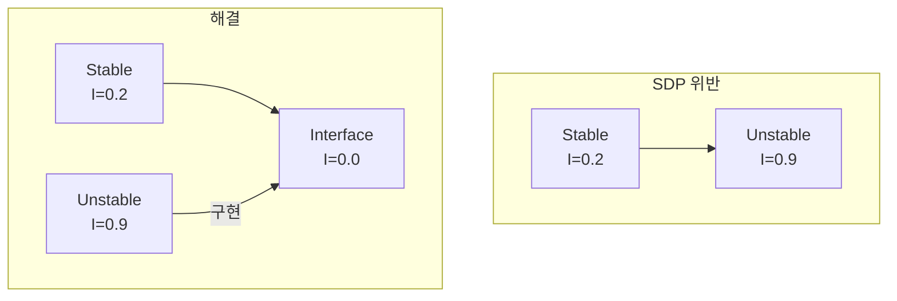
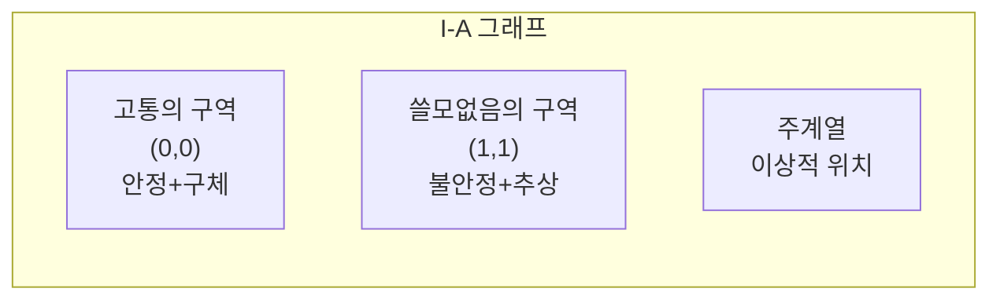
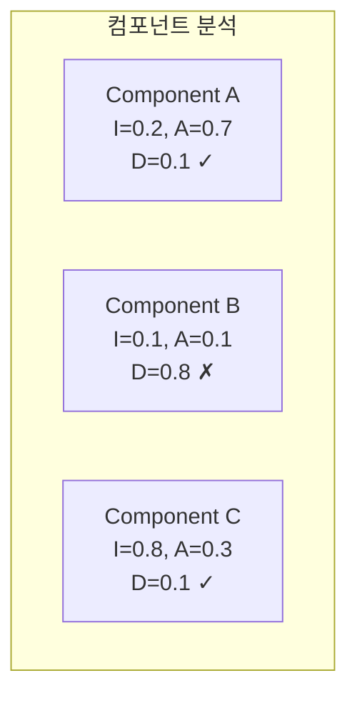

컴포넌트 응집도가 **무엇을 포함할 것인가**에 관한 것이라면, 컴포넌트 결합은 **컴포넌트 간 관계**에 관한 것이다. 이 장에서는 컴포넌트 의존성을 관리하는 세 가지 원칙을 다룬다.

## ADP: 비순환 의존성 원칙

> **"컴포넌트 의존성 그래프에 순환(Cycle)이 있으면 안 된다."**
> (Acyclic Dependencies Principle)

### 아침에 출근했더니 코드가 망가져 있다?

팀 개발에서 흔한 문제:

1. 당신이 무언가를 만들어 퇴근
2. 다음 날 출근했더니 **작동하지 않음**
3. 누군가 당신이 의존하는 코드를 변경함

이것을 "아침 증후군(Morning After Syndrome)"이라고 부른다.

### 해결책 1: 주간 빌드 (Weekly Build)

과거의 해결책:
- 주 4일은 각자 독립 개발
- 금요일에 전체 통합

문제:
- 통합이 갈수록 어려워짐
- 프로젝트가 커지면 금요일 하루로 부족

### 해결책 2: 릴리스 기반 개발

현대적 해결책:
- 각 컴포넌트를 **독립적으로 릴리스**
- 다른 팀은 **준비되면** 새 버전 사용


```mermaid
flowchart LR
    subgraph Team1 [팀 1]
        C1["Component A</br>v1.0 → v1.1"]
    end
    
    subgraph Team2 [팀 2]
        C2["Component B</br>A v1.0 사용 중"]
    end
    
    subgraph Team3 [팀 3]
        C3["Component C</br>A v1.1로 업그레이드"]
    end
```

### 순환 의존성의 문제

이 방식이 작동하려면 **순환 의존성이 없어야** 한다.


```mermaid
flowchart TB
    subgraph Bad [순환 의존성 - 나쁨]
        A1[A] --> B1[B]
        B1 --> C1[C]
        C1 --> A1
    end
```

순환이 있으면:
- A를 릴리스하려면 C가 필요
- C를 릴리스하려면 B가 필요
- B를 릴리스하려면 A가 필요
- **데드락!**

### DAG (방향성 비순환 그래프)

올바른 의존성 구조는 **DAG(Directed Acyclic Graph)**여야 한다:


```mermaid
flowchart TB
    subgraph Good [DAG - 좋음]
        A2[A]
        B2[B]
        C2[C]
        D2[D]
        
        A2 --> B2
        A2 --> C2
        B2 --> D2
        C2 --> D2
    end
```

### 순환 끊기

순환이 발생하면 두 가지 방법으로 끊는다:

#### 방법 1: 의존성 역전 (DIP)


```mermaid
flowchart TB
    subgraph Before [순환 있음]
        A3[A] --> B3[B]
        B3 --> C3[C]
        C3 --> A3
    end
    
    subgraph After [순환 제거]
        A4[A] --> B4[B]
        B4 --> C4[C]
        A4 --> I[Interface]
        C4 --> I
    end
```

`C`가 `A`를 직접 호출해야 하는 상황이라면, `A`가 구현할 인터페이스를 `C` 쪽(또는 둘 사이의 새 컴포넌트)에 정의하고 `A`가 그 인터페이스를 구현하게 한다. 그러면 `C → A`였던 화살표가 `A → Interface ← C`로 바뀌어, `C`는 더 이상 `A`에 직접 의존하지 않는다. DIP를 컴포넌트 단위로 적용한 것과 같다.

#### 방법 2: 새 컴포넌트 추출


```mermaid
flowchart TB
    subgraph Before2 [순환 있음]
        X1[X] --> Y1[Y]
        Y1 --> X1
    end
    
    subgraph After2 [순환 제거]
        X2[X]
        Y2[Y]
        Z2[Z - 새로 추출]
        
        X2 --> Z2
        Y2 --> Z2
    end
```

`X`와 `Y`가 서로를 필요로 하는 이유가 실제로는 둘 다 의존하는 공통 로직 때문인 경우가 많다. 그 공통 부분을 `Z`라는 새 컴포넌트로 뽑아내면, `X`와 `Y`는 서로가 아니라 `Z`에만 의존하게 되어 순환이 사라진다. 다만 이 방법은 컴포넌트 수를 늘리므로, 인터페이스 도입만으로 충분한 경우에는 방법 1을 먼저 고려하는 것이 낫다.

## SDP: 안정된 의존성 원칙

> **"더 안정된 쪽으로 의존하라."**
> (Stable Dependencies Principle)

### 안정성이란?

**안정성(Stability)**: 변경하기 어려운 정도. 여기서 "어렵다"는 것은 코드를 고치는 기술적 난이도가 아니라, 그 변경이 얼마나 많은 다른 컴포넌트에 영향을 미치는가를 뜻한다.

- **안정된 컴포넌트**: 많은 것이 의존 → 변경 어려움 — 하나를 바꾸면 의존하는 모든 곳을 함께 고쳐야 한다
- **불안정한 컴포넌트**: 의존하는 것이 적음 → 변경 쉬움 — 바꿔도 영향받는 곳이 적다

### 안정성 메트릭

이 직관을 수치화한 것이 불안정성(I) 메트릭이다. 이 컴포넌트에 의존하는 쪽(Fan-in)이 많을수록 안정적이고, 이 컴포넌트가 다른 곳에 의존하는 쪽(Fan-out)이 많을수록 불안정하다.

```text
불안정성(I) = Fan-out / (Fan-in + Fan-out)

Fan-in: 이 컴포넌트에 의존하는 외부 클래스 수
Fan-out: 이 컴포넌트가 의존하는 외부 클래스 수
```


```mermaid
flowchart TB
    subgraph Example [안정성 계산]
        X[다른 컴포넌트들]
        C[Component C]
        Y[의존 대상들]
        
        X -->|"Fan-in: 3"| C
        C -->|"Fan-out: 1"| Y
    end
```

- I = 1 / (3 + 1) = 0.25 (안정적)

| I 값 | 의미 |
|------|------|
| I = 0 | 최대 안정 (의존만 받음) |
| I = 1 | 최대 불안정 (의존만 함) |

### SDP 규칙

> **의존하는 컴포넌트의 I 값 ≤ 자신의 I 값**


```mermaid
flowchart TB
    subgraph Good [SDP 준수]
        A["A</br>I=0.8 (불안정)"]
        B["B</br>I=0.3 (안정)"]
        A --> B
    end
    
    subgraph Bad [SDP 위반]
        X["X</br>I=0.2 (안정)"]
        Y["Y</br>I=0.9 (불안정)"]
        X --> Y
    end
```

안정된 컴포넌트가 불안정한 컴포넌트에 의존하면 **SDP 위반**.

### 위반 해결: DIP 적용


```mermaid
flowchart TB
    subgraph Before [SDP 위반]
        Stable1["Stable</br>I=0.2"]
        Unstable1["Unstable</br>I=0.9"]
        Stable1 --> Unstable1
    end
    
    subgraph After [해결]
        Stable2["Stable</br>I=0.2"]
        Interface["Interface</br>I=0.0"]
        Unstable2["Unstable</br>I=0.9"]
        
        Stable2 --> Interface
        Unstable2 -->|구현| Interface
    end
```

`Stable`이 `Unstable`을 직접 참조하던 것을, `Stable`이 정의하는 `Interface`를 `Unstable`이 구현하는 구조로 바꾸면 화살표 방향이 뒤집힌다. `Interface`는 `Stable` 안에 속하므로 I=0에 가깝게 유지되고, `Stable`은 이제 안정된 것(자신이 정의한 인터페이스)에만 의존한다 — 겉보기엔 여전히 두 컴포넌트가 연결되어 있지만, 소스 코드 의존성의 방향은 SDP를 만족하도록 바뀐 것이다.

## SAP: 안정된 추상화 원칙

> **"안정된 컴포넌트는 추상적이어야 한다."**
> (Stable Abstractions Principle)

### 문제

SDP는 "안정된 쪽으로 의존하라"고 말하지만, 안정성만으로는 충분하지 않다. 안정된 컴포넌트(I=0)가 **구체적**이면 오히려 시스템 전체가 굳어버린다.
- 변경하기 어려움 (안정적이니까) — 많은 컴포넌트가 의존하므로 함부로 바꿀 수 없다
- 확장도 어려움 (구체적이니까) — 구체 클래스는 상속·재정의로 확장하는 비용이 인터페이스보다 크다
- **경직된 설계** — 가장 많이 의존받는 부분이 가장 바꾸기 어렵고, 가장 확장하기도 어려운 이중고에 빠진다

### 해결: 추상화

안정된 컴포넌트는 **추상 클래스와 인터페이스**로 구성해야 이 이중고를 피할 수 있다. 안정성 자체는 유지하되(많은 것이 의존해도 괜찮다), 그 안정된 것을 추상화로 만들면:
- OCP 적용 가능 — 새 구현을 추가해도 안정된 인터페이스 자체는 수정할 필요가 없다
- 확장에 열림 — 안정성과 확장 가능성을 동시에 만족한다

### 추상화 메트릭

```text
추상화 정도(A) = 추상 클래스 및 인터페이스 수 / 전체 클래스 수
```

| A 값 | 의미 |
|------|------|
| A = 0 | 전부 구체 클래스 |
| A = 1 | 전부 추상 클래스/인터페이스 |

### 주계열 (Main Sequence)

I(불안정성)과 A(추상화)를 축으로 그래프를 그린다:


```mermaid
flowchart TB
    subgraph Graph [I-A 그래프]
        direction TB
        ZP["고통의 구역</br>(0,0)</br>안정+구체"]
        ZU["쓸모없음의 구역</br>(1,1)</br>불안정+추상"]
        MS["주계열</br>이상적 위치"]
    end
```

```text
A
1 |  쓸모없음의 구역
  |       ↘
  |         주계열
  |       ↗
0 |  고통의 구역
  +------------------
  0                 1  I
```

### 두 가지 위험 구역

#### 고통의 구역 (Zone of Pain)

- 위치: (I=0, A=0) 근처
- 안정적이면서 구체적
- 변경도 어렵고 확장도 어려움
- 예: 데이터베이스 스키마, 구체적 유틸리티

#### 쓸모없음의 구역 (Zone of Uselessness)

- 위치: (I=1, A=1) 근처
- 불안정하면서 추상적
- 아무도 의존하지 않는 추상화
- 쓸모없는 코드

### 이상적 위치: 주계열

**주계열(Main Sequence)**: (0,1)에서 (1,0)을 잇는 선

```text
이상적: I + A = 1

예:
- (I=0, A=1): 안정+추상 → 좋음
- (I=1, A=0): 불안정+구체 → 좋음
- (I=0.5, A=0.5): 중간 → 좋음
```

### 주계열로부터의 거리

```text
D = |A + I - 1|
```

- D = 0: 주계열 위에 있음 (이상적)
- D > 0: 주계열에서 벗어남 (재검토 필요)

## 종합: 컴포넌트 메트릭 분석


```mermaid
flowchart TB
    subgraph Analysis [컴포넌트 분석]
        C1["Component A</br>I=0.2, A=0.7</br>D=0.1 ✓"]
        C2["Component B</br>I=0.1, A=0.1</br>D=0.8 ✗"]
        C3["Component C</br>I=0.8, A=0.3</br>D=0.1 ✓"]
    end
```

Component B는 고통의 구역에 있다 → 리팩토링 필요.

## 흔한 오해

I(불안정성)와 A(추상화) 메트릭을 "이 값만 계산하면 설계 품질이 자동으로 나온다"는 정량적 정답으로 오해하기 쉽다. 그러나 이 메트릭들은 판단을 대신해주는 공식이 아니라, 어디를 더 살펴봐야 할지 알려주는 신호에 가깝다. D 값이 0.8이라고 해서 반드시 리팩토링해야 하는 것은 아니다 — 예를 들어 데이터베이스 스키마처럼 태생적으로 고통의 구역(안정+구체)에 속할 수밖에 없는 컴포넌트도 있다. 또 다른 오해는 SDP를 "항상 안정된 컴포넌트에 의존해야 한다"로 오해하는 것이다. 실제로는 반대 방향도 정상이다 — 불안정한 컴포넌트(예: Main)가 안정된 컴포넌트에 의존하는 것은 SDP를 따르는 것이고, 문제가 되는 것은 안정된 컴포넌트가 불안정한 것에 의존하는 경우뿐이다.

## 학습 목표

이 장을 읽은 후 다음을 스스로 점검한다.

- 순환 의존성이 왜 릴리스 기반 개발을 데드락에 빠뜨리는지 설명할 수 있는가?
- 순환을 끊는 두 가지 방법(의존성 역전, 새 컴포넌트 추출)의 차이와 각각을 언제 선택해야 하는지 설명할 수 있는가?
- 불안정성(I)과 추상화(A) 메트릭을 Fan-in/Fan-out으로부터 직접 계산할 수 있는가?
- 고통의 구역과 쓸모없음의 구역이 각각 왜 나쁜 설계 신호인지 설명할 수 있는가?
- 주계열(Main Sequence)과 거리(D) 값이 무엇을 의미하는지, 그리고 D 값이 크다고 해서 항상 리팩토링이 필요한 것은 아닌 이유를 설명할 수 있는가?

## 판단 기준

컴포넌트 간 의존성을 설계·검토할 때 다음을 확인한다.

- 이 컴포넌트들의 의존성 그래프를 그렸을 때 순환이 존재하는가?
- 이 컴포넌트가 자신보다 불안정한(I 값이 큰) 컴포넌트에 의존하고 있는가?
- 안정적인(I 값이 작은) 컴포넌트가 구체 클래스 위주로 구성되어 있는가, 추상화 위주로 구성되어 있는가?
- D 값이 주계열에서 크게 벗어난 컴포넌트가 있다면, 그것이 실제 설계 문제인지 아니면 태생적으로 불가피한 경우(예: 데이터베이스 스키마)인지 구분했는가?

## 참고 자료

- Robert C. Martin, 『Clean Architecture』, 2017, 14장 — ADP·SDP·SAP 원칙과 I/A/D 메트릭의 원 출처.

## 핵심 요약

| 원칙 | 내용 | 해결책 |
|------|------|--------|
| ADP | 순환 의존성 금지 | DIP, 새 컴포넌트 추출 |
| SDP | 안정된 쪽으로 의존 | DIP로 의존성 역전 |
| SAP | 안정된 것은 추상적 | 추상 클래스/인터페이스 |

| 메트릭 | 공식 | 의미 |
|--------|------|------|
| I | Fan-out / (Fan-in + Fan-out) | 불안정성 |
| A | 추상 / 전체 | 추상화 정도 |
| D | \|A + I - 1\| | 주계열 거리 |

마틴은 좋은 의존성 구조가 변경이 쉽고, 확장이 쉬우며, 순환이 없는 구조라고 요약한다(Martin, 『Clean Architecture』, 2017, 14장).

## 다음 파트에서는

컴포넌트 원칙을 마치고, 다음 파트에서는 드디어 **아키텍처**를 다룬다. 지금까지 배운 모든 원칙이 어떻게 시스템 수준의 아키텍처로 통합되는지 살펴본다.
