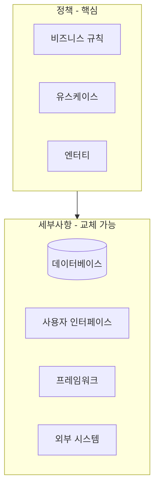
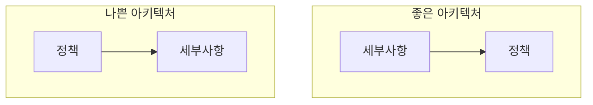
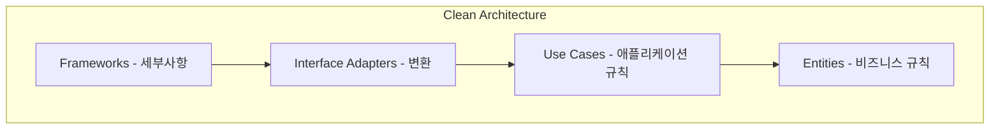

지금까지 프로그래밍 패러다임, SOLID 원칙, 컴포넌트 원칙을 살펴보았다. 이제 이 모든 것을 통합하는 **아키텍처**를 다룰 차례다. 아키텍처란 무엇이고, 좋은 아키텍처는 어떤 특성을 가지는가?

## 아키텍처란?

> **"소프트웨어 아키텍처란 소프트웨어 시스템의 형태를 결정하는 것이다."**

아키텍처는 시스템을 **컴포넌트로 분할**하고, 컴포넌트를 **배치**하고, 컴포넌트 간의 **통신 방식**을 정의한다.

### 아키텍트의 역할

마틴은 아키텍트가 **프로그래머**여야 한다고 강조한다:

> "소프트웨어 아키텍트는 최고의 프로그래머이며, 계속 프로그래밍 작업을 해야 한다."

아키텍트가 프로그래밍을 멈추면:
- 팀이 겪는 문제를 모름
- 현실과 동떨어진 설계
- 개발자의 신뢰 상실

## 좋은 아키텍처의 목표

### 개발 용이성

아키텍처는 **개발 팀을 지원**해야 한다:

- 소규모 팀: 모놀리식도 가능
- 대규모 팀: 컴포넌트 분리 필요
- 여러 팀: 독립적으로 개발 가능해야 함

### 배포 용이성

> "좋은 아키텍처는 시스템을 단일 액션으로 배포할 수 있게 한다."

나쁜 아키텍처:
- 수십 개의 작은 컴포넌트를 각각 배포
- 복잡한 연결과 순서
- 배포마다 문제 발생

### 운영 용이성

아키텍처는 시스템의 **운영 요구사항**을 드러내야 한다:

- 시스템이 무엇을 하는지 명확
- 유스케이스가 구조에 반영됨
- 확장과 축소가 용이

### 유지보수 용이성

유지보수는 소프트웨어 비용의 **대부분**을 차지한다:

- 새 기능 추가
- 버그 수정
- 요구사항 변경

좋은 아키텍처는 **변경의 영향**을 최소화한다.

## 선택지를 열어두기

### 결정 지연

> "좋은 아키텍처는 결정을 지연시킬 수 있게 해준다."

어떤 결정을 지연시킬 수 있어야 하나?

- 데이터베이스 선택: MySQL? PostgreSQL? MongoDB?
- 웹 프레임워크 선택: Spring? Django? Express?
- UI 기술: Web? Mobile? Desktop?

이런 결정을 **가능한 늦게** 내릴수록 더 많은 정보를 바탕으로 결정할 수 있다.

### 정책과 세부사항

마틴은 시스템을 **정책(Policy)**과 **세부사항(Details)**으로 나눈다:

| 구분 | 정책 | 세부사항 |
|------|------|----------|
| 정의 | 비즈니스 규칙 | 기술적 구현 |
| 변경 빈도 | 낮음 | 높음 |
| 의존성 | 없음 | 정책에 의존 |
| 예시 | 주문 처리 규칙 | MySQL, React |

### 정책과 세부사항의 분리

좋은 아키텍처는 **정책이 세부사항에 의존하지 않게** 만든다:

정책이 세부사항에 의존하면:
- DB 변경 시 정책도 변경
- 테스트에 DB 필요
- 프레임워크에 갇힘

## Clean Architecture 미리보기

앞으로 다룰 내용:

핵심 원칙: **의존성은 안쪽으로만**

## 이 파트에서 다룰 내용

| 장 | 제목 | 내용 |
|---|------|------|
| 15 | 아키텍처란? | 아키텍처의 정의와 목표 |
| 16 | 독립성 | 유스케이스, 운영, 개발, 배포의 독립성 |
| 17 | 경계: 선 긋기 | 컴포넌트 간 경계 |
| 18 | 경계 해부학 | 경계의 구현 방식 |
| 19 | 정책과 수준 | 고수준/저수준 정책 |
| 20 | 업무 규칙 | 엔터티와 유스케이스 |
| 21 | 소리치는 아키텍처 | 의도를 드러내는 구조 |
| 22 | 클린 아키텍처 | 동심원 구조의 핵심 |
| 23-29 | 세부 주제 | 경계, 테스트, 서비스 등 |

## 핵심 요약

| 항목 | 내용 |
|------|------|
| 아키텍처 | 시스템의 형태를 결정 |
| 목표 | 개발, 배포, 운영, 유지보수 용이성 |
| 핵심 | 선택지를 열어두기 (결정 지연) |
| 분리 | 정책(핵심)과 세부사항(교체 가능) |

> **"아키텍처의 목적은 시스템의 생명주기를 지원하는 것이다. 좋은 아키텍처는 시스템을 쉽게 이해하고, 쉽게 개발하고, 쉽게 유지보수하고, 쉽게 배포하게 해준다."**
> — Robert C. Martin
