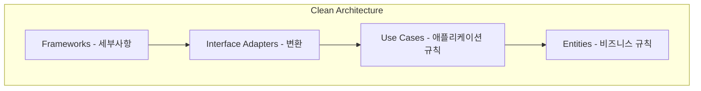

지금까지 프로그래밍 패러다임, SOLID 원칙, 컴포넌트 원칙을 살펴보았다. 이 세 가지는 모두 클래스나 컴포넌트처럼 비교적 작은 단위를 다뤘다. 이제 이 모든 것을 통합해 **시스템 전체의 구조**를 결정하는 **아키텍처**를 다룰 차례다.

## 아키텍처란?

> **"소프트웨어 아키텍처란 소프트웨어 시스템의 형태를 결정하는 것이다."**

아키텍처는 시스템을 **컴포넌트로 분할**하고, 컴포넌트를 **배치**하고, 컴포넌트 간의 **통신 방식**을 정의한다. 좋은 아키텍처는 개발·배포·운영·유지보수라는 시스템 생명주기 전반을 지원해야 하며, 데이터베이스나 프레임워크 같은 세부사항을 핵심 비즈니스 정책으로부터 분리해 결정을 최대한 늦출 수 있게 만든다. 아키텍처의 정의, 아키텍트의 역할, 생명주기 네 가지 목표, 정책과 세부사항의 분리는 25장(아키텍처란?)에서 구체적인 예제와 함께 자세히 다룬다.

## 왜 컴포넌트 원칙만으로는 부족한가

SOLID는 클래스 내부의 결합도·응집도를 다뤘고, 컴포넌트 원칙(REP·CCP·CRP·ADP·SDP·SAP)은 클래스를 묶은 컴포넌트 사이의 결합도·응집도를 다뤘다. 두 수준 모두 지켰다고 해서 시스템 전체가 저절로 좋은 구조를 갖추는 것은 아니다. 컴포넌트 원칙은 "이 컴포넌트와 저 컴포넌트가 서로 어떻게 의존해야 하는가"까지는 답하지만, "시스템을 몇 개의 큰 영역으로 나눌 것인가"·"어디까지가 비즈니스 정책이고 어디부터가 교체 가능한 세부사항인가" 같은 더 높은 층위의 질문에는 답하지 않는다. 이 상위 질문에 답하는 것이 아키텍처다.

이 관계는 추상화 수준의 문제이기도 하다. 클래스 하나의 인터페이스 설계(추상화)는 SOLID의 ISP·DIP가, 컴포넌트 하나의 안정성과 추상화 균형은 컴포넌트 원칙의 SAP가 다룬다. 아키텍처는 이 추상화를 시스템 전체 규모로 확장해, "가장 안정적이고 변경되지 않아야 할 것(업무 규칙)"과 "가장 자주 바뀌는 것(UI, 데이터베이스, 프레임워크)"을 시스템 수준에서 분리하는 문제를 다룬다. 좋은 모범 사례를 따르는 클래스·컴포넌트들도, 이 상위 분리가 없으면 결국 하나의 거대하고 결합된 시스템으로 굳어버릴 수 있다.

## Clean Architecture 미리보기

앞으로 다룰 내용:

```mermaid
flowchart TB
    subgraph Preview [Clean Architecture]
        E[Entities - 비즈니스 규칙]
        U[Use Cases - 애플리케이션 규칙]
        I[Interface Adapters - 변환]
        F[Frameworks - 세부사항]
    end
    
    F --> I --> U --> E
```

핵심 원칙: **의존성은 안쪽으로만**

## 이 파트에서 다룰 내용

이 파트는 크게 세 흐름으로 이어진다. 먼저 25~29장은 아키텍처의 기본 개념(정의, 독립성, 경계, 정책 수준)을 다지고, 30~32장은 그 개념을 Clean Architecture라는 구체적인 구조(업무 규칙, 소리치는 아키텍처, 동심원)로 완성하며, 33~39장은 실전에서 부딪히는 세부 주제(테스트 용이성, 부분적 경계, 서비스 분리, 임베디드 하드웨어)를 다룬다.

| 장 | 제목 | 내용 |
|---|------|------|
| 25 | 아키텍처란? | 아키텍처의 정의와 생명주기 목표 |
| 26 | 독립성 | 유스케이스, 운영, 개발, 배포의 독립성 |
| 27 | 경계: 선 긋기 | 플러그인 아키텍처와 경계 긋기 |
| 28 | 경계 해부학 | 모놀리스에서 서비스까지 경계의 구현 방식 |
| 29 | 정책과 수준 | 고수준/저수준 정책과 의존성 방향 |
| 30 | 업무 규칙 | 엔티티와 유스케이스 |
| 31 | 소리치는 아키텍처 | 의도를 드러내는 구조 |
| 32 | 클린 아키텍처 | 동심원과 의존성 규칙 |
| 33 | 프레젠터와 험블 객체 | UI 로직의 테스트 용이성 확보 |
| 34 | 부분적 경계 | 완전한 경계 구현의 비용과 절충안 |
| 35 | 레이어와 경계 | 여러 경계를 실전에서 설정하는 방법 |
| 36 | 메인 컴포넌트 | 모든 구체 클래스를 조립하는 최저 수준 정책 |
| 37 | 서비스와 마이크로서비스 | 서비스 분리가 곧 아키텍처 경계는 아니라는 것 |
| 38 | 테스트 경계 | 테스트 코드도 시스템 설계의 일부라는 관점 |
| 39 | 클린 임베디드 아키텍처 | 하드웨어와 소프트웨어의 경계 분리 |

각 장은 독립적으로 읽을 수 있지만, 뒤로 갈수록 앞 장에서 정의한 개념(정책과 세부사항의 분리, 의존성 규칙)을 전제로 삼는다. 예를 들어 33장의 험블 객체 패턴은 29장의 "정책과 수준" 개념을 UI 계층에 적용한 사례이고, 37장의 서비스 경계 논의는 27장의 "경계 선 긋기" 개념을 마이크로서비스라는 배포 기술에 적용한 것이다.

## 학습 목표

이 장을 읽은 후 다음을 스스로 점검한다.

- 아키텍처가 클래스·컴포넌트 수준의 원칙과 어떻게 다른 층위의 문제인지 설명할 수 있는가?
- Clean Architecture의 동심원 4계층(Entities, Use Cases, Interface Adapters, Frameworks)과 "의존성은 안쪽으로만"이라는 핵심 규칙을 설명할 수 있는가?
- 이 파트(25~39장)가 다룰 주제들이 서로 어떻게 이어지는지, 전체 흐름을 대략적으로 그릴 수 있는가?

## 참고 자료

- Robert C. Martin, 『Clean Architecture』, 2017, Part V(15~22장) — 아키텍처 전반과 Clean Architecture 동심원 구조의 원 출처.

## 핵심 요약

| 항목 | 내용 |
|------|------|
| 아키텍처 | 시스템의 형태를 결정 |
| 목표 | 개발, 배포, 운영, 유지보수 용이성 (25장에서 심화) |
| 핵심 구조 | Entities → Use Cases → Interface Adapters → Frameworks, 의존성은 안쪽으로만 |
| 이 파트의 범위 | 25~39장에 걸쳐 아키텍처 원칙과 Clean Architecture를 다룸 |

마틴은 아키텍처의 목적이 시스템의 생명주기를 지원하는 것이라고 말한다. 좋은 아키텍처는 시스템을 쉽게 이해하고, 쉽게 개발하고, 쉽게 유지보수하고, 쉽게 배포하게 해준다(Martin, 『Clean Architecture』, 2017).
