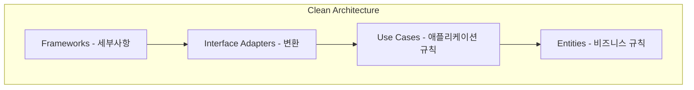

지금까지 프로그래밍 패러다임, SOLID 원칙, 컴포넌트 원칙을 살펴보았다. 이 세 가지는 모두 클래스나 컴포넌트처럼 비교적 작은 단위를 다뤘다. 이제 이 모든 것을 통합해 **시스템 전체의 구조**를 결정하는 **아키텍처**를 다룰 차례다.

## 아키텍처란?

> **"소프트웨어 아키텍처란 소프트웨어 시스템의 형태를 결정하는 것이다."**
> — Robert C. Martin

아키텍처는 시스템을 **컴포넌트로 분할**하고, 컴포넌트를 **배치**하고, 컴포넌트 간의 **통신 방식**을 정의한다. 좋은 아키텍처는 개발·배포·운영·유지보수라는 시스템 생명주기 전반을 지원해야 하며, 데이터베이스나 프레임워크 같은 세부사항을 핵심 비즈니스 정책으로부터 분리해 결정을 최대한 늦출 수 있게 만든다. 아키텍처의 정의, 아키텍트의 역할, 생명주기 네 가지 목표, 정책과 세부사항의 분리는 25장(아키텍처란?)에서 구체적인 예제와 함께 자세히 다룬다.

## 왜 컴포넌트 원칙만으로는 부족한가

SOLID는 클래스 내부의 결합도·응집도를 다뤘고, 컴포넌트 원칙(REP·CCP·CRP·ADP·SDP·SAP)은 클래스를 묶은 컴포넌트 사이의 결합도·응집도를 다뤘다. 두 수준 모두 지켰다고 해서 시스템 전체가 저절로 좋은 구조를 갖추는 것은 아니다. 컴포넌트 원칙은 "이 컴포넌트와 저 컴포넌트가 서로 어떻게 의존해야 하는가"까지는 답하지만, "시스템을 몇 개의 큰 영역으로 나눌 것인가"·"어디까지가 비즈니스 정책이고 어디부터가 교체 가능한 세부사항인가" 같은 더 높은 층위의 질문에는 답하지 않는다. 이 상위 질문에 답하는 것이 아키텍처다.

이 관계는 추상화 수준의 문제이기도 하다. 클래스 하나의 인터페이스 설계(추상화)는 SOLID의 ISP·DIP가, 컴포넌트 하나의 안정성과 추상화 균형은 컴포넌트 원칙의 SAP가 다룬다. 아키텍처는 이 추상화를 시스템 전체 규모로 확장해, "가장 안정적이고 변경되지 않아야 할 것(업무 규칙)"과 "가장 자주 바뀌는 것(UI, 데이터베이스, 프레임워크)"을 시스템 수준에서 분리하는 문제를 다룬다. 좋은 모범 사례를 따르는 클래스·컴포넌트들도, 이 상위 분리가 없으면 결국 하나의 거대하고 결합된 시스템으로 굳어버릴 수 있다.

## Clean Architecture 미리보기

앞으로 다룰 내용:

```mermaid
flowchart TB
    subgraph Preview [Clean Architecture]
        E[Entities - 비즈니스 규칙]
        U[Use Cases - 애플리케이션 규칙]
        I[Interface Adapters - 변환]
        F[Frameworks - 세부사항]
    end
    
    F --> I --> U --> E
```

동심원의 가장 안쪽 **Entities**는 특정 애플리케이션과 무관하게 성립하는 핵심 업무 규칙을 담는다(30장에서 자세히 다룬다). 그 바깥 **Use Cases**는 이 애플리케이션에서만 의미 있는 절차적 규칙(예: "주문을 생성한다")을 담아 Entities를 조율한다. **Interface Adapters**는 Use Cases가 사용하는 형식(순수 객체)과 바깥 세계가 사용하는 형식(HTTP 요청, DB 레코드) 사이를 변환하는 계층이다. 가장 바깥 **Frameworks**는 웹 프레임워크·데이터베이스·UI 툴킷처럼 가장 자주 바뀌는 세부사항이다. 핵심 원칙은 **의존성은 안쪽으로만** 향한다는 것이다 — 바깥 원이 안쪽 원을 알 수는 있어도, 안쪽 원은 바깥 원의 존재를 몰라야 한다.

## 이 파트에서 다룰 내용

이 파트는 크게 세 흐름으로 이어진다. 먼저 25~29장은 아키텍처의 기본 개념(정의, 독립성, 경계, 정책 수준)을 다지고, 30~32장은 그 개념을 Clean Architecture라는 구체적인 구조(업무 규칙, 소리치는 아키텍처, 동심원)로 완성하며, 33~39장은 실전에서 부딪히는 세부 주제(테스트 용이성, 부분적 경계, 서비스 분리, 임베디드 하드웨어)를 다룬다.

| 장 | 제목 | 내용 |
|---|------|------|
| 25 | 아키텍처란? | 아키텍처의 정의와 생명주기 목표 |
| 26 | 독립성 | 유스케이스, 운영, 개발, 배포의 독립성 |
| 27 | 경계: 선 긋기 | 플러그인 아키텍처와 경계 긋기 |
| 28 | 경계 해부학 | 모놀리스에서 서비스까지 경계의 구현 방식 |
| 29 | 정책과 수준 | 고수준/저수준 정책과 의존성 방향 |
| 30 | 업무 규칙 | 엔티티와 유스케이스 |
| 31 | 소리치는 아키텍처 | 의도를 드러내는 구조 |
| 32 | 클린 아키텍처 | 동심원과 의존성 규칙 |
| 33 | 프레젠터와 험블 객체 | UI 로직의 테스트 용이성 확보 |
| 34 | 부분적 경계 | 완전한 경계 구현의 비용과 절충안 |
| 35 | 레이어와 경계 | 여러 경계를 실전에서 설정하는 방법 |
| 36 | 메인 컴포넌트 | 모든 구체 클래스를 조립하는 최저 수준 정책 |
| 37 | 서비스와 마이크로서비스 | 서비스 분리가 곧 아키텍처 경계는 아니라는 것 |
| 38 | 테스트 경계 | 테스트 코드도 시스템 설계의 일부라는 관점 |
| 39 | 클린 임베디드 아키텍처 | 하드웨어와 소프트웨어의 경계 분리 |

각 장은 독립적으로 읽을 수 있지만, 뒤로 갈수록 앞 장에서 정의한 개념(정책과 세부사항의 분리, 의존성 규칙)을 전제로 삼는다. 예를 들어 33장의 험블 객체 패턴은 29장의 "정책과 수준" 개념을 UI 계층에 적용한 사례이고, 37장의 서비스 경계 논의는 27장의 "경계 선 긋기" 개념을 마이크로서비스라는 배포 기술에 적용한 것이다.

## 흔한 오해

"SOLID와 컴포넌트 원칙을 다 지켰으니 아키텍처는 저절로 좋아질 것"이라는 생각이 흔한 오해다. 앞서 설명했듯 이 두 수준의 원칙은 클래스·컴포넌트 각각의 결합도·응집도만 다룰 뿐, 시스템을 몇 개의 큰 영역으로 나누고 어디에 정책과 세부사항의 경계를 그을지는 답하지 않는다. 반대로 "아키텍처를 먼저 완벽하게 설계한 다음에 코드를 짜야 한다"는 것도 오해다. 25장에서 다루듯 좋은 아키텍처의 핵심은 오히려 결정을 지연시켜 선택지를 열어두는 것이며, Clean Architecture의 동심원도 처음부터 4계층을 전부 완성해야 하는 청사진이 아니라 "무엇이 안정적이고 무엇이 자주 바뀌는가"를 판단하는 사고 도구에 가깝다.

## 판단 기준

이 파트를 읽는 순서를 정할 때 다음을 참고한다.

- 아키텍처 개념 자체가 생소하다면 25~32장을 순서대로 읽는다. 뒤 장이 앞 장의 개념(정책과 세부사항, 경계, 동심원)을 전제로 삼기 때문이다.
- 이미 Clean Architecture의 기본 구조를 알고 특정 실전 문제(테스트하기 어려운 UI, 서비스 분리 시점, 임베디드 환경)를 안고 있다면, 33~39장 중 해당 주제로 바로 건너뛰어도 된다.
- 지금 다루는 시스템이 아직 작고 요구사항이 불확실하다면, 26장(독립성)의 "모놀리스로 시작해 필요할 때 분리하라"는 조언과 34장(부분적 경계)의 절충안을 먼저 참고하는 것이 실용적이다.

## 학습 목표

이 장을 읽은 후 다음을 스스로 점검한다.

- 동심원 4계층(Entities, Use Cases, Interface Adapters, Frameworks)의 이름과 각 계층의 책임을 나열할 수 있는가?
- SOLID·컴포넌트 원칙이 왜 "시스템을 몇 개의 큰 영역으로 나눌 것인가"라는 질문에는 답하지 못하는지 설명할 수 있는가?
- "SOLID·컴포넌트 원칙을 지키면 아키텍처는 저절로 좋아진다"는 오해와 "아키텍처를 먼저 완벽히 설계해야 한다"는 오해가 각각 왜 틀렸는지 말할 수 있는가?
- 이 파트(25~39장)의 세 흐름(기본 개념 → Clean Architecture 완성 → 실전 세부 주제)이 서로 어떻게 이어지는지 대략적으로 그릴 수 있는가?

## 참고 자료

- Robert C. Martin, 『Clean Architecture』, 2017, 15장(아키텍처 정의)·22장(Clean Architecture 동심원 구조) — 이 장에서 다룬 개념들의 원 출처. Part V(아키텍처) 전체는 15~29장에 걸쳐 있으며, 이 파트(25~39장)는 그중 아키텍처 원칙과 관련 심화 주제를 다룬다.

## 핵심 요약

| 항목 | 내용 |
|------|------|
| 아키텍처 | 시스템의 형태를 결정 |
| 목표 | 개발, 배포, 운영, 유지보수 용이성 (25장에서 심화) |
| 핵심 구조 | Entities → Use Cases → Interface Adapters → Frameworks, 의존성은 안쪽으로만 |
| 이 파트의 범위 | 25~39장에 걸쳐 아키텍처 원칙과 Clean Architecture를 다룸 |

다음 장(25장)부터 이 요약의 각 항목을 하나씩 구체적인 예제와 함께 풀어나간다.
