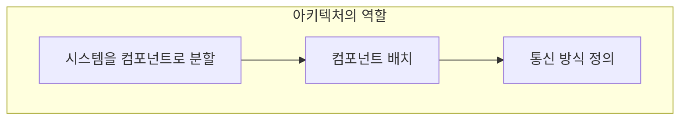
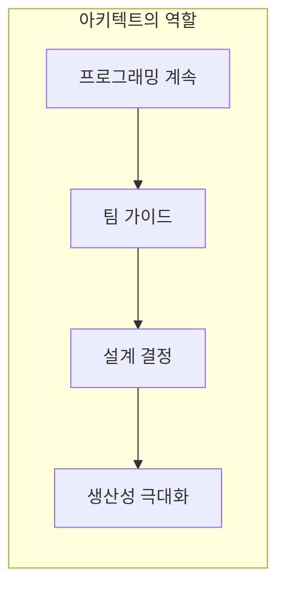
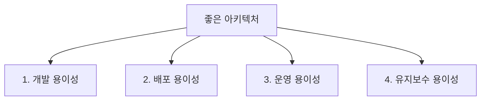
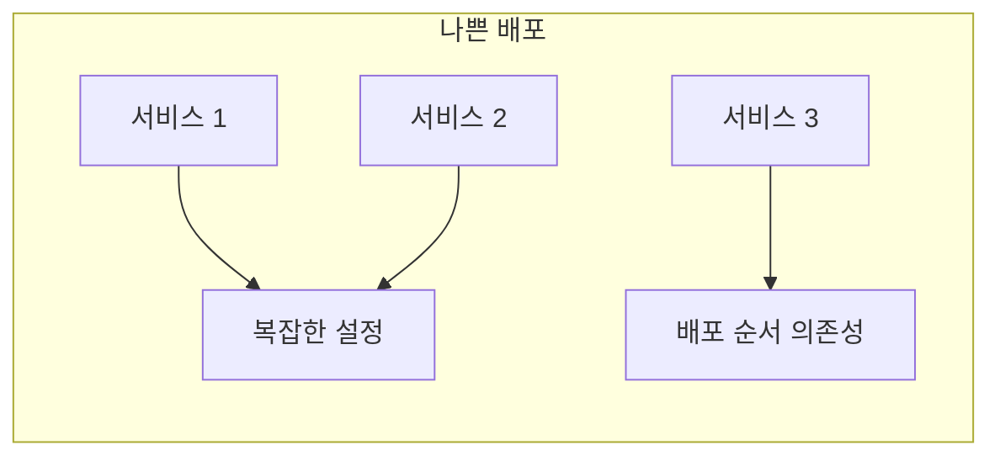
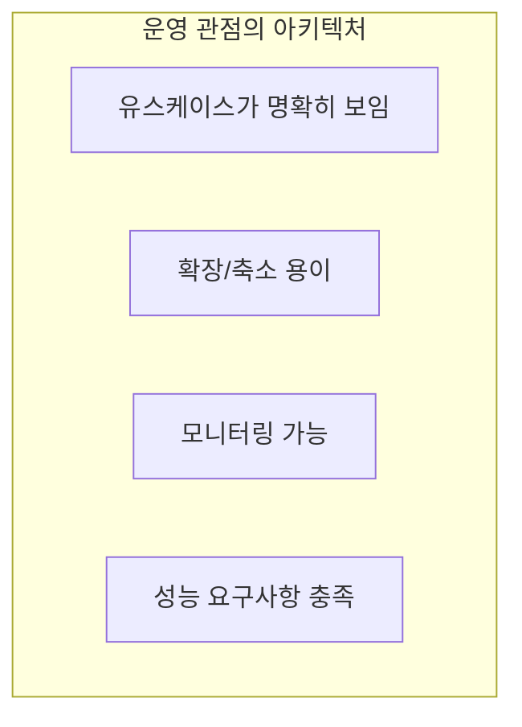
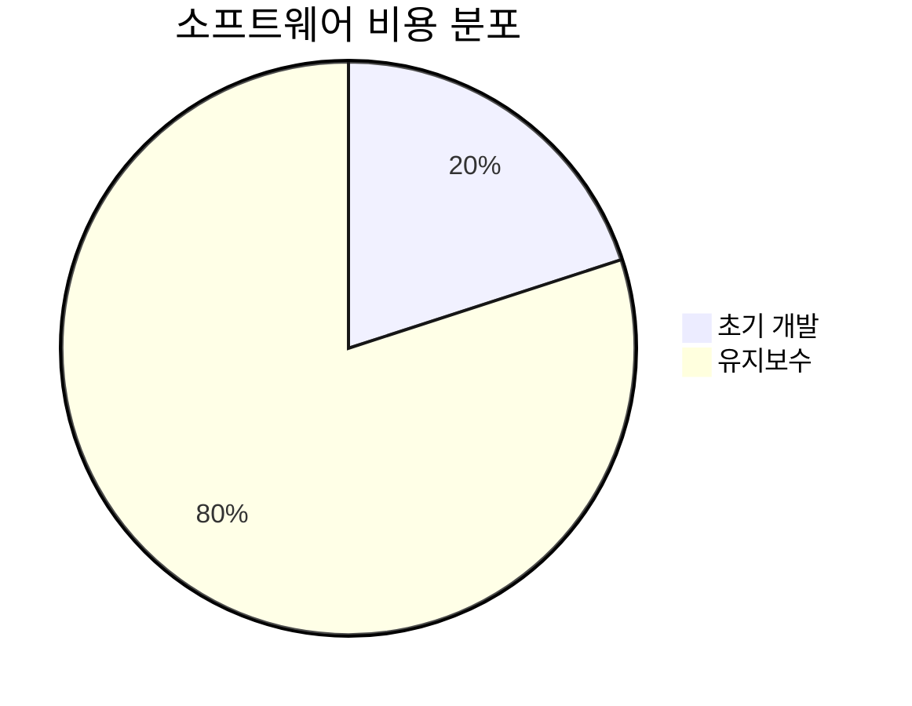
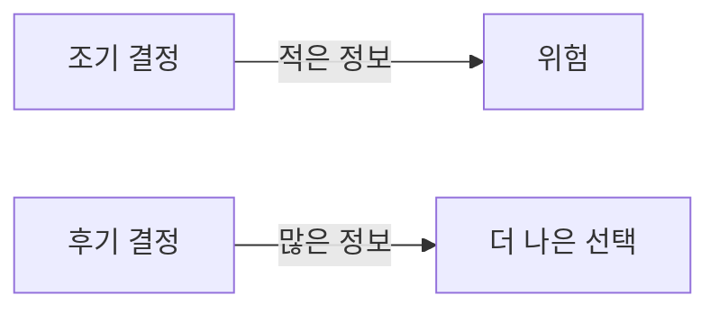
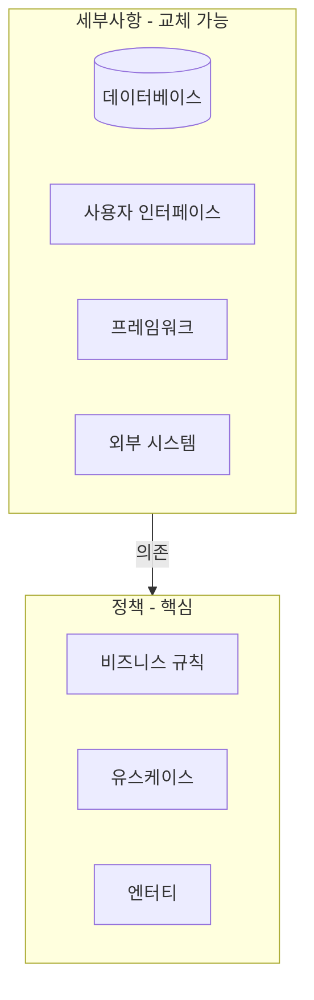
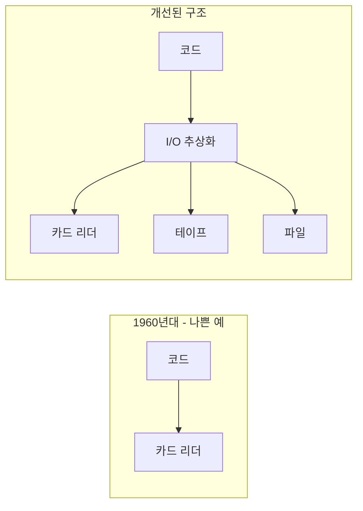

소프트웨어 아키텍처란 무엇인가? 마틴은 아키텍처를 시스템의 **형태를 결정**하고, 시스템의 **생명주기를 지원**하는 것으로 정의한다.

## 아키텍처의 정의

> **"시스템 아키텍처란 시스템을 구축한 사람들이 그 시스템에 부여한 형태다."**
> — Robert C. Martin

아키텍처는 시스템을:
- **컴포넌트로 분할**
- **컴포넌트를 배치**
- **컴포넌트 간 통신 정의**



### 아키텍처의 궁극적 목표

> "아키텍처의 궁극적 목표는 시스템의 생명주기 동안 필요한 **인력을 최소화**하는 것이다."

## 아키텍트는 프로그래머다

마틴은 아키텍트의 역할에 대해 강조한다:



> "소프트웨어 아키텍트는 **최고의 프로그래머**이며, 계속 프로그래밍 작업을 맡을 뿐 아니라 동시에 나머지 팀원들이 생산성을 극대화할 수 있는 설계를 하도록 방향을 이끌어야 한다."

### 아키텍트가 프로그래밍을 멈추면?

| 문제점 | 결과 |
|--------|------|
| 팀이 겪는 문제를 모름 | 현실과 동떨어진 설계 |
| 실제 코드를 작성하지 않음 | 팀의 신뢰 상실 |
| 생산성 향상 방법 모름 | 비효율적인 아키텍처 |

## 아키텍처의 네 가지 목표

좋은 아키텍처는 시스템 생명주기의 **네 가지 측면**을 지원한다.



### 1. 개발 (Development)

팀이 시스템을 **쉽게 개발**할 수 있어야 한다.

```java
// 좋은 아키텍처: 팀이 독립적으로 작업 가능
// 주문 팀
package com.example.order;
public class OrderService { }

// 결제 팀
package com.example.payment;
public class PaymentService { }

// 배송 팀
package com.example.shipping;
public class ShippingService { }
```

| 팀 규모 | 적합한 구조 | 이유 |
|--------|------------|------|
| 5인 이하 | 모놀리식도 가능 | 커뮤니케이션 오버헤드 적음 |
| 대규모 | 컴포넌트 분리 필수 | 팀 간 충돌 방지 |
| 여러 팀 | 독립 개발 가능해야 함 | 병렬 작업 가능 |

### 2. 배포 (Deployment)

> "좋은 아키텍처는 시스템을 **단일 액션**으로 쉽게 배포할 수 있게 한다."

**나쁜 배포 경험:**



- 수십 개의 작은 서비스를 각각 배포
- 복잡한 연결 설정
- 배포마다 문제 발생
- 수동 개입 필요

**좋은 배포 경험:**

```bash
# 이상적인 배포
$ git push origin main
# 자동으로 빌드, 테스트, 배포 완료
```

### 3. 운영 (Operation)

아키텍처는 시스템의 **운영 요구사항을 드러내야** 한다.



좋은 아키텍처의 운영 특성:
- 시스템이 **무엇을 하는지 명확**
- 유스케이스가 **구조에 반영**됨
- **확장과 축소**가 용이
- 처리량과 응답 시간 요구사항 충족

### 4. 유지보수 (Maintenance)

유지보수는 소프트웨어 비용의 **대부분**을 차지한다.



| 유지보수 활동 | 좋은 아키텍처의 효과 |
|--------------|---------------------|
| 새 기능 추가 | 영향 범위 최소화 |
| 버그 수정 | 문제 위치 파악 용이 |
| 요구사항 변경 | 변경 비용 일정 |

> "유지보수의 가장 큰 비용은 **탐사(spelunking)**와 **위험 감수**에서 발생한다."

```java
// 탐사: 어디를 고쳐야 하는지 찾기
// 나쁜 아키텍처
class GodClass {
    // 10,000줄의 코드
    // 어디를 수정해야 할까?
}

// 좋은 아키텍처
class OrderProcessor { /* 주문 처리만 */ }
class PaymentProcessor { /* 결제 처리만 */ }
class ShippingProcessor { /* 배송 처리만 */ }
// 주문 관련 버그? OrderProcessor만 보면 됨
```

## 선택지를 열어두기 (결정 지연)

> **"좋은 아키텍처는 결정을 지연시킬 수 있게 해준다."**

### 왜 결정을 늦춰야 하는가?



늦게 결정할수록:
- 더 많은 **정보**를 바탕으로 결정
- 더 나은 **선택** 가능
- 불필요한 **제약** 방지

### 어떤 결정을 지연할 수 있는가?

| 결정 유형 | 예시 | 지연 가능? |
|----------|------|----------|
| 비즈니스 규칙 | 주문 처리 로직 | ❌ 먼저 결정 |
| 데이터베이스 | MySQL vs PostgreSQL | ✅ 지연 가능 |
| 웹 프레임워크 | Spring vs Django | ✅ 지연 가능 |
| UI 기술 | Web vs Mobile | ✅ 지연 가능 |
| 메시징 시스템 | Kafka vs RabbitMQ | ✅ 지연 가능 |

## 정책과 세부사항

마틴은 시스템을 **정책(Policy)**과 **세부사항(Details)**으로 구분한다.



| 구분 | 정책 | 세부사항 |
|------|------|----------|
| 정의 | 비즈니스 규칙 | 기술적 구현 |
| 변경 빈도 | 낮음 | 높음 |
| 의존성 방향 | 없음 (핵심) | 정책에 의존 |
| 예시 | 주문 처리 규칙 | MySQL, React |
| 교체 가능성 | 어려움 | 쉬움 |

### 정책과 세부사항의 분리

좋은 아키텍처는 **정책이 세부사항에 의존하지 않게** 만든다.

```java
// 좋은 설계: 정책이 세부사항을 모름
public class OrderProcessor {
    private final OrderRepository repository; // 인터페이스
    
    public void processOrder(Order order) {
        // 비즈니스 규칙만 알고 있음
        // DB가 MySQL인지 MongoDB인지 모름
        repository.save(order);
    }
}

// 세부사항: 정책에 의존
public class MySqlOrderRepository implements OrderRepository {
    public void save(Order order) { /* MySQL 구현 */ }
}

public class MongoOrderRepository implements OrderRepository {
    public void save(Order order) { /* MongoDB 구현 */ }
}
```

## 장치 독립성

마틴은 1960년대의 경험을 공유한다. 당시 코드를 특정 장치(카드 리더, 테이프)에 직접 의존하도록 작성했다.



**교훈**: 세부사항으로부터 정책을 분리하면 **장치 독립성**을 얻는다.

## 핵심 요약

| 항목 | 내용 |
|------|------|
| 아키텍처의 정의 | 시스템의 형태를 결정하는 것 |
| 궁극적 목표 | 인력 최소화 |
| 네 가지 목표 | 개발, 배포, 운영, 유지보수 용이성 |
| 핵심 전략 | 결정 지연, 선택지 열어두기 |
| 분리 원칙 | 정책(핵심)과 세부사항(교체 가능) |

> **"아키텍처의 목적은 시스템의 생명주기를 지원하는 것이다. 좋은 아키텍처는 시스템을 쉽게 이해하고, 쉽게 개발하고, 쉽게 유지보수하고, 쉽게 배포하게 해준다."**
> — Robert C. Martin
