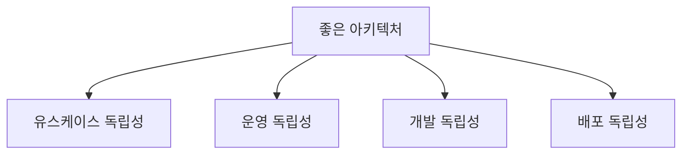
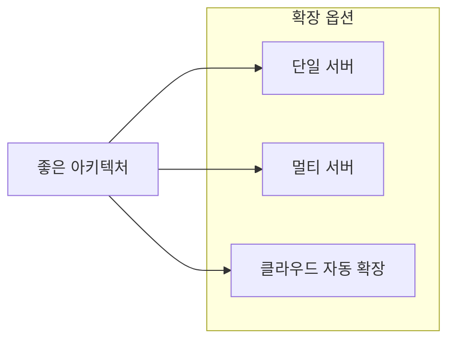
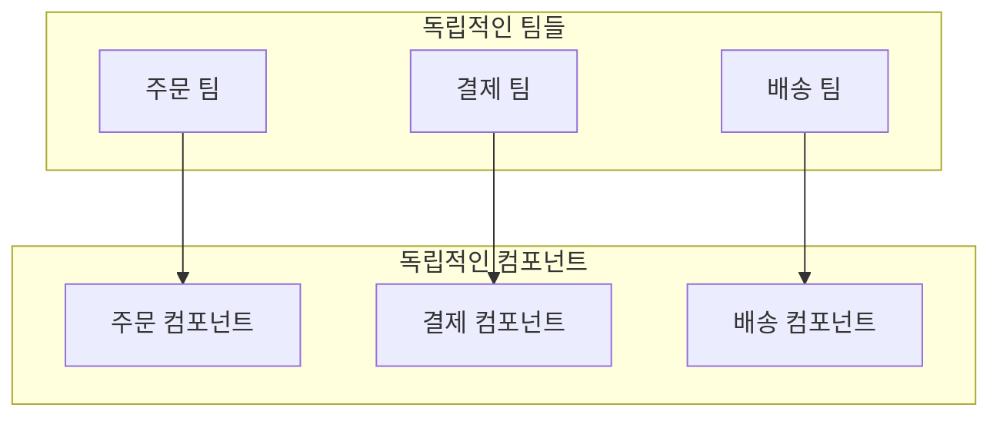
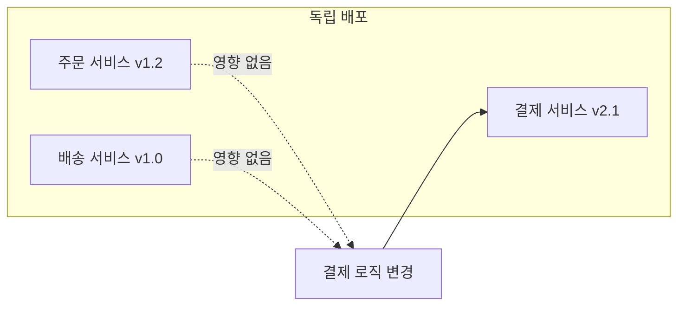
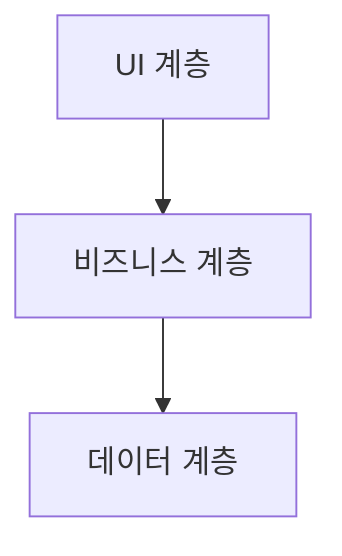
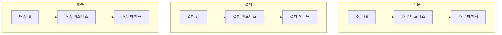
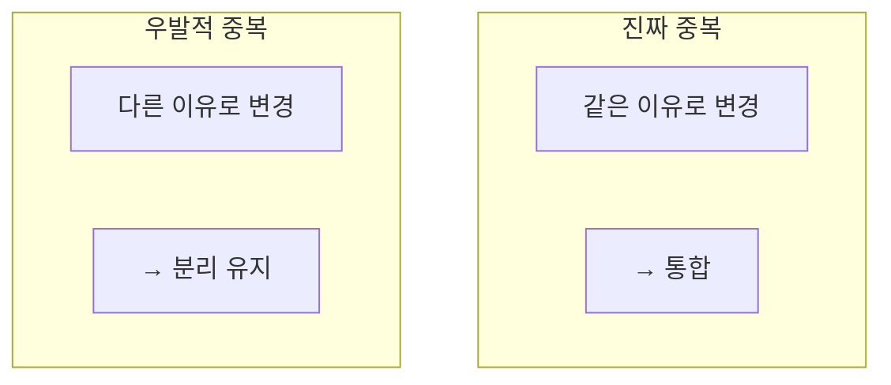
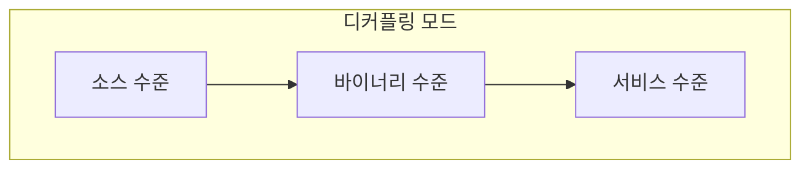

좋은 아키텍처는 다양한 **독립성**을 제공해야 한다. 유스케이스의 독립성, 운영의 독립성, 개발의 독립성, 배포의 독립성이 그것이다.

## 네 가지 독립성



### 1. 유스케이스 독립성 (Use Case Independence)

각 유스케이스가 **명확히 보여야** 한다. 시스템의 **의도가 아키텍처에서 드러나야** 한다.

```java
// 좋은 구조: 유스케이스가 명확히 보임
src/
├── usecases/
│   ├── CreateOrderUseCase.java
│   ├── CancelOrderUseCase.java
│   ├── ProcessPaymentUseCase.java
│   ├── RefundPaymentUseCase.java
│   ├── ShipOrderUseCase.java
│   └── TrackShipmentUseCase.java
```

> "시스템의 아키텍처를 보면 유스케이스가 무엇인지 알 수 있어야 한다. **프레임워크가 아니라 유스케이스**가 보여야 한다."

### 2. 운영 독립성 (Operation Independence)

시스템이 필요로 하는 **처리량과 응답 시간**을 지원해야 한다.



| 운영 요구사항 | 아키텍처 지원 |
|--------------|-------------|
| 초당 10만 요청 | 수평 확장 가능 |
| 밀리초 응답 시간 | 캐싱 레이어 분리 |
| 99.99% 가용성 | 페일오버 지원 |

### 3. 개발 독립성 (Development Independence)

여러 팀이 **독립적으로 개발**할 수 있어야 한다. 팀 간 조율 최소화.



```java
// 각 팀이 독립적으로 작업 가능
// 주문 팀 - 주문 컴포넌트만 수정
package com.company.order;

// 결제 팀 - 결제 컴포넌트만 수정  
package com.company.payment;

// 배송 팀 - 배송 컴포넌트만 수정
package com.company.shipping;
```

### 4. 배포 독립성 (Deployment Independence)

컴포넌트를 **독립적으로 배포**할 수 있어야 한다. 전체 재배포 없이 일부만 변경.



## 계층과 유스케이스

시스템을 분리하는 두 가지 방법이 있다: **수평 분할**과 **수직 분할**.

### 수평 분할 (계층)



```
┌─────────────────────────────┐
│         UI 계층             │
├─────────────────────────────┤
│      비즈니스 계층          │
├─────────────────────────────┤
│       데이터 계층           │
└─────────────────────────────┘
```

### 수직 분할 (유스케이스)

```
┌─────────┬─────────┬─────────┐
│  주문   │  결제   │  배송   │
│ 유스케이스│ 유스케이스│ 유스케이스│
└─────────┴─────────┴─────────┘
```

### 결합: 계층 + 유스케이스

가장 좋은 방법은 **두 가지를 결합**하는 것이다.



```
┌─────────────┬─────────────┬─────────────┐
│  주문 UI    │  결제 UI    │  배송 UI    │
├─────────────┼─────────────┼─────────────┤
│ 주문 비즈니스│ 결제 비즈니스│ 배송 비즈니스│
├─────────────┼─────────────┼─────────────┤
│ 주문 데이터 │ 결제 데이터 │ 배송 데이터 │
└─────────────┴─────────────┴─────────────┘
```

## 중복의 함정

코드 중복처럼 보이는 것이 항상 나쁜 것은 아니다. **두 종류의 중복**을 구분해야 한다.

### 진짜 중복 (True Duplication)

같은 이유로 변경되는 코드 → **통합 필요**

```java
// 진짜 중복: 하나로 통합해야 함
class UserValidator {
    boolean validateEmail(String email) {
        return email.contains("@");
    }
}

class AdminValidator {
    boolean validateEmail(String email) {  // 똑같은 코드!
        return email.contains("@");
    }
}

// 해결: 공통 유틸리티로 추출
class EmailValidator {
    static boolean validate(String email) {
        return email.contains("@");
    }
}
```

### 우발적 중복 (Accidental Duplication)

우연히 비슷해 보이지만 **다른 이유로 변경** → **분리 유지**

```java
// 우발적 중복 - 분리 유지!
// 지금은 같아 보여도 다르게 진화할 것

// 주문 팀용 DTO
class OrderDTO {
    String customerName;
    String address;
    // 주문 요구사항에 따라 변경됨
}

// 배송 팀용 DTO  
class ShipmentDTO {
    String customerName;
    String address;
    // 배송 요구사항에 따라 변경됨
    // 나중에 배송 추적 정보 추가될 수 있음
}

// 통합하면 안 됨! 각자 독립적으로 진화해야 함
```



| 유형 | 특징 | 대응 |
|------|------|------|
| 진짜 중복 | 같은 이유로 변경 | 통합 |
| 우발적 중복 | 다른 이유로 변경 | 분리 유지 |

## 디커플링 모드

시스템을 분리하는 세 가지 수준:



| 모드 | 분리 수준 | 배포 | 예시 |
|------|----------|------|------|
| 소스 수준 | 모듈/패키지 | 하나의 실행 파일 | 모놀리스 |
| 바이너리 수준 | jar/dll | 독립 배포 가능 | 플러그인 |
| 서비스 수준 | 네트워크 | 완전 독립 | 마이크로서비스 |

### 소스 수준 디커플링

```java
// 하나의 실행 파일, 패키지로 분리
com.company.order/
com.company.payment/
com.company.shipping/
```

### 바이너리 수준 디커플링

```
app.jar
├── uses → order.jar
├── uses → payment.jar
└── uses → shipping.jar
```

### 서비스 수준 디커플링

```
[Order Service] <--HTTP--> [Payment Service]
                <--HTTP--> [Shipping Service]
```

## 어떤 모드를 선택할 것인가?

> "좋은 아키텍처는 **선택지를 열어둔다**. 모놀리스로 시작해서 필요할 때 서비스로 분리할 수 있어야 한다."


| 단계 | 상황 | 권장 |
|------|------|------|
| 초기 | 요구사항 불명확 | 모놀리스 |
| 성장 | 팀 확장, 확장성 필요 | 컴포넌트 분리 |
| 성숙 | 독립 배포 필요 | 서비스 분리 |

## 핵심 요약

| 독립성 | 의미 | 효과 |
|--------|------|------|
| 유스케이스 | 의도가 드러남 | 이해하기 쉬움 |
| 운영 | 확장 가능 | 성능 충족 |
| 개발 | 팀 독립 | 병렬 작업 |
| 배포 | 부분 배포 | 빠른 릴리스 |

> **"좋은 아키텍처는 선택지를 열어둔다. 모놀리스로 시작해서 필요할 때 서비스로 분리할 수 있어야 한다."**
