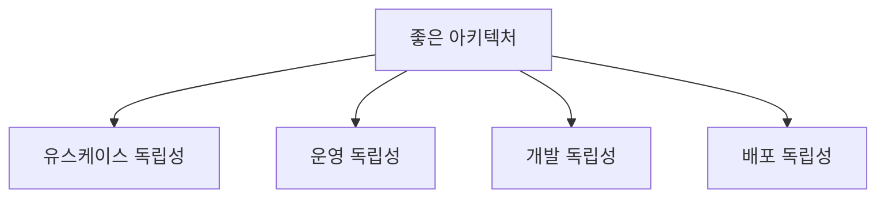
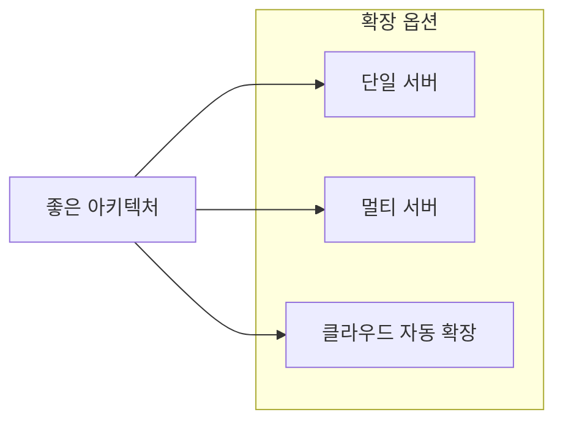
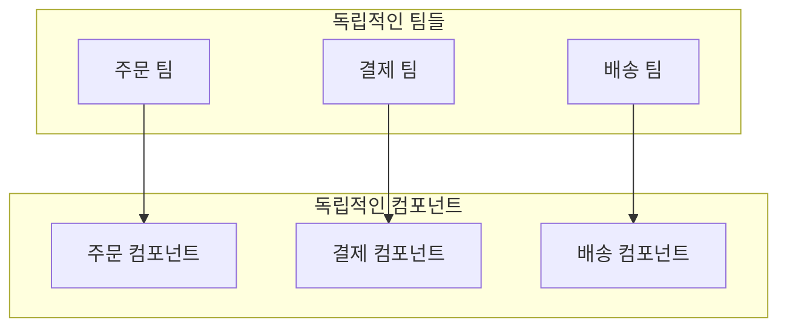
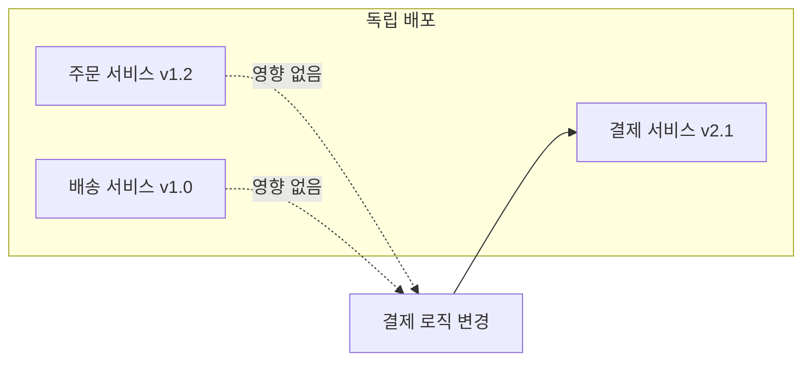
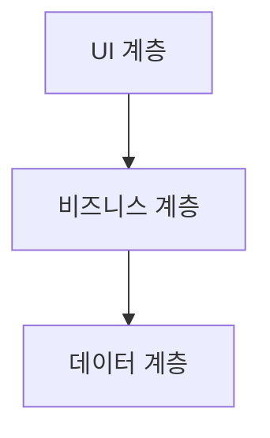
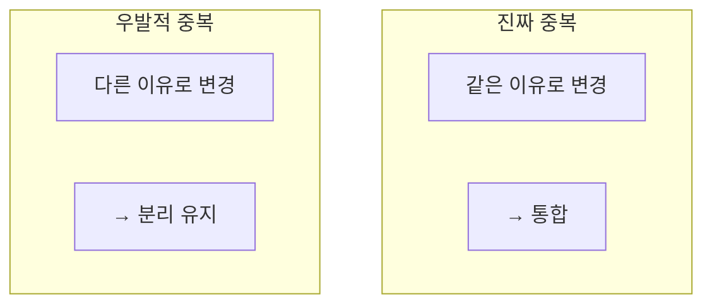

좋은 아키텍처는 다양한 **독립성**을 제공해야 한다. 유스케이스의 독립성, 운영의 독립성, 개발의 독립성, 배포의 독립성이 그것이다.

## 네 가지 독립성


```mermaid
flowchart TB
    ARCH[좋은 아키텍처]
    
    UC[유스케이스 독립성]
    OP[운영 독립성]
    DEV[개발 독립성]
    DEPLOY[배포 독립성]
    
    ARCH --> UC
    ARCH --> OP
    ARCH --> DEV
    ARCH --> DEPLOY
```

네 가지는 서로 다른 층위의 질문이다. 유스케이스 독립성은 "코드를 읽고 이해하기 쉬운가", 운영 독립성은 "트래픽이 늘어도 견디는가", 개발 독립성은 "여러 팀이 충돌 없이 작업하는가", 배포 독립성은 "일부만 골라 배포할 수 있는가"를 각각 묻는다. 넷 중 하나만 만족시키는 아키텍처는 흔하지만, 넷을 동시에 만족시키려면 뒤에서 다룰 수직/수평 분할의 결합이 필요하다.

### 1. 유스케이스 독립성 (Use Case Independence)

각 유스케이스가 **명확히 보여야** 한다. 시스템의 **의도가 아키텍처에서 드러나야** 한다. 폴더 구조가 `controllers/`, `models/`, `views/`처럼 프레임워크의 어휘로 짜여 있으면, 이 코드가 실제로 무슨 일을 하는 시스템인지는 파일을 열어보기 전까지 알 수 없다. 반대로 폴더 구조가 유스케이스 이름을 그대로 따르면, 디렉터리 목록만 봐도 시스템의 의도가 드러난다.

```text
// 좋은 구조: 유스케이스가 명확히 보임
src/
├── usecases/
│   ├── CreateOrderUseCase.java
│   ├── CancelOrderUseCase.java
│   ├── ProcessPaymentUseCase.java
│   ├── RefundPaymentUseCase.java
│   ├── ShipOrderUseCase.java
│   └── TrackShipmentUseCase.java
```

> "시스템의 아키텍처를 보면 유스케이스가 무엇인지 알 수 있어야 한다. **프레임워크가 아니라 유스케이스**가 보여야 한다."
> — Robert C. Martin, 『Clean Architecture』(2017), 16장

### 2. 운영 독립성 (Operation Independence)

시스템이 필요로 하는 **처리량과 응답 시간**을 지원해야 한다. 유스케이스를 컨트롤러·인터랙터·프레젠터 같은 별도 객체로 나눠 두면, 이 객체들을 같은 스레드 안에서 순차 호출할 수도 있고, 별도 서비스로 분리해 네트워크로 호출할 수도 있다. 이 선택을 유스케이스 코드 자체는 전혀 몰라도 되므로, 운영 요구사항(트래픽 증가, 응답 시간 단축)이 바뀌어도 비즈니스 로직은 그대로 둔 채 배치 방식만 바꿀 수 있다.


```mermaid
flowchart LR
    subgraph ScaleOptions [확장 옵션]
        SINGLE[단일 서버]
        MULTI[멀티 서버]
        CLOUD[클라우드 자동 확장]
    end
    
    ARCH[좋은 아키텍처] --> SINGLE
    ARCH --> MULTI
    ARCH --> CLOUD
```

| 운영 요구사항 | 아키텍처 지원 |
|--------------|-------------|
| 초당 10만 요청 | 수평 확장 가능 |
| 밀리초 응답 시간 | 캐싱 레이어 분리 |
| 99.99% 가용성 | 페일오버 지원 |

### 3. 개발 독립성 (Development Independence)

여러 팀이 **독립적으로 개발**할 수 있어야 한다. 팀 간 조율 최소화. Conway's Law가 보여주듯 소프트웨어 구조는 조직 구조를 반영하는 경향이 있으므로, 아키텍처 경계를 팀 경계와 맞춰 두면 각 팀이 서로의 코드를 밟지 않고 병렬로 작업할 수 있다.


```mermaid
flowchart TB
    subgraph Teams [독립적인 팀들]
        T1[주문 팀]
        T2[결제 팀]
        T3[배송 팀]
    end
    
    subgraph Components [독립적인 컴포넌트]
        C1[주문 컴포넌트]
        C2[결제 컴포넌트]
        C3[배송 컴포넌트]
    end
    
    T1 --> C1
    T2 --> C2
    T3 --> C3
```

```text
// 각 팀이 독립적으로 작업 가능
// 주문 팀 - 주문 컴포넌트만 수정
package com.company.order;

// 결제 팀 - 결제 컴포넌트만 수정  
package com.company.payment;

// 배송 팀 - 배송 컴포넌트만 수정
package com.company.shipping;
```

### 4. 배포 독립성 (Deployment Independence)

컴포넌트를 **독립적으로 배포**할 수 있어야 한다. 전체 재배포 없이 일부만 변경. 결제 로직에 버그가 하나 있다고 해서 주문·배송 서비스까지 함께 재배포해야 한다면, 그만큼 배포 위험과 대기 시간이 늘어난다. 컴포넌트 경계가 배포 단위와 일치하면, 변경된 부분만 골라 배포할 수 있다.


```mermaid
flowchart LR
    subgraph Deploy [독립 배포]
        D1[주문 서비스 v1.2]
        D2[결제 서비스 v2.1]
        D3[배송 서비스 v1.0]
    end
    
    CHANGE[결제 로직 변경] --> D2
    D1 -.->|영향 없음| CHANGE
    D3 -.->|영향 없음| CHANGE
```

## 계층과 유스케이스

시스템을 분리하는 두 가지 방법이 있다: **수평 분할**과 **수직 분할**. 앞서 본 네 가지 독립성은 이 두 분할 방식을 어떻게 조합하느냐에 따라 실제로 확보되기도 하고 무너지기도 한다.

### 수평 분할 (계층)

수평 분할은 UI·비즈니스 로직·데이터라는 **기술적 역할**을 기준으로 시스템을 나눈다. 전통적인 3계층 아키텍처가 이 방식이며, 관심사의 종류(화면 표시인가, 규칙 판단인가, 저장인가)에 따라 코드를 배치한다는 장점이 있다.


```mermaid
flowchart TB
    UI[UI 계층]
    BIZ[비즈니스 계층]
    DATA[데이터 계층]
    
    UI --> BIZ --> DATA
```

```text
┌─────────────────────────────┐
│         UI 계층             │
├─────────────────────────────┤
│      비즈니스 계층          │
├─────────────────────────────┤
│       데이터 계층           │
└─────────────────────────────┘
```

수평 분할만으로는 유스케이스 독립성을 확보하지 못한다는 게 문제다. "주문 생성"이라는 유스케이스 하나를 이해하려 해도 UI·비즈니스·데이터 세 계층을 모두 오가며 코드를 찾아야 하고, 주문 팀과 결제 팀이 같은 비즈니스 계층 파일을 함께 수정하게 되어 개발 독립성도 깨진다.

### 수직 분할 (유스케이스)

수직 분할은 반대로 유스케이스(주문·결제·배송)를 기준으로 시스템을 나눈다.

```text
┌─────────┬─────────┬─────────┐
│  주문   │  결제   │  배송   │
│ 유스케이스│ 유스케이스│ 유스케이스│
└─────────┴─────────┴─────────┘
```

이렇게 나누면 유스케이스 하나의 코드가 한 곳에 모이므로 유스케이스 독립성은 확보되지만, 이번에는 각 유스케이스 내부에서 UI·비즈니스·데이터 코드가 다시 뒤섞일 위험이 생긴다.

### 결합: 계층 + 유스케이스

수평 분할은 기술적 역할별 응집도를, 수직 분할은 유스케이스별 응집도를 각각 지키지만 상대방이 놓치는 축을 놓친다. 가장 좋은 방법은 **두 가지를 결합**하는 것이다.


```mermaid
flowchart TB
    subgraph Order [주문]
        O_UI[주문 UI]
        O_BIZ[주문 비즈니스]
        O_DATA[주문 데이터]
    end
    
    subgraph Payment [결제]
        P_UI[결제 UI]
        P_BIZ[결제 비즈니스]
        P_DATA[결제 데이터]
    end
    
    subgraph Shipping [배송]
        S_UI[배송 UI]
        S_BIZ[배송 비즈니스]
        S_DATA[배송 데이터]
    end
    
    O_UI --> O_BIZ --> O_DATA
    P_UI --> P_BIZ --> P_DATA
    S_UI --> S_BIZ --> S_DATA
```

```text
┌─────────────┬─────────────┬─────────────┐
│  주문 UI    │  결제 UI    │  배송 UI    │
├─────────────┼─────────────┼─────────────┤
│ 주문 비즈니스│ 결제 비즈니스│ 배송 비즈니스│
├─────────────┼─────────────┼─────────────┤
│ 주문 데이터 │ 결제 데이터 │ 배송 데이터 │
└─────────────┴─────────────┴─────────────┘
```

이 격자 구조에서 각 열(주문·결제·배송)은 독립된 유스케이스이자 독립된 팀의 작업 단위이고, 각 행(UI·비즈니스·데이터)은 같은 유스케이스 안에서도 서로 다른 이유로 바뀌는 코드다. 열 방향으로 나누면 유스케이스·개발 독립성이, 행 방향의 구분을 유지하면 계층 간 관심사 분리가 함께 성립한다. 각 열이 자신의 UI·비즈니스·데이터를 하나의 단위로 캡슐화하고 있다는 점도 중요하다 — 결제 컴포넌트 내부 구현이 바뀌어도 그 변화는 결제 열 밖으로 새어 나가지 않는다.

## 중복의 함정

코드 중복처럼 보이는 것이 항상 나쁜 것은 아니다. **두 종류의 중복**을 구분해야 한다.

### 진짜 중복 (True Duplication)

**같은 이유로 변경되는 코드**는 진짜 중복이다. 이메일 형식 검증 규칙이 바뀔 때 `UserValidator`와 `AdminValidator` 둘 다 똑같이 고쳐야 한다면, 이 둘은 우연히 닮은 게 아니라 애초에 같은 규칙을 표현하고 있을 뿐이다. 이런 코드를 따로 두면 한쪽만 고치고 다른 쪽을 깜빡하는 사고가 반드시 일어난다 — 그래서 **통합**해야 한다.

```java
// 진짜 중복: 하나로 통합해야 함
class UserValidator {
    boolean validateEmail(String email) {
        return email.contains("@");
    }
}

class AdminValidator {
    boolean validateEmail(String email) {  // 똑같은 코드!
        return email.contains("@");
    }
}

// 해결: 공통 유틸리티로 추출
class EmailValidator {
    static boolean validate(String email) {
        return email.contains("@");
    }
}
```

### 우발적 중복 (Accidental Duplication)

반대로 **지금은 같아 보이지만 서로 다른 이유로 바뀔 코드**는 우발적 중복이다. 아래 `OrderDTO`와 `ShipmentDTO`는 필드 구성이 똑같아 보이지만, 하나는 주문 팀이 결제 요구사항에 맞춰, 다른 하나는 배송 팀이 배송 추적 요구사항에 맞춰 각자 진화한다. 지금 이 둘을 하나의 `CustomerInfo` 클래스로 통합해 버리면, 배송 팀이 추적 정보 필드를 추가하려 할 때마다 주문 팀의 코드까지 영향을 받는 원치 않는 결합이 생긴다 — 겉모습이 같다는 이유만으로 통합하면 안 되고, **분리를 유지**해야 한다.

```java
// 우발적 중복 - 분리 유지!
// 지금은 같아 보여도 다르게 진화할 것

// 주문 팀용 DTO
class OrderDTO {
    String customerName;
    String address;
    // 주문 요구사항에 따라 변경됨
}

// 배송 팀용 DTO  
class ShipmentDTO {
    String customerName;
    String address;
    // 배송 요구사항에 따라 변경됨
    // 나중에 배송 추적 정보 추가될 수 있음
}

// 통합하면 안 됨! 각자 독립적으로 진화해야 함
```


```mermaid
flowchart TB
    subgraph TrueDup [진짜 중복]
        T1[같은 이유로 변경]
        T2[→ 통합]
    end
    
    subgraph AccDup [우발적 중복]
        A1[다른 이유로 변경]
        A2[→ 분리 유지]
    end
```

| 유형 | 특징 | 대응 |
|------|------|------|
| 진짜 중복 | 같은 이유로 변경 | 통합 |
| 우발적 중복 | 다른 이유로 변경 | 분리 유지 |

## 디커플링 모드

시스템을 분리하는 세 가지 수준:


```mermaid
flowchart TB
    subgraph Modes [디커플링 모드]
        SRC[소스 수준]
        BIN[바이너리 수준]
        SVC[서비스 수준]
    end
    
    SRC --> BIN --> SVC
```

| 모드 | 분리 수준 | 배포 | 예시 |
|------|----------|------|------|
| 소스 수준 | 모듈/패키지 | 하나의 실행 파일 | 모놀리스 |
| 바이너리 수준 | jar/dll | 독립 배포 가능 | 플러그인 |
| 서비스 수준 | 네트워크 | 완전 독립 | 마이크로서비스 |

### 소스 수준 디커플링

패키지 경계만 나누고 실제로는 하나의 프로세스, 하나의 실행 파일로 컴파일·배포된다. 컴파일 시점에는 팀별로 독립적으로 작업할 수 있지만, 배포 시점에는 여전히 전체를 한 번에 빌드하고 재시작해야 한다.

```text
// 하나의 실행 파일, 패키지로 분리
com.company.order/
com.company.payment/
com.company.shipping/
```

### 바이너리 수준 디커플링

각 컴포넌트가 별도의 바이너리(jar, dll)로 빌드되어 서로를 라이브러리처럼 참조한다. 결제 팀이 `payment.jar`만 새로 빌드해 배포하면 되고, 주문·배송 모듈은 재컴파일할 필요가 없다 — 다만 여전히 같은 프로세스 안에서 함께 실행된다.

```text
app.jar
├── uses → order.jar
├── uses → payment.jar
└── uses → shipping.jar
```

### 서비스 수준 디커플링

각 컴포넌트가 완전히 독립된 프로세스로 실행되며, HTTP 같은 네트워크 프로토콜로만 통신한다. 배포 독립성이 가장 강력하게 보장되는 대신, 네트워크 지연·부분 장애 같은 새로운 문제가 함께 따라온다.

```text
[Order Service] <--HTTP--> [Payment Service]
                <--HTTP--> [Shipping Service]
```

세 모드는 배포 단위가 실행 파일 하나(소스)→바이너리 여러 개(바이너리)→프로세스 여러 개(서비스)로 점점 더 잘게 쪼개지는 스펙트럼이다. 쪼갤수록 배포 독립성은 강해지지만, 그만큼 운영 복잡도(네트워크 장애 처리, 분산 트랜잭션 등)도 함께 늘어난다.

## 어떤 모드를 선택할 것인가?

> "좋은 아키텍처는 **선택지를 열어둔다**. 모놀리스로 시작해서 필요할 때 서비스로 분리할 수 있어야 한다."
> — Robert C. Martin, 『Clean Architecture』(2017), 16장


```mermaid
flowchart LR
    START[모놀리스로 시작]
    GROW[필요에 따라 성장]
    MICRO[마이크로서비스로 분리]
    
    START --> GROW --> MICRO
```

| 단계 | 상황 | 권장 |
|------|------|------|
| 초기 | 요구사항 불명확 | 모놀리스 |
| 성장 | 팀 확장, 확장성 필요 | 컴포넌트 분리 |
| 성숙 | 독립 배포 필요 | 서비스 분리 |

이 표가 강조하는 것은 시점마다 다른 정답이 있다는 사실이 아니라, 앞서 살펴본 수직 분할(유스케이스별 경계)을 처음부터 지켜두면 소스→바이너리→서비스로의 이행이 코드 재설계 없이 배포 방식 변경만으로 끝난다는 점이다. 반대로 처음부터 계층(수평) 기준으로만 나눠뒀다면, 나중에 유스케이스 단위로 서비스를 쪼개려 할 때 계층을 가로지르는 대대적인 재설계가 필요해진다.

## 흔한 오해

"독립성"을 처음부터 마이크로서비스로 시작해야 한다는 뜻으로 오해하기 쉽다. 그러나 이 장이 강조하는 것은 정반대에 가깝다 — 좋은 아키텍처는 소스 수준 디커플링(모놀리스)으로 시작해도 나중에 서비스 수준으로 옮겨갈 수 있는 **선택지**를 열어둔다. 처음부터 서비스로 나누면 초기 개발 속도가 느려지고, 아직 안정되지 않은 경계를 성급하게 굳히는 위험이 있다. 또 다른 오해는 코드 중복을 보는 즉시 통합해야 한다는 생각이다. 진짜 중복(같은 이유로 변경)과 우발적 중복(우연히 같아 보이지만 다른 이유로 변경)을 구분하지 않고 성급하게 통합하면, 서로 다른 액터의 요구가 한 코드에 뒤섞여 오히려 결합도가 높아진다.

## 학습 목표

이 장을 읽은 후 다음을 스스로 점검한다.

- 유스케이스·운영·개발·배포 네 가지 독립성이 각각 무엇을 요구하는지 구체적 예로 설명할 수 있는가?
- 수평 분할(계층)과 수직 분할(유스케이스)을 결합해야 하는 이유를 설명할 수 있는가?
- 진짜 중복과 우발적 중복을 구분하는 기준(변경 이유가 같은가)을 코드 예로 설명할 수 있는가?
- 소스·바이너리·서비스 세 가지 디커플링 모드의 차이와 각각의 배포 방식을 설명할 수 있는가?
- 왜 "모놀리스로 시작해서 필요할 때 분리"가 권장되는지, 조기 서비스 분리의 위험과 함께 설명할 수 있는가?

## 판단 기준

시스템을 분리할지, 어느 수준으로 분리할지 판단할 때 다음을 확인한다.

- 이 코드 중복은 같은 액터·같은 이유로 변경되는가(진짜 중복), 아니면 우연히 같아 보일 뿐 다른 이유로 변경되는가(우발적 중복)?
- 현재 팀 규모와 요구사항 안정성을 볼 때, 지금 서비스 수준까지 분리할 필요가 있는가, 아니면 소스·바이너리 수준으로 충분한가?
- 운영 요구사항(처리량, 응답 시간, 가용성)이 현재 구조로 충족되는가, 아니면 특정 컴포넌트만 독립적으로 확장해야 하는가?

세 질문 모두 "지금 당장 최대치로 분리하라"가 아니라 "현재 필요와 미래의 선택지 사이에서 어디에 서 있는가"를 묻는다는 공통점이 있다. 성급한 분리와 성급한 통합은 둘 다 나중에 되돌리는 비용을 키운다는 점에서 증상은 다르지만 원인은 같다.

## 참고 자료

- Robert C. Martin, 『Clean Architecture』, 2017, 16장 — 독립성 네 가지 축과 디커플링 모드의 원 출처.

## 핵심 요약

| 독립성 | 의미 | 효과 |
|--------|------|------|
| 유스케이스 | 의도가 드러남 | 이해하기 쉬움 |
| 운영 | 확장 가능 | 성능 충족 |
| 개발 | 팀 독립 | 병렬 작업 |
| 배포 | 부분 배포 | 빠른 릴리스 |

네 가지 독립성, 진짜/우발적 중복의 구분, 소스·바이너리·서비스라는 세 디커플링 모드는 결국 하나의 질문으로 수렴한다 — "지금 이 시스템에 어느 수준의 분리가 실제로 필요한가?"라는 질문이다. 다음 장(27장)에서는 이 질문에 답하는 구체적인 도구인 경계 긋기와 플러그인 아키텍처를 다룬다.
