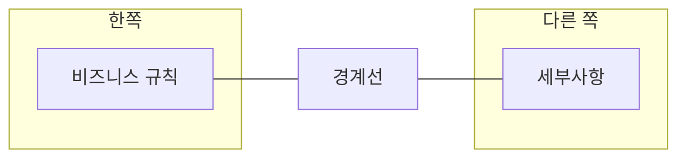
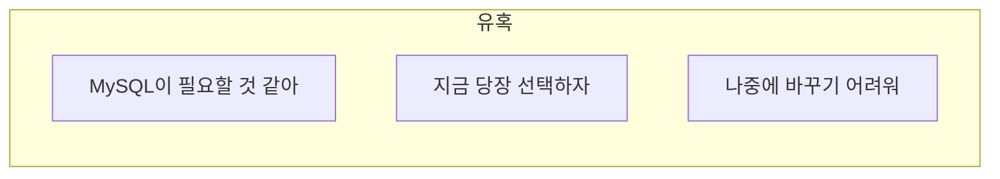
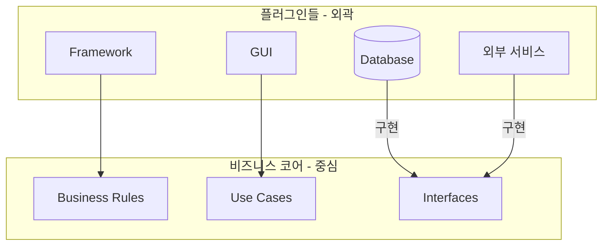
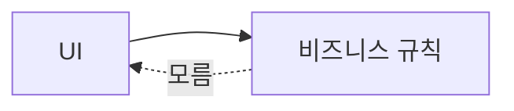
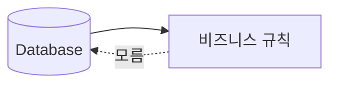
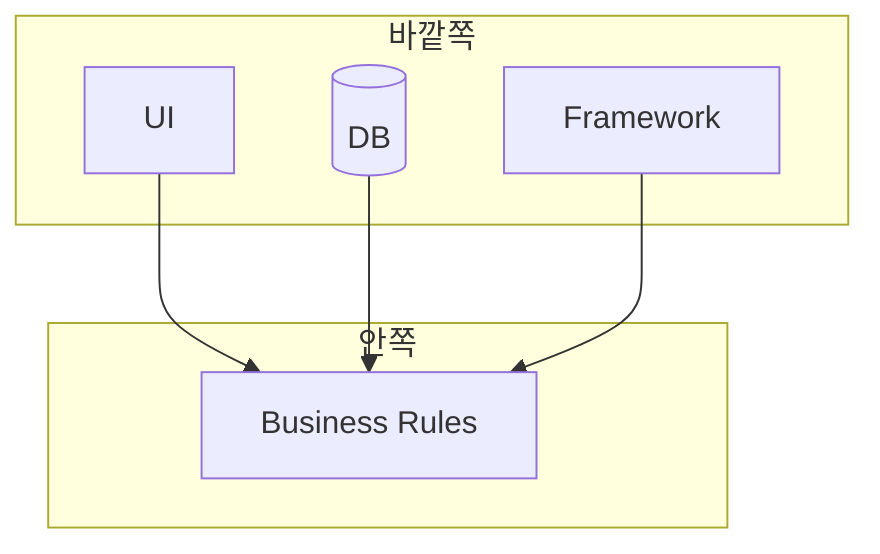
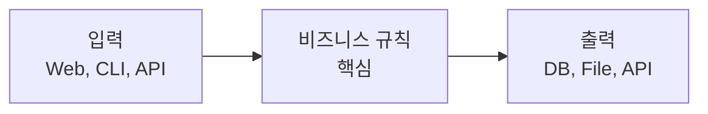
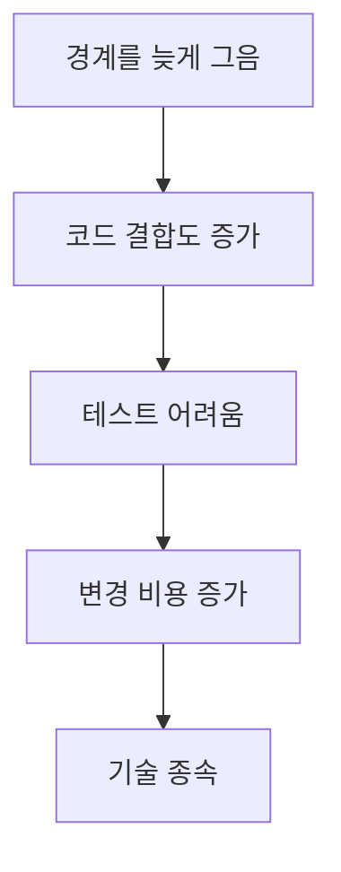

아키텍처에서 **경계(Boundary)**란 관심사를 분리하는 선이다. 경계의 한쪽에는 비즈니스 규칙이, 다른 쪽에는 세부사항이 있다. 경계를 제대로 그으면 **플러그인 아키텍처**가 된다.

## 경계란?

> "경계는 소프트웨어 요소를 분리하고, 한쪽이 다른 쪽을 모르게 한다."
> — Robert C. Martin



### 어디에 경계를 긋는가?

**관련 없는 것들 사이에** 경계를 긋는다:

| 경계의 한쪽 | 경계의 다른 쪽 |
|------------|---------------|
| 비즈니스 규칙 | GUI |
| 비즈니스 규칙 | 데이터베이스 |
| 비즈니스 규칙 | 프레임워크 |
| 비즈니스 규칙 | 외부 서비스 |

```java
// 경계를 긋기 전: 모든 것이 섞여있음
public class OrderService {
    public void createOrder(Request request) {
        // GUI에 대한 지식
        String json = parseJsonFromHttpRequest(request);
        
        // 비즈니스 규칙
        Order order = new Order(json);
        order.validate();
        
        // DB에 대한 지식
        Connection conn = DriverManager.getConnection("...");
        PreparedStatement stmt = conn.prepareStatement("INSERT...");
    }
}
```

```java
// 경계를 긋고 난 후: 깔끔하게 분리됨
public class CreateOrderUseCase {
    private final OrderRepository repository;  // 인터페이스
    
    public void execute(OrderRequest request) {
        // 비즈니스 규칙만 알고 있음
        Order order = new Order(request);
        order.validate();
        repository.save(order);
        // DB가 MySQL인지, 파일인지 모름
    }
}
```

## FitNesse 사례

마틴은 자신이 개발한 **FitNesse** 프로젝트 경험을 공유한다.

### 조기 결정의 유혹



초기에 MySQL을 선택하고 싶었지만, **결정을 미뤘다**. 데이터베이스 선택 없이 개발을 진행했다.

### 경계를 먼저 그음

```java
// FitNesse의 데이터 접근 인터페이스
public interface WikiPagePersistence {
    WikiPage load(String pageName);
    void save(WikiPage page);
    List<WikiPage> findAll();
}

// 비즈니스 규칙은 이 인터페이스만 알면 됨
public class WikiPageService {
    private final WikiPagePersistence persistence;
    
    public WikiPage getPage(String name) {
        return persistence.load(name);
    }
}
```

### 결과

| 진행 단계 | 상태 |
|----------|------|
| 초기 개발 | 파일 시스템으로 구현 |
| 나중에 | MySQL 옵션 추가 |
| 최종 | 사용자가 선택 |

```java
// 파일 시스템 구현
public class FileSystemWikiPagePersistence implements WikiPagePersistence {
    public WikiPage load(String pageName) {
        // 파일에서 읽기
        return readFromFile(pageName);
    }
}

// MySQL 구현 (나중에 추가)
public class MySqlWikiPagePersistence implements WikiPagePersistence {
    public WikiPage load(String pageName) {
        // MySQL에서 읽기
        return readFromDatabase(pageName);
    }
}
```

> "놀랍게도 MySQL이 필요 없었다. 파일 시스템만으로 충분했다. 우리는 **결정을 미루는 데 성공**했고, 그 덕분에 불필요한 복잡성을 피할 수 있었다."

## 플러그인 아키텍처

경계를 제대로 그으면 **플러그인 아키텍처**가 된다.



### 플러그인 아키텍처의 특징

| 특징 | 설명 |
|------|------|
| 코어 | 비즈니스 규칙, 유스케이스, 인터페이스 |
| 플러그인 | DB, GUI, 프레임워크, 외부 서비스 |
| 의존성 방향 | 플러그인 → 코어 |
| 교체 가능성 | 플러그인은 언제든 교체 가능 |

### 코드로 보는 플러그인 아키텍처

```java
// 코어: 인터페이스 정의
public interface PaymentGateway {
    PaymentResult process(Payment payment);
}

// 플러그인 1: Stripe
public class StripeGateway implements PaymentGateway {
    public PaymentResult process(Payment payment) {
        // Stripe API 호출
        return stripeApi.charge(payment);
    }
}

// 플러그인 2: PayPal
public class PayPalGateway implements PaymentGateway {
    public PaymentResult process(Payment payment) {
        // PayPal API 호출
        return paypalApi.charge(payment);
    }
}

// 플러그인 3: 테스트용 Mock
public class MockPaymentGateway implements PaymentGateway {
    public PaymentResult process(Payment payment) {
        return PaymentResult.success();
    }
}

// 비즈니스 규칙: 플러그인을 모름
public class PaymentService {
    private final PaymentGateway gateway;
    
    public void pay(Order order) {
        Payment payment = createPayment(order);
        PaymentResult result = gateway.process(payment);
        // Stripe인지 PayPal인지 모르고 처리
    }
}
```

## 경계 긋기 규칙

### 규칙 1: 비즈니스 규칙이 UI를 모르게



```java
// 나쁜 예: 비즈니스 규칙이 UI를 암
public class OrderService {
    public void createOrder(HttpServletRequest request) {  // UI 기술!
        String json = request.getParameter("order");
        // ...
    }
}

// 좋은 예: UI를 모름
public class CreateOrderUseCase {
    public void execute(CreateOrderRequest request) {  // 순수 DTO
        // ...
    }
}
```

### 규칙 2: 비즈니스 규칙이 DB를 모르게



```java
// 나쁜 예: 비즈니스 규칙이 DB를 암
public class OrderService {
    public void save(Order order) {
        Connection conn = DriverManager.getConnection("jdbc:mysql://...");
        // ...
    }
}

// 좋은 예: DB를 모름
public class OrderService {
    private final OrderRepository repository;  // 인터페이스
    
    public void save(Order order) {
        repository.save(order);  // 구체적인 DB 기술 모름
    }
}
```

### 규칙 3: 의존성은 비즈니스 규칙을 향하게



## 입력과 출력은 중요치 않다

마틴은 흥미로운 관점을 제시한다:

> "입력과 출력은 중요치 않다. **비즈니스 규칙**이 중요하다."



우리는 종종 시스템을 입력/출력 관점에서 생각하지만, 실제로 **가치를 창출하는 것은 비즈니스 규칙**이다.

| 관점 | 초점 |
|------|------|
| 전통적 | 입력 → 처리 → 출력 |
| 클린 아키텍처 | 비즈니스 규칙이 중심 |

## 경계를 늦게 그으면?

경계를 늦게 그으면 다음과 같은 문제가 발생한다:



```java
// 경계 없이 시작한 코드
public class OrderController {
    public void createOrder(HttpServletRequest req) {
        // UI, 비즈니스, DB가 모두 섞임
        String name = req.getParameter("name");
        Order order = new Order(name);
        order.setTotal(order.calculateTotal());
        
        Connection conn = DriverManager.getConnection("...");
        PreparedStatement stmt = conn.prepareStatement(
            "INSERT INTO orders VALUES (?, ?)");
        stmt.setString(1, order.getName());
        stmt.setDouble(2, order.getTotal());
        stmt.execute();
        
        // 이 코드를 분리하려면? 재작성 수준의 노력 필요
    }
}
```

## 핵심 요약

| 항목 | 내용 |
|------|------|
| 경계의 정의 | 관심사를 분리하는 선 |
| 경계의 위치 | 비즈니스 규칙과 세부사항 사이 |
| 플러그인 아키텍처 | 코어는 중심, 세부사항은 플러그인 |
| 의존성 방향 | 세부사항 → 비즈니스 규칙 |
| 핵심 이점 | 세부사항 교체 가능 |

> **"경계를 제대로 그으면, 나중에 세부사항을 바꿀 수 있다. 경계가 없으면 갇히게 된다."**
> — Robert C. Martin
