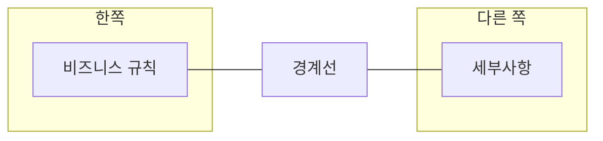
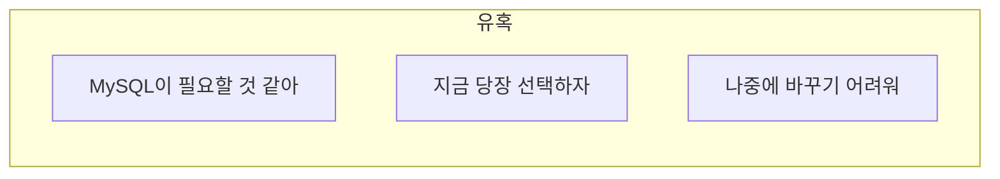
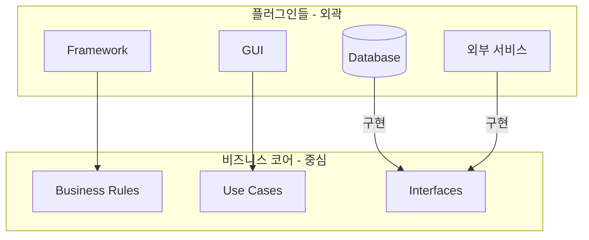
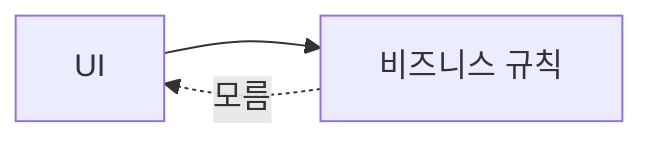
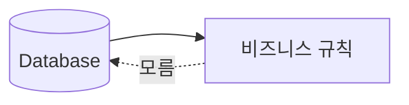
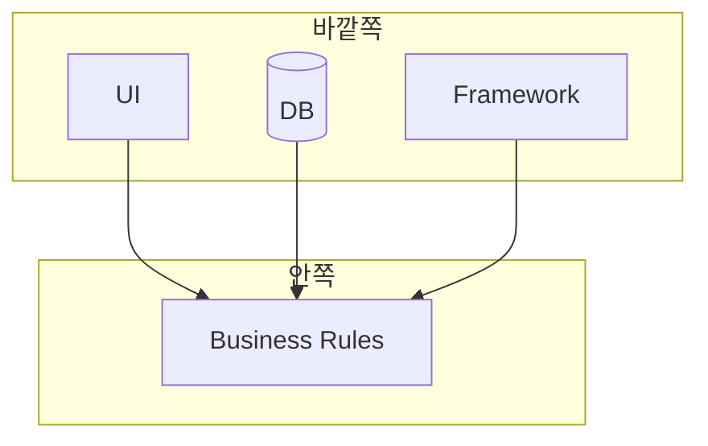
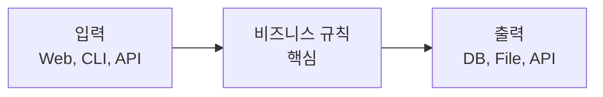
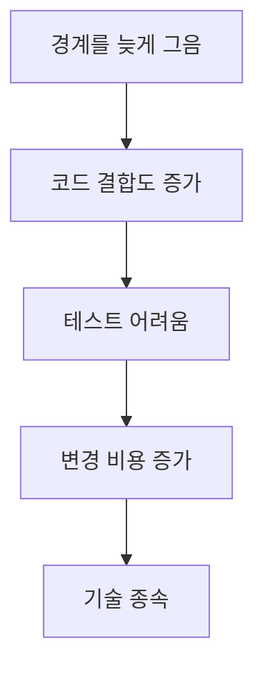

아키텍처에서 **경계(Boundary)**란 관심사를 분리하는 선이다. 경계의 한쪽에는 비즈니스 규칙이, 다른 쪽에는 세부사항이 있다. 경계를 제대로 그으면 **플러그인 아키텍처**가 된다.

## 경계란?

> "경계는 소프트웨어 요소를 분리하고, 한쪽이 다른 쪽을 모르게 한다."
> — Robert C. Martin, 『Clean Architecture』(2017), 17장


```mermaid
flowchart LR
    subgraph Left [한쪽]
        A[비즈니스 규칙]
    end
    
    BOUNDARY[경계선]
    
    subgraph Right [다른 쪽]
        B[세부사항]
    end
    
    A --- BOUNDARY --- B
```

### 어디에 경계를 긋는가?

경계를 아무 데나 그으면 의미가 없다. 기준은 **변경의 이유가 서로 다른 것들 사이**를 가르는 것이다. 비즈니스 규칙은 회사의 정책이 바뀔 때 바뀌고, GUI는 사용자 경험 요구가 바뀔 때 바뀌며, 데이터베이스는 저장 기술이 바뀔 때 바뀐다 — 이렇게 서로 다른 이유로 변경되는 것들이 한 클래스 안에 뒤섞여 있으면, 한쪽의 변경이 다른 쪽까지 건드리게 된다. 그래서 **관련 없는 것들 사이에** 경계를 긋는다:

| 경계의 한쪽 | 경계의 다른 쪽 |
|------------|---------------|
| 비즈니스 규칙 | GUI |
| 비즈니스 규칙 | 데이터베이스 |
| 비즈니스 규칙 | 프레임워크 |
| 비즈니스 규칙 | 외부 서비스 |

아래 두 코드는 같은 "주문 생성" 기능을 각각 경계 없이, 경계를 그어서 구현한 것이다. 경계가 없는 버전은 HTTP 요청 파싱·비즈니스 검증·SQL 실행이 한 메서드에 뒤섞여, GUI 기술이나 DB가 바뀔 때마다 이 클래스를 함께 수정해야 한다.

```java
// 경계를 긋기 전: 모든 것이 섞여있음
public class OrderService {
    public void createOrder(Request request) {
        // GUI에 대한 지식
        String json = parseJsonFromHttpRequest(request);
        
        // 비즈니스 규칙
        Order order = new Order(json);
        order.validate();
        
        // DB에 대한 지식
        Connection conn = DriverManager.getConnection("...");
        PreparedStatement stmt = conn.prepareStatement("INSERT...");
    }
}
```

```java
// 경계를 긋고 난 후: 깔끔하게 분리됨
public class CreateOrderUseCase {
    private final OrderRepository repository;  // 인터페이스
    
    public void execute(OrderRequest request) {
        // 비즈니스 규칙만 알고 있음
        Order order = new Order(request);
        order.validate();
        repository.save(order);
        // DB가 MySQL인지, 파일인지 모름
    }
}
```

경계를 그은 버전은 `CreateOrderUseCase`가 `OrderRepository`라는 인터페이스만 알고, 그 뒤에 무엇이 있는지(MySQL, 파일, 원격 API) 전혀 모른다. GUI 기술이 바뀌거나 DB가 교체돼도 이 클래스는 손댈 필요가 없다 — 변경이 경계 반대편에 머물기 때문이다.

## FitNesse 사례

마틴은 자신이 개발한 **FitNesse** 프로젝트 경험을 공유한다.

### 조기 결정의 유혹


```mermaid
flowchart LR
    subgraph Temptation [유혹]
        T1[MySQL이 필요할 것 같아]
        T2[지금 당장 선택하자]
        T3[나중에 바꾸기 어려워]
    end
```

초기에 MySQL을 선택하고 싶었지만, **결정을 미뤘다**. 데이터베이스 선택 없이 개발을 진행했다.

### 경계를 먼저 그음

```java
import java.util.List;

record WikiPage(String name, String content) {}

// FitNesse의 데이터 접근 인터페이스
public interface WikiPagePersistence {
    WikiPage load(String pageName) throws Exception;
    void save(WikiPage page) throws Exception;
    List<WikiPage> findAll() throws Exception;
}

// 비즈니스 규칙은 이 인터페이스만 알면 됨
public class WikiPageService {
    private final WikiPagePersistence persistence;
    
    public WikiPageService(WikiPagePersistence persistence) {
        this.persistence = persistence;
    }
    
    public WikiPage getPage(String name) throws Exception {
        return persistence.load(name);
    }
}
```

### 결과

| 진행 단계 | 상태 |
|----------|------|
| 초기 개발 | 파일 시스템으로 구현, 수년간 그대로 사용 |
| 이후 | 한 고객사가 자신의 필요에 따라 MySQL 버전을 직접 작성 |
| 최종 | FitNesse 팀도, 그 고객사도 결국 MySQL 옵션을 다시 걷어냄 |

```java
import java.nio.file.Files;
import java.nio.file.Path;
import java.util.List;
import java.util.stream.Stream;

// 파일 시스템 구현 - FitNesse 팀이 실제로 쓴 것은 이것뿐이었다
public class FileSystemWikiPagePersistence implements WikiPagePersistence {
    private final Path rootDir;

    FileSystemWikiPagePersistence(Path rootDir) {
        this.rootDir = rootDir;
    }

    public WikiPage load(String pageName) throws java.io.IOException {
        String content = Files.readString(rootDir.resolve(pageName + ".txt"));
        return new WikiPage(pageName, content);
    }

    public void save(WikiPage page) throws java.io.IOException {
        Files.writeString(rootDir.resolve(page.name() + ".txt"), page.content());
    }

    public List<WikiPage> findAll() throws java.io.IOException {
        try (Stream<Path> files = Files.list(rootDir)) {
            List<WikiPage> pages = new java.util.ArrayList<>();
            for (Path file : (Iterable<Path>) files::iterator) {
                pages.add(load(file.getFileName().toString().replace(".txt", "")));
            }
            return pages;
        }
    }
}
```

```java
import java.sql.Connection;
import java.sql.PreparedStatement;
import java.sql.ResultSet;
import java.util.List;
import java.util.ArrayList;

// MySQL 구현 - 한 고객사가 자신의 필요에 따라 하루 만에 작성
public class MySqlWikiPagePersistence implements WikiPagePersistence {
    private final Connection connection;

    MySqlWikiPagePersistence(Connection connection) {
        this.connection = connection;
    }

    public WikiPage load(String pageName) throws java.sql.SQLException {
        PreparedStatement stmt = connection.prepareStatement(
            "SELECT content FROM wiki_pages WHERE name = ?");
        stmt.setString(1, pageName);
        ResultSet rs = stmt.executeQuery();
        return rs.next() ? new WikiPage(pageName, rs.getString("content")) : null;
    }

    public void save(WikiPage page) throws java.sql.SQLException {
        PreparedStatement stmt = connection.prepareStatement(
            "REPLACE INTO wiki_pages (name, content) VALUES (?, ?)");
        stmt.setString(1, page.name());
        stmt.setString(2, page.content());
        stmt.execute();
    }

    public List<WikiPage> findAll() throws java.sql.SQLException {
        PreparedStatement stmt = connection.prepareStatement("SELECT name, content FROM wiki_pages");
        ResultSet rs = stmt.executeQuery();
        List<WikiPage> pages = new ArrayList<>();
        while (rs.next()) {
            pages.add(new WikiPage(rs.getString("name"), rs.getString("content")));
        }
        return pages;
    }
}
```

마틴은 FitNesse 팀 자신은 결국 MySQL이 전혀 필요 없었고 파일 시스템만으로 충분했다고 말한다. 그런데 훗날 한 고객사가 자신의 목적을 위해 MySQL에 위키를 넣고 싶어 했을 때, `WikiPagePersistence` 인터페이스 덕분에 `MySqlWikiPagePersistence` 하나만 하루 만에 작성하면 됐다 — 비즈니스 로직은 전혀 건드리지 않았다. 흥미롭게도 그 고객사조차 나중에는 MySQL 버전을 다시 걷어냈다(Martin, 『Clean Architecture』, 2017, 17장). 결정을 미루는 데 성공했기 때문에, 필요 없는 복잡성은 애초에 짊어지지 않았고, 정말 필요해졌을 때는 하루 만에 대응할 수 있었다.

## 플러그인 아키텍처

경계를 제대로 그으면 **플러그인 아키텍처**가 된다. 운영체제가 프린터 드라이버를 모르면서도 어떤 프린터든 꽂으면 동작하는 것처럼, 비즈니스 코어는 자신에게 꽂히는 DB·GUI·프레임워크가 구체적으로 무엇인지 몰라도 동작해야 한다. 이것이 가능한 이유는 의존성 방향이 항상 플러그인에서 코어로만 향하기 때문이다 — 코어는 인터페이스를 정의할 뿐, 그 인터페이스를 누가 구현하는지는 신경 쓰지 않는다.


```mermaid
flowchart TB
    subgraph Core [비즈니스 코어 - 중심]
        BR[Business Rules]
        UC[Use Cases]
        INTF[Interfaces]
    end
    
    subgraph Plugins [플러그인들 - 외곽]
        DB[(Database)]
        GUI[GUI]
        FW[Framework]
        EXT[외부 서비스]
    end
    
    DB -->|구현| INTF
    GUI --> UC
    FW --> BR
    EXT -->|구현| INTF
```

### 플러그인 아키텍처의 특징

| 특징 | 설명 |
|------|------|
| 코어 | 비즈니스 규칙, 유스케이스, 인터페이스 |
| 플러그인 | DB, GUI, 프레임워크, 외부 서비스 |
| 의존성 방향 | 플러그인 → 코어 |
| 교체 가능성 | 플러그인은 언제든 교체 가능 |

### 코드로 보는 플러그인 아키텍처

```java
// 코어: 인터페이스 정의
public interface PaymentGateway {
    PaymentResult process(Payment payment);
}

// 플러그인 1: Stripe
public class StripeGateway implements PaymentGateway {
    public PaymentResult process(Payment payment) {
        // Stripe API 호출
        return stripeApi.charge(payment);
    }
}

// 플러그인 2: PayPal
public class PayPalGateway implements PaymentGateway {
    public PaymentResult process(Payment payment) {
        // PayPal API 호출
        return paypalApi.charge(payment);
    }
}

// 플러그인 3: 테스트용 Mock
public class MockPaymentGateway implements PaymentGateway {
    public PaymentResult process(Payment payment) {
        return PaymentResult.success();
    }
}

// 비즈니스 규칙: 플러그인을 모름
public class PaymentService {
    private final PaymentGateway gateway;
    
    public void pay(Order order) {
        Payment payment = createPayment(order);
        PaymentResult result = gateway.process(payment);
        // Stripe인지 PayPal인지 모르고 처리
    }
}
```

## 경계 긋기 규칙

앞서 본 원칙을 실무에서 적용하려면 세 가지 구체적인 규칙으로 나눠 생각하면 편하다. 셋 다 "비즈니스 규칙이 무언가를 몰라야 한다"는 같은 형태를 띠지만, 그 "무언가"가 UI냐 DB냐 프레임워크 전체냐에 따라 규칙을 나눠 점검하는 것이 실수를 줄인다.

### 규칙 1: 비즈니스 규칙이 UI를 모르게

`HttpServletRequest`처럼 특정 UI 기술의 타입이 비즈니스 규칙의 메서드 시그니처에 등장하는 순간, 그 규칙은 웹이 아닌 다른 UI(CLI, 모바일)에서 재사용할 수 없게 된다.


```mermaid
flowchart LR
    UI[UI] --> BR[비즈니스 규칙]
    BR -.->|모름| UI
```

```java
// 나쁜 예: 비즈니스 규칙이 UI를 암
public class OrderService {
    public void createOrder(HttpServletRequest request) {  // UI 기술!
        String json = request.getParameter("order");
        // ...
    }
}

// 좋은 예: UI를 모름
public class CreateOrderUseCase {
    public void execute(CreateOrderRequest request) {  // 순수 DTO
        // ...
    }
}
```

### 규칙 2: 비즈니스 규칙이 DB를 모르게

같은 원리가 데이터베이스에도 적용된다. `Connection`이나 SQL 문자열이 비즈니스 규칙 안에 직접 등장하면, DB를 교체하거나 DB 없이 테스트하는 것이 불가능해진다.


```mermaid
flowchart LR
    DB[(Database)] --> BR[비즈니스 규칙]
    BR -.->|모름| DB
```

```java
// 나쁜 예: 비즈니스 규칙이 DB를 암
public class OrderService {
    public void save(Order order) {
        Connection conn = DriverManager.getConnection("jdbc:mysql://...");
        // ...
    }
}

// 좋은 예: DB를 모름
public class OrderService {
    private final OrderRepository repository;  // 인터페이스
    
    public void save(Order order) {
        repository.save(order);  // 구체적인 DB 기술 모름
    }
}
```

### 규칙 3: 의존성은 비즈니스 규칙을 향하게


```mermaid
flowchart TB
    subgraph Outer [바깥쪽]
        UI[UI]
        DB[(DB)]
        FW[Framework]
    end
    
    subgraph Inner [안쪽]
        BR[Business Rules]
    end
    
    UI --> BR
    DB --> BR
    FW --> BR
```

## 입력과 출력은 중요치 않다

마틴은 흥미로운 관점을 제시한다:

> "입력과 출력은 중요치 않다. **비즈니스 규칙**이 중요하다."
> — Robert C. Martin, 『Clean Architecture』(2017), 17장


```mermaid
flowchart LR
    INPUT["입력</br>Web, CLI, API"] --> CORE["비즈니스 규칙</br>핵심"]
    CORE --> OUTPUT["출력</br>DB, File, API"]
```

우리는 종종 시스템을 입력/출력 관점에서 생각하지만, 실제로 **가치를 창출하는 것은 비즈니스 규칙**이다.

| 관점 | 초점 |
|------|------|
| 전통적 | 입력 → 처리 → 출력 |
| 클린 아키텍처 | 비즈니스 규칙이 중심 |

## 경계를 늦게 그으면?

경계를 늦게 그으면 다음과 같은 문제가 발생한다:


```mermaid
flowchart TB
    LATE[경계를 늦게 그음]
    
    P1[코드 결합도 증가]
    P2[테스트 어려움]
    P3[변경 비용 증가]
    P4[기술 종속]
    
    LATE --> P1 --> P2 --> P3 --> P4
```

```java
// 경계 없이 시작한 코드
public class OrderController {
    public void createOrder(HttpServletRequest req) {
        // UI, 비즈니스, DB가 모두 섞임
        String name = req.getParameter("name");
        Order order = new Order(name);
        order.setTotal(order.calculateTotal());
        
        Connection conn = DriverManager.getConnection("...");
        PreparedStatement stmt = conn.prepareStatement(
            "INSERT INTO orders VALUES (?, ?)");
        stmt.setString(1, order.getName());
        stmt.setDouble(2, order.getTotal());
        stmt.execute();
        
        // 이 코드를 분리하려면? 재작성 수준의 노력 필요
    }
}
```

## 흔한 오해

경계를 "처음부터 모든 곳에 완벽하게" 그어야 한다는 오해가 흔하다. FitNesse 사례가 보여주듯, 마틴은 오히려 결정을 미룬 채로 개발을 진행했다. 그 결과 FitNesse 팀 자신은 MySQL이 끝내 필요하지 않았고, 훗날 실제로 필요했던 한 고객사는 인터페이스 덕분에 하루 만에 구현체를 추가할 수 있었다. 경계를 긋는 목적은 "지금 당장 완벽한 구조를 만드는 것"이 아니라 "나중에 필요해지든 필요 없어지든 그 여지를 낮은 비용으로 남겨 두는 것"이다. 또 다른 오해는 입력과 출력(Web, CLI, DB, 파일)을 아키텍처의 중심으로 여기는 것이다. 이 장이 강조하듯 입력·출력은 세부사항이고, 진짜 중심은 그 사이에서 가치를 만드는 비즈니스 규칙이다 — 입출력 기술이 바뀌어도 비즈니스 규칙은 그대로여야 한다. 다만 경계마다 완전한 인터페이스·구현체 분리를 갖추는 데는 비용이 따른다 — 이 비용과 효과의 균형을 어떻게 잡을지는 34장(부분적 경계)에서 더 자세히 다룬다.

## 학습 목표

이 장을 읽은 후 다음을 스스로 점검한다.

- 경계가 "관심사를 분리하는 선"이라는 정의를 실제 코드(경계 전/후)로 설명할 수 있는가?
- FitNesse 사례에서 "결정을 미루는 데 성공했다"는 말이 구체적으로 무엇을 의미하는지 설명할 수 있는가?
- 플러그인 아키텍처에서 의존성이 항상 플러그인 → 코어 방향인 이유를 설명할 수 있는가?
- "입력과 출력은 중요치 않다"는 주장의 의미를, 비즈니스 규칙이 중심이라는 관점에서 설명할 수 있는가?
- 경계를 늦게 그었을 때 발생하는 구체적 문제(결합도 증가, 테스트 어려움 등)를 코드 예로 설명할 수 있는가?

## 판단 기준

새 기능이나 외부 의존성을 추가할 때 다음을 확인한다.

- 이 코드가 비즈니스 규칙과 세부사항(UI, DB, 프레임워크, 외부 서비스) 중 무엇에 속하는가?
- 비즈니스 규칙 코드에 특정 기술(HTTP 요청 객체, JDBC 커넥션 등)의 이름이 등장하는가? 등장한다면 경계가 없는 것이다.
- 이 세부사항을 나중에 다른 구현으로 교체해야 한다면, 지금 구조에서 얼마나 많은 코드를 수정해야 하는가?
- 이 경계 분리를 생략해도 되는 경우인가? 프로토타입이나 수명이 짧은 스크립트처럼 "교체 가능성" 자체가 의미 없는 코드라면, 인터페이스 계층을 미리 만드는 비용이 얻는 이득보다 클 수 있다.

## 참고 자료

- Robert C. Martin, 『Clean Architecture』, 2017, 17장 — 경계와 플러그인 아키텍처, FitNesse 사례의 원 출처.

## 핵심 요약

| 항목 | 내용 |
|------|------|
| 경계의 정의 | 관심사를 분리하는 선 |
| 경계의 위치 | 비즈니스 규칙과 세부사항 사이 |
| 플러그인 아키텍처 | 코어는 중심, 세부사항은 플러그인 |
| 의존성 방향 | 세부사항 → 비즈니스 규칙 |
| 핵심 이점 | 세부사항 교체 가능 |

마틴은 경계를 제대로 그으면 나중에 세부사항을 바꿀 수 있지만, 경계가 없으면 갇히게 된다고 말한다(Martin, 『Clean Architecture』, 2017, 17장).
