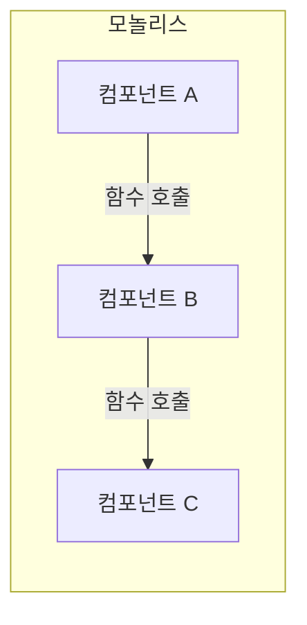
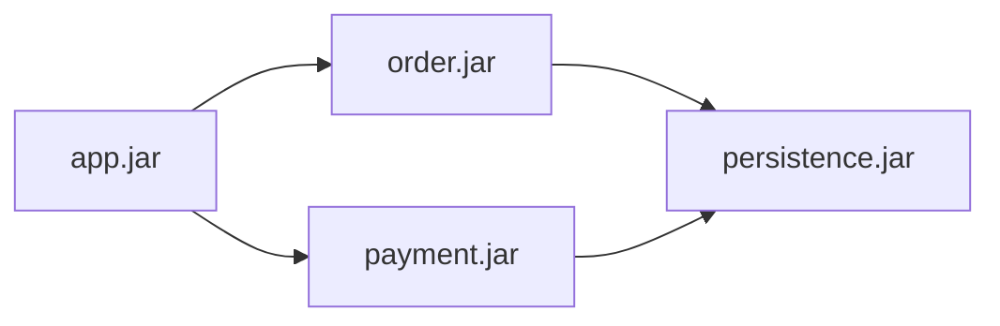
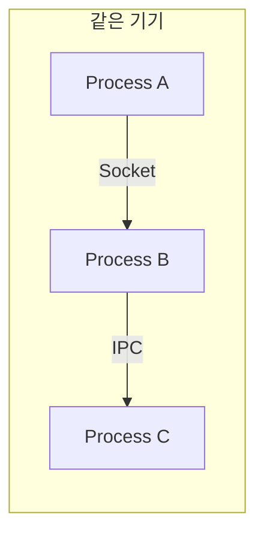
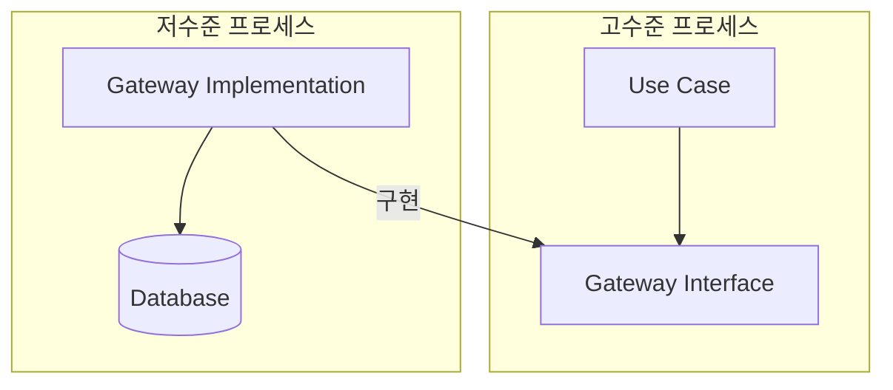
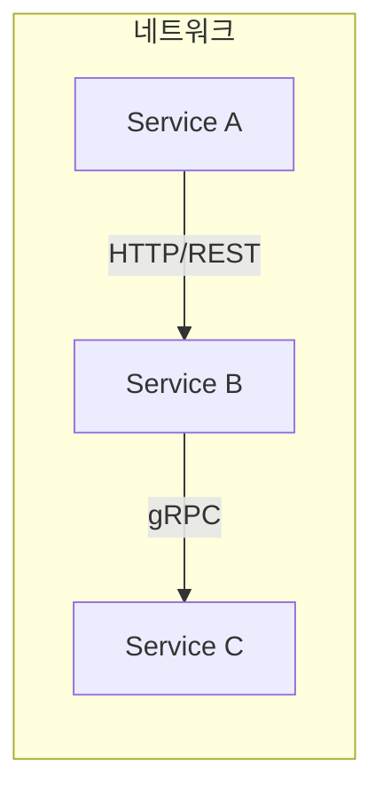
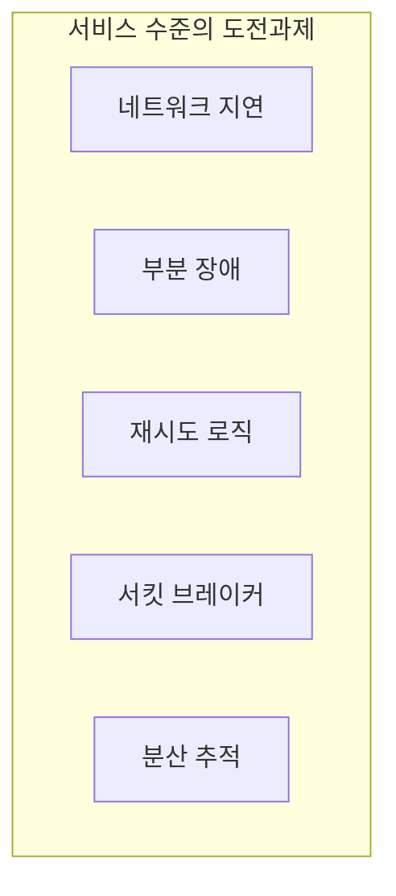
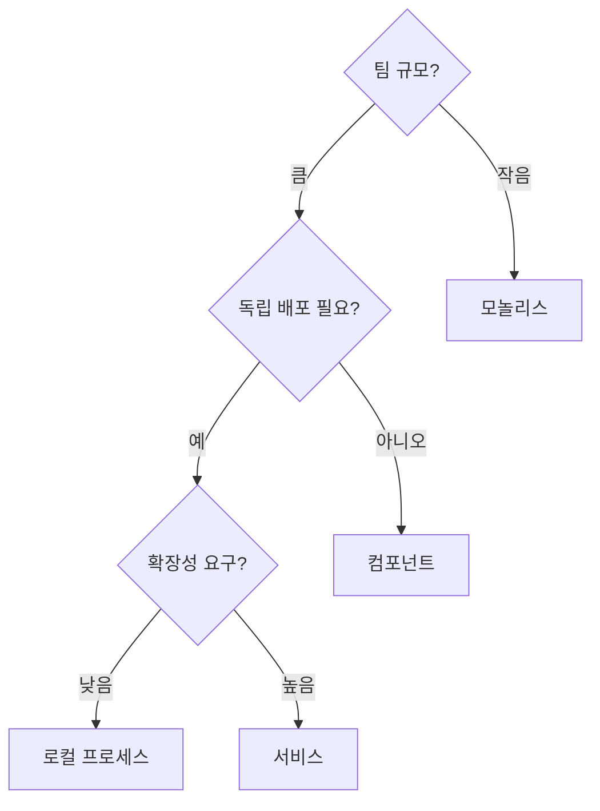

경계는 다양한 **물리적 형태**로 존재한다. 단순한 함수 호출부터 네트워크를 통한 서비스 호출까지, 각각의 비용과 장단점이 다르다.

## 경계 횡단 방식


## 1. 모놀리스 (소스 수준)

**단일 실행 파일**. 경계는 **함수 호출**로 횡단한다.

```java
// 모놀리스: 함수 호출로 경계 횡단
public class OrderService {
    private final OrderRepository repository;
    private final PaymentService paymentService;
    
    public void placeOrder(Order order) {
        // 경계 횡단 1: 결제 서비스 호출
        paymentService.processPayment(order.getPayment());
        
        // 경계 횡단 2: 저장소 호출
        repository.save(order);  // 단순 함수 호출
    }
}
```

### 특징



| 항목 | 설명 |
|------|------|
| 배포 | 하나의 실행 파일 |
| 통신 | 함수 호출 (메모리 내) |
| 지연 | **최저** (나노초) |
| 비용 | 거의 없음 |
| 복잡성 | 최저 |

### 의존성 관리

소스 수준에서도 **의존성 역전**은 적용해야 한다:

```java
// 고수준 모듈
package com.example.order.usecase;

public class PlaceOrderUseCase {
    private final OrderGateway gateway; // 인터페이스
    
    public void execute(OrderRequest request) {
        // 비즈니스 로직
    }
}

// 저수준 모듈이 고수준 인터페이스를 구현
package com.example.order.gateway.mysql;

public class MySqlOrderGateway implements OrderGateway {
    // MySQL 구현
}
```

## 2. 컴포넌트 (바이너리 수준)

**독립 배포 가능한 단위**: jar, dll, gem, shared library 등



```
app.jar
├── uses → order.jar
├── uses → payment.jar
└── uses → persistence.jar

order.jar
└── uses → persistence.jar

payment.jar
└── uses → persistence.jar
```

### 동적 다형성

런타임에 컴포넌트를 교체할 수 있다:

```java
// 인터페이스는 코어에 정의
public interface PaymentProcessor {
    PaymentResult process(Payment payment);
}

// 플러그인 jar: stripe-payment.jar
public class StripeProcessor implements PaymentProcessor {
    public PaymentResult process(Payment payment) {
        // Stripe API 호출
    }
}

// 플러그인 jar: paypal-payment.jar
public class PayPalProcessor implements PaymentProcessor {
    public PaymentResult process(Payment payment) {
        // PayPal API 호출
    }
}

// 런타임에 선택
PaymentProcessor processor = ServiceLoader.load(PaymentProcessor.class)
    .findFirst().orElseThrow();
```

| 항목 | 설명 |
|------|------|
| 배포 | 독립적으로 가능 |
| 통신 | 함수 호출 (같은 프로세스) |
| 지연 | **낮음** (마이크로초) |
| 비용 | 낮음 |
| 복잡성 | 낮음 |

## 3. 로컬 프로세스

**같은 기기의 별도 프로세스**. IPC, 소켓, 메시지 큐로 통신.



```python
# Process A: 주문 서비스
import socket

def send_to_payment(order):
    sock = socket.socket(socket.AF_UNIX, socket.SOCK_STREAM)
    sock.connect('/tmp/payment.sock')
    sock.send(serialize(order))
    response = sock.recv(1024)
    return deserialize(response)
```

### 특징

| 항목 | 설명 |
|------|------|
| 배포 | 독립적 |
| 통신 | IPC, 소켓, 공유 메모리 |
| 지연 | **중간** (밀리초) |
| 비용 | 중간 |
| 복잡성 | 중간 |

### 의존성 역전은 여전히 중요



## 4. 서비스 (서비스 수준)

**네트워크를 통한 통신**. REST, gRPC, GraphQL, 메시지 큐 등.



```java
// REST 클라이언트
@Service
public class PaymentClient {
    private final RestTemplate restTemplate;
    
    public PaymentResult processPayment(Payment payment) {
        // 네트워크 호출 - 수십~수백 밀리초
        return restTemplate.postForObject(
            "https://payment-service/api/payments",
            payment,
            PaymentResult.class
        );
    }
}
```

### 특징

| 항목 | 설명 |
|------|------|
| 배포 | **완전 독립** |
| 통신 | HTTP, gRPC, 메시지 큐 |
| 지연 | **높음** (수십~수백 밀리초) |
| 비용 | 높음 |
| 복잡성 | 높음 (분산 시스템 문제) |

### 서비스의 추가 고려사항



```java
// 서비스 호출 시 고려할 것들
@Service
public class ResilientPaymentClient {
    
    @CircuitBreaker(name = "payment")
    @Retry(name = "payment")
    public PaymentResult processPayment(Payment payment) {
        try {
            return paymentService.process(payment);
        } catch (TimeoutException e) {
            // 타임아웃 처리
            return PaymentResult.pending();
        } catch (ServiceUnavailableException e) {
            // 서비스 불가 처리
            return PaymentResult.retry();
        }
    }
}
```

## 경계 형태 비교

| 형태 | 배포 | 통신 | 지연 | 복잡성 | 적합한 상황 |
|------|------|------|------|--------|------------|
| 모놀리스 | 함께 | 함수 호출 | 나노초 | 최저 | 초기 개발, 작은 팀 |
| 컴포넌트 | 선택적 | 함수 호출 | 마이크로초 | 낮음 | 플러그인 필요 |
| 로컬 프로세스 | 독립 | IPC | 밀리초 | 중간 | 언어 다양성 |
| 서비스 | 독립 | 네트워크 | 수십 밀리초 | 높음 | 완전 독립 배포 |

## 경계의 선택



## 핵심 요약

> **"아키텍트는 경계를 선으로 긋고, 나중에 물리적 형태를 결정한다. 처음부터 서비스일 필요는 없다."**
> — Robert C. Martin

| 원칙 | 설명 |
|------|------|
| 논리적 경계 먼저 | 물리적 형태는 나중에 |
| 의존성 역전 항상 적용 | 모든 경계 형태에서 |
| 단순한 것부터 | 모놀리스 → 필요시 분리 |
| 비용 고려 | 각 형태의 장단점 이해 |

```java
// 핵심: 경계의 물리적 형태가 무엇이든
// 의존성 방향은 항상 고수준을 향해야 한다

// 인터페이스 (고수준)
public interface PaymentGateway {
    PaymentResult process(Payment payment);
}

// 구현 (저수준) - 모놀리스든 서비스든
public class PaymentGatewayImpl implements PaymentGateway {
    // 구현 세부사항
}
```
