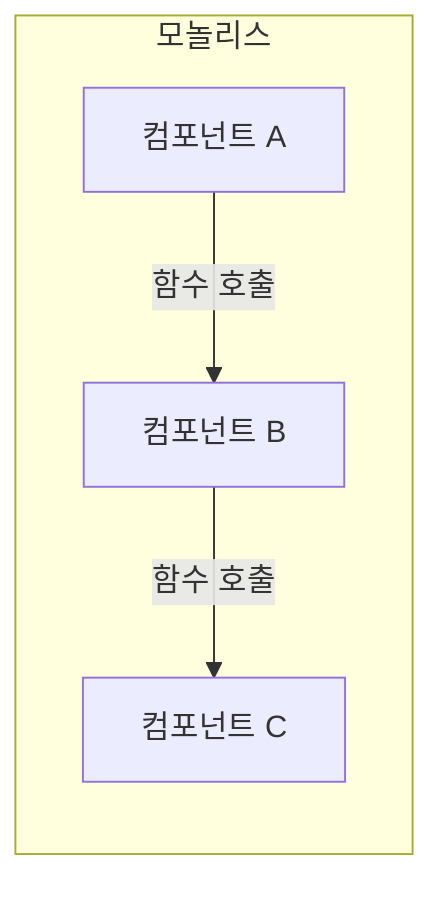
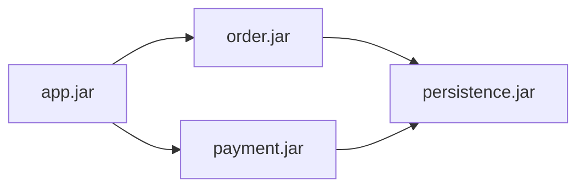
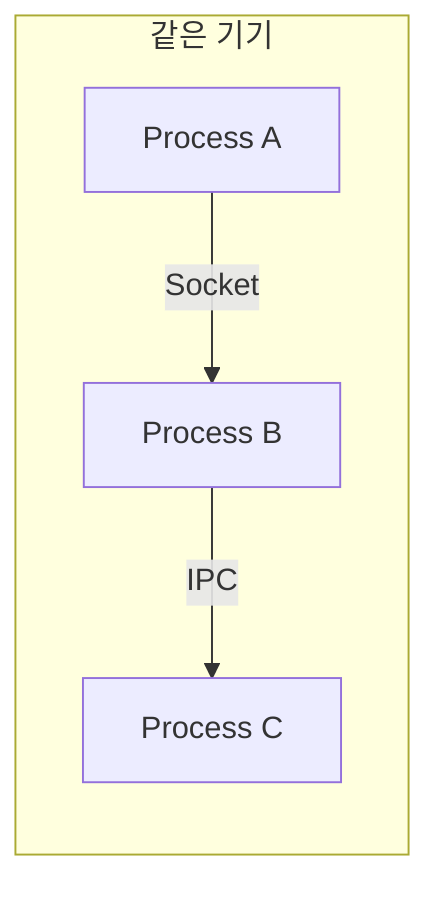
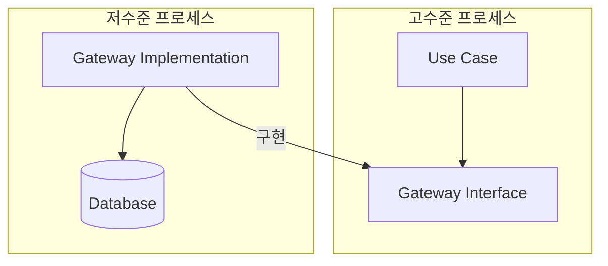
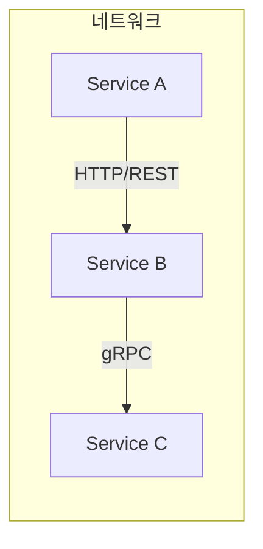
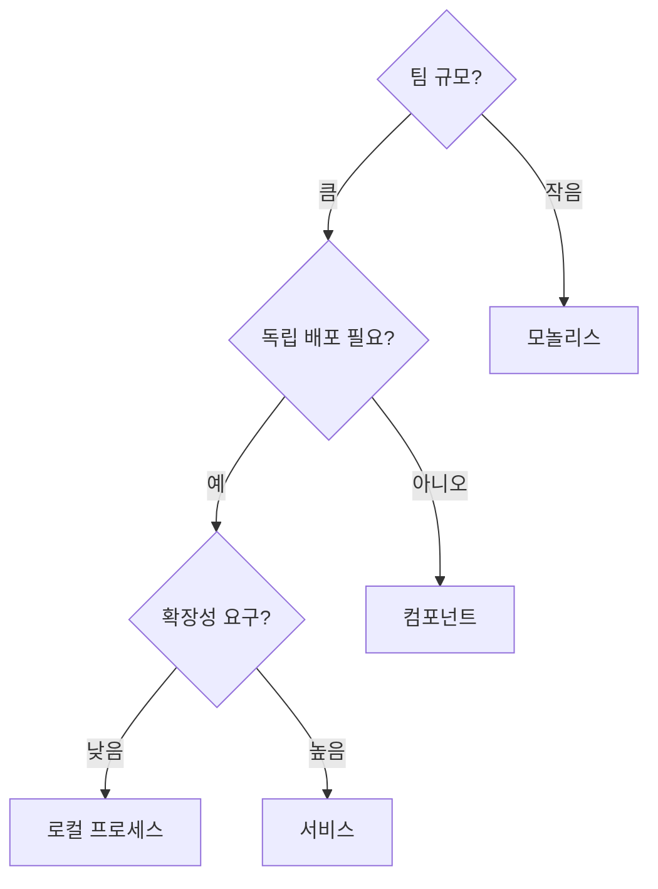

경계는 다양한 **물리적 형태**로 존재한다. 단순한 함수 호출부터 네트워크를 통한 서비스 호출까지, 각각의 비용과 장단점이 다르다.

## 경계 횡단 방식


```mermaid
flowchart TB
    subgraph Boundaries [경계의 물리적 형태]
        MONO[모놀리스<br/>함수 호출]
        COMP[컴포넌트<br/>jar/dll]
        LOCAL[로컬 프로세스<br/>IPC/소켓]
        SVC[서비스<br/>네트워크]
    end
    
    MONO -->|복잡성 증가| COMP
    COMP -->|복잡성 증가| LOCAL
    LOCAL -->|복잡성 증가| SVC
```

## 1. 모놀리스 (소스 수준)

**단일 실행 파일**. 경계는 **함수 호출**로 횡단한다. 논리적 경계(비즈니스 규칙과 세부사항 사이의 인터페이스)는 존재하지만, 물리적으로는 모두 같은 프로세스·같은 메모리 공간 안에서 컴파일되고 실행된다. 이것이 경계의 가장 저렴한 형태다 — 함수를 호출하는 데는 네트워크도, 별도 프로세스도, 직렬화도 필요 없다.

```java
// 모놀리스: 함수 호출로 경계 횡단
public class OrderService {
    private final OrderRepository repository;
    private final PaymentService paymentService;
    
    public void placeOrder(Order order) {
        // 경계 횡단 1: 결제 서비스 호출
        paymentService.processPayment(order.getPayment());
        
        // 경계 횡단 2: 저장소 호출
        repository.save(order);  // 단순 함수 호출
    }
}
```

### 특징


```mermaid
flowchart LR
    subgraph Monolith [모놀리스]
        A[컴포넌트 A]
        B[컴포넌트 B]
        C[컴포넌트 C]
    end
    
    A -->|함수 호출| B
    B -->|함수 호출| C
```

| 항목 | 설명 |
|------|------|
| 배포 | 하나의 실행 파일 |
| 통신 | 함수 호출 (메모리 내) |
| 지연 | **최저** (나노초) |
| 비용 | 거의 없음 |
| 복잡성 | 최저 |

### 의존성 관리

소스 수준에서도 **의존성 역전**은 적용해야 한다:

```java
// 고수준 모듈
package com.example.order.usecase;

public class PlaceOrderUseCase {
    private final OrderGateway gateway; // 인터페이스
    
    public void execute(OrderRequest request) {
        // 비즈니스 로직
    }
}

// 저수준 모듈이 고수준 인터페이스를 구현
package com.example.order.gateway.mysql;

public class MySqlOrderGateway implements OrderGateway {
    // MySQL 구현
}
```

## 2. 컴포넌트 (바이너리 수준)

**독립 배포 가능한 단위**: jar, dll, gem, shared library 등. 여전히 같은 프로세스 안에서 함수 호출로 통신하지만, 각 컴포넌트가 별도 파일로 빌드·배포된다는 점이 모놀리스와 다르다. 덕분에 실행 시점에 어떤 구현체를 로드할지 선택할 수 있는 동적 다형성이 가능해진다.


```mermaid
flowchart LR
    APP[app.jar] --> ORDER[order.jar]
    APP --> PAYMENT[payment.jar]
    ORDER --> PERSISTENCE[persistence.jar]
    PAYMENT --> PERSISTENCE
```

```text
app.jar
├── uses → order.jar
├── uses → payment.jar
└── uses → persistence.jar

order.jar
└── uses → persistence.jar

payment.jar
└── uses → persistence.jar
```

### 동적 다형성

컴포넌트 수준에서는 런타임에 구현체를 교체할 수 있다는 이점이 추가된다. 자바의 `ServiceLoader`처럼 클래스패스에 있는 jar를 스캔해 인터페이스 구현체를 찾아주는 메커니즘을 쓰면, 어떤 플러그인 jar가 배포됐는지에 따라 실제로 어떤 구현이 쓰일지가 실행 시점에 결정된다.

```java
import java.util.ServiceLoader;

record Payment(String orderId, java.math.BigDecimal amount) {}
record PaymentResult(boolean success) {}

// 인터페이스는 코어에 정의
public interface PaymentProcessor {
    PaymentResult process(Payment payment);
}

// 플러그인 jar: stripe-payment.jar
public class StripeProcessor implements PaymentProcessor {
    public PaymentResult process(Payment payment) {
        // Stripe API 호출
        return new PaymentResult(true);
    }
}

// 플러그인 jar: paypal-payment.jar
public class PayPalProcessor implements PaymentProcessor {
    public PaymentResult process(Payment payment) {
        // PayPal API 호출
        return new PaymentResult(true);
    }
}

// 런타임에 선택 - 클래스패스에 있는 플러그인 jar 중 첫 번째 구현체를 사용
PaymentProcessor processor = ServiceLoader.load(PaymentProcessor.class)
    .stream()
    .findFirst()
    .map(ServiceLoader.Provider::get)
    .orElseThrow();
```

| 항목 | 설명 |
|------|------|
| 배포 | 독립적으로 가능 |
| 통신 | 함수 호출 (같은 프로세스) |
| 지연 | **낮음** (마이크로초) |
| 비용 | 낮음 |
| 복잡성 | 낮음 |

## 3. 로컬 프로세스

**같은 기기의 별도 프로세스**. IPC, 소켓, 메시지 큐로 통신. 함수 호출이 아니라 운영체제가 중재하는 통신 수단을 쓰므로, 이제부터는 직렬화·역직렬화 비용과 컨텍스트 스위칭 비용이 지연 시간에 더해진다. 대신 프로세스가 완전히 분리되므로, 한쪽이 다른 언어로 작성돼도 상관없다는 장점이 생긴다.


```mermaid
flowchart LR
    subgraph Machine [같은 기기]
        P1[Process A]
        P2[Process B]
        P3[Process C]
    end
    
    P1 -->|Socket| P2
    P2 -->|IPC| P3
```

```python
# Process A: 주문 서비스
import socket

def send_to_payment(order):
    sock = socket.socket(socket.AF_UNIX, socket.SOCK_STREAM)
    sock.connect('/tmp/payment.sock')
    sock.send(serialize(order))
    response = sock.recv(1024)
    return deserialize(response)
```

### 특징

| 항목 | 설명 |
|------|------|
| 배포 | 독립적 |
| 통신 | IPC, 소켓, 공유 메모리 |
| 지연 | **중간** (밀리초) |
| 비용 | 중간 |
| 복잡성 | 중간 |

### 의존성 역전은 여전히 중요


```mermaid
flowchart TB
    subgraph HighLevel [고수준 프로세스]
        UC[Use Case]
        INTF[Gateway Interface]
    end
    
    subgraph LowLevel [저수준 프로세스]
        GW[Gateway Implementation]
        DB[(Database)]
    end
    
    UC --> INTF
    GW -->|구현| INTF
    GW --> DB
```

## 4. 서비스 (서비스 수준)

**네트워크를 통한 통신**. REST, gRPC, GraphQL, 메시지 큐 등. 프로세스가 다른 기기에 있을 수도 있다는 것이 로컬 프로세스와의 결정적 차이다. 네트워크는 로컬 IPC보다 훨씬 느리고, 언제든 끊어질 수 있다는 전제를 깔고 설계해야 한다 — 그래서 서비스 수준부터는 지연·부분 장애·재시도 같은 새로운 문제가 등장한다.


```mermaid
flowchart LR
    subgraph Internet [네트워크]
        SA[Service A]
        SB[Service B]
        SC[Service C]
    end
    
    SA -->|HTTP/REST| SB
    SB -->|gRPC| SC
```

```java
import org.springframework.stereotype.Service;
import org.springframework.web.client.RestTemplate;

record PaymentResult(boolean success, String message) {}

// REST 클라이언트
@Service
public class PaymentClient {
    private final RestTemplate restTemplate;

    PaymentClient(RestTemplate restTemplate) {
        this.restTemplate = restTemplate;
    }

    public PaymentResult processPayment(Payment payment) {
        // 네트워크 호출 - 수십~수백 밀리초
        return restTemplate.postForObject(
            "https://payment-service/api/payments",
            payment,
            PaymentResult.class
        );
    }
}
```

### 특징

| 항목 | 설명 |
|------|------|
| 배포 | **완전 독립** |
| 통신 | HTTP, gRPC, 메시지 큐 |
| 지연 | **높음** (수십~수백 밀리초) |
| 비용 | 높음 |
| 복잡성 | 높음 (분산 시스템 문제) |

### 서비스의 추가 고려사항

함수 호출은 실패하지 않는다는 전제를 깔고 코드를 짤 수 있지만, 네트워크 호출은 언제든 응답이 늦어지거나 아예 오지 않을 수 있다는 전제를 깔아야 한다. 그래서 서비스 수준의 경계에는 모놀리스에는 없던 새로운 책임(재시도, 타임아웃, 장애 격리)이 추가된다.


```mermaid
flowchart TB
    subgraph Challenges [서비스 수준의 도전과제]
        NET[네트워크 지연]
        FAIL[부분 장애]
        RETRY[재시도 로직]
        CIRCUIT[서킷 브레이커]
        TRACE[분산 추적]
    end
```

```java
import io.github.resilience4j.circuitbreaker.annotation.CircuitBreaker;
import io.github.resilience4j.retry.annotation.Retry;
import org.springframework.stereotype.Service;
import java.util.concurrent.TimeoutException;

// 서비스 호출 시 고려할 것들
@Service
public class ResilientPaymentClient {
    private final PaymentClient paymentClient;

    ResilientPaymentClient(PaymentClient paymentClient) {
        this.paymentClient = paymentClient;
    }

    @CircuitBreaker(name = "payment")
    @Retry(name = "payment")
    public PaymentResult processPayment(Payment payment) {
        try {
            return paymentClient.processPayment(payment);
        } catch (TimeoutException e) {
            // 타임아웃 처리
            return new PaymentResult(false, "pending");
        } catch (RuntimeException e) {
            // 서비스 불가 처리
            return new PaymentResult(false, "retry");
        }
    }
}
```

## 경계 형태 비교

| 형태 | 배포 | 통신 | 지연 | 복잡성 | 적합한 상황 |
|------|------|------|------|--------|------------|
| 모놀리스 | 함께 | 함수 호출 | 나노초 | 최저 | 초기 개발, 작은 팀 |
| 컴포넌트 | 선택적 | 함수 호출 | 마이크로초 | 낮음 | 플러그인 필요 |
| 로컬 프로세스 | 독립 | IPC | 밀리초 | 중간 | 언어 다양성 |
| 서비스 | 독립 | 네트워크 | 수십 밀리초 | 높음 | 완전 독립 배포 |

## 경계의 선택


```mermaid
flowchart TB
    Q1{팀 규모?}
    Q2{독립 배포 필요?}
    Q3{확장성 요구?}
    
    Q1 -->|작음| MONO[모놀리스]
    Q1 -->|큼| Q2
    
    Q2 -->|아니오| COMP[컴포넌트]
    Q2 -->|예| Q3
    
    Q3 -->|낮음| LOCAL[로컬 프로세스]
    Q3 -->|높음| SVC[서비스]
```

## 흔한 오해

"경계를 그었으니 처음부터 서비스로 배포해야 한다"는 생각이 흔한 오해다. 이 장의 핵심은 오히려 반대다 — 경계는 **논리적**으로 먼저 긋고, 그 경계를 **물리적으로** 어떻게 구현할지(함수 호출, jar, IPC, 네트워크)는 별개의 나중 결정이다. 처음부터 서비스 수준으로 시작하면 네트워크 지연·부분 장애·분산 추적 같은 비용을 프로젝트 초기부터 떠안게 된다. 또 다른 오해는 의존성 역전이 서비스 경계에서만 중요하다는 생각이다. 이 장이 보여주듯 모놀리스의 단순 함수 호출에서도 고수준 모듈이 저수준 구현을 직접 참조하면 동일한 결합 문제가 생긴다 — 물리적 형태와 무관하게 의존성 방향은 항상 지켜야 한다.

## 학습 목표

이 장을 읽은 후 다음을 스스로 점검한다.

- 모놀리스·컴포넌트·로컬 프로세스·서비스 네 가지 경계 형태를 지연 시간·복잡성 순으로 비교할 수 있는가?
- 각 경계 형태에서도 의존성 역전이 왜 여전히 필요한지 코드 예로 설명할 수 있는가?
- 서비스 수준에서만 추가로 고려해야 하는 문제(부분 장애, 재시도, 서킷 브레이커)를 설명할 수 있는가?
- "논리적 경계를 먼저 긋고 물리적 형태는 나중에 정한다"는 원칙을 실제 설계 결정에 적용할 수 있는가?

## 판단 기준

경계의 물리적 형태를 선택할 때 다음을 확인한다.

- 팀이 독립적으로 배포해야 하는가, 아니면 함께 배포해도 무방한가?
- 요구되는 지연 시간과 처리량이 함수 호출 수준인가, 네트워크 호출을 감수할 수 있는 수준인가?
- 지금 서비스로 분리할 만큼 이 경계가 안정적인가, 아니면 아직 요구사항이 바뀌고 있어 모놀리스 안에서 논리적으로만 분리해 두는 것이 나은가?
- 서비스로 분리한다면 네트워크 장애·재시도·타임아웃을 처리할 준비가 되어 있는가?

## 참고 자료

- Robert C. Martin, 『Clean Architecture』, 2017, 18장 — 경계의 물리적 형태와 각 형태의 비용 비교의 원 출처.

## 핵심 요약

| 원칙 | 설명 |
|------|------|
| 논리적 경계 먼저 | 물리적 형태는 나중에 |
| 의존성 역전 항상 적용 | 모든 경계 형태에서 |
| 단순한 것부터 | 모놀리스 → 필요시 분리 |
| 비용 고려 | 각 형태의 장단점 이해 |

핵심은 앞서 본 `OrderGateway`(모놀리스)·`PaymentGateway`(플러그인)·`Gateway Interface`(로컬 프로세스) 예제 모두에서 반복된 하나의 규칙이다 — 경계의 물리적 형태가 무엇이든, 의존성 방향은 항상 고수준(비즈니스 규칙)을 향해야 한다. 마틴은 아키텍트가 경계를 선으로 긋고 나중에 물리적 형태를 결정한다고 말한다. 처음부터 서비스일 필요는 없다(Martin, 『Clean Architecture』, 2017, 18장).
