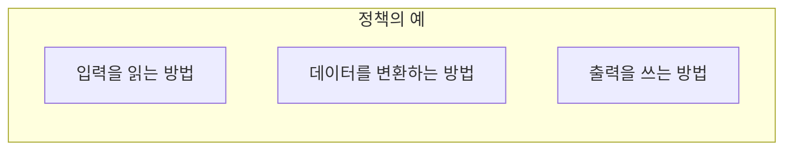
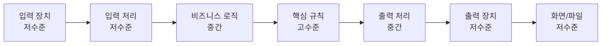
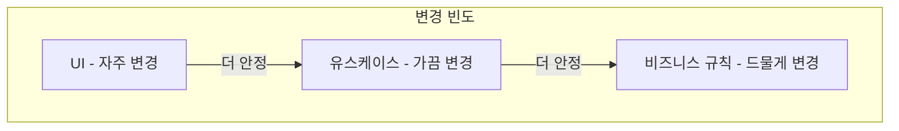
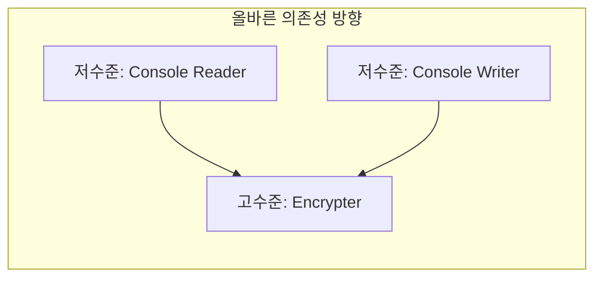
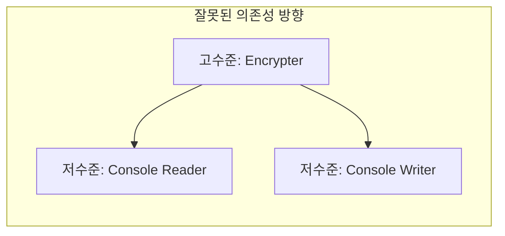
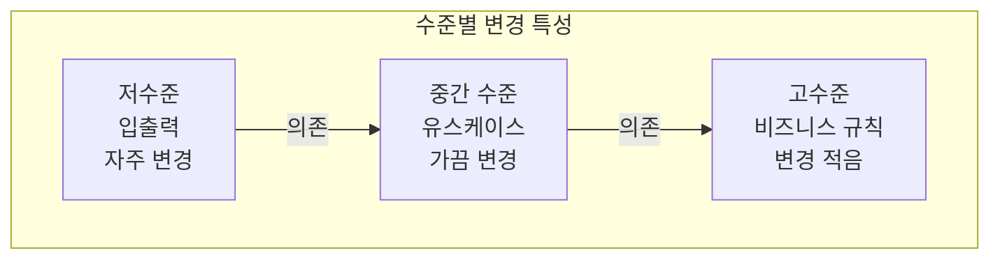
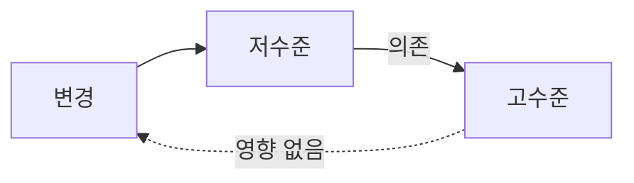

소프트웨어 시스템은 여러 **정책(Policy)**의 집합이다. 정책들은 서로 다른 **수준(Level)**에 존재하며, 의존성은 수준의 방향으로 흘러야 한다.

## 정책(Policy)이란?

정책은 시스템의 **행동을 기술**하는 것이다.



### 정책의 예시

| 정책 유형 | 예시 |
|----------|------|
| 입력 정책 | 키보드 읽기, 파일 읽기, HTTP 요청 수신 |
| 변환 정책 | 암호화, 포맷 변환, 비즈니스 규칙 적용 |
| 출력 정책 | 화면 출력, 파일 저장, HTTP 응답 전송 |

```java
// 다양한 정책의 예
// 입력 정책
interface InputReader {
    String read();
}

// 변환 정책 (비즈니스 규칙)
interface Transformer {
    String transform(String input);
}

// 출력 정책
interface OutputWriter {
    void write(String output);
}
```

## 수준(Level)이란?

**입력과 출력으로부터의 거리**가 수준을 결정한다.



### 수준의 정의

| 수준 | 특징 | 예시 |
|------|------|------|
| **고수준** | 입출력에서 멀리 떨어짐 | 핵심 비즈니스 규칙 |
| **중간 수준** | 변환과 처리 | 유스케이스 |
| **저수준** | 입출력에 가까움 | UI, DB, 외부 API |

### 왜 거리가 중요한가?

> "입력과 출력에 가까울수록 **변경 가능성이 높다**. 멀수록 **안정적**이다."



## 의존성 방향

의존성은 **수준이 낮은 곳에서 수준이 높은 곳**으로 흘러야 한다.



### 잘못된 의존성



고수준 정책이 저수준 정책을 **모르게** 해야 한다.

## 예시: 암호화 프로그램

마틴은 간단한 암호화 프로그램을 예로 들어 설명한다.

### 요구사항

- 문자를 읽어서
- 암호화하고
- 암호화된 문자를 출력

### 잘못된 설계

```java
// 고수준이 저수준에 의존 - 나쁜 설계
public class Encrypter {
    private ConsoleReader reader;   // 저수준에 의존!
    private ConsoleWriter writer;   // 저수준에 의존!
    
    public void encrypt() {
        char c = reader.readChar();
        char encrypted = doEncrypt(c);
        writer.writeChar(encrypted);
    }
    
    private char doEncrypt(char c) {
        // 암호화 로직 (고수준)
        return (char)(c + 1);
    }
}
```

### 올바른 설계

```java
// 고수준: 비즈니스 규칙 (인터페이스만 알고 있음)
public interface Encrypt {
    char encrypt(char c);
}

public class CaesarCipher implements Encrypt {
    private final int shift;
    
    public char encrypt(char c) {
        return (char)(c + shift);
    }
}

// 저수준: 입출력 인터페이스
public interface CharReader {
    char readChar();
}

public interface CharWriter {
    void writeChar(char c);
}

// 저수준 구현: 고수준 인터페이스에 의존
public class ConsoleReader implements CharReader {
    public char readChar() {
        return (char) System.in.read();
    }
}

public class ConsoleWriter implements CharWriter {
    public void writeChar(char c) {
        System.out.print(c);
    }
}
```

### 조립 (의존성 주입)

```java
// Main에서 조립
public class Main {
    public static void main(String[] args) {
        CharReader reader = new ConsoleReader();
        CharWriter writer = new ConsoleWriter();
        Encrypt encrypt = new CaesarCipher(3);
        
        // 고수준 모듈에 저수준 구현 주입
        EncryptionService service = new EncryptionService(
            reader, writer, encrypt
        );
        service.run();
    }
}

// 고수준 서비스: 인터페이스만 의존
public class EncryptionService {
    private final CharReader reader;
    private final CharWriter writer;
    private final Encrypt encrypt;
    
    public void run() {
        char c;
        while ((c = reader.readChar()) != EOF) {
            writer.writeChar(encrypt.encrypt(c));
        }
    }
}
```

## 수준과 변경



| 수준 | 변경 빈도 | 변경 이유 |
|------|----------|----------|
| 고수준 | 드물게 | 비즈니스 요구사항 변경 |
| 중간 수준 | 가끔 | 새로운 기능 추가 |
| 저수준 | 자주 | 기술 변경, UI 개선 |

### 왜 고수준으로 의존해야 하는가?

```java
// 저수준이 변경되어도 고수준은 영향 없음

// 콘솔 → 파일로 변경
public class FileReader implements CharReader {
    public char readChar() {
        return fileInputStream.read();
    }
}

// 암호화 로직(고수준)은 그대로!
public class CaesarCipher implements Encrypt {
    public char encrypt(char c) {
        return (char)(c + shift);
    }
}
```

## 아키텍처에 적용

```mermaid
flowchart TB
    subgraph Architecture [클린 아키텍처의 수준]
        ENT[Entities<br/>가장 고수준]
        UC[Use Cases<br/>고수준]
        CTRL[Controllers<br/>중간]
        GW[Gateways<br/>저수준]
        DB[(DB)<br/>가장 저수준]
    end
    
    DB --> GW --> CTRL --> UC --> ENT
```

## 핵심 요약

| 원칙 | 설명 |
|------|------|
| 수준의 정의 | 입출력으로부터의 거리 |
| 의존성 방향 | 저수준 → 고수준 |
| 고수준의 특징 | 안정적, 변경 적음 |
| 저수준의 특징 | 불안정, 변경 많음 |

> **"수준이 높을수록 변경이 적고, 수준이 낮을수록 변경이 많다. 따라서 의존성은 고수준을 향해야 한다."**
> — Robert C. Martin



안정적인 고수준 정책이 불안정한 저수준 정책을 모르게 하면, **저수준의 변경이 고수준에 영향을 주지 않는다**.
