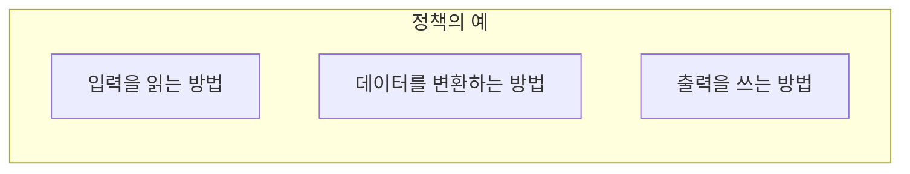
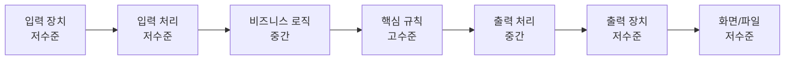
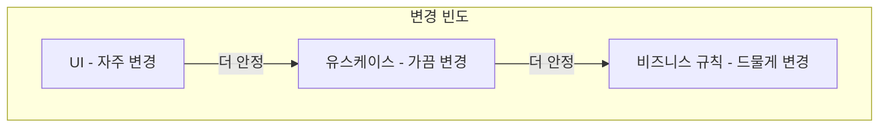
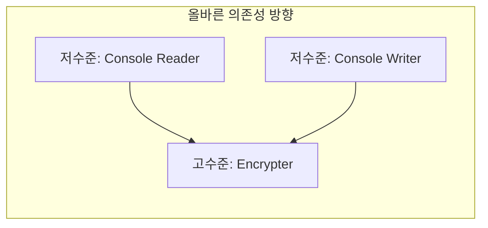
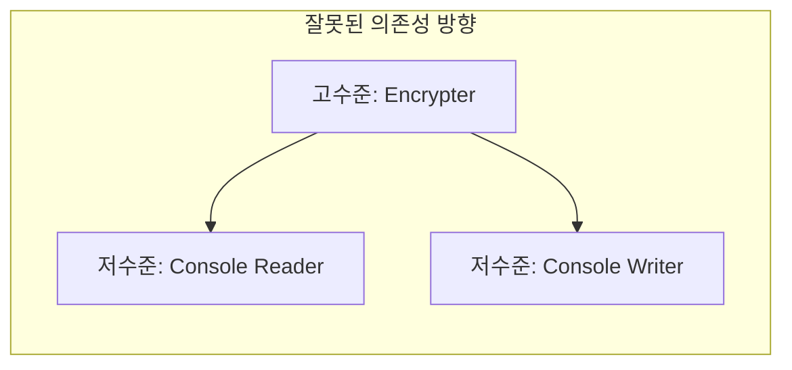
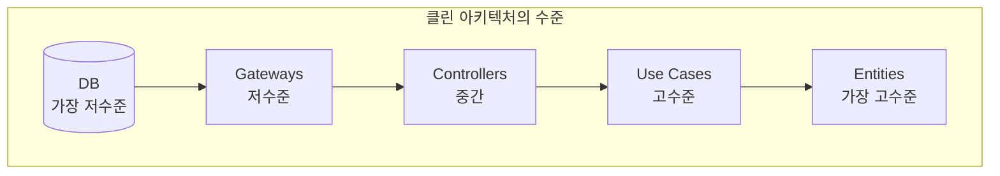

소프트웨어 시스템은 여러 **정책(Policy)**의 집합이다. 정책들은 서로 다른 **수준(Level)**에 존재하며, 의존성은 수준의 방향으로 흘러야 한다.

## 정책(Policy)이란?

정책은 시스템의 **행동을 기술**하는 것이다. 프로그램이 하는 일을 잘게 쪼개보면, 결국 "무언가를 읽고, 그것을 바꾸고, 무언가를 쓰는" 규칙들의 집합으로 볼 수 있다. 문제는 이 규칙들이 하나의 덩어리가 아니라, 서로 성격이 다른 여러 층위로 이뤄져 있다는 점이다.


```mermaid
flowchart LR
    subgraph Policies [정책의 예]
        P1[입력을 읽는 방법]
        P2[데이터를 변환하는 방법]
        P3[출력을 쓰는 방법]
    end
```

### 정책의 예시

앞서 정의한 세 층위(입력을 읽는 방법·데이터를 변환하는 방법·출력을 쓰는 방법)를 실제 소프트웨어에 대응시키면 아래 표와 같다. 세 정책이 하는 일은 서로 완전히 다르지만, "무언가를 규칙에 따라 처리한다"는 점에서 모두 정책이라는 공통 분류에 속한다.

| 정책 유형 | 예시 |
|----------|------|
| 입력 정책 | 키보드 읽기, 파일 읽기, HTTP 요청 수신 |
| 변환 정책 | 암호화, 포맷 변환, 비즈니스 규칙 적용 |
| 출력 정책 | 화면 출력, 파일 저장, HTTP 응답 전송 |

이를 코드로 옮기면 각 정책은 별도의 인터페이스로 분리된다. 아래 예제에서 `InputReader`·`Transformer`·`OutputWriter`는 각각 위 표의 세 정책 유형에 대응하며, 아직은 어느 것이 더 "높은 수준"인지 구분하지 않은 상태다 — 그 구분 기준이 다음 절의 주제다.

```java
// 다양한 정책의 예
// 입력 정책
interface InputReader {
    String read();
}

// 변환 정책 (비즈니스 규칙)
interface Transformer {
    String transform(String input);
}

// 출력 정책
interface OutputWriter {
    void write(String output);
}
```

## 수준(Level)이란?

**입력과 출력으로부터의 거리**가 수준을 결정한다. 데이터가 입력 장치에서 들어와 여러 단계를 거쳐 가공된 뒤 출력 장치로 나가는 과정을 상상해보면, 입출력에 가장 가까운 코드(장치를 직접 다루는 코드)가 저수준이고, 그 흐름 한가운데서 "이 데이터로 무엇을 할지"를 결정하는 핵심 규칙이 가장 멀리 떨어진 고수준이다.


```mermaid
flowchart LR
    INPUT[입력 장치<br/>저수준]
    LOW1[입력 처리<br/>저수준]
    MID[비즈니스 로직<br/>중간]
    HIGH[핵심 규칙<br/>고수준]
    MID2[출력 처리<br/>중간]
    LOW2[출력 장치<br/>저수준]
    OUTPUT[화면/파일<br/>저수준]
    
    INPUT --> LOW1 --> MID --> HIGH
    HIGH --> MID2 --> LOW2 --> OUTPUT
```

### 수준의 정의

| 수준 | 특징 | 예시 |
|------|------|------|
| **고수준** | 입출력에서 멀리 떨어짐 | 핵심 비즈니스 규칙 |
| **중간 수준** | 변환과 처리 | 유스케이스 |
| **저수준** | 입출력에 가까움 | UI, DB, 외부 API |

### 왜 거리가 중요한가?

마틴은 정책이 입력과 출력 양쪽 모두로부터 멀리 떨어져 있을수록 그 정책의 수준이 높아진다고 설명한다(Martin, 『Clean Architecture』, 2017, 19장). 입출력에 가까운 코드는 장치·프로토콜·화면 형식처럼 외부 요인에 자주 휘둘리는 반면, 입출력에서 먼 코드는 그런 외부 요인과 직접 맞닿지 않으므로 상대적으로 변경 압력을 덜 받는다.


```mermaid
flowchart TB
    subgraph ChangeFrequency [변경 빈도]
        UI[UI - 자주 변경]
        UC[유스케이스 - 가끔 변경]
        BR[비즈니스 규칙 - 드물게 변경]
    end
    
    UI -->|더 안정| UC -->|더 안정| BR
```

## 의존성 방향

수준이 곧 변경 빈도를 결정한다면, 의존성의 방향도 그 결론을 따라야 한다. 자주 바뀌는 저수준 코드가 드물게 바뀌는 고수준 코드를 알게 하는 것은 괜찮지만, 그 반대(드물게 바뀌어야 할 고수준 코드가 자주 바뀌는 저수준 코드를 알게 되는 것)는 고수준 코드까지 저수준의 변경에 휘말리게 만든다. 그래서 의존성은 **수준이 낮은 곳에서 수준이 높은 곳**으로 흘러야 한다.


```mermaid
flowchart TB
    subgraph Good [올바른 의존성 방향]
        direction TB
        L1[저수준: Console Reader]
        L2[저수준: Console Writer]
        H[고수준: Encrypter]
        
        L1 --> H
        L2 --> H
    end
```

### 잘못된 의존성

반대로 고수준 모듈이 저수준 구현을 직접 참조하면 방향이 뒤집힌다.


```mermaid
flowchart TB
    subgraph Bad [잘못된 의존성 방향]
        direction TB
        H2[고수준: Encrypter]
        L3[저수준: Console Reader]
        L4[저수준: Console Writer]
        
        H2 --> L3
        H2 --> L4
    end
```

이 상태에서는 `Console Reader`를 `FileReader`로 바꾸는 것처럼 사소한 저수준 변경조차 `Encrypter` 내부 코드를 직접 수정하게 만든다. 고수준 정책이 저수준 정책을 **모르게** 해야 하는 이유가 여기에 있다.

## 예시: 암호화 프로그램

마틴은 간단한 암호화 프로그램을 예로 들어 설명한다. 이 예제가 유용한 이유는 겉보기에 단순한 "읽기→암호화→쓰기" 흐름 안에도 수준이 다른 정책이 섞여 있다는 것을 보여주기 때문이다 — 어떤 문자를 어떻게 암호화할지는 고수준 규칙이고, 그 문자를 어디서 읽고 어디로 쓸지는 저수준 세부사항이다.

### 요구사항

- 문자를 읽어서
- 암호화하고
- 암호화된 문자를 출력

### 잘못된 설계

```java
// 고수준이 저수준에 의존 - 나쁜 설계
class ConsoleReader { char readChar() { return 'a'; } }
class ConsoleWriter { void writeChar(char c) { System.out.print(c); } }

public class Encrypter {
    private ConsoleReader reader;   // 저수준에 의존!
    private ConsoleWriter writer;   // 저수준에 의존!
    
    public void encrypt() {
        char c = reader.readChar();
        char encrypted = doEncrypt(c);
        writer.writeChar(encrypted);
    }
    
    private char doEncrypt(char c) {
        // 암호화 로직 (고수준)
        return (char)(c + 1);
    }
}
```

### 올바른 설계

```java
// 고수준: 비즈니스 규칙 (인터페이스만 알고 있음)
public interface Encrypt {
    char encrypt(char c);
}

public class CaesarCipher implements Encrypt {
    private final int shift;

    public CaesarCipher(int shift) {
        this.shift = shift;
    }

    public char encrypt(char c) {
        return (char)(c + shift);
    }
}

// 저수준: 입출력 인터페이스
// int를 쓰는 이유: char는 EOF(-1)를 표현할 수 없어 int 기반 시그니처가 필요하다
public interface CharReader {
    int readChar();  // 문자 코드 또는 EOF(-1) 반환
}

public interface CharWriter {
    void writeChar(char c);
}

// 저수준 구현: 고수준 인터페이스에 의존
public class ConsoleReader implements CharReader {
    public int readChar() {
        try {
            return System.in.read();  // EOF 시 -1 반환
        } catch (java.io.IOException e) {
            return -1;
        }
    }
}

public class ConsoleWriter implements CharWriter {
    public void writeChar(char c) {
        System.out.print(c);
    }
}
```

### 조립 (의존성 주입)

```java
// Main에서 조립
public class Main {
    public static void main(String[] args) {
        CharReader reader = new ConsoleReader();
        CharWriter writer = new ConsoleWriter();
        Encrypt encrypt = new CaesarCipher(3);
        
        // 고수준 모듈에 저수준 구현 주입
        EncryptionService service = new EncryptionService(
            reader, writer, encrypt
        );
        service.run();
    }
}

// 고수준 서비스: 인터페이스만 의존
public class EncryptionService {
    private static final int EOF = -1;
    private final CharReader reader;
    private final CharWriter writer;
    private final Encrypt encrypt;

    public EncryptionService(CharReader reader, CharWriter writer, Encrypt encrypt) {
        this.reader = reader;
        this.writer = writer;
        this.encrypt = encrypt;
    }

    public void run() {
        int code;
        while ((code = reader.readChar()) != EOF) {
            writer.writeChar(encrypt.encrypt((char) code));
        }
    }
}
```

## 수준과 변경

앞서 "왜 거리가 중요한가?" 절에서 거리와 안정성의 관계를 다이어그램으로 봤다면, 여기서는 각 수준이 구체적으로 **무엇 때문에** 바뀌는지를 짚는다. 변경 빈도가 다르다는 사실 자체보다, 그 변경을 일으키는 원인이 수준마다 다르다는 점이 의존성 방향을 결정하는 진짜 이유다.

| 수준 | 변경 빈도 | 변경 이유 |
|------|----------|----------|
| 고수준 | 드물게 | 비즈니스 요구사항 변경 |
| 중간 수준 | 가끔 | 새로운 기능 추가 |
| 저수준 | 자주 | 기술 변경, UI 개선 |

### 왜 고수준으로 의존해야 하는가?

`CaesarCipher`가 `CharReader` 인터페이스에만 의존하고 `ConsoleReader`라는 구체 클래스를 직접 참조하지 않았기 때문에, 입력 소스를 콘솔에서 파일로 바꾸는 일은 `FileCharReader`라는 새 클래스를 하나 추가하는 것으로 끝난다. 암호화 로직을 담은 `CaesarCipher`는 단 한 줄도 건드릴 필요가 없다.

```java
// 저수준이 변경되어도 고수준은 영향 없음
interface CharReader { int readChar(); }
interface Encrypt { char encrypt(char c); }

// 콘솔 → 파일로 변경
public class FileCharReader implements CharReader {
    private final java.io.InputStream fileInputStream;

    FileCharReader(java.io.InputStream fileInputStream) {
        this.fileInputStream = fileInputStream;
    }

    public int readChar() {
        try {
            return fileInputStream.read();  // EOF 시 -1 반환
        } catch (java.io.IOException e) {
            return -1;
        }
    }
}

// 암호화 로직(고수준)은 그대로!
public class CaesarCipher implements Encrypt {
    private final int shift;

    public CaesarCipher(int shift) {
        this.shift = shift;
    }

    public char encrypt(char c) {
        return (char)(c + shift);
    }
}
```

## 아키텍처에 적용

이 장에서 다룬 "수준"은 Clean Architecture의 동심원과 정확히 같은 축이다. Entities는 가장 안정적인 업무 규칙이므로 가장 고수준이고, Gateways·DB는 입출력에 가장 가까운 세부사항이므로 가장 저수준이다. 의존성이 저수준에서 고수준으로 흐른다는 이 장의 규칙은, 곧 동심원에서 바깥쪽이 안쪽으로 의존해야 한다는 규칙과 동일하다. 이 고수준 정책이 구체적으로 무엇으로 이루어지는지는 [30장: 업무 규칙](/post/clean-architecture/business-rules-entities-usecases/)에서 엔터티와 유스케이스로 나눠 다룬다.


```mermaid
flowchart TB
    subgraph Architecture [클린 아키텍처의 수준]
        ENT[Entities<br/>가장 고수준]
        UC[Use Cases<br/>고수준]
        CTRL[Controllers<br/>중간]
        GW[Gateways<br/>저수준]
        DB[("DB<br/>가장 저수준")]
    end
    
    DB --> GW --> CTRL --> UC --> ENT
```

## 흔한 오해

"고수준"을 "추상 클래스나 인터페이스"와 같은 말로, "저수준"을 "구체 클래스"와 같은 말로 오해하기 쉽다. 그러나 이 장이 정의하는 수준은 추상화 정도가 아니라 **입출력으로부터의 거리**다. 암호화 예제에서 `Encrypt` 인터페이스와 `CaesarCipher` 구현 모두 고수준에 속한다 — 암호화 알고리즘이 무엇이든 입출력 장치와 무관하게 성립하는 규칙이기 때문이다. 반면 `CharReader`·`CharWriter`는 인터페이스임에도 저수준이다. 입출력 장치에 직접 닿아 있어 자주 바뀔 수 있기 때문이다. 즉 추상화(인터페이스 vs 구현)와 수준(고수준 vs 저수준)은 서로 다른 축이며, 둘 다 같은 방향(안정적인 쪽)으로 의존성이 향해야 한다는 점에서만 만난다.

수준 구분이 항상 깔끔하게 떨어지는 것은 아니다. 실무에서는 하나의 유스케이스가 "입력 검증"(저수준에 가까움)과 "핵심 계산"(고수준)을 함께 처리하는 경우가 흔해, 어디까지를 고수준으로 볼지 애매해진다. 또한 수준을 지나치게 잘게 나누면(입력 처리·검증·변환·계산을 모두 별도 계층으로 분리하는 식) 계층 사이를 오가는 호출이 늘어나 오히려 코드를 따라가기 어려워진다. 수준 구분은 "무조건 세분화"가 아니라, 실제로 변경 빈도가 다른 지점에서만 경계를 긋는 것이 목적이다.

## 학습 목표

이 장을 읽은 후 다음을 스스로 점검한다.

- 수준(Level)이 "입출력으로부터의 거리"로 정의된다는 것을, 추상화 정도와 구분해 설명할 수 있는가?
- 암호화 예제에서 왜 `Encrypt`는 고수준이고 `CharReader`는 저수준인지 설명할 수 있는가?
- 저수준 구현(콘솔 → 파일)이 바뀌어도 고수준 로직이 영향받지 않는 이유를 코드로 설명할 수 있는가?
- Clean Architecture의 동심원(Entities → Use Cases → Controllers → Gateways)이 왜 수준의 순서와 일치하는지 설명할 수 있는가?

## 판단 기준

새 클래스나 모듈을 어느 수준에 배치할지 판단할 때 다음을 확인한다.

- 이 코드가 입출력 장치(파일, 네트워크, DB, UI)의 구체적인 형태가 바뀌면 함께 바뀌는가? 그렇다면 저수준이다.
- 이 코드가 특정 기술과 무관하게, 비즈니스 요구사항이 바뀔 때만 바뀌는가? 그렇다면 고수준이다.
- 지금 의존성 화살표가 저수준에서 고수준으로 향하는가, 아니면 고수준 코드에 저수준 클래스 이름이 직접 등장하는가?

## 참고 자료

- Robert C. Martin, 『Clean Architecture』, 2017, 19장 — 정책과 수준, 암호화 예제의 원 출처.

## 핵심 요약

| 원칙 | 설명 |
|------|------|
| 수준의 정의 | 입출력으로부터의 거리 |
| 의존성 방향 | 저수준 → 고수준 |
| 고수준의 특징 | 안정적, 변경 적음 |
| 저수준의 특징 | 불안정, 변경 많음 |
