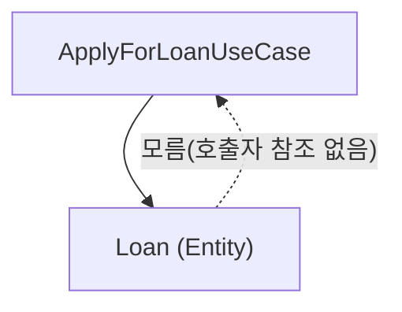

[29장: 정책과 수준](/post/clean-architecture/policy-and-level-high-level-dependency/)에서 상위 정책일수록 변경 빈도가 낮고 하위 세부사항에 의존하지 않아야 한다는 원칙을 다뤘다. 이 장은 그 원칙을 실제 코드 단위로 구체화한다 — 업무 규칙은 시스템에서 가장 **핵심적인 부분**이다. 마틴은 업무 규칙을 두 가지로 구분한다: **엔터티**(핵심 업무 규칙)와 **유스케이스**(애플리케이션 업무 규칙).

## 핵심 업무 규칙 (Critical Business Rules)

컴퓨터가 없어도 **존재하는** 규칙이다. 은행이 컴퓨터 없이 장부로 대출을 관리하던 시절에도 "대출에는 이자가 붙는다"는 규칙은 이미 존재했다. 이런 규칙은 소프트웨어를 만들기 위해 발명된 것이 아니라, 소프트웨어가 그대로 반영해야 하는 이미 존재하는 사업 규칙이다.

> "Strictly speaking, business rules are rules or procedures that make or save the business money."
> — Robert C. Martin, 『Clean Architecture』(2017), 20장

마틴은 이 정의를 은행 대출 이자 사례로 설명한다: 은행이 대출에 N%의 이자를 부과하는 규칙은 컴퓨터로 처리하든 수기 장부로 처리하든 은행에 똑같이 돈을 벌어준다. 즉 핵심 업무 규칙의 가치는 구현 수단(컴퓨터 여부)과 무관하게 성립한다.

### 예시: 대출

대출 규칙을 이자 계산이라는 단일 절차로 풀어보면 다음과 같다. 세 문장 모두 컴퓨터라는 매체와 무관하게 참이라는 점에 주목한다:

- 대출에는 이자가 붙는다
- 이자는 원금, 이율, 기간으로 계산된다
- 이 규칙은 **컴퓨터 이전에도 존재**했다

### 핵심 업무 데이터 (Critical Business Data)

규칙이 필요로 하는 데이터도 마찬가지로 컴퓨터 이전부터 존재했다. 이자를 계산하려면 원금·이율·기간이라는 세 가지 값이 필요했고, 이 값들은 규칙과 분리해서 생각할 수 없다. 이 세 값이 하나로 묶이는 이유는 셋 중 하나만 있어서는 이자를 계산할 수 없기 때문이다 — 원금만 알아도, 이율만 알아도 최종 상환액은 정해지지 않는다:

- 원금 (Principal)
- 이율 (Interest Rate)
- 기간 (Term)

## 엔터티 (Entity)

핵심 업무 규칙 + 핵심 업무 데이터 = **엔터티**

```java
import java.math.BigDecimal;

record Money(BigDecimal amount) {
    Money multiply(double factor) {
        return new Money(amount.multiply(BigDecimal.valueOf(factor)));
    }
    Money divide(int n) {
        return new Money(amount.divide(BigDecimal.valueOf(n), 2, java.math.RoundingMode.HALF_UP));
    }
}

public class Loan {
    private final Money principal;
    private final double interestRate;
    private final int termInMonths;

    public Loan(Money principal, double interestRate, int termInMonths) {
        this.principal = principal;
        this.interestRate = interestRate;
        this.termInMonths = termInMonths;
    }

    // 핵심 업무 규칙
    public Money calculateInterest() {
        return principal.multiply(interestRate)
                       .multiply(termInMonths / 12.0);
    }

    public Money calculateMonthlyPayment() {
        // 핵심 업무 규칙: 원금과 이자를 합쳐 개월 수로 나눈 단순 상환액(실제 대출 상품의 복리 계산은 이보다 복잡할 수 있다)
        Money total = principal.multiply(1 + interestRate * termInMonths / 12.0);
        return total.divide(termInMonths);
    }
}
```

이렇게 정의된 엔터티는 몇 가지 공통된 특성을 가진다. 엔터티는 특정 애플리케이션이 아니라 기업 전체에서 통용되는 순수한 비즈니스 개념이므로, 그 개념을 표현하는 코드에는 UI·DB·프레임워크의 흔적이 전혀 없어야 한다. 그리고 비즈니스 규칙 자체가 좀처럼 바뀌지 않는 만큼, 엔터티는 시스템 전체에서 가장 변경 빈도가 낮은 부분이 된다.

- **순수한 비즈니스 개념**
- UI, DB, 프레임워크와 **무관**
- **가장 변하지 않는** 부분

## 유스케이스 (Use Case)

**애플리케이션 특화** 업무 규칙이다. 같은 `Loan` 엔터티를 쓰더라도, "고객이 앱에서 대출을 신청한다"는 절차는 그 애플리케이션에서만 의미가 있다. 다른 은행 시스템은 같은 이자 계산 규칙(엔터티)을 재사용하면서도 전혀 다른 신청 절차(유스케이스)를 가질 수 있다.

```java
import java.util.UUID;
import java.math.BigDecimal;

record Money(BigDecimal amount) {
    Money multiply(double factor) { return new Money(amount.multiply(BigDecimal.valueOf(factor))); }
}
class Loan {
    Loan(Money principal, double interestRate, int termInMonths) {}
}
record ApplyForLoanRequest(String customerId, Money principal, int term) {}
record ApplyForLoanResponse(String status, String loanId, String message) {
    static ApplyForLoanResponse approved(String loanId) { return new ApplyForLoanResponse("APPROVED", loanId, null); }
    static ApplyForLoanResponse rejected(String message) { return new ApplyForLoanResponse("REJECTED", null, message); }
}
record Customer(String id, String name) {}
record CreditScore(int value) {
    boolean isBelowMinimum() { return value < 600; }
}

interface CustomerRepository { Customer findById(String id); }
interface LoanRepository { void save(Loan loan); }
interface CreditService { CreditScore check(Customer customer); }

public class ApplyForLoanUseCase {
    private final CustomerRepository customers;
    private final LoanRepository loans;
    private final CreditService creditService;

    public ApplyForLoanUseCase(CustomerRepository customers, LoanRepository loans, CreditService creditService) {
        this.customers = customers;
        this.loans = loans;
        this.creditService = creditService;
    }

    public ApplyForLoanResponse execute(ApplyForLoanRequest request) {
        // 1. 고객 조회
        Customer customer = customers.findById(request.customerId());

        // 2. 신용 확인 (애플리케이션 규칙)
        CreditScore score = creditService.check(customer);
        if (score.isBelowMinimum()) {
            return ApplyForLoanResponse.rejected("신용 부족");
        }

        // 3. 대출 생성 (엔터티 사용)
        Loan loan = new Loan(
            request.principal(),
            determineRate(score),
            request.term()
        );
        String loanId = UUID.randomUUID().toString();

        // 4. 저장
        loans.save(loan);

        return ApplyForLoanResponse.approved(loanId);
    }

    private double determineRate(CreditScore score) {
        // 애플리케이션 규칙: 신용 점수가 높을수록 낮은 이율 적용
        return score.value() >= 750 ? 0.03 : 0.05;
    }
}
```

### 요청/응답 모델

유스케이스의 **입력과 출력**은 단순한 데이터 구조다. 엔터티(`Loan`)와 달리 이 구조체들은 특정 유스케이스 하나만을 위해 존재하며, 다른 유스케이스와 공유하지 않는다:

```java
import java.math.BigDecimal;

record Money(BigDecimal amount) {}

// 요청 모델
record ApplyForLoanRequest(String customerId, Money principal, int term) {}

// 응답 모델
record ApplyForLoanResponse(String status, String loanId, String message) {
    static ApplyForLoanResponse approved(String loanId) {
        return new ApplyForLoanResponse("APPROVED", loanId, null);
    }
    static ApplyForLoanResponse rejected(String message) {
        return new ApplyForLoanResponse("REJECTED", null, message);
    }
}
```

**주의**: 엔터티를 요청/응답에 직접 사용하지 마라! `Loan`을 그대로 API 응답으로 내보내면, 엔터티에 필드를 추가할 때마다 그 필드가 원치 않아도 API 응답에 노출된다. 요청/응답 모델을 별도로 두면 애플리케이션의 입출력 형식과 기업의 핵심 개념을 독립적으로 변경할 수 있다.

## 엔터티 vs 유스케이스

| 항목 | 엔터티 | 유스케이스 |
|------|--------|-----------|
| 범위 | 기업 전체 | 특정 애플리케이션 |
| 변경 이유 | 비즈니스 규칙 변경 | 애플리케이션 요구 변경 |
| 의존성 | 없음 | 엔터티에 의존 |
| 예시 | Loan.calculateInterest() | ApplyForLoan |

의존성은 한 방향으로만 흐른다. 유스케이스는 자신이 사용할 엔터티를 알지만, 엔터티는 자신을 어떤 유스케이스가 호출하는지 전혀 모른다. 마틴은 이를 의존성 역전 원칙의 한 사례로 설명한다(Martin, 『Clean Architecture』, 2017, 20장) — 상위 정책일수록 하위 세부사항을 몰라야 여러 유스케이스에서 안정적으로 재사용될 수 있기 때문이다.



## 한계와 트레이드오프

엔터티·유스케이스·요청/응답 모델을 항상 3단으로 분리해야 하는 것은 아니다. 필드 몇 개짜리 CRUD 화면 하나를 위한 기능이라면, 세 계층으로 나누는 것 자체가 보일러플레이트를 늘리는 과잉 설계가 될 수 있다. 이런 경우 요청 모델과 엔터티를 잠정적으로 합쳐 시작하고, 업무 규칙이 실제로 복잡해지는 시점에 분리하는 실용적 접근도 가능하다. 다만 이 절충은 "지금 당장은 규칙이 단순하다"는 판단에 근거해야지, 나중에 분리할 계획 없이 영구히 뒤섞는 것과는 다르다. 또한 커뮤니티에서는 엔터티가 로직 없이 데이터만 가지는 **Anemic Domain Model**(빈혈 도메인 모델)이 되는 것을 안티패턴으로 보는 시각과, 서비스 계층이 로직을 모두 가져가는 편이 오히려 테스트하기 쉽다는 반론이 공존한다 — 이 장의 `Loan.calculateMonthlyPayment()`처럼 엔터티가 실제 계산 로직을 갖도록 하는 것이 마틴이 말하는 "핵심 업무 규칙"의 원래 취지에 가깝다.

## 흔한 오해

"엔터티"라는 이름 때문에 JPA `@Entity`나 데이터베이스 테이블과 혼동하기 쉽다. 이 장에서 말하는 엔터티는 순수한 비즈니스 개념(핵심 업무 규칙 + 핵심 업무 데이터)이며, 영속성 프레임워크와는 아무 관계가 없다. `Loan` 클래스에 `@Entity` 애너테이션을 붙이는 순간, 이 클래스는 더 이상 "UI, DB, 프레임워크와 무관"하지 않게 된다. 또 다른 오해는 유스케이스를 "컨트롤러가 하는 일"과 동일시하는 것이다. 컨트롤러는 유스케이스를 호출하는 얇은 어댑터일 뿐, 유스케이스 로직 자체는 컨트롤러·프레임워크와 독립적으로 존재해야 한다.

## 학습 목표

이 장을 읽은 후 다음을 스스로 점검한다.

- 핵심 업무 규칙(엔터티)과 애플리케이션 업무 규칙(유스케이스)을 "컴퓨터 이전에도 존재했는가"라는 기준으로 구분할 수 있는가?
- 엔터티가 왜 UI·DB·프레임워크와 무관해야 하는지, 그리고 이것이 JPA `@Entity`와 어떻게 다른지 설명할 수 있는가?
- 요청/응답 모델을 엔터티와 별도로 두어야 하는 이유를 API 응답 노출 문제로 설명할 수 있는가?
- 엔터티와 유스케이스의 의존성 방향(유스케이스가 엔터티에 의존)이 왜 그 반대가 아닌지 설명할 수 있는가?

## 판단 기준

새 비즈니스 로직을 어디에 둘지 판단할 때 다음을 확인한다.

- 이 규칙이 이 애플리케이션이 없어도, 심지어 컴퓨터가 없어도 성립하는가? 그렇다면 엔터티다.
- 이 규칙이 "이 화면에서 이 버튼을 누르면"처럼 특정 애플리케이션의 흐름에 종속적인가? 그렇다면 유스케이스다.
- 요청/응답 모델에 엔터티 타입이 직접 노출되고 있지는 않은가?

## 참고 자료

- Robert C. Martin, 『Clean Architecture』, 2017, 20장 — 엔터티·유스케이스 구분과 요청/응답 모델의 원 출처.

## 핵심 요약

| 항목 | 내용 |
|------|------|
| 업무 규칙 | 엔터티(핵심)와 유스케이스(애플리케이션 특화) 두 가지 |
| 엔터티 | 컴퓨터 이전에도 존재하는 규칙 + 데이터, 가장 안정적 |
| 유스케이스 | 특정 애플리케이션에서만 의미 있는 절차, 엔터티에 의존 |
| 요청/응답 모델 | 엔터티와 분리된 별도 데이터 구조 |

마틴은 엔터티가 기업의 핵심이며, 유스케이스는 엔터티를 사용해 애플리케이션의 목적을 달성한다고 요약한다(Martin, 『Clean Architecture』, 2017, 20장).
