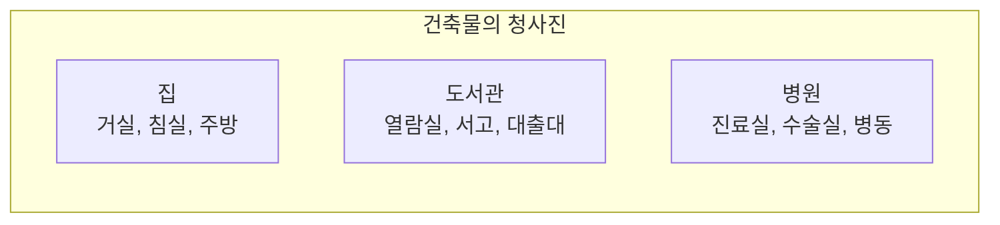
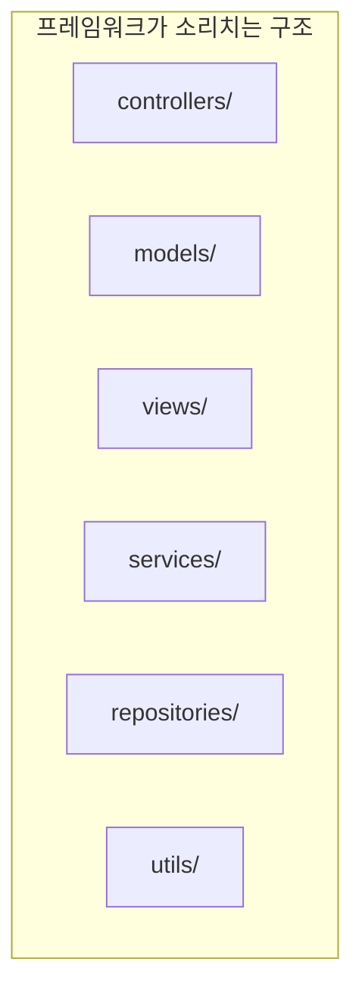
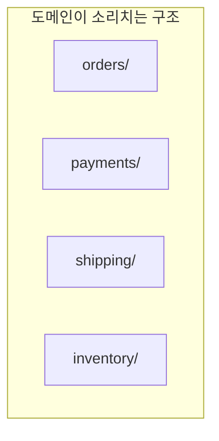
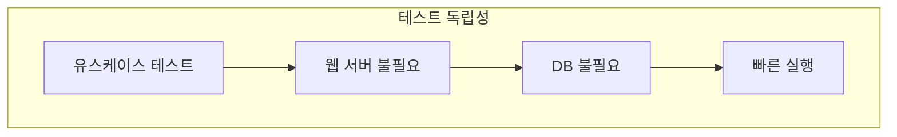
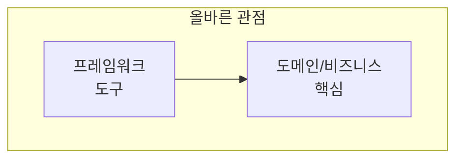
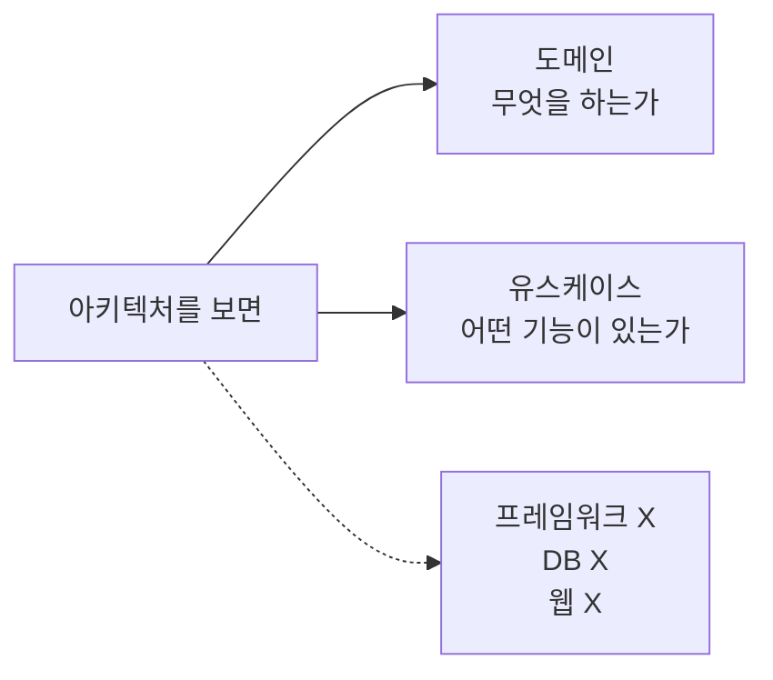

아키텍처는 시스템의 **의도를 소리쳐야** 한다. 최상위 디렉토리 구조를 보면 이것이 건강 관리 시스템인지, 회계 시스템인지 알 수 있어야 한다.

## 건축과의 비유

건축물의 **청사진**을 보면 그것이 무엇인지 바로 알 수 있다.



| 건축물 | 청사진에서 보이는 것 |
|--------|---------------------|
| 집 | 거실, 침실, 주방, 욕실 |
| 도서관 | 열람실, 서고, 대출대 |
| 병원 | 진료실, 수술실, 병동 |

> "건축물의 청사진을 보면 그것이 집인지, 도서관인지, 병원인지 알 수 있다. **소프트웨어 아키텍처도 마찬가지여야 한다.**"

## 소프트웨어 아키텍처는?

소프트웨어의 최상위 구조를 보면 **무엇을 하는 시스템인지** 알 수 있어야 한다.

### 프레임워크가 소리치면 안 된다



**나쁜 구조 예시:**

```
src/
├── controllers/
│   ├── OrderController.java
│   ├── PaymentController.java
│   └── ShippingController.java
├── models/
│   ├── Order.java
│   ├── Payment.java
│   └── Shipment.java
├── views/
│   ├── order.html
│   └── payment.html
├── services/
├── repositories/
└── utils/
```

이 구조를 보고 무엇을 알 수 있는가?
- "Spring 앱이구나"
- "MVC 패턴이구나"
- **"이 시스템이 뭘 하는지는 모르겠다"**

### 도메인이 소리쳐야 한다



**좋은 구조 예시:**

```
src/
├── orders/
│   ├── PlaceOrderUseCase.java
│   ├── CancelOrderUseCase.java
│   ├── Order.java
│   └── OrderRepository.java
├── payments/
│   ├── ProcessPaymentUseCase.java
│   ├── RefundPaymentUseCase.java
│   ├── Payment.java
│   └── PaymentGateway.java
├── shipping/
│   ├── ScheduleDeliveryUseCase.java
│   ├── TrackShipmentUseCase.java
│   └── Shipment.java
└── inventory/
    ├── CheckStockUseCase.java
    └── InventoryItem.java
```

이 구조를 보면 **바로 알 수 있다**:
- "이건 **전자상거래 시스템**이다"
- "주문, 결제, 배송, 재고 관리를 한다"

## 비교: 프레임워크 중심 vs 도메인 중심

| 관점 | 프레임워크 중심 | 도메인 중심 |
|------|---------------|------------|
| 최상위 폴더 | controllers, models, views | orders, payments, shipping |
| 알 수 있는 것 | 사용 기술 | 비즈니스 도메인 |
| 소리치는 것 | "Spring 앱!" | "전자상거래 시스템!" |
| 테스트 용이성 | 프레임워크 의존 | 독립적 테스트 가능 |

## Ivar Jacobson의 교훈

객체지향 소프트웨어 공학의 선구자 **Ivar Jacobson**의 가르침:

> "시스템 아키텍처는 **유스케이스를 지원**해야 한다. 아키텍처의 최상위 요소는 프레임워크가 아니라 **유스케이스**여야 한다."

```java
// 유스케이스가 명확히 드러나는 구조
package com.example.orders;

public class PlaceOrderUseCase {
    private final OrderRepository orderRepository;
    private final PaymentGateway paymentGateway;
    private final InventoryService inventoryService;
    
    public OrderResult execute(PlaceOrderRequest request) {
        // 유스케이스 로직
        Order order = Order.create(request);
        inventoryService.reserve(order.getItems());
        paymentGateway.charge(order.getPayment());
        orderRepository.save(order);
        return OrderResult.success(order);
    }
}
```

## 테스트 용이성

**소리치는 아키텍처**는 테스트하기 쉽다.

```java
// 웹 서버 없이 테스트
@Test
void shouldPlaceOrderSuccessfully() {
    // Given
    OrderRepository repo = new InMemoryOrderRepository();
    PaymentGateway gateway = new MockPaymentGateway();
    InventoryService inventory = new MockInventoryService();
    
    PlaceOrderUseCase useCase = new PlaceOrderUseCase(
        repo, gateway, inventory
    );
    
    // When
    OrderResult result = useCase.execute(new PlaceOrderRequest(...));
    
    // Then
    assertThat(result.isSuccess()).isTrue();
}
```



| 소리치는 아키텍처의 테스트 | 프레임워크 종속 테스트 |
|--------------------------|----------------------|
| 웹 서버 없이 테스트 | 웹 서버 필요 |
| DB 없이 테스트 | 실제 DB 필요 |
| 밀리초 단위 실행 | 초 단위 실행 |
| 유스케이스 단위 테스트 | 통합 테스트만 가능 |

## 프레임워크는 도구



> "프레임워크는 사용할 뿐, 시스템을 지배하게 하지 마라."
> — Robert C. Martin

### 프레임워크 중심 vs 도메인 중심

| 프레임워크 중심 사고 | 도메인 중심 사고 |
|---------------------|-----------------|
| "Rails 앱을 만들자" | "전자상거래 앱을 만들자 (Rails 사용)" |
| "Spring 앱이다" | "은행 시스템이다 (Spring 사용)" |
| "Django 프로젝트" | "블로그 플랫폼 (Django 사용)" |

```java
// 프레임워크 중심 - 나쁜 예
@RestController
@RequestMapping("/orders")
public class OrderController {
    @PostMapping
    public ResponseEntity<?> createOrder(@RequestBody OrderDTO dto) {
        // 컨트롤러에 비즈니스 로직이 있음
        Order order = new Order(dto.getItems());
        order.calculateTotal();
        orderRepo.save(order);
        return ResponseEntity.ok(order);
    }
}

// 도메인 중심 - 좋은 예
@RestController  // 프레임워크는 외곽에만
public class OrderController {
    private final PlaceOrderUseCase placeOrder;
    
    @PostMapping("/orders")
    public ResponseEntity<?> createOrder(@RequestBody OrderDTO dto) {
        // 컨트롤러는 얇게, 유스케이스에 위임
        OrderResult result = placeOrder.execute(dto.toRequest());
        return ResponseEntity.ok(result.toDTO());
    }
}
```

## 아키텍처가 소리쳐야 하는 것



## 핵심 요약

| 원칙 | 설명 |
|------|------|
| 소리치는 것 | 도메인과 유스케이스 |
| 숨기는 것 | 프레임워크, DB, 웹 |
| 최상위 구조 | 비즈니스 기능별 |
| 테스트 | 프레임워크 없이 가능 |

> **"아키텍처를 보고 이것이 헬스케어 시스템인지, Rails 앱인지 알 수 있어야 한다. 헬스케어 시스템이어야 한다!"**
> — Robert C. Martin

```
// 좋은 아키텍처의 최상위 구조
healthcare-system/
├── patients/           # 환자 관리
├── appointments/       # 예약 관리
├── prescriptions/      # 처방 관리
├── billing/           # 청구 관리
└── medical-records/    # 의료 기록

// 아키텍처가 소리친다: "이것은 헬스케어 시스템이다!"
```
