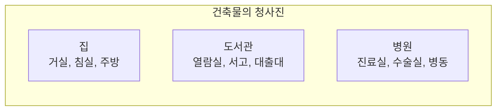
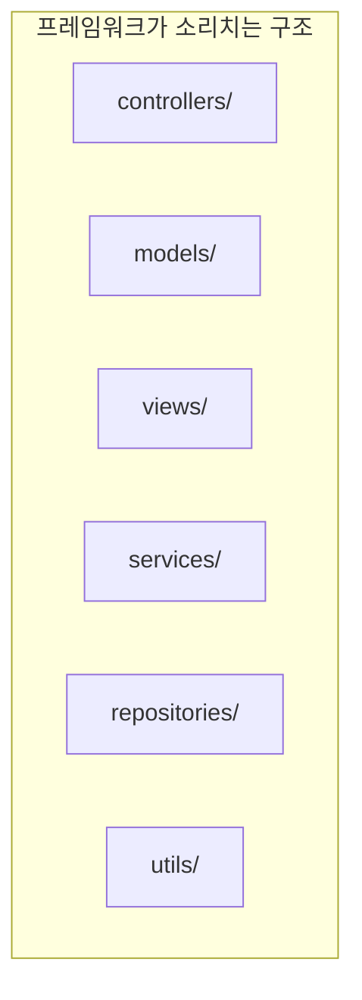
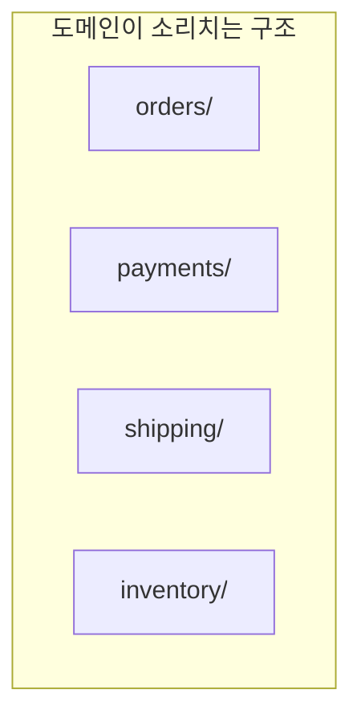
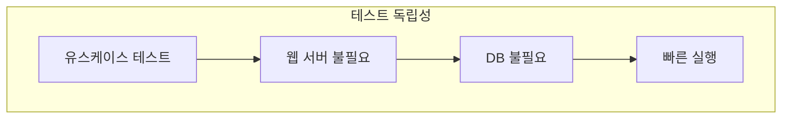
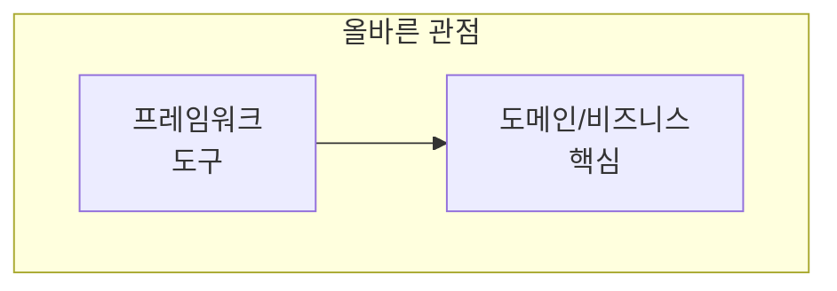
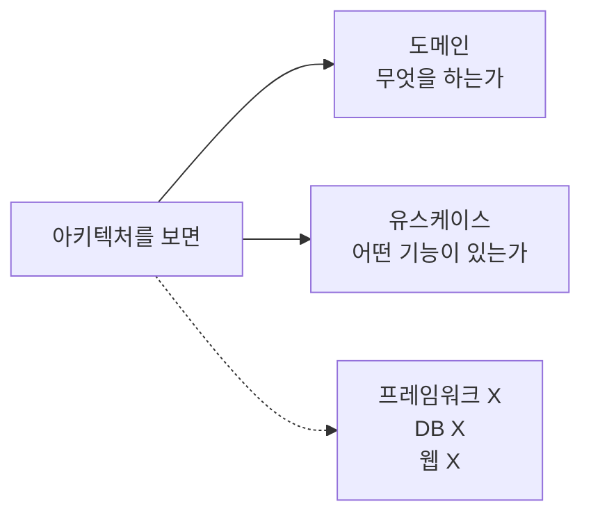

아키텍처는 시스템의 **의도를 소리쳐야** 한다. 최상위 디렉토리 구조를 보면 이것이 건강 관리 시스템인지, 회계 시스템인지 알 수 있어야 한다.

## 건축과의 비유

건축물의 **청사진**을 보면 그것이 무엇인지 바로 알 수 있다.


```mermaid
flowchart LR
    subgraph Buildings [건축물의 청사진]
        HOUSE[집<br/>거실, 침실, 주방]
        LIB[도서관<br/>열람실, 서고, 대출대]
        HOSP[병원<br/>진료실, 수술실, 병동]
    end
```

| 건축물 | 청사진에서 보이는 것 |
|--------|---------------------|
| 집 | 거실, 침실, 주방, 욕실 |
| 도서관 | 열람실, 서고, 대출대 |
| 병원 | 진료실, 수술실, 병동 |

마틴은 도서관 청사진을 예로 든다: 웅장한 입구, 대출/반납 창구, 열람실, 소회의실, 그리고 서고로 가득한 갤러리들이 늘어서 있다면 굳이 설명하지 않아도 이 건물이 무엇인지 알 수 있다.

> "That architecture would scream: **Library**."
> — Robert C. Martin, "Screaming Architecture"(2011); 『Clean Architecture』(2017), 21장

## 소프트웨어 아키텍처는?

소프트웨어의 최상위 구조를 보면 **무엇을 하는 시스템인지** 알 수 있어야 한다. 마틴은 최상위 디렉토리 구조와 최상위 패키지의 소스 파일들이 "Health Care System"·"Accounting System"·"Inventory Management System"을 외쳐야지, "Rails"·"Spring/Hibernate"·"ASP"를 외쳐서는 안 된다고 말한다(Martin, "Screaming Architecture", 2011). 아래 두 구조는 정확히 같은 전자상거래 기능(주문·결제·배송)을 담고 있지만, 폴더 이름이 무엇을 소리치는지가 완전히 다르다.

### 프레임워크가 소리치면 안 된다


```mermaid
flowchart TB
    subgraph Bad [프레임워크가 소리치는 구조]
        CTRL[controllers/]
        MODEL[models/]
        VIEW[views/]
        SVC[services/]
        REPO[repositories/]
        UTIL[utils/]
    end
```

첫 번째 구조는 파일을 **기술적 역할**(컨트롤러, 모델, 뷰)별로 묶는다. Spring MVC를 써본 개발자라면 익숙한 배치지만, 정작 이 폴더들만 봐서는 이 시스템이 무엇을 하는 시스템인지 전혀 알 수 없다:

**나쁜 구조 예시:**

```
src/
├── controllers/
│   ├── OrderController.java
│   ├── PaymentController.java
│   └── ShippingController.java
├── models/
│   ├── Order.java
│   ├── Payment.java
│   └── Shipment.java
├── views/
│   ├── order.html
│   └── payment.html
├── services/
├── repositories/
└── utils/
```

이 구조를 보고 알 수 있는 것은 "Spring 앱이구나", "MVC 패턴이구나" 정도이지, 정작 이 시스템이 무엇을 하는지는 알 수 없다. 폴더 이름 어디에도 "주문", "결제", "배송"이라는 이 시스템의 존재 이유가 드러나지 않는다.

### 도메인이 소리쳐야 한다


```mermaid
flowchart TB
    subgraph Good [도메인이 소리치는 구조]
        ORDER[orders/]
        PAYMENT[payments/]
        SHIP[shipping/]
        INV[inventory/]
    end
```

두 번째 구조는 같은 클래스들을 **업무 도메인**(주문, 결제, 배송, 재고)별로 묶는다. 각 폴더 안에는 그 도메인의 유스케이스·엔터티·리포지토리가 함께 들어 있어, 폴더 하나만 열어봐도 그 기능이 어떻게 동작하는지 파악할 수 있다:

**좋은 구조 예시:**

```
src/
├── orders/
│   ├── PlaceOrderUseCase.java
│   ├── CancelOrderUseCase.java
│   ├── Order.java
│   └── OrderRepository.java
├── payments/
│   ├── ProcessPaymentUseCase.java
│   ├── RefundPaymentUseCase.java
│   ├── Payment.java
│   └── PaymentGateway.java
├── shipping/
│   ├── ScheduleDeliveryUseCase.java
│   ├── TrackShipmentUseCase.java
│   └── Shipment.java
└── inventory/
    ├── CheckStockUseCase.java
    └── InventoryItem.java
```

이 구조를 보면 이건 전자상거래 시스템이며 주문·결제·배송·재고 관리를 한다는 것을 바로 알 수 있다. 사용된 프레임워크(Spring인지 Django인지)는 이 최상위 구조 어디에도 드러나지 않는다 — 그것은 각 도메인 폴더 안쪽, 어댑터 계층의 세부사항일 뿐이다.

## 비교: 프레임워크 중심 vs 도메인 중심

| 관점 | 프레임워크 중심 | 도메인 중심 |
|------|---------------|------------|
| 최상위 폴더 | controllers, models, views | orders, payments, shipping |
| 알 수 있는 것 | 사용 기술 | 비즈니스 도메인 |
| 소리치는 것 | "Spring 앱!" | "전자상거래 시스템!" |
| 테스트 용이성 | 프레임워크 의존 | 독립적 테스트 가능 |

## Ivar Jacobson의 교훈

마틴은 이 개념의 뿌리를 객체지향 소프트웨어 공학의 선구자 **Ivar Jacobson**의 저서 『Object-Oriented Software Engineering: A Use Case Driven Approach』(1992)에서 찾는다. 이 책의 부제("유스케이스 주도 접근")가 이미 핵심을 말해준다 — 소프트웨어 아키텍처는 그 시스템의 유스케이스를 지원하는 구조여야 하며, 프레임워크가 그 자리를 대신해서는 안 된다는 것이다.

`orders/` 폴더 안이 실제로 어떻게 구성되는지 `PlaceOrderUseCase` 하나로 구체화해보면 다음과 같다. 이 유스케이스는 주문·결제·재고라는 세 가지 관심사를 각각 인터페이스(`OrderRepository`, `PaymentGateway`, `InventoryService`) 뒤로 감춰, 유스케이스 자신은 Spring이든 Django든 어떤 프레임워크와도 무관하게 동작한다:

```java
// 유스케이스가 명확히 드러나는 구조
package com.example.orders;

import java.math.BigDecimal;
import java.util.List;

record OrderItem(String productId, int quantity, BigDecimal unitPrice) {}
record Payment(String method, BigDecimal amount) {}
record PlaceOrderRequest(String customerId, List<OrderItem> items, Payment payment) {}

record Order(String customerId, List<OrderItem> items, Payment payment) {
    static Order create(PlaceOrderRequest request) {
        return new Order(request.customerId(), request.items(), request.payment());
    }
    List<OrderItem> getItems() { return items; }
    Payment getPayment() { return payment; }
}

class OrderResult {
    private final boolean success;
    private final Order order;
    private OrderResult(boolean success, Order order) {
        this.success = success;
        this.order = order;
    }
    static OrderResult success(Order order) { return new OrderResult(true, order); }
    boolean isSuccess() { return success; }
}

interface OrderRepository { void save(Order order); }
interface PaymentGateway { void charge(Payment payment); }
interface InventoryService { void reserve(List<OrderItem> items); }

public class PlaceOrderUseCase {
    private final OrderRepository orderRepository;
    private final PaymentGateway paymentGateway;
    private final InventoryService inventoryService;

    public PlaceOrderUseCase(OrderRepository orderRepository, PaymentGateway paymentGateway, InventoryService inventoryService) {
        this.orderRepository = orderRepository;
        this.paymentGateway = paymentGateway;
        this.inventoryService = inventoryService;
    }

    public OrderResult execute(PlaceOrderRequest request) {
        // 유스케이스 로직
        Order order = Order.create(request);
        inventoryService.reserve(order.getItems());
        paymentGateway.charge(order.getPayment());
        orderRepository.save(order);
        return OrderResult.success(order);
    }
}
```

## 테스트 용이성

**소리치는 아키텍처**는 테스트하기 쉽다. 위 유스케이스는 웹 서버·실제 DB·결제 게이트웨이 없이도, 인터페이스(`OrderRepository`, `PaymentGateway`, `InventoryService`)의 테스트용 구현체만으로 검증할 수 있다:

```java
import static org.assertj.core.api.Assertions.assertThat;
import org.junit.jupiter.api.Test;
import java.math.BigDecimal;
import java.util.ArrayList;
import java.util.List;

class InMemoryOrderRepository implements OrderRepository {
    List<Order> saved = new ArrayList<>();
    public void save(Order order) { saved.add(order); }
}
class MockPaymentGateway implements PaymentGateway {
    public void charge(Payment payment) { /* 테스트에서는 실제 결제를 생략한다 */ }
}
class MockInventoryService implements InventoryService {
    public void reserve(List<OrderItem> items) { /* 테스트에서는 실제 재고 차감을 생략한다 */ }
}

class PlaceOrderUseCaseTest {
    @Test
    void shouldPlaceOrderSuccessfully() {
        // Given
        OrderRepository repo = new InMemoryOrderRepository();
        PaymentGateway gateway = new MockPaymentGateway();
        InventoryService inventory = new MockInventoryService();

        PlaceOrderUseCase useCase = new PlaceOrderUseCase(repo, gateway, inventory);

        PlaceOrderRequest request = new PlaceOrderRequest(
            "customer-1",
            List.of(new OrderItem("sku-1", 2, new BigDecimal("9900"))),
            new Payment("CARD", new BigDecimal("19800"))
        );

        // When
        OrderResult result = useCase.execute(request);

        // Then
        assertThat(result.isSuccess()).isTrue();
    }
}
```


```mermaid
flowchart TB
    subgraph Testing [테스트 독립성]
        UC[유스케이스 테스트]
        NO_WEB[웹 서버 불필요]
        NO_DB[DB 불필요]
        FAST[빠른 실행]
    end
    
    UC --> NO_WEB --> NO_DB --> FAST
```

| 소리치는 아키텍처의 테스트 | 프레임워크 종속 테스트 |
|--------------------------|----------------------|
| 웹 서버 없이 테스트 | 웹 서버 필요 |
| DB 없이 테스트 | 실제 DB 필요 |
| 밀리초 단위 실행 | 초 단위 실행 |
| 유스케이스 단위 테스트 | 통합 테스트만 가능 |

## 프레임워크는 도구


```mermaid
flowchart TB
    subgraph Correct [올바른 관점]
        DOMAIN[도메인/비즈니스<br/>핵심]
        FW[프레임워크<br/>도구]
        
        FW --> DOMAIN
    end
```

> "Frameworks are tools to be used, not architectures to be conformed to. If your architecture is based on frameworks, then it cannot be based on your use cases."
> — Robert C. Martin, "Screaming Architecture"(2011); 『Clean Architecture』(2017), 21장

### 프레임워크 중심 vs 도메인 중심

| 프레임워크 중심 사고 | 도메인 중심 사고 |
|---------------------|-----------------|
| "Rails 앱을 만들자" | "전자상거래 앱을 만들자 (Rails 사용)" |
| "Spring 앱이다" | "은행 시스템이다 (Spring 사용)" |
| "Django 프로젝트" | "블로그 플랫폼 (Django 사용)" |

이 차이는 컨트롤러 코드에서 더 분명히 드러난다. 아래 두 `OrderController`는 같은 REST 엔드포인트(`POST /orders`)를 처리하지만, 비즈니스 로직을 컨트롤러(프레임워크 계층)에 두느냐 유스케이스(도메인 계층)에 위임하느냐가 다르다. 앞서 정의한 `Order`, `OrderRepository`, `PlaceOrderUseCase` 등의 타입을 그대로 이어서 사용한다:

```java
import java.util.List;
import org.springframework.web.bind.annotation.*;
import org.springframework.http.ResponseEntity;

record OrderDTO(String customerId, List<OrderItem> items, Payment payment) {
    PlaceOrderRequest toRequest() {
        return new PlaceOrderRequest(customerId, items, payment);
    }
}

// 프레임워크 중심 - 나쁜 예
@RestController
@RequestMapping("/orders")
class BadOrderController {
    private final OrderRepository orderRepo;

    BadOrderController(OrderRepository orderRepo) { this.orderRepo = orderRepo; }

    @PostMapping
    public ResponseEntity<?> createOrder(@RequestBody OrderDTO dto) {
        // 컨트롤러 안에서 엔터티 생성·저장까지 직접 처리 — 비즈니스 로직이 프레임워크 계층에 섞여 있다
        Order order = Order.create(dto.toRequest());
        orderRepo.save(order);
        return ResponseEntity.ok(order);
    }
}

// 도메인 중심 - 좋은 예
@RestController  // 프레임워크는 외곽에만
class OrderController {
    private final PlaceOrderUseCase placeOrder;

    OrderController(PlaceOrderUseCase placeOrder) { this.placeOrder = placeOrder; }

    @PostMapping("/orders")
    public ResponseEntity<?> createOrder(@RequestBody OrderDTO dto) {
        // 컨트롤러는 얇게, 유스케이스에 위임
        OrderResult result = placeOrder.execute(dto.toRequest());
        return ResponseEntity.ok(result.isSuccess());
    }
}
```

## 아키텍처가 소리쳐야 하는 것


```mermaid
flowchart LR
    ARCH[아키텍처를 보면]
    
    DOMAIN[도메인<br/>무엇을 하는가]
    UC[유스케이스<br/>어떤 기능이 있는가]
    
    ARCH --> DOMAIN
    ARCH --> UC
    
    NOT[프레임워크 X<br/>DB X<br/>웹 X]
    
    ARCH -.-> NOT
```

## 흔한 오해

"소리치는 아키텍처"를 프레임워크를 아예 쓰지 말라는 뜻으로 오해하기 쉽다. 마틴의 주장은 프레임워크 사용 자체를 금지하는 것이 아니라, 프레임워크가 최상위 디렉토리 구조와 아키텍처의 정체성을 차지하지 말아야 한다는 것이다. Spring이나 Django 같은 프레임워크는 여전히 컨트롤러·라우팅·직렬화 같은 세부사항을 처리하는 도구로 계속 쓰인다. 또 다른 오해는 폴더 이름을 `orders/`, `payments/`처럼 바꾸기만 하면 소리치는 아키텍처가 완성된다고 여기는 것이다. 실제로는 `OrderController`가 여전히 계산·저장 로직을 직접 처리한다면(이 장의 `BadOrderController` 예시), 폴더명만 도메인 중심으로 바뀌었을 뿐 의존성 방향은 그대로 프레임워크·DB를 향해 있다.

## 학습 목표

이 장을 읽은 후 다음을 스스로 점검한다.

- 최상위 디렉토리 구조만 보고 "이 프레임워크로 만들었다"가 아니라 "이 시스템은 무엇을 한다"를 말할 수 있는가?
- 프레임워크·DB·웹이 아키텍처의 핵심이 아니라 세부사항으로 취급되어야 하는 이유를 설명할 수 있는가?
- `BadOrderController`와 `OrderController` 예시에서 어떤 차이가 유스케이스를 프레임워크로부터 독립시키는지 짚을 수 있는가?
- 소리치는 아키텍처가 프레임워크 사용 자체를 금지하는 것이 아니라는 점을 설명할 수 있는가?

## 판단 기준

새 기능을 어느 폴더·계층에 둘지 판단할 때 다음을 확인한다.

- 이 폴더 이름을 지웠을 때, 남은 구조만 보고도 이 시스템이 무엇을 하는지 설명할 수 있는가?
- 컨트롤러(또는 진입점)에서 프레임워크 어노테이션을 걷어내면, 남는 코드가 유스케이스 로직으로 성립하는가?
- 웹 서버·DB 없이 이 로직을 단위 테스트할 수 있는가? 그렇지 않다면 프레임워크에 종속된 것이다.

## 참고 자료

- Robert C. Martin, "Screaming Architecture", Clean Coder Blog (2011) — 이 장의 도서관 청사진 비유와 "Frameworks are tools..." 인용의 원출처.
- Robert C. Martin, 『Clean Architecture』(2017), 21장 — 위 블로그 원고를 확장한 책 본문.
- Ivar Jacobson, 『Object-Oriented Software Engineering: A Use Case Driven Approach』(1992) — 유스케이스 중심 아키텍처 개념의 원 출처.

## 핵심 요약

아키텍처의 최상위 구조는 프레임워크가 아니라 도메인과 유스케이스를 소리쳐야 한다. `BadOrderController`처럼 비즈니스 로직이 컨트롤러에 남아 있으면 폴더명만 바꿔서는 소용없고, `PlaceOrderUseCase`처럼 유스케이스가 인터페이스 뒤로 프레임워크·DB·웹을 감출 때 비로소 웹 서버 없이도 테스트할 수 있는 구조가 된다. 도서관의 청사진이 "도서관"을 외치듯, 좋은 소프트웨어 아키텍처는 그 시스템이 무엇을 하는지를 외쳐야 한다(Martin, 『Clean Architecture』, 2017, 21장).
