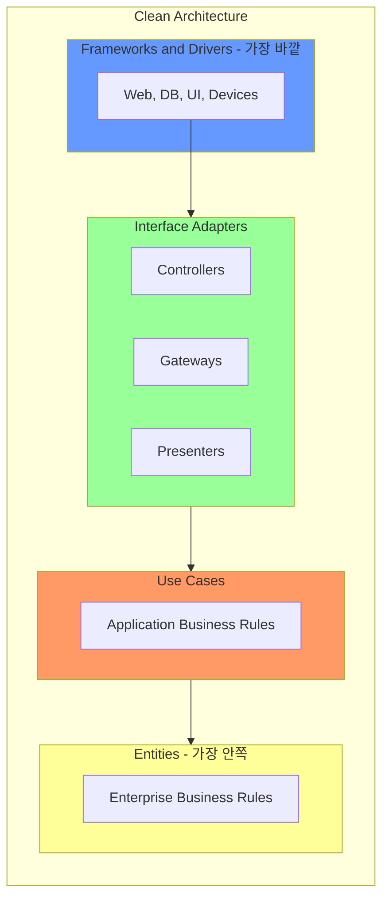
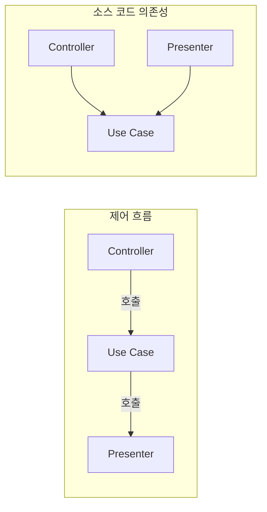
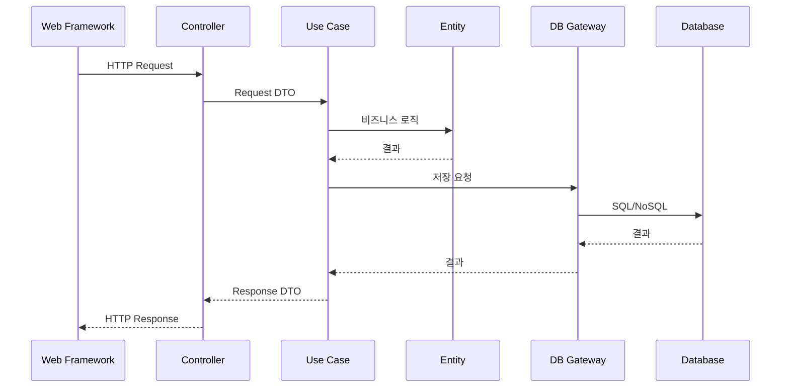

드디어 Clean Architecture의 핵심에 도달했다. 이 장에서는 육각형 아키텍처, 양파 아키텍처, BCE 등 기존 아키텍처들의 공통점을 추출하여 정제한 **Clean Architecture**의 구조를 상세히 다룬다.

## 동심원 다이어그램

Clean Architecture는 **동심원(Concentric Circles)** 형태로 표현된다:



## 의존성 규칙 (The Dependency Rule)

Clean Architecture의 **단 하나의 규칙**:

> **"소스 코드 의존성은 반드시 안쪽으로, 고수준의 정책 방향으로만 향해야 한다."**

### 무엇을 의미하는가?

- 안쪽 원(Entities)은 바깥 원(Frameworks)을 **전혀 모른다**
- 바깥쪽 코드의 **이름, 함수, 클래스**를 안쪽에서 언급하면 안 된다
- 데이터 형식도 마찬가지

```java
// 위반: Entity가 Framework를 알고 있음
@Entity  // JPA 어노테이션 - Framework!
public class User {
    @Id  // JPA 어노테이션 - Framework!
    private Long id;
}

// 준수: Entity는 순수한 비즈니스 객체
public class User {
    private UserId id;
    private Email email;
    
    public void changeEmail(Email newEmail) {
        // 순수한 비즈니스 로직
    }
}
```

## 4가지 계층

### 1. Entities (엔터티)

가장 안쪽. **기업 전체의 핵심 비즈니스 규칙**을 캡슐화한다.

```java
public class Order {
    private OrderId id;
    private List<OrderLine> lines;
    private OrderStatus status;
    
    // 기업 비즈니스 규칙
    public Money calculateTotal() {
        return lines.stream()
            .map(OrderLine::getSubtotal)
            .reduce(Money.ZERO, Money::add);
    }
    
    public void submit() {
        if (lines.isEmpty()) {
            throw new EmptyOrderException();
        }
        this.status = OrderStatus.SUBMITTED;
    }
}
```

특성:
- 메서드를 가진 객체 또는 데이터 구조와 함수의 집합
- **가장 변하지 않는** 부분
- 외부 변화로부터 가장 **보호**받는 부분
- 특정 애플리케이션과 무관

### 2. Use Cases (유스케이스)

**애플리케이션 특화 비즈니스 규칙**을 포함한다.

```java
public class PlaceOrderUseCase {
    private final OrderRepository orderRepository;
    private final PaymentGateway paymentGateway;
    private final OrderPresenter presenter;
    
    public void execute(PlaceOrderRequest request) {
        // 1. 주문 생성
        Order order = new Order(request.getCustomerId());
        for (var item : request.getItems()) {
            order.addLine(item.getProductId(), item.getQuantity());
        }
        
        // 2. 주문 제출
        order.submit();
        
        // 3. 결제 처리
        paymentGateway.charge(order.getTotal());
        
        // 4. 저장
        orderRepository.save(order);
        
        // 5. 결과 출력
        presenter.present(new PlaceOrderResponse(order.getId()));
    }
}
```

특성:
- 시스템의 **유스케이스 구현**
- 엔터티 간의 **데이터 흐름 조율**
- 엔터티에 영향을 주지 **않음**
- 바깥쪽(DB, UI)에 영향을 받지 **않음**

### 3. Interface Adapters (인터페이스 어댑터)

유스케이스와 엔터티에 가장 편한 형식에서, 외부 에이전시에 가장 편한 형식으로 **데이터를 변환**한다.

```java
// Controller - 웹 요청 → 유스케이스 입력
@RestController
public class OrderController {
    private final PlaceOrderUseCase placeOrderUseCase;
    
    @PostMapping("/orders")
    public ResponseEntity<?> placeOrder(@RequestBody OrderRequest webRequest) {
        // 웹 형식 → 유스케이스 형식
        PlaceOrderRequest request = new PlaceOrderRequest(
            webRequest.getCustomerId(),
            webRequest.getItems()
        );
        
        placeOrderUseCase.execute(request);
        return ResponseEntity.ok().build();
    }
}

// Presenter - 유스케이스 출력 → 웹 응답
public class WebOrderPresenter implements OrderPresenter {
    private OrderResponse response;
    
    @Override
    public void present(PlaceOrderResponse output) {
        // 유스케이스 형식 → 웹 형식
        this.response = new OrderResponse(
            output.getOrderId().toString(),
            "SUCCESS"
        );
    }
}

// Gateway - 유스케이스 출력 포트 → DB
public class JpaOrderRepository implements OrderRepository {
    private final SpringDataOrderRepository springRepo;
    
    @Override
    public void save(Order order) {
        // 도메인 객체 → JPA 엔터티
        OrderEntity entity = OrderMapper.toEntity(order);
        springRepo.save(entity);
    }
}
```

포함 요소:
- **Controllers**: 입력 데이터 변환
- **Presenters**: 출력 데이터 변환
- **Gateways**: 외부 시스템과의 연결

### 4. Frameworks and Drivers (프레임워크와 드라이버)

가장 바깥쪽. **세부사항**으로 구성된다.

- 웹 프레임워크: Spring, Express, Django
- 데이터베이스: MySQL, MongoDB, Redis
- UI 프레임워크: React, Vue, Angular
- 외부 API 클라이언트

```java
// Spring Data JPA - Framework
@Repository
public interface SpringDataOrderRepository extends JpaRepository<OrderEntity, Long> {
}

// JPA Entity - Framework
@Entity
@Table(name = "orders")
public class OrderEntity {
    @Id
    @GeneratedValue
    private Long id;
    
    @OneToMany(mappedBy = "order")
    private List<OrderLineEntity> lines;
}
```

특성:
- **최소한의 코드**만 작성
- **글루 코드(glue code)** 위주
- 안쪽 계층과 연결하는 역할

## 경계 횡단

### 제어 흐름 vs 소스 코드 의존성



**제어 흐름**: Controller → Use Case → Presenter
**소스 코드 의존성**: Controller → Use Case ← Presenter

Presenter가 Use Case에 의존하도록 **의존성 역전**.

### 데이터 경계 넘기

경계를 넘는 데이터는 **단순한 구조**여야 한다:

```java
// 경계를 넘는 데이터 - 단순한 구조
public class PlaceOrderRequest {
    private String customerId;
    private List<OrderItemDTO> items;
}

public class PlaceOrderResponse {
    private String orderId;
    private String status;
}
```

**안 되는 것**:
- Entity를 그대로 전달 (Entity가 외부에 노출됨)
- Framework 객체 전달 (JPA Entity, HTTP Request 등)

## Clean Architecture가 제공하는 것

### 1. 프레임워크 독립성

아키텍처가 프레임워크에 의존하지 않는다. 프레임워크를 **도구**로 사용할 뿐, 제약하지 않는다.

### 2. 테스트 용이성

비즈니스 규칙을 UI, DB, 웹 서버 없이 테스트할 수 있다.

```java
@Test
void shouldPlaceOrder() {
    // 인메모리 구현으로 테스트
    OrderRepository repo = new InMemoryOrderRepository();
    PaymentGateway payment = new FakePaymentGateway();
    OrderPresenter presenter = new TestPresenter();
    
    PlaceOrderUseCase useCase = new PlaceOrderUseCase(repo, payment, presenter);
    
    useCase.execute(new PlaceOrderRequest(...));
    
    assertThat(presenter.getResult().getStatus()).isEqualTo("SUCCESS");
}
```

### 3. UI 독립성

UI를 쉽게 교체할 수 있다. 웹 UI를 콘솔 UI로, 또는 REST API로 바꿔도 비즈니스 규칙은 변하지 않는다.

### 4. 데이터베이스 독립성

Oracle에서 MongoDB로, SQL에서 NoSQL로 바꿔도 비즈니스 규칙은 영향받지 않는다.

### 5. 외부 에이전시 독립성

비즈니스 규칙은 외부 세계에 대해 전혀 모른다.

## 전형적인 시나리오



## 패키지 구조 예시

```
src/
├── domain/                 # Entities
│   ├── Order.java
│   ├── OrderLine.java
│   └── Money.java
│
├── application/            # Use Cases
│   ├── PlaceOrderUseCase.java
│   ├── port/
│   │   ├── in/
│   │   │   └── PlaceOrderRequest.java
│   │   └── out/
│   │       ├── OrderRepository.java
│   │       └── PaymentGateway.java
│   └── PlaceOrderResponse.java
│
├── adapter/                # Interface Adapters
│   ├── in/
│   │   └── web/
│   │       └── OrderController.java
│   └── out/
│       ├── persistence/
│       │   └── JpaOrderRepository.java
│       └── payment/
│           └── StripePaymentGateway.java
│
└── framework/              # Frameworks & Drivers
    └── config/
        └── SpringConfig.java
```

## 핵심 요약

| 계층 | 역할 | 의존 방향 |
|------|------|----------|
| Entities | 기업 비즈니스 규칙 | 없음 (가장 안쪽) |
| Use Cases | 애플리케이션 비즈니스 규칙 | Entities |
| Interface Adapters | 데이터 형식 변환 | Use Cases |
| Frameworks | 세부사항, 도구 | Interface Adapters |

> **"Clean Architecture의 핵심은 단 하나의 규칙이다: 소스 코드 의존성은 반드시 안쪽으로만 향해야 한다."**
> — Robert C. Martin
