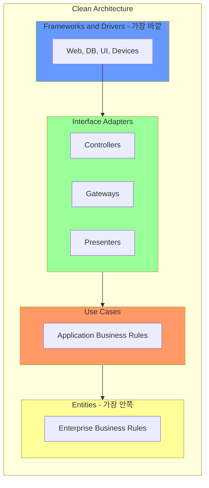
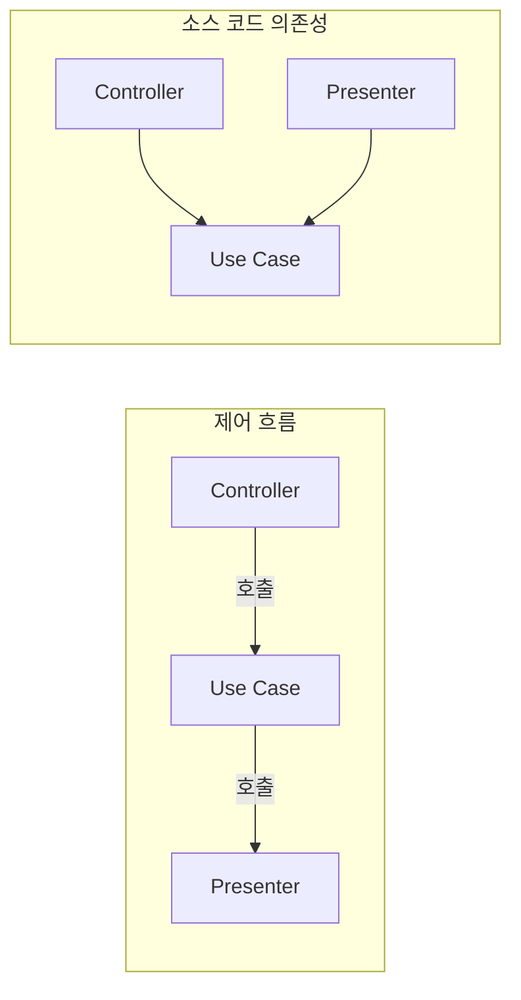
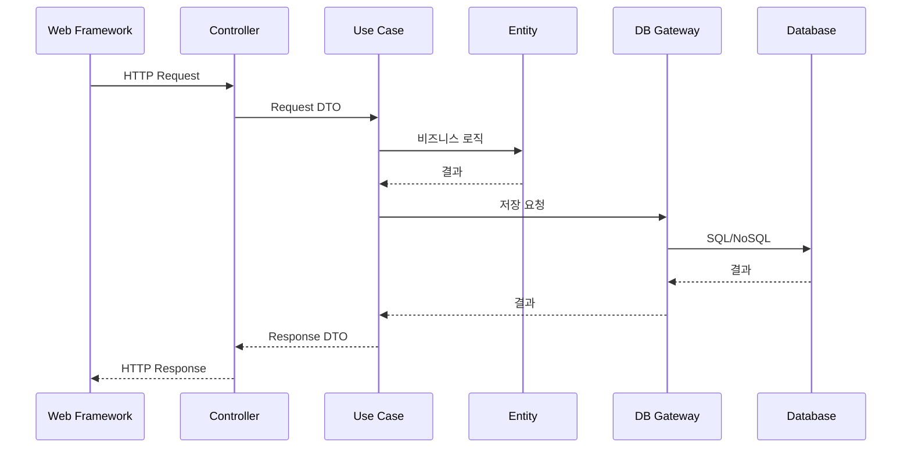

드디어 Clean Architecture의 핵심에 도달했다. 이 장에서는 육각형 아키텍처, 양파 아키텍처, BCE 등 기존 아키텍처들의 공통점을 추출하여 정제한 **Clean Architecture**의 구조를 상세히 다룬다.

## 동심원 다이어그램

Clean Architecture는 **동심원(Concentric Circles)** 형태로 표현된다:


```mermaid
flowchart TB
    subgraph CleanArch [Clean Architecture]
        direction TB
        subgraph Entities [Entities - 가장 안쪽]
            E[Enterprise Business Rules]
        end
        
        subgraph UseCases [Use Cases]
            U[Application Business Rules]
        end
        
        subgraph Adapters [Interface Adapters]
            C[Controllers]
            G[Gateways]
            P[Presenters]
        end
        
        subgraph Frameworks [Frameworks and Drivers - 가장 바깥]
            F[Web, DB, UI, Devices]
        end
    end
    
    F --> Adapters
    Adapters --> UseCases
    UseCases --> Entities
    
    style Entities fill:#ff9
    style UseCases fill:#f96
    style Adapters fill:#9f9
    style Frameworks fill:#69f
```

## 의존성 규칙 (The Dependency Rule)

Clean Architecture의 **단 하나의 규칙**:

> "The overriding rule that makes this architecture work is _The Dependency Rule_. This rule says that _source code dependencies_ can only point _inwards_."
> — Robert C. Martin, "The Clean Architecture", Clean Coder Blog (2012); 『Clean Architecture』(2017), 22장

### 무엇을 의미하는가?

마틴은 이 규칙을 더 구체적으로 이렇게 설명한다: "Nothing in an inner circle can know anything at all about something in an outer circle." 안쪽 원(Entities)은 바깥 원(Frameworks)의 존재 자체를 몰라야 하며, 이는 다음 세 가지로 구체화된다.

- 안쪽 원(Entities)은 바깥 원(Frameworks)을 **전혀 모른다**
- 바깥쪽 코드의 **이름, 함수, 클래스**를 안쪽에서 언급하면 안 된다
- 데이터 형식도 마찬가지

```java
// 위반: Entity가 Framework를 알고 있음
@Entity  // JPA 어노테이션 - Framework!
public class User {
    @Id  // JPA 어노테이션 - Framework!
    private Long id;
}

// 준수: Entity는 순수한 비즈니스 객체
public class User {
    private UserId id;
    private Email email;
    
    public void changeEmail(Email newEmail) {
        // 순수한 비즈니스 로직
    }
}
```

## 4가지 계층

### 1. Entities (엔터티)

가장 안쪽. **기업 전체의 핵심 비즈니스 규칙**을 캡슐화한다.

```java
import java.util.List;
import java.util.ArrayList;

public class Money {
    public static final Money ZERO = new Money(java.math.BigDecimal.ZERO);
    private final java.math.BigDecimal amount;

    public Money(java.math.BigDecimal amount) { this.amount = amount; }
    public Money add(Money other) { return new Money(amount.add(other.amount)); }
    public Money multiply(int n) { return new Money(amount.multiply(java.math.BigDecimal.valueOf(n))); }
}

public class OrderLine {
    private final String productId;
    private final int quantity;
    private final Money unitPrice;

    public OrderLine(String productId, int quantity, Money unitPrice) {
        this.productId = productId;
        this.quantity = quantity;
        this.unitPrice = unitPrice;
    }
    public Money getSubtotal() { return unitPrice.multiply(quantity); }
}

public enum OrderStatus { CREATED, SUBMITTED }
public class OrderId {
    private final String value;
    public OrderId(String value) { this.value = value; }
    @Override public String toString() { return value; }
}
public class EmptyOrderException extends RuntimeException {}

public class Order {
    private final OrderId id;
    private final String customerId;
    private final List<OrderLine> lines = new ArrayList<>();
    private OrderStatus status = OrderStatus.CREATED;

    public Order(OrderId id, String customerId) {
        this.id = id;
        this.customerId = customerId;
    }

    public void addLine(OrderLine line) { lines.add(line); }

    // 기업 비즈니스 규칙
    public Money calculateTotal() {
        return lines.stream()
            .map(OrderLine::getSubtotal)
            .reduce(Money.ZERO, Money::add);
    }

    public void submit() {
        if (lines.isEmpty()) {
            throw new EmptyOrderException();
        }
        this.status = OrderStatus.SUBMITTED;
    }

    public OrderId getId() { return id; }
    public Money getTotal() { return calculateTotal(); }
}
```

엔터티는 메서드를 가진 객체이거나, 데이터 구조와 그 데이터에 작용하는 함수들의 집합일 수도 있다 — 형태는 자유롭지만 내용은 항상 기업 전체가 공유하는 핵심 규칙이어야 한다. 위 `Order`가 `@Entity`나 `@Table` 같은 프레임워크 어노테이션을 전혀 참조하지 않는다는 점에 주목한다. 비즈니스 규칙 자체가 좀처럼 바뀌지 않으므로 엔터티는 시스템에서 **가장 변하지 않는** 부분이 되고, 그만큼 외부 변화(UI 개편, DB 교체, 프레임워크 업그레이드)로부터 가장 **보호**받는다. 또한 엔터티는 특정 애플리케이션 하나만을 위해 존재하지 않는다 — 같은 `Order`가 온라인 쇼핑몰, 콜센터 주문 시스템, 배치 정산 시스템에서 동일하게 재사용될 수 있다.

### 2. Use Cases (유스케이스)

**애플리케이션 특화 비즈니스 규칙**을 포함한다.

```java
import java.util.List;

public class PlaceOrderRequest {
    private final String customerId;
    private final List<OrderItemDTO> items;
    public PlaceOrderRequest(String customerId, List<OrderItemDTO> items) {
        this.customerId = customerId;
        this.items = items;
    }
    public String getCustomerId() { return customerId; }
    public List<OrderItemDTO> getItems() { return items; }
}

public class OrderItemDTO {
    private final String productId;
    private final int quantity;
    private final Money unitPrice;
    public OrderItemDTO(String productId, int quantity, Money unitPrice) {
        this.productId = productId;
        this.quantity = quantity;
        this.unitPrice = unitPrice;
    }
    public String getProductId() { return productId; }
    public int getQuantity() { return quantity; }
    public Money getUnitPrice() { return unitPrice; }
}

public class PlaceOrderResponse {
    private final OrderId orderId;
    public PlaceOrderResponse(OrderId orderId) { this.orderId = orderId; }
    public OrderId getOrderId() { return orderId; }
}

public interface OrderRepository { void save(Order order); }
public interface PaymentGateway { void charge(Money amount); }
public interface OrderPresenter { void present(PlaceOrderResponse response); }

public class PlaceOrderUseCase {
    private final OrderRepository orderRepository;
    private final PaymentGateway paymentGateway;
    private final OrderPresenter presenter;

    public PlaceOrderUseCase(OrderRepository orderRepository, PaymentGateway paymentGateway, OrderPresenter presenter) {
        this.orderRepository = orderRepository;
        this.paymentGateway = paymentGateway;
        this.presenter = presenter;
    }

    public void execute(PlaceOrderRequest request) {
        // 1. 주문 생성
        Order order = new Order(new OrderId(java.util.UUID.randomUUID().toString()), request.getCustomerId());
        for (var item : request.getItems()) {
            order.addLine(new OrderLine(item.getProductId(), item.getQuantity(), item.getUnitPrice()));
        }

        // 2. 주문 제출
        order.submit();

        // 3. 결제 처리
        paymentGateway.charge(order.getTotal());

        // 4. 저장
        orderRepository.save(order);

        // 5. 결과 출력
        presenter.present(new PlaceOrderResponse(order.getId()));
    }
}
```

`PlaceOrderUseCase`는 그 자체로 시스템의 유스케이스 하나를 구현하며, 엔터티(`Order`, `OrderLine`) 사이의 데이터 흐름을 조율하는 역할만 한다. 위 코드에서 `execute()`가 `Order`의 내부 필드를 직접 조작하지 않고 `addLine()`·`submit()` 같은 엔터티 자신의 메서드만 호출한다는 점에 주목한다 — 유스케이스는 엔터티가 어떻게 동작하는지에 영향을 주지 않으며, 반대로 DB나 UI가 바뀌어도(인터페이스 뒤에 숨겨져 있으므로) 유스케이스 코드 자체는 영향을 받지 않는다.

### 3. Interface Adapters (인터페이스 어댑터)

유스케이스와 엔터티에 가장 편한 형식에서, 외부 에이전시에 가장 편한 형식으로 **데이터를 변환**한다.

```java
import java.util.List;
import org.springframework.web.bind.annotation.*;
import org.springframework.http.ResponseEntity;

// 웹 계층 DTO - 유스케이스 DTO와는 별개의, HTTP에만 쓰이는 형식
public class OrderRequest {
    private String customerId;
    private List<OrderItemWebDTO> items;
    public String getCustomerId() { return customerId; }
    public List<OrderItemWebDTO> getItems() { return items; }
}
public class OrderItemWebDTO {
    private String productId;
    private int quantity;
    private java.math.BigDecimal unitPrice;
    public String getProductId() { return productId; }
    public int getQuantity() { return quantity; }
    public java.math.BigDecimal getUnitPrice() { return unitPrice; }
}
public class OrderResponse {
    private final String orderId;
    private final String status;
    public OrderResponse(String orderId, String status) {
        this.orderId = orderId;
        this.status = status;
    }
    public String getStatus() { return status; }
}

// Controller - 웹 요청 → 유스케이스 입력
@RestController
public class OrderController {
    private final PlaceOrderUseCase placeOrderUseCase;

    public OrderController(PlaceOrderUseCase placeOrderUseCase) {
        this.placeOrderUseCase = placeOrderUseCase;
    }

    @PostMapping("/orders")
    public ResponseEntity<?> placeOrder(@RequestBody OrderRequest webRequest) {
        // 웹 형식 → 유스케이스 형식
        List<OrderItemDTO> items = webRequest.getItems().stream()
            .map(i -> new OrderItemDTO(i.getProductId(), i.getQuantity(), new Money(i.getUnitPrice())))
            .toList();
        PlaceOrderRequest request = new PlaceOrderRequest(webRequest.getCustomerId(), items);

        placeOrderUseCase.execute(request);
        return ResponseEntity.ok().build();
    }
}

// Presenter - 유스케이스 출력 → 웹 응답
public class WebOrderPresenter implements OrderPresenter {
    private OrderResponse response;

    @Override
    public void present(PlaceOrderResponse output) {
        // 유스케이스 형식 → 웹 형식
        this.response = new OrderResponse(
            output.getOrderId().toString(),
            "SUCCESS"
        );
    }

    public OrderResponse getResult() { return response; }
}

// Gateway - 유스케이스 출력 포트 → DB
public class JpaOrderRepository implements OrderRepository {
    private final SpringDataOrderRepository springRepo;

    public JpaOrderRepository(SpringDataOrderRepository springRepo) {
        this.springRepo = springRepo;
    }

    @Override
    public void save(Order order) {
        // 도메인 객체 → JPA 엔터티(글루 코드이므로 필드 매핑은 생략)
        OrderEntity entity = OrderMapper.toEntity(order);
        springRepo.save(entity);
    }
}

class OrderMapper {
    static OrderEntity toEntity(Order order) {
        return new OrderEntity();
    }
}
```

위 코드의 세 클래스가 Interface Adapters 계층의 전형적인 구성이다. **Controller**는 HTTP 요청이라는 외부 형식을 유스케이스가 이해하는 입력으로 변환하고, **Presenter**는 유스케이스의 출력을 다시 웹 응답 형식으로 변환하며, **Gateway**(`JpaOrderRepository`)는 유스케이스가 정의한 출력 포트(`OrderRepository`)를 실제 DB 접근 기술(Spring Data JPA)로 구현해 외부 시스템과 연결한다. 세 클래스 모두 안쪽(유스케이스·엔터티)이 정의한 인터페이스나 타입에 맞춰 바깥쪽 세부사항을 감싸는 어댑터 역할을 한다는 공통점이 있다.

### 4. Frameworks and Drivers (프레임워크와 드라이버)

가장 바깥쪽 원은 웹 프레임워크(Spring, Express, Django), 데이터베이스(MySQL, MongoDB, Redis), UI 프레임워크(React, Vue, Angular), 외부 API 클라이언트처럼 구체적인 기술 **세부사항**으로 구성된다. 이 원에 속한 코드는 안쪽 원이 정의한 인터페이스를 구현하는 것 외에 다른 역할을 하지 않는다.

```java
import java.util.List;
import org.springframework.stereotype.Repository;
import org.springframework.data.jpa.repository.JpaRepository;
import jakarta.persistence.*;

// Spring Data JPA - Framework
@Repository
public interface SpringDataOrderRepository extends JpaRepository<OrderEntity, Long> {
}

// JPA Entity - Framework
@Entity
@Table(name = "orders")
public class OrderEntity {
    @Id
    @GeneratedValue
    private Long id;

    @OneToMany(mappedBy = "order")
    private List<OrderLineEntity> lines;
}

@Entity
@Table(name = "order_lines")
public class OrderLineEntity {
    @Id
    @GeneratedValue
    private Long id;

    @ManyToOne
    private OrderEntity order;
    private String productId;
    private int quantity;
}
```

`SpringDataOrderRepository`와 `OrderEntity`가 하는 일은 이것이 전부다 — 비즈니스 로직은 한 줄도 없고, `JpaOrderRepository`(Interface Adapters 계층)와 실제 Spring Data JPA 사이를 연결하는 **글루 코드(glue code)**일 뿐이다. 프레임워크 계층에는 이처럼 **최소한의 코드**만 두어, 안쪽 계층과 바깥쪽 기술을 연결하는 역할에 충실해야 한다.

## 경계 횡단

### 제어 흐름 vs 소스 코드 의존성


```mermaid
flowchart LR
    subgraph ControlFlow [제어 흐름]
        C1[Controller] -->|호출| U1[Use Case]
        U1 -->|호출| P1[Presenter]
    end
    
    subgraph Dependency [소스 코드 의존성]
        C2[Controller] --> U2[Use Case]
        P2[Presenter] --> U2
    end
```

**제어 흐름**: Controller → Use Case → Presenter
**소스 코드 의존성**: Controller → Use Case ← Presenter

Presenter가 Use Case에 의존하도록 **의존성 역전**.

### 데이터 경계 넘기

경계를 넘는 데이터는 **단순한 구조**여야 한다. 앞서 "Use Cases" 절에서 정의한 `PlaceOrderRequest`/`PlaceOrderResponse`가 정확히 이 원칙을 따른 예다 — 둘 다 getter만 가진 순수 데이터 구조이며, `Order` 같은 엔터티나 JPA `@Entity`, HTTP `HttpServletRequest` 같은 프레임워크 타입을 필드로 포함하지 않는다.

**안 되는 것**:
- Entity를 그대로 전달 (Entity가 외부에 노출됨)
- Framework 객체 전달 (JPA Entity, HTTP Request 등)

## Clean Architecture가 제공하는 것

### 1. 프레임워크 독립성

아키텍처가 프레임워크에 의존하지 않는다. 프레임워크를 **도구**로 사용할 뿐, 제약하지 않는다.

### 2. 테스트 용이성

비즈니스 규칙을 UI, DB, 웹 서버 없이 테스트할 수 있다.

```java
import static org.assertj.core.api.Assertions.assertThat;
import org.junit.jupiter.api.Test;
import java.math.BigDecimal;
import java.util.List;
import java.util.ArrayList;

class InMemoryOrderRepository implements OrderRepository {
    List<Order> saved = new ArrayList<>();
    public void save(Order order) { saved.add(order); }
}
class FakePaymentGateway implements PaymentGateway {
    public void charge(Money amount) { /* 테스트에서는 실제 결제를 생략한다 */ }
}
class TestPresenter implements OrderPresenter {
    private OrderResponse result;
    public void present(PlaceOrderResponse output) {
        this.result = new OrderResponse(output.getOrderId().toString(), "SUCCESS");
    }
    OrderResponse getResult() { return result; }
}

class PlaceOrderUseCaseTest {
    @Test
    void shouldPlaceOrder() {
        // 인메모리 구현으로 테스트
        OrderRepository repo = new InMemoryOrderRepository();
        PaymentGateway payment = new FakePaymentGateway();
        TestPresenter presenter = new TestPresenter();

        PlaceOrderUseCase useCase = new PlaceOrderUseCase(repo, payment, presenter);

        List<OrderItemDTO> items = List.of(new OrderItemDTO("sku-1", 2, new Money(new BigDecimal("9900"))));
        useCase.execute(new PlaceOrderRequest("customer-1", items));

        assertThat(presenter.getResult().getStatus()).isEqualTo("SUCCESS");
    }
}
```

### 3. UI 독립성

UI를 쉽게 교체할 수 있다. 웹 UI를 콘솔 UI로, 또는 REST API로 바꿔도 비즈니스 규칙은 변하지 않는다.

### 4. 데이터베이스 독립성

Oracle에서 MongoDB로, SQL에서 NoSQL로 바꿔도 비즈니스 규칙은 영향받지 않는다.

### 5. 외부 에이전시 독립성

비즈니스 규칙은 외부 세계에 대해 전혀 모른다.

## 전형적인 시나리오


```mermaid
sequenceDiagram
    participant Web as Web Framework
    participant Controller as Controller
    participant UseCase as Use Case
    participant Entity as Entity
    participant Gateway as DB Gateway
    participant DB as Database
    
    Web->>Controller: HTTP Request
    Controller->>UseCase: Request DTO
    UseCase->>Entity: 비즈니스 로직
    Entity-->>UseCase: 결과
    UseCase->>Gateway: 저장 요청
    Gateway->>DB: SQL/NoSQL
    DB-->>Gateway: 결과
    Gateway-->>UseCase: 결과
    UseCase-->>Controller: Response DTO
    Controller-->>Web: HTTP Response
```

## 패키지 구조 예시

```
src/
├── domain/                 # Entities
│   ├── Order.java
│   ├── OrderLine.java
│   └── Money.java
│
├── application/            # Use Cases
│   ├── PlaceOrderUseCase.java
│   ├── port/
│   │   ├── in/
│   │   │   └── PlaceOrderRequest.java
│   │   └── out/
│   │       ├── OrderRepository.java
│   │       └── PaymentGateway.java
│   └── PlaceOrderResponse.java
│
├── adapter/                # Interface Adapters
│   ├── in/
│   │   └── web/
│   │       └── OrderController.java
│   └── out/
│       ├── persistence/
│       │   └── JpaOrderRepository.java
│       └── payment/
│           └── StripePaymentGateway.java
│
└── framework/              # Frameworks & Drivers
    └── config/
        └── SpringConfig.java
```

## 흔한 오해

동심원이 정확히 4개여야 한다고 오해하기 쉽다. 마틴은 이 그림이 개략적(schematic)일 뿐이라고 밝힌다 — 4개는 최소한의 예시이며, 필요하면 더 많은 계층을 둘 수 있다. 중요한 것은 원의 개수가 아니라 **의존성 규칙**(안쪽으로만 향한다)이 지켜지는지다. 또 다른 오해는 "제어 흐름"과 "소스 코드 의존성"을 같은 것으로 여기는 것이다. `Controller → UseCase → Presenter` 순서로 실행되지만, `Presenter`가 `UseCase`가 정의한 `OrderPresenter` 인터페이스를 구현하므로 소스 코드 의존성은 `Presenter → UseCase` 방향이다("경계 횡단" 절 참고). 실행 순서와 컴파일 타임 의존 방향은 별개다.

이 장이 요구하는 엄격한 경계 분리에는 비용이 따른다. 이 장의 예제에서만도 "주문 항목"이라는 같은 개념이 `OrderLine`(엔터티), `OrderItemDTO`(유스케이스 입력), `OrderItemWebDTO`(웹 요청)로 세 번 정의된다. 계층 하나가 바뀔 때마다(예: 웹 요청 필드 추가) 나머지 두 계층은 영향받지 않는다는 장점이 있지만, 그만큼 변환 코드(매핑 보일러플레이트)를 계속 유지해야 한다는 비용도 뒤따른다. 마틴 자신도 모든 경계에 이 수준의 완전한 분리가 항상 필요한 것은 아니라고 인정하며, 이 절충을 어디까지 완화할 수 있는지는 34장("부분적 경계")에서 다룬다.

## 학습 목표

이 장을 읽은 후 다음을 스스로 점검한다.

- 의존성 규칙("소스 코드 의존성은 안쪽으로만 향한다")을 자신의 언어로 설명할 수 있는가?
- 동심원이 정확히 4개여야 하는 것은 아니라는 점, 그리고 원의 개수보다 의존성 방향이 왜 더 중요한지 설명할 수 있는가?
- 제어 흐름과 소스 코드 의존성이 Presenter 예시에서 어떻게 반대 방향이 되는지 설명할 수 있는가?
- 경계를 넘는 데이터(`PlaceOrderRequest`)가 왜 Entity나 프레임워크 타입을 직접 담으면 안 되는지 설명할 수 있는가?

## 판단 기준

새 클래스를 어느 계층에 둘지 판단할 때 다음을 확인한다.

- 이 클래스가 프레임워크의 이름·타입(`@Entity`, `HttpServletRequest` 등)을 알아야 하는가? 그렇다면 Interface Adapters 이상 바깥쪽이다.
- 이 클래스가 특정 애플리케이션의 흐름 없이도, 기업의 다른 시스템에서도 재사용될 수 있는가? 그렇다면 Entities다.
- 이 클래스를 바꿨을 때 더 바깥쪽 계층(Controller, DB)도 함께 바꿔야 하는가? 그렇다면 의존성 규칙이 깨진 것이다.

## 참고 자료

- Robert C. Martin, "The Clean Architecture", Clean Coder Blog (2012) — 동심원 다이어그램과 의존성 규칙의 원출처.
- Robert C. Martin, 『Clean Architecture』(2017), 22장 — 위 블로그 원고를 확장한 책 본문.

## 핵심 요약

| 계층 | 역할 | 의존 방향 |
|------|------|----------|
| Entities | 기업 비즈니스 규칙 | 없음 (가장 안쪽) |
| Use Cases | 애플리케이션 비즈니스 규칙 | Entities |
| Interface Adapters | 데이터 형식 변환 | Use Cases |
| Frameworks | 세부사항, 도구 | Interface Adapters |

> "By separating the software into layers, and conforming to _The Dependency Rule_, you will create a system that is intrinsically testable, with all the benefits that implies."
> — Robert C. Martin, "The Clean Architecture", Clean Coder Blog (2012)
