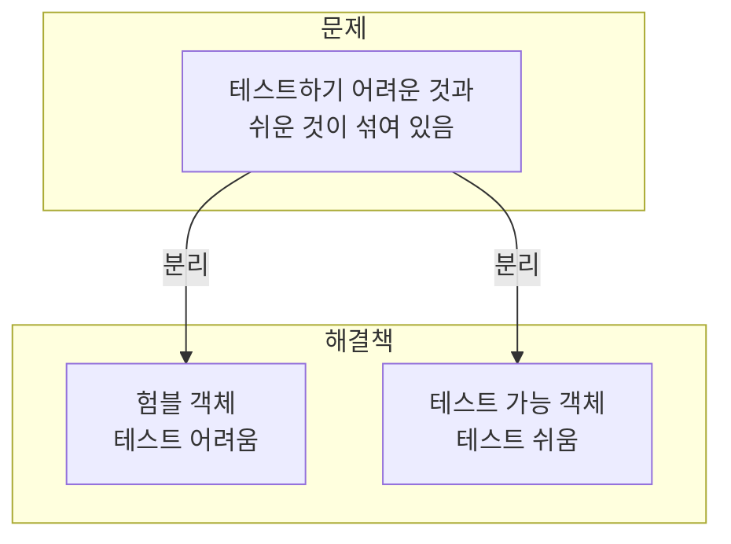
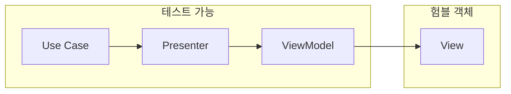
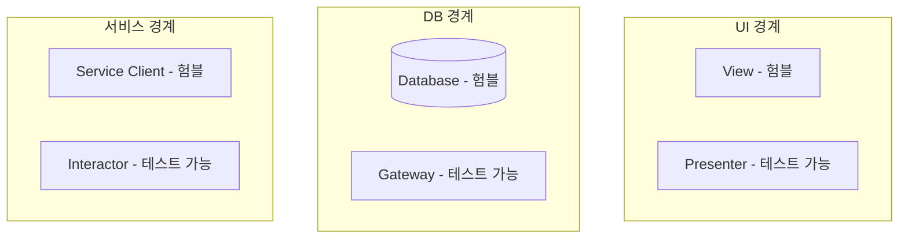
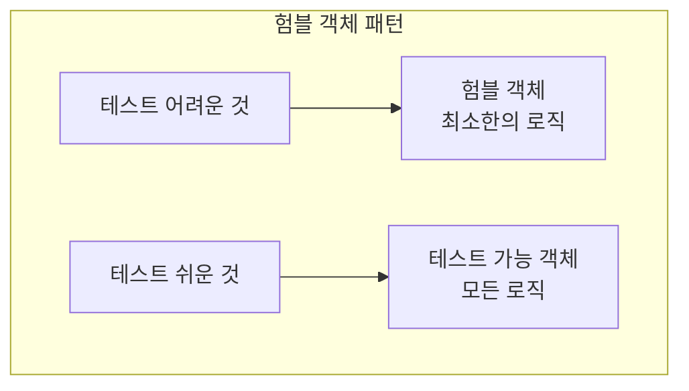

**험블 객체 패턴(Humble Object Pattern)**은 테스트하기 어려운 행위와 쉬운 행위를 분리하는 패턴이다. 이 패턴은 아키텍처 경계에서 자주 사용된다.

## 험블 객체 패턴이란?



> "테스트하기 어려운 행위와 쉬운 행위를 분리하여, **테스트 가능한 부분을 최대화**한다."

## 문제: GUI는 테스트하기 어렵다

GUI는 테스트하기 **어렵다**. 왜?

```java
// GUI 테스트의 어려움
public class OrderView extends JFrame {
    private JLabel lblOrderId;
    private JLabel lblTotal;
    private JLabel lblDate;
    
    public void displayOrder(Order order) {
        // 비즈니스 로직과 UI 코드가 섞여 있음
        String formattedTotal = "$" + order.getTotal();
        String formattedDate = new SimpleDateFormat("yyyy-MM-dd")
            .format(order.getCreatedAt());
        
        lblOrderId.setText(order.getId().toString());
        lblTotal.setText(formattedTotal);
        lblDate.setText(formattedDate);
    }
}

// 어떻게 테스트하지?
// - JFrame을 생성해야 함
// - 화면에 무엇이 표시되는지 어떻게 검증?
// - 느리고 불안정한 테스트
```

| 문제점 | 영향 |
|--------|------|
| 실제 UI 컴포넌트 필요 | 테스트 환경 복잡 |
| 화면 출력 검증 어려움 | 자동화 테스트 어려움 |
| 느린 테스트 | 피드백 지연 |
| 불안정한 테스트 | 신뢰도 저하 |

## 해결: Presenter와 View 분리

테스트하기 어려운 부분(**View**)과 쉬운 부분(**Presenter**)을 **분리**한다.



### View (험블 객체)

화면에 데이터를 표시하는 **아주 단순한** 역할만 수행한다.

```java
// View는 아주 단순하게
public class OrderView {
    private JLabel lblOrderId;
    private JLabel lblTotal;
    private JLabel lblDate;
    
    public void display(OrderViewModel viewModel) {
        // 로직 없음! 단순히 표시만
        lblOrderId.setText(viewModel.orderId);
        lblTotal.setText(viewModel.total);
        lblDate.setText(viewModel.date);
    }
}
```

### ViewModel (데이터 전달 객체)

View가 표시할 **준비된 데이터**를 담는다.

```java
// ViewModel: 이미 포맷팅된 문자열
public class OrderViewModel {
    public final String orderId;
    public final String total;      // "$100.00"
    public final String date;       // "2026년 1월 18일"
    public final String status;     // "배송 중"
    public final boolean canCancel; // 취소 버튼 활성화 여부
    
    // 생성자 생략
}
```

### Presenter (테스트 가능)

비즈니스 데이터를 View가 표시할 수 있는 형태로 **변환**한다.

```java
// Presenter: 모든 로직 담당
public class OrderPresenter {
    
    public OrderViewModel present(Order order) {
        return new OrderViewModel(
            formatOrderId(order.getId()),
            formatMoney(order.getTotal()),
            formatDate(order.getCreatedAt()),
            translateStatus(order.getStatus()),
            canCancel(order)
        );
    }
    
    private String formatOrderId(Long id) {
        return "ORD-" + String.format("%08d", id);
    }
    
    private String formatMoney(BigDecimal amount) {
        return NumberFormat.getCurrencyInstance()
            .format(amount);
    }
    
    private String formatDate(LocalDateTime dateTime) {
        return dateTime.format(
            DateTimeFormatter.ofPattern("yyyy년 M월 d일")
        );
    }
    
    private String translateStatus(OrderStatus status) {
        return switch (status) {
            case PENDING -> "주문 접수";
            case PAID -> "결제 완료";
            case SHIPPED -> "배송 중";
            case DELIVERED -> "배송 완료";
            case CANCELLED -> "취소됨";
        };
    }
    
    private boolean canCancel(Order order) {
        return order.getStatus() == OrderStatus.PENDING ||
               order.getStatus() == OrderStatus.PAID;
    }
}
```

### 테스트

이제 Presenter를 **쉽게 테스트**할 수 있다:

```java
class OrderPresenterTest {
    
    private OrderPresenter presenter = new OrderPresenter();
    
    @Test
    void shouldFormatOrderIdWithPrefix() {
        Order order = new Order(123L, ...);
        
        OrderViewModel vm = presenter.present(order);
        
        assertThat(vm.orderId).isEqualTo("ORD-00000123");
    }
    
    @Test
    void shouldFormatMoneyAsCurrency() {
        Order order = orderWithTotal(new BigDecimal("100.00"));
        
        OrderViewModel vm = presenter.present(order);
        
        assertThat(vm.total).isEqualTo("$100.00");
    }
    
    @Test
    void shouldTranslateStatusToKorean() {
        Order order = orderWithStatus(OrderStatus.SHIPPED);
        
        OrderViewModel vm = presenter.present(order);
        
        assertThat(vm.status).isEqualTo("배송 중");
    }
    
    @Test
    void shouldAllowCancelForPendingOrders() {
        Order order = orderWithStatus(OrderStatus.PENDING);
        
        OrderViewModel vm = presenter.present(order);
        
        assertThat(vm.canCancel).isTrue();
    }
    
    @Test
    void shouldNotAllowCancelForShippedOrders() {
        Order order = orderWithStatus(OrderStatus.SHIPPED);
        
        OrderViewModel vm = presenter.present(order);
        
        assertThat(vm.canCancel).isFalse();
    }
}
```

## 경계에서의 험블 객체

험블 객체 패턴은 **모든 아키텍처 경계**에서 사용할 수 있다.



| 경계 | 험블 객체 | 테스트 가능 객체 |
|------|----------|-----------------|
| UI | View | Presenter |
| 데이터베이스 | Database/ORM | Gateway/Repository |
| 외부 서비스 | HTTP Client | Interactor |
| 파일 시스템 | File I/O | Data Mapper |

### 데이터베이스 경계

```java
// 험블: 실제 DB 접근
public class JpaOrderRepository implements OrderRepository {
    private final EntityManager em;
    
    public void save(Order order) {
        // JPA 코드 - 테스트하기 어려움
        em.persist(OrderEntity.from(order));
    }
}

// 테스트 가능: 비즈니스 로직
public class OrderGateway {
    private final OrderRepository repository;
    
    public Order findValidOrder(Long orderId) {
        Order order = repository.findById(orderId)
            .orElseThrow(() -> new OrderNotFoundException(orderId));
        
        if (order.isExpired()) {
            throw new OrderExpiredException(orderId);
        }
        
        return order;
    }
}

// Gateway 테스트
@Test
void shouldThrowWhenOrderNotFound() {
    OrderRepository mockRepo = mock(OrderRepository.class);
    when(mockRepo.findById(999L)).thenReturn(Optional.empty());
    
    OrderGateway gateway = new OrderGateway(mockRepo);
    
    assertThrows(OrderNotFoundException.class,
        () -> gateway.findValidOrder(999L));
}
```

### 외부 서비스 경계

```java
// 험블: HTTP 클라이언트
public class PaymentServiceClient {
    private final RestTemplate restTemplate;
    
    public PaymentResponse charge(PaymentRequest request) {
        // HTTP 호출 - 테스트하기 어려움
        return restTemplate.postForObject(
            "https://payment.example.com/charge",
            request,
            PaymentResponse.class
        );
    }
}

// 테스트 가능: 비즈니스 로직
public class PaymentInteractor {
    private final PaymentGateway gateway;
    
    public PaymentResult processPayment(Order order) {
        // 비즈니스 로직
        if (order.getTotal().compareTo(BigDecimal.ZERO) <= 0) {
            return PaymentResult.invalid("금액이 0 이하입니다");
        }
        
        Payment payment = Payment.from(order);
        PaymentResponse response = gateway.charge(payment);
        
        if (response.isDeclined()) {
            return PaymentResult.declined(response.getReason());
        }
        
        return PaymentResult.success(response.getTransactionId());
    }
}
```

## View는 얼마나 험블해야 하는가?

View는 **가능한 한 단순**해야 한다. 조건문조차 피해야 한다.

```java
// 나쁜 예: View에 로직이 있음
public class OrderView {
    public void display(Order order) {
        if (order.getStatus() == OrderStatus.CANCELLED) {
            lblStatus.setForeground(Color.RED);
        }
        lblTotal.setText("$" + order.getTotal());
    }
}

// 좋은 예: View는 무조건 표시만
public class OrderView {
    public void display(OrderViewModel vm) {
        lblStatus.setForeground(vm.statusColor);  // 이미 결정됨
        lblTotal.setText(vm.total);               // 이미 포맷됨
    }
}

// Presenter가 모든 결정을 함
public class OrderPresenter {
    public OrderViewModel present(Order order) {
        Color statusColor = order.getStatus() == OrderStatus.CANCELLED 
            ? Color.RED 
            : Color.BLACK;
            
        return new OrderViewModel(
            formatMoney(order.getTotal()),
            statusColor
        );
    }
}
```

## 핵심 요약



| 원칙 | 설명 |
|------|------|
| 분리 | 테스트하기 어려운 것과 쉬운 것을 분리 |
| 험블 객체 | 최소한의 로직만 (표시, 저장 등) |
| 테스트 가능 객체 | 모든 비즈니스 로직 |
| 적용 위치 | 모든 아키텍처 경계 |

> **"아키텍처 경계마다 험블 객체를 찾을 수 있다. 테스트하기 어려운 것과 쉬운 것을 분리하라."**
> — Robert C. Martin
