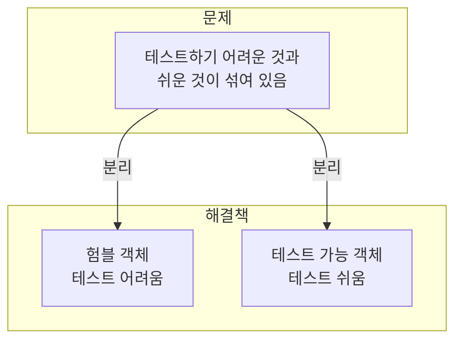
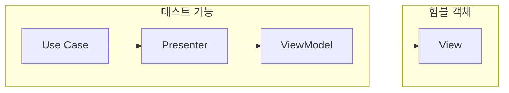
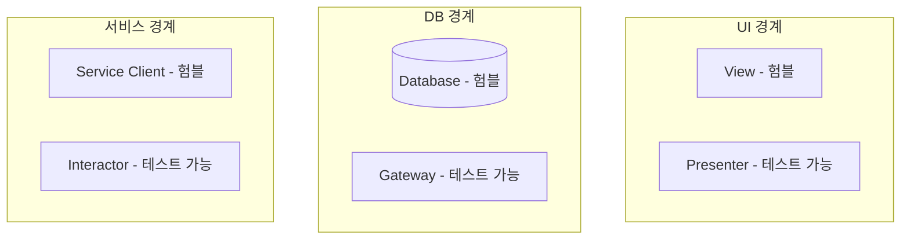
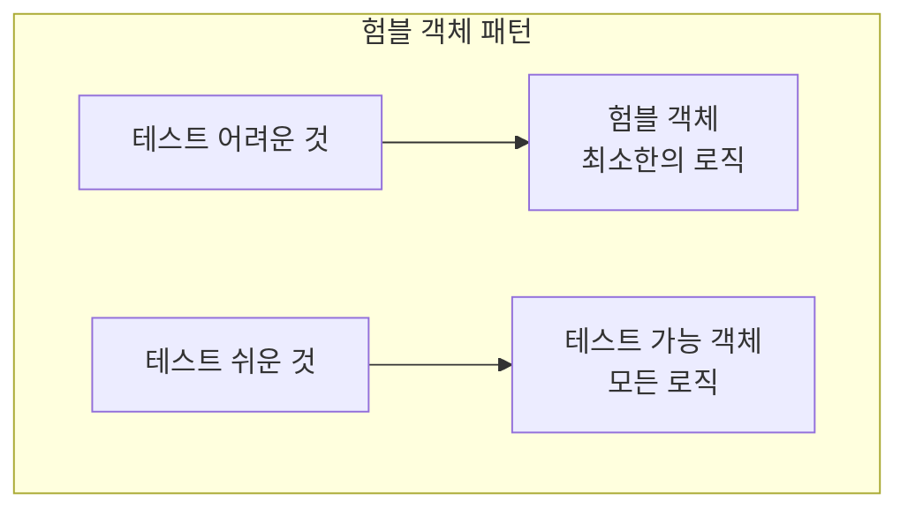

**험블 객체 패턴(Humble Object Pattern)**은 테스트하기 어려운 행위와 쉬운 행위를 분리하는 패턴이다. 이 패턴은 아키텍처 경계에서 자주 사용된다.

## 험블 객체 패턴이란?


```mermaid
flowchart TB
    subgraph Problem [문제]
        MIXED[테스트하기 어려운 것과</br>쉬운 것이 섞여 있음]
    end
    
    subgraph Solution [해결책]
        HUMBLE[험블 객체<br/>테스트 어려움]
        TESTABLE[테스트 가능 객체<br/>테스트 쉬움]
    end
    
    MIXED -->|분리| HUMBLE
    MIXED -->|분리| TESTABLE
```

> "One of those modules is humble; it contains all the hard-to-test behaviors stripped down to their barest essence."
> — Robert C. Martin, 『Clean Architecture』(2017), 23장

"험블(humble)"이라는 이름은 Michael Feathers가 2002년에 쓴 논문 "The Humble Dialog Box"에서 비롯됐다. 화면(GUI)처럼 테스트하기 어려운 요소는 로직을 최대한 비워 "겸손하게" 만들고, 나머지 로직은 전부 테스트하기 쉬운 객체로 옮기자는 것이 핵심 아이디어였다.

## 문제: GUI는 테스트하기 어렵다

GUI는 테스트하기 **어렵다**. 왜?

```java
import javax.swing.JFrame;
import javax.swing.JLabel;
import java.text.SimpleDateFormat;
import java.math.BigDecimal;
import java.util.Date;

enum OrderStatus { PENDING, PAID, SHIPPED, DELIVERED, CANCELLED }

class Order {
    private final Long id;
    private final BigDecimal total;
    private final Date createdAt;
    private final OrderStatus status;

    Order(Long id, BigDecimal total, Date createdAt, OrderStatus status) {
        this.id = id;
        this.total = total;
        this.createdAt = createdAt;
        this.status = status;
    }
    Long getId() { return id; }
    BigDecimal getTotal() { return total; }
    Date getCreatedAt() { return createdAt; }
    OrderStatus getStatus() { return status; }
    boolean isExpired() {
        long THIRTY_DAYS_MS = 30L * 24 * 60 * 60 * 1000;
        return new Date().getTime() - createdAt.getTime() > THIRTY_DAYS_MS;
    }
}

// GUI 테스트의 어려움
public class LegacyOrderView extends JFrame {
    private JLabel lblOrderId;
    private JLabel lblTotal;
    private JLabel lblDate;

    public void displayOrder(Order order) {
        // 비즈니스 로직과 UI 코드가 섞여 있음
        String formattedTotal = "$" + order.getTotal();
        String formattedDate = new SimpleDateFormat("yyyy-MM-dd")
            .format(order.getCreatedAt());

        lblOrderId.setText(order.getId().toString());
        lblTotal.setText(formattedTotal);
        lblDate.setText(formattedDate);
    }
}

// 어떻게 테스트하지?
// - JFrame을 생성해야 함
// - 화면에 무엇이 표시되는지 어떻게 검증?
// - 느리고 불안정한 테스트
```

| 문제점 | 영향 |
|--------|------|
| 실제 UI 컴포넌트 필요 | 테스트 환경 복잡 |
| 화면 출력 검증 어려움 | 자동화 테스트 어려움 |
| 느린 테스트 | 피드백 지연 |
| 불안정한 테스트 | 신뢰도 저하 |

## 해결: Presenter와 View 분리

테스트하기 어려운 부분(**View**)과 쉬운 부분(**Presenter**)을 **분리**한다.


```mermaid
flowchart LR
    subgraph Testable [테스트 가능]
        UC[Use Case]
        P[Presenter]
        VM[ViewModel]
    end
    
    subgraph Humble [험블 객체]
        V[View]
    end
    
    UC --> P
    P --> VM
    VM --> V
```

### View (험블 객체)

화면에 데이터를 표시하는 **아주 단순한** 역할만 수행한다.

```java
import javax.swing.JLabel;
import java.awt.Color;

// View는 아주 단순하게
public class OrderView {
    private JLabel lblOrderId;
    private JLabel lblTotal;
    private JLabel lblDate;
    private JLabel lblStatus;

    public void display(OrderViewModel viewModel) {
        // 로직 없음! 단순히 표시만
        lblOrderId.setText(viewModel.orderId);
        lblTotal.setText(viewModel.total);
        lblDate.setText(viewModel.date);
        lblStatus.setText(viewModel.status);
        lblStatus.setForeground(viewModel.statusColor);
    }
}
```

### ViewModel (데이터 전달 객체)

View가 표시할 **준비된 데이터**를 담는다.

```java
import java.awt.Color;

// ViewModel: 이미 포맷팅된 문자열
public class OrderViewModel {
    public final String orderId;
    public final String total;      // "$100.00"
    public final String date;       // "2026년 1월 18일"
    public final String status;     // "배송 중"
    public final boolean canCancel; // 취소 버튼 활성화 여부
    public final Color statusColor; // 이미 결정된 표시 색상

    public OrderViewModel(String orderId, String total, String date,
                           String status, boolean canCancel, Color statusColor) {
        this.orderId = orderId;
        this.total = total;
        this.date = date;
        this.status = status;
        this.canCancel = canCancel;
        this.statusColor = statusColor;
    }
}
```

### Presenter (테스트 가능)

비즈니스 데이터를 View가 표시할 수 있는 형태로 **변환**한다.

```java
import java.awt.Color;
import java.math.BigDecimal;
import java.text.NumberFormat;
import java.text.SimpleDateFormat;
import java.util.Date;
import java.util.Locale;

// Presenter: 모든 로직 담당
public class OrderPresenter {

    public OrderViewModel present(Order order) {
        return new OrderViewModel(
            formatOrderId(order.getId()),
            formatMoney(order.getTotal()),
            formatDate(order.getCreatedAt()),
            translateStatus(order.getStatus()),
            canCancel(order),
            statusColor(order.getStatus())
        );
    }

    private String formatOrderId(Long id) {
        return "ORD-" + String.format(Locale.US, "%08d", id);
    }

    private String formatMoney(BigDecimal amount) {
        // 로케일을 명시하지 않으면 실행 환경에 따라 통화 기호가 달라진다
        return NumberFormat.getCurrencyInstance(Locale.US)
            .format(amount);
    }

    private String formatDate(Date date) {
        return new SimpleDateFormat("yyyy년 M월 d일").format(date);
    }

    private String translateStatus(OrderStatus status) {
        return switch (status) {
            case PENDING -> "주문 접수";
            case PAID -> "결제 완료";
            case SHIPPED -> "배송 중";
            case DELIVERED -> "배송 완료";
            case CANCELLED -> "취소됨";
        };
    }

    private boolean canCancel(Order order) {
        return order.getStatus() == OrderStatus.PENDING ||
               order.getStatus() == OrderStatus.PAID;
    }

    private Color statusColor(OrderStatus status) {
        return status == OrderStatus.CANCELLED ? Color.RED : Color.BLACK;
    }
}
```

### 테스트

이제 Presenter를 **쉽게 테스트**할 수 있다:

```java
import static org.assertj.core.api.Assertions.assertThat;
import org.junit.jupiter.api.Test;
import java.math.BigDecimal;
import java.util.Date;

class OrderPresenterTest {

    private OrderPresenter presenter = new OrderPresenter();

    private Order orderWithTotal(BigDecimal total) {
        return new Order(123L, total, new Date(), OrderStatus.PENDING);
    }

    private Order orderWithStatus(OrderStatus status) {
        return new Order(123L, new BigDecimal("100.00"), new Date(), status);
    }

    @Test
    void shouldFormatOrderIdWithPrefix() {
        Order order = orderWithTotal(new BigDecimal("100.00"));

        OrderViewModel vm = presenter.present(order);

        assertThat(vm.orderId).isEqualTo("ORD-00000123");
    }

    @Test
    void shouldFormatMoneyAsCurrency() {
        Order order = orderWithTotal(new BigDecimal("100.00"));

        OrderViewModel vm = presenter.present(order);

        assertThat(vm.total).isEqualTo("$100.00");
    }

    @Test
    void shouldTranslateStatusToKorean() {
        Order order = orderWithStatus(OrderStatus.SHIPPED);

        OrderViewModel vm = presenter.present(order);

        assertThat(vm.status).isEqualTo("배송 중");
    }

    @Test
    void shouldAllowCancelForPendingOrders() {
        Order order = orderWithStatus(OrderStatus.PENDING);

        OrderViewModel vm = presenter.present(order);

        assertThat(vm.canCancel).isTrue();
    }

    @Test
    void shouldNotAllowCancelForShippedOrders() {
        Order order = orderWithStatus(OrderStatus.SHIPPED);

        OrderViewModel vm = presenter.present(order);

        assertThat(vm.canCancel).isFalse();
    }
}
```

## 경계에서의 험블 객체

험블 객체 패턴은 **모든 아키텍처 경계**에서 사용할 수 있다.


```mermaid
flowchart TB
    subgraph UI_Boundary [UI 경계]
        V[View - 험블]
        P[Presenter - 테스트 가능]
    end
    
    subgraph DB_Boundary [DB 경계]
        DB[(Database - 험블)]
        GW[Gateway - 테스트 가능]
    end
    
    subgraph Service_Boundary [서비스 경계]
        SVC[Service Client - 험블]
        INT[Interactor - 테스트 가능]
    end
```

| 경계 | 험블 객체 | 테스트 가능 객체 |
|------|----------|-----------------|
| UI | View | Presenter |
| 데이터베이스 | Database/ORM | Gateway/Repository |
| 외부 서비스 | HTTP Client | Interactor |

### 데이터베이스 경계

```java
import jakarta.persistence.EntityManager;
import jakarta.persistence.Entity;
import java.util.Optional;
import static org.mockito.Mockito.mock;
import static org.mockito.Mockito.when;
import static org.junit.jupiter.api.Assertions.assertThrows;
import org.junit.jupiter.api.Test;

interface OrderRepository { Optional<Order> findById(Long id); }
class OrderNotFoundException extends RuntimeException {
    OrderNotFoundException(Long id) { super("order not found: " + id); }
}
class OrderExpiredException extends RuntimeException {
    OrderExpiredException(Long id) { super("order expired: " + id); }
}

@Entity
class OrderEntity {
    static OrderEntity from(Order order) { return new OrderEntity(); }
}

// 험블: 실제 DB 접근
public class JpaOrderRepository implements OrderRepository {
    private final EntityManager em;

    public JpaOrderRepository(EntityManager em) { this.em = em; }

    public void save(Order order) {
        // JPA 코드 - 테스트하기 어려움
        em.persist(OrderEntity.from(order));
    }

    @Override
    public Optional<Order> findById(Long id) {
        return Optional.empty(); // 실제로는 em.find(...) 등을 사용한다
    }
}

// 테스트 가능: 비즈니스 로직
public class OrderGateway {
    private final OrderRepository repository;

    public OrderGateway(OrderRepository repository) { this.repository = repository; }

    public Order findValidOrder(Long orderId) {
        Order order = repository.findById(orderId)
            .orElseThrow(() -> new OrderNotFoundException(orderId));

        if (order.isExpired()) {
            throw new OrderExpiredException(orderId);
        }

        return order;
    }
}

// Gateway 테스트
class OrderGatewayTest {
    @Test
    void shouldThrowWhenOrderNotFound() {
        OrderRepository mockRepo = mock(OrderRepository.class);
        when(mockRepo.findById(999L)).thenReturn(Optional.empty());

        OrderGateway gateway = new OrderGateway(mockRepo);

        assertThrows(OrderNotFoundException.class,
            () -> gateway.findValidOrder(999L));
    }
}
```

### 외부 서비스 경계

```java
import org.springframework.web.client.RestTemplate;
import java.math.BigDecimal;

class PaymentRequest { PaymentRequest(BigDecimal amount) {} }
class PaymentResponse {
    private final boolean declined;
    private final String reason;
    private final String transactionId;
    PaymentResponse(boolean declined, String reason, String transactionId) {
        this.declined = declined; this.reason = reason; this.transactionId = transactionId;
    }
    boolean isDeclined() { return declined; }
    String getReason() { return reason; }
    String getTransactionId() { return transactionId; }
}
class Payment {
    private final BigDecimal amount;
    private Payment(BigDecimal amount) { this.amount = amount; }
    static Payment from(Order order) { return new Payment(order.getTotal()); }
    BigDecimal getAmount() { return amount; }
}
class PaymentResult {
    private final String status;
    private final String detail;
    private PaymentResult(String status, String detail) { this.status = status; this.detail = detail; }
    static PaymentResult invalid(String reason) { return new PaymentResult("INVALID", reason); }
    static PaymentResult declined(String reason) { return new PaymentResult("DECLINED", reason); }
    static PaymentResult success(String transactionId) { return new PaymentResult("SUCCESS", transactionId); }
}
interface PaymentGateway { PaymentResponse charge(Payment payment); }

// 험블: HTTP 클라이언트
public class PaymentServiceClient implements PaymentGateway {
    private final RestTemplate restTemplate;

    public PaymentServiceClient(RestTemplate restTemplate) { this.restTemplate = restTemplate; }

    @Override
    public PaymentResponse charge(Payment payment) {
        // HTTP 호출 - 테스트하기 어려움
        PaymentRequest request = new PaymentRequest(payment.getAmount());
        return restTemplate.postForObject(
            "https://payment.example.com/charge",
            request,
            PaymentResponse.class
        );
    }
}

// 테스트 가능: 비즈니스 로직
public class PaymentInteractor {
    private final PaymentGateway gateway;

    public PaymentInteractor(PaymentGateway gateway) { this.gateway = gateway; }

    public PaymentResult processPayment(Order order) {
        // 비즈니스 로직
        if (order.getTotal().compareTo(BigDecimal.ZERO) <= 0) {
            return PaymentResult.invalid("금액이 0 이하입니다");
        }

        Payment payment = Payment.from(order);
        PaymentResponse response = gateway.charge(payment);

        if (response.isDeclined()) {
            return PaymentResult.declined(response.getReason());
        }

        return PaymentResult.success(response.getTransactionId());
    }
}
```

`PaymentServiceClient`는 `PaymentGateway` 인터페이스를 구현하는 험블 객체이고, `PaymentInteractor`는 그 인터페이스에만 의존하는 테스트 가능한 비즈니스 로직이다. 테스트에서는 실제 `RestTemplate` 대신 `PaymentGateway`의 가짜 구현을 주입하면 되므로, HTTP 호출 없이 `processPayment()`의 금액 검증·응답 해석 로직만 검증할 수 있다.

## View는 얼마나 험블해야 하는가?

View는 **가능한 한 단순**해야 한다. 조건문조차 피해야 한다. 앞서 정의한 `OrderView.display(OrderViewModel)`가 이미 이 원칙을 따르고 있다 — `if` 문 하나 없이 `viewModel`의 이미 결정된 값을 라벨에 옮기기만 한다. 대조를 위해, 같은 기능을 View에 로직을 남긴 채 구현하면 다음과 같이 된다:

```java
import javax.swing.JLabel;
import java.awt.Color;

// 나쁜 예: View가 스스로 "취소됨인지"를 판단함
public class BadOrderView {
    private JLabel lblStatus;
    private JLabel lblTotal;

    public void display(Order order) {
        if (order.getStatus() == OrderStatus.CANCELLED) {
            lblStatus.setForeground(Color.RED);
        }
        lblTotal.setText("$" + order.getTotal());
    }
}
```

`BadOrderView`는 `OrderStatus.CANCELLED`라는 도메인 지식과 "취소되면 빨간색"이라는 표시 규칙을 View 스스로 알아야 한다 — 이 조건문 하나를 테스트하려면 결국 JLabel을 가진 View 객체를 생성해야 한다. 반면 앞서의 `OrderPresenter.statusColor()`처럼 그 판단을 Presenter로 옮기면, View는 조건문 없이 이미 결정된 `Color` 값만 그대로 전달하면 된다.

## 흔한 오해

험블 객체 패턴을 "View 코드는 아예 테스트하지 않아도 된다"는 뜻으로 오해하기 쉽다. 정확히는, View에 남는 로직을 조건문 하나조차 없을 만큼 최소화해서 **테스트할 필요가 없는 수준**으로 낮추는 것이 목표다. 로직이 남아 있다면(`BadOrderView`처럼) 그 로직은 여전히 테스트 대상이고, 험블 객체 패턴은 그 로직을 Presenter·Interactor 같은 테스트 가능한 객체로 옮기라고 말할 뿐이다. 또 다른 오해는 이 패턴이 UI 계층에만 해당한다고 여기는 것이다. "경계에서의 험블 객체" 절에서 보듯, DB 접근(`JpaOrderRepository`)과 외부 HTTP 호출(`PaymentServiceClient`)도 똑같이 험블 객체로 다룰 수 있다 — 프레임워크·네트워크·파일시스템처럼 목(mock) 없이는 테스트하기 어려운 모든 경계가 대상이다.

이 패턴에는 비용도 따른다. `OrderViewModel`처럼 View 전용 데이터 구조를 매 화면마다 새로 만들어야 하므로, 필드 몇 개짜리 단순한 화면에서는 Presenter·ViewModel을 나누는 것 자체가 원본 데이터를 그대로 표시하는 것보다 코드량이 늘어나는 과잉 설계가 될 수 있다. 이 패턴은 웹 프런트엔드의 MVP(Model-View-Presenter)·MVVM(Model-View-ViewModel) 아키텍처와 뿌리가 같다 — Presenter가 View를 알지 못하고 데이터만 준비해 건네준다는 점에서, `OrderPresenter`/`OrderViewModel`은 사실상 MVP를 서버 사이드 Java로 구현한 것이다.

## 학습 목표

이 장을 읽은 후 다음을 스스로 점검한다.

- 험블 객체 패턴이 "테스트를 생략해도 된다"가 아니라 "테스트가 필요 없을 만큼 로직을 비운다"는 뜻임을 설명할 수 있는가?
- `OrderView`와 `OrderPresenter` 중 어느 쪽이 험블 객체이고 어느 쪽이 테스트 가능 객체인지, 그리고 그 이유를 설명할 수 있는가?
- 험블 객체 패턴이 UI 경계뿐 아니라 DB·외부 서비스 경계에도 적용된다는 것을 `JpaOrderRepository`/`OrderGateway`, `PaymentServiceClient`/`PaymentInteractor` 예시로 설명할 수 있는가?
- `BadOrderView`가 왜 테스트하기 어려운지, 그 조건문을 Presenter로 옮기면 무엇이 달라지는지 설명할 수 있는가?

## 판단 기준

어떤 로직을 험블 객체 쪽에 둘지, 테스트 가능한 쪽에 둘지 판단할 때 다음을 확인한다.

- 이 로직을 테스트하려면 실제 UI·DB·네트워크가 필요한가? 그렇다면 그 로직 자체를 테스트 가능한 객체(Presenter, Interactor, Gateway)로 옮길 수 있는지 먼저 검토한다.
- 험블 객체에 조건문(`if`)이 하나라도 남아 있는가? 남아 있다면 그 판단을 테스트 가능한 쪽으로 옮길 여지가 있다는 신호다.
- 이 값이 이미 결정된 채로 전달되는가, 아니면 험블 객체가 스스로 결정하는가? 후자라면 험블 객체가 아니다.

## 참고 자료

- Robert C. Martin, 『Clean Architecture』(2017), 23장 — 험블 객체 패턴과 프레젠터/뷰 분리의 원출처.
- Michael Feathers, "The Humble Dialog Box" (2002) — "험블 객체"라는 이름과 최초 아이디어의 원출처.

## 핵심 요약


```mermaid
flowchart TB
    subgraph Pattern [험블 객체 패턴]
        HARD[테스트 어려운 것] --> HUMBLE[험블 객체<br/>최소한의 로직]
        EASY[테스트 쉬운 것] --> TESTABLE[테스트 가능 객체<br/>모든 로직]
    end
```

| 원칙 | 설명 |
|------|------|
| 분리 | 테스트하기 어려운 것과 쉬운 것을 분리 |
| 험블 객체 | 최소한의 로직만 (표시, 저장 등) |
| 테스트 가능 객체 | 모든 비즈니스 로직 |
| 적용 위치 | 모든 아키텍처 경계 |
