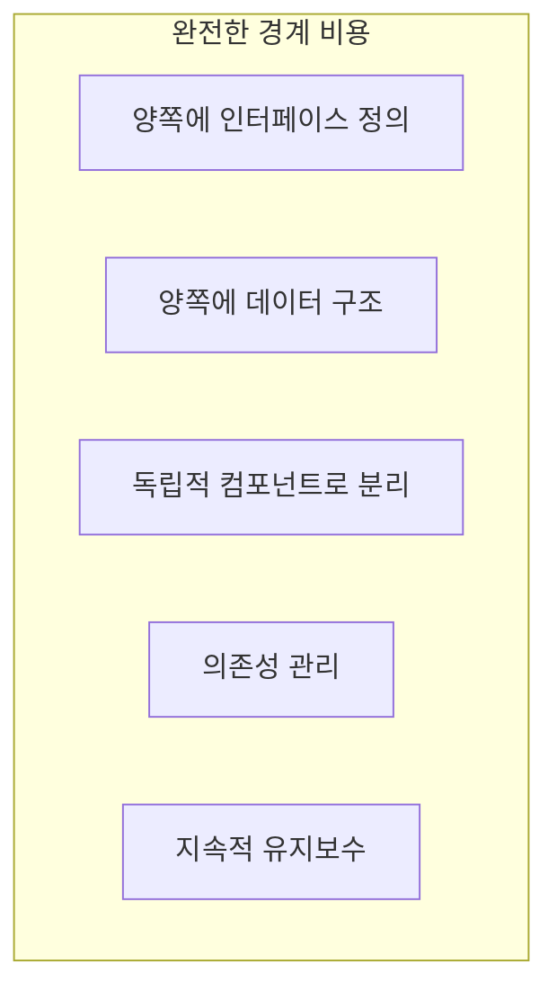
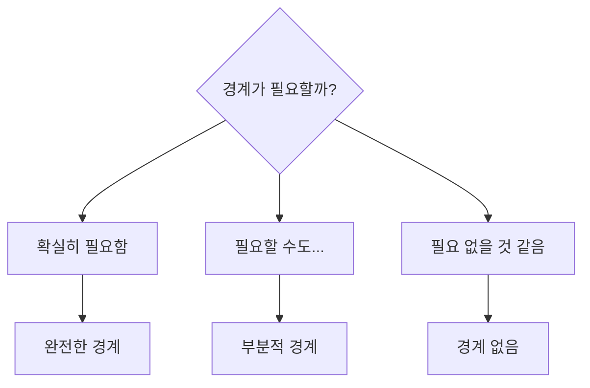
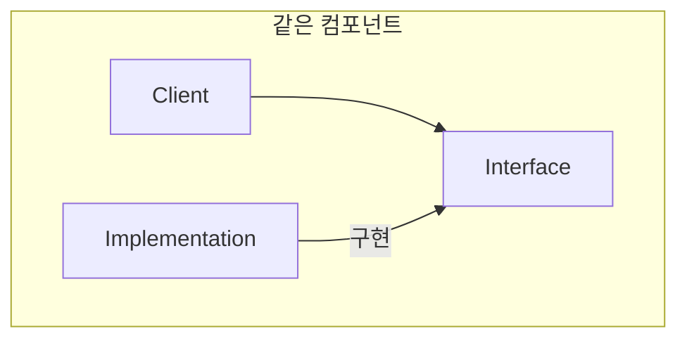
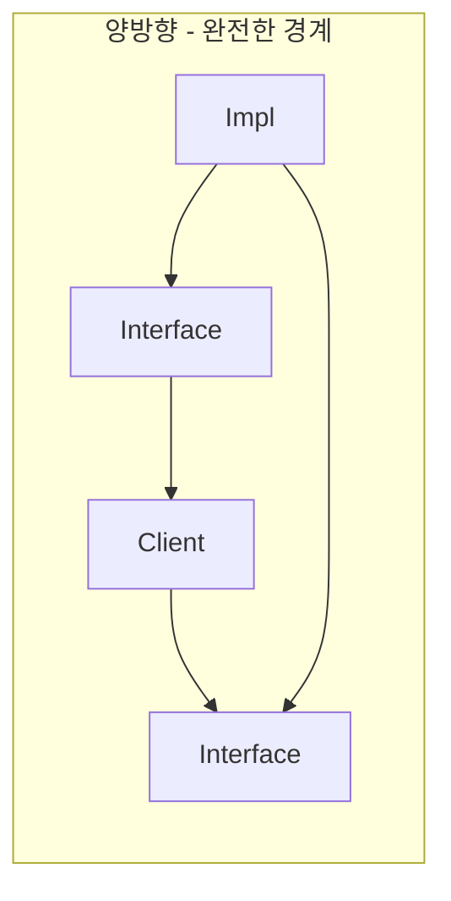
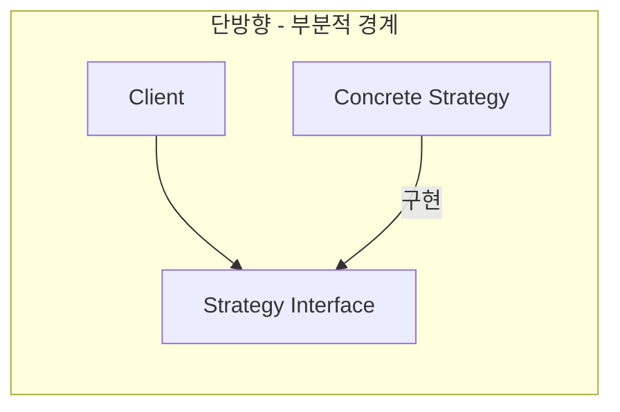
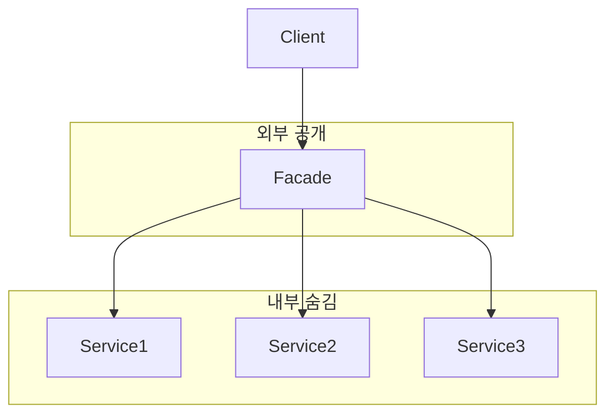
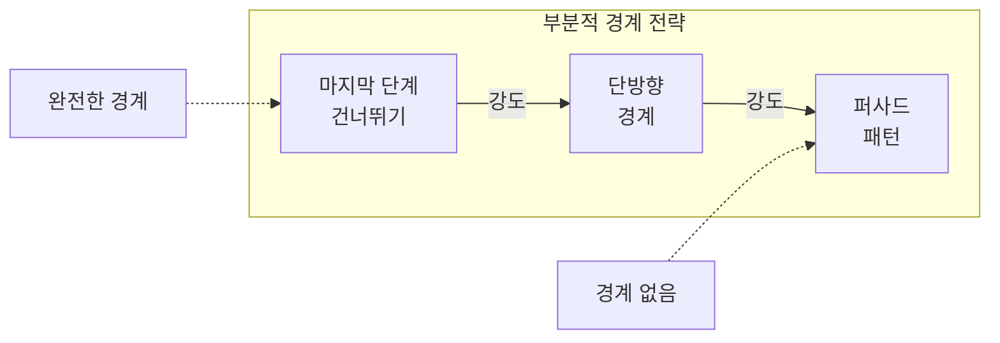
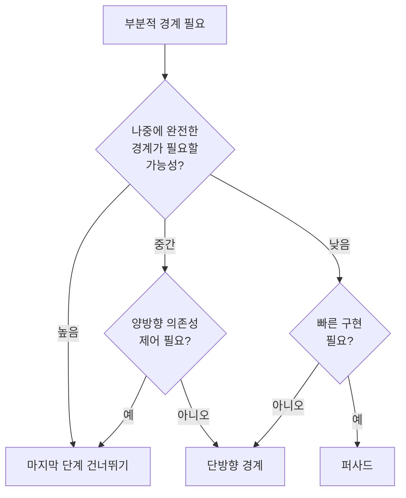

완전한 경계를 만드는 비용은 **상당하다**. 때로는 완전한 경계가 **과도할** 수 있다. 부분적 경계는 비용을 줄이면서 일부 이점을 얻는 방법이다.

## 완전한 경계의 비용



완전한 아키텍처 경계를 만들려면:

| 비용 항목 | 설명 |
|----------|------|
| 인터페이스 정의 | 경계 양쪽에 인터페이스 필요 |
| 데이터 구조 | 경계를 넘는 데이터 구조 정의 |
| 독립 컴포넌트 | 별도 jar/dll로 분리 |
| 의존성 관리 | 컴포넌트 간 버전 관리 |
| 유지보수 비용 | 지속적인 관리 필요 |

> "완전한 경계를 만드는 비용은 **상당하며**, 유지보수 비용도 높다."

## 부분적 경계가 필요한 상황



| 상황 | 권장 전략 |
|------|----------|
| 경계가 확실히 필요 | 완전한 경계 |
| 불확실하지만 가능성 있음 | 부분적 경계 |
| YAGNI (필요 없을 것) | 경계 없음 |

## 세 가지 부분적 경계 전략

### 1. 마지막 단계 건너뛰기 (Skip the Last Step)

인터페이스는 만들지만, **별도 컴포넌트로 분리하지 않음**.



```java
// 같은 패키지에 있지만 인터페이스로 분리
package com.example.order;

// 인터페이스
public interface OrderRepository {
    void save(Order order);
    Optional<Order> findById(Long id);
}

// 구현
public class JpaOrderRepository implements OrderRepository {
    private final EntityManager em;
    
    @Override
    public void save(Order order) {
        em.persist(OrderEntity.from(order));
    }
    
    @Override
    public Optional<Order> findById(Long id) {
        return Optional.ofNullable(em.find(OrderEntity.class, id))
            .map(OrderEntity::toDomain);
    }
}

// 나중에 필요하면 별도 jar로 분리 가능!
```

| 장점 | 단점 |
|------|------|
| 나중에 쉽게 분리 가능 | 같은 컴포넌트라 의존성 침해 가능 |
| 적은 초기 비용 | 분리를 미루다 보면 영원히 안 할 수도 |
| 인터페이스 설계 강제 | 실제 독립성은 없음 |

### 2. 단방향 경계 (One-Dimensional Boundary)

양방향 인터페이스 대신 **한쪽만** 인터페이스를 사용한다.





**전략 패턴을 활용한 단방향 경계:**

```java
// 단방향 경계: 전략 패턴
public class PaymentService {
    private final PaymentStrategy strategy;  // 인터페이스
    
    public PaymentResult process(Order order) {
        return strategy.charge(order.getTotal());
    }
}

// 전략 인터페이스
public interface PaymentStrategy {
    PaymentResult charge(BigDecimal amount);
}

// 구체적인 전략들
public class StripePaymentStrategy implements PaymentStrategy {
    public PaymentResult charge(BigDecimal amount) {
        // Stripe API 호출
    }
}

public class PayPalPaymentStrategy implements PaymentStrategy {
    public PaymentResult charge(BigDecimal amount) {
        // PayPal API 호출
    }
}
```

| 장점 | 단점 |
|------|------|
| 더 간단함 | 양방향 분리 미흡 |
| 전략 교체 가능 | 클라이언트가 구현에 의존할 위험 |
| 빠른 구현 | 역방향 의존성 제어 어려움 |

### 3. 퍼사드 패턴 (Facade Pattern)

경계 없이 **퍼사드로 접근 제한**.



```java
// 퍼사드: 내부 구현을 숨김
public class OrderFacade {
    private final OrderService orderService;
    private final PaymentService paymentService;
    private final InventoryService inventoryService;
    
    // 클라이언트는 퍼사드만 사용
    public OrderResult placeOrder(OrderRequest request) {
        // 내부 서비스들 조합
        inventoryService.reserve(request.getItems());
        paymentService.charge(request.getPayment());
        return orderService.create(request);
    }
    
    public void cancelOrder(Long orderId) {
        orderService.cancel(orderId);
        paymentService.refund(orderId);
        inventoryService.release(orderId);
    }
    
    // 내부 서비스들은 외부에 노출되지 않음
}
```

| 장점 | 단점 |
|------|------|
| 가장 간단함 | 의존성 역전 없음 |
| 진입점 단일화 | 클라이언트가 내부를 직접 접근 가능 |
| 최소 비용 | 경계가 매우 약함 |

## 세 가지 전략 비교



| 전략 | 비용 | 유연성 | 나중에 완전한 경계로 |
|------|------|--------|---------------------|
| 마지막 단계 건너뛰기 | 중간 | 높음 | 쉬움 |
| 단방향 경계 | 낮음 | 중간 | 중간 |
| 퍼사드 | 최저 | 낮음 | 어려움 |

## 선택 가이드



## 코드 예시: 같은 문제, 세 가지 해법

### 문제: 알림 서비스

```java
// 완전한 경계: 별도 컴포넌트
// notification-api.jar
public interface NotificationGateway {
    void send(Notification notification);
}

// notification-email.jar (별도 배포)
public class EmailNotificationGateway implements NotificationGateway {
    public void send(Notification notification) {
        // 이메일 발송
    }
}
```

```java
// 부분적 경계 1: 마지막 단계 건너뛰기
// 같은 jar에 있지만 인터페이스 분리
package com.example.notification;

public interface NotificationGateway {
    void send(Notification notification);
}

public class EmailNotificationGateway implements NotificationGateway {
    // 같은 패키지, 나중에 분리 가능
}
```

```java
// 부분적 경계 2: 단방향 경계
public class OrderService {
    private final NotificationSender sender;  // 단방향
    
    public void placeOrder(Order order) {
        // 주문 처리
        sender.sendOrderConfirmation(order);
    }
}
```

```java
// 부분적 경계 3: 퍼사드
public class NotificationFacade {
    private final EmailService email;
    private final SmsService sms;
    private final PushService push;
    
    public void notifyOrderPlaced(Order order) {
        email.sendOrderConfirmation(order);
        if (order.getCustomer().hasMobile()) {
            sms.sendOrderConfirmation(order);
        }
    }
}
```

## 핵심 요약

| 원칙 | 설명 |
|------|------|
| 비용 고려 | 완전한 경계는 비용이 높음 |
| 미래 예측 | 나중에 필요할 가능성 평가 |
| 단계적 접근 | 부분적 경계로 시작, 필요 시 확장 |
| 트레이드오프 | 비용 vs 유연성 균형 |

> **"부분적 경계는 나중을 위한 자리 표시자다. 필요하면 완전한 경계로 발전시킬 수 있다."**
> — Robert C. Martin
