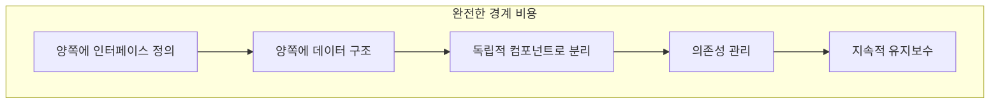
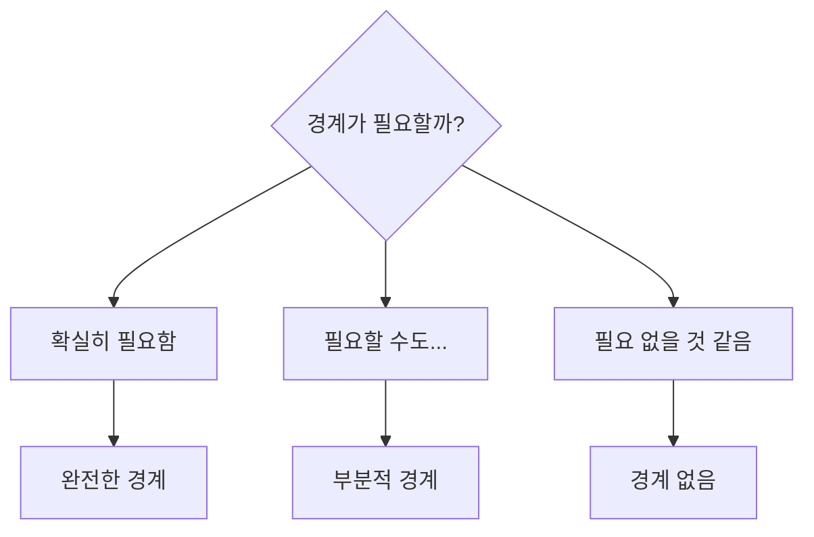
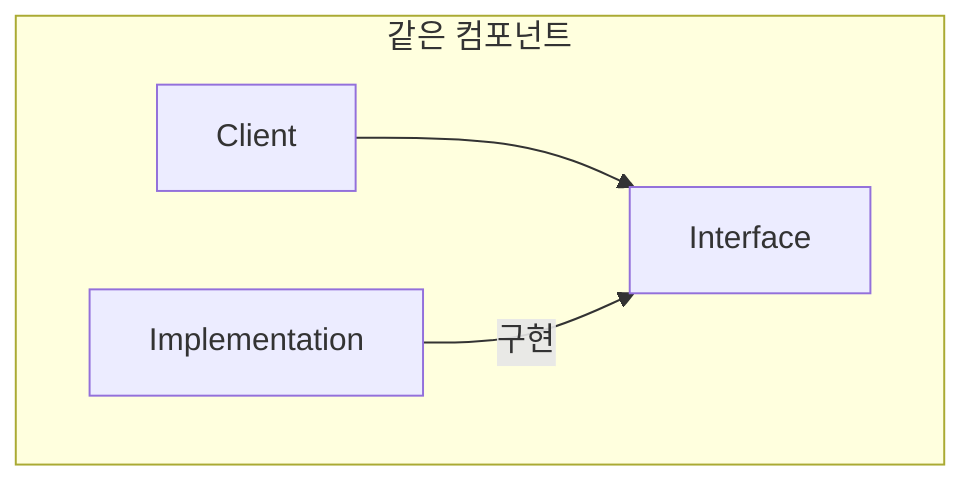
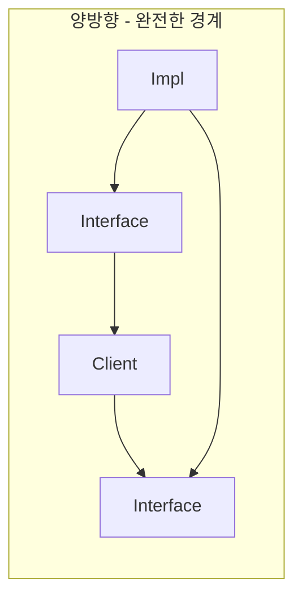
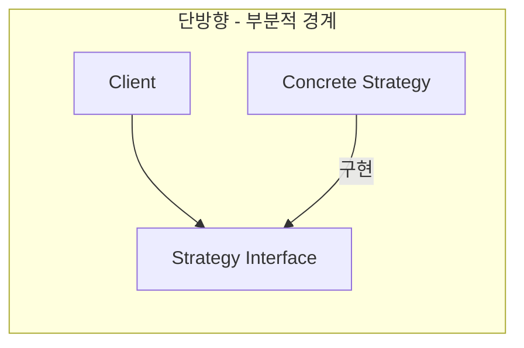
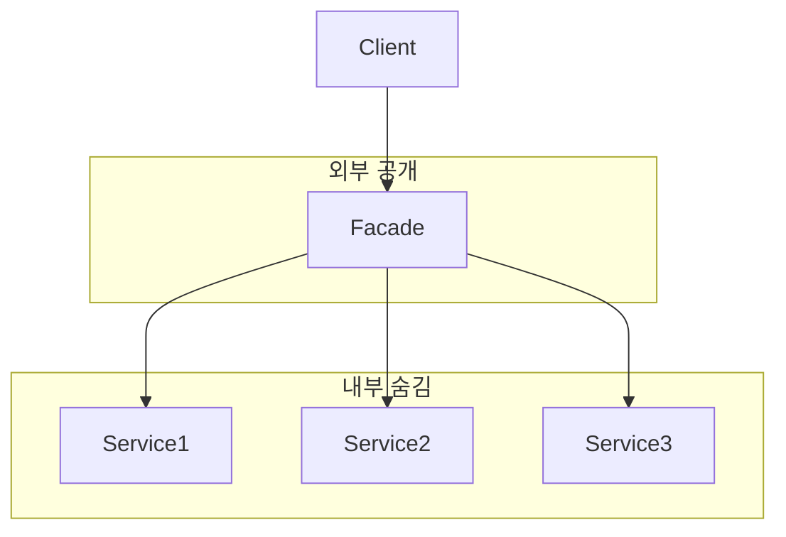
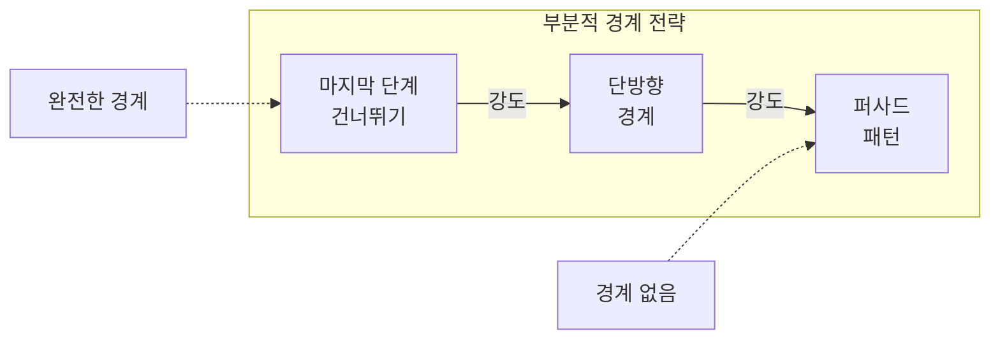
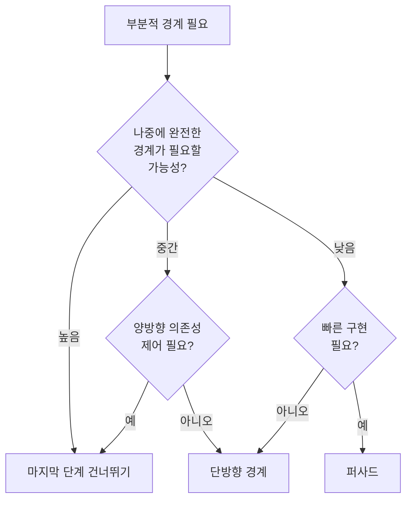

완전한 경계를 만드는 비용은 **상당하다**. 때로는 완전한 경계가 **과도할** 수 있다. 부분적 경계는 비용을 줄이면서 일부 이점을 얻는 방법이다.

## 완전한 경계의 비용


```mermaid
flowchart TB
    subgraph FullBoundary [완전한 경계 비용]
        INTF[양쪽에 인터페이스 정의] --> DS[양쪽에 데이터 구조]
        DS --> DEP[독립적 컴포넌트로 분리]
        DEP --> MANAGE[의존성 관리]
        MANAGE --> MAINT[지속적 유지보수]
    end
```

완전한 아키텍처 경계를 만들려면:

| 비용 항목 | 설명 |
|----------|------|
| 인터페이스 정의 | 경계 양쪽에 인터페이스 필요 |
| 데이터 구조 | 경계를 넘는 데이터 구조 정의 |
| 독립 컴포넌트 | 별도 jar/dll로 분리 |
| 의존성 관리 | 컴포넌트 간 버전 관리 |
| 유지보수 비용 | 지속적인 관리 필요 |

> "Full-fledged architectural boundaries are expensive. They require reciprocal polymorphic Boundary interfaces, Input and Output data structures, and all of the dependency management necessary to isolate the two sides into independently compilable and deployable components."
> — Robert C. Martin, 『Clean Architecture』(2017), 24장

## 부분적 경계가 필요한 상황


```mermaid
flowchart TB
    QUESTION{경계가 필요할까?}
    
    YES[확실히 필요함]
    MAYBE[필요할 수도...]
    NO[필요 없을 것 같음]
    
    QUESTION --> YES --> FULL[완전한 경계]
    QUESTION --> MAYBE --> PARTIAL[부분적 경계]
    QUESTION --> NO --> NONE[경계 없음]
```

| 상황 | 권장 전략 |
|------|----------|
| 경계가 확실히 필요 | 완전한 경계 |
| 불확실하지만 가능성 있음 | 부분적 경계 |
| YAGNI (필요 없을 것) | 경계 없음 |

## 세 가지 부분적 경계 전략

### 1. 마지막 단계 건너뛰기 (Skip the Last Step)

완전한 경계를 만드는 작업의 대부분(인터페이스 설계, 클라이언트가 구현이 아닌 인터페이스에만 의존하도록 하는 것)은 그대로 하되, 딱 한 단계 — 별도의 jar/dll로 물리적으로 분리하고 독립 배포하는 단계 — 만 건너뛴다. 인터페이스와 구현체는 여전히 같은 소스 코드 컴포넌트 안에 있지만, 그 경계선을 코드 상에서는 이미 그어 놓은 상태다. 이렇게 하면 "정말 이 경계가 필요한가"를 나중에 실제 운영 경험으로 확인한 뒤, 필요하다고 판명될 때만 물리적 분리 비용을 지불할 수 있다.


```mermaid
flowchart TB
    subgraph SameComponent [같은 컴포넌트]
        CLIENT[Client]
        INTF[Interface]
        IMPL[Implementation]
        
        CLIENT --> INTF
        IMPL -->|구현| INTF
    end
```

```java
// 같은 패키지에 있지만 인터페이스로 분리
package com.example.order;

import jakarta.persistence.EntityManager;
import jakarta.persistence.Entity;
import java.util.Optional;

class Order {
    private final Long id;
    Order(Long id) { this.id = id; }
    Long getId() { return id; }
}

@Entity
class OrderEntity {
    static OrderEntity from(Order order) { return new OrderEntity(); }
    Order toDomain() { return new Order(1L); }
}

// 인터페이스
interface OrderRepository {
    void save(Order order);
    Optional<Order> findById(Long id);
}

// 구현
class JpaOrderRepository implements OrderRepository {
    private final EntityManager em;

    public JpaOrderRepository(EntityManager em) { this.em = em; }

    @Override
    public void save(Order order) {
        em.persist(OrderEntity.from(order));
    }

    @Override
    public Optional<Order> findById(Long id) {
        return Optional.ofNullable(em.find(OrderEntity.class, id))
            .map(OrderEntity::toDomain);
    }
}

// 나중에 필요하면 별도 jar로 분리 가능!
```

| 장점 | 단점 |
|------|------|
| 나중에 쉽게 분리 가능 | 같은 컴포넌트라 의존성 침해 가능 |
| 적은 초기 비용 | 분리를 미루다 보면 영원히 안 할 수도 |
| 인터페이스 설계 강제 | 실제 독립성은 없음 |

### 2. 단방향 경계 (One-Dimensional Boundary)

완전한 경계는 양쪽 모두 상대편을 인터페이스로만 알아야 하는 **양방향** 의존성 역전을 요구한다. 단방향 경계는 이 중 한쪽만 인터페이스를 두고 나머지 한쪽은 포기한다 — 전형적으로 전략 패턴(Strategy Pattern)이 이 형태를 취한다. 클라이언트(`PaymentService`)는 `PaymentStrategy` 인터페이스에만 의존하고, 구체적인 전략(`StripePaymentStrategy`)은 그 인터페이스를 구현하며 클라이언트를 향해서는 알지 못한다. 다만 이 방향의 의존성 역전만으로는 부족하다 — 구체 전략을 어디서 생성해 주입할지는 여전히 클라이언트 바깥의 조립 코드(main 컴포넌트)가 알아야 하므로, 완전한 경계만큼 양쪽이 독립적으로 배포되지는 않는다.


```mermaid
flowchart LR
    subgraph Bidirectional [양방향 - 완전한 경계]
        A1[Client] --> I1[Interface]
        I2[Interface] --> A1
        IMPL1[Impl] --> I1
        IMPL1 --> I2
    end
```


```mermaid
flowchart LR
    subgraph Unidirectional [단방향 - 부분적 경계]
        B1[Client]
        I3[Strategy Interface]
        IMPL2[Concrete Strategy]
        
        B1 --> I3
        IMPL2 -->|구현| I3
    end
```

**전략 패턴을 활용한 단방향 경계:**

```java
import java.math.BigDecimal;

class Order {
    private final BigDecimal total;
    Order(BigDecimal total) { this.total = total; }
    BigDecimal getTotal() { return total; }
}

class PaymentResult {
    private final boolean success;
    private final String transactionId;
    private PaymentResult(boolean success, String transactionId) {
        this.success = success; this.transactionId = transactionId;
    }
    static PaymentResult success(String transactionId) { return new PaymentResult(true, transactionId); }
    static PaymentResult failure() { return new PaymentResult(false, null); }
}

// 단방향 경계: 전략 패턴
public class PaymentService {
    private final PaymentStrategy strategy;  // 인터페이스

    public PaymentService(PaymentStrategy strategy) { this.strategy = strategy; }

    public PaymentResult process(Order order) {
        return strategy.charge(order.getTotal());
    }
}

// 전략 인터페이스
interface PaymentStrategy {
    PaymentResult charge(BigDecimal amount);
}

// 구체적인 전략들
class StripePaymentStrategy implements PaymentStrategy {
    public PaymentResult charge(BigDecimal amount) {
        // Stripe API 호출(실제로는 Stripe SDK를 사용한다)
        return PaymentResult.success("stripe-tx-" + System.nanoTime());
    }
}

class PayPalPaymentStrategy implements PaymentStrategy {
    public PaymentResult charge(BigDecimal amount) {
        // PayPal API 호출(실제로는 PayPal SDK를 사용한다)
        return PaymentResult.success("paypal-tx-" + System.nanoTime());
    }
}
```

| 장점 | 단점 |
|------|------|
| 더 간단함 | 양방향 분리 미흡 |
| 전략 교체 가능 | 클라이언트가 구현에 의존할 위험 |
| 빠른 구현 | 역방향 의존성 제어 어려움 |

### 3. 퍼사드 패턴 (Facade Pattern)

앞의 두 전략과 달리, 퍼사드는 인터페이스를 통한 의존성 역전을 아예 포기한다. 대신 내부 서비스들(`OrderService`, `PaymentService`, `InventoryService`)에 대한 접근을 퍼사드 클래스(`OrderFacade`) 하나로만 제한해, 클라이언트가 내부 구조를 직접 알지 못하게 한다. 경계는 존재하지만 그 경계는 인터페이스가 아니라 "이 클래스를 거치지 않고는 내부에 접근할 수 없다"는 **접근 제한**으로만 만들어진다 — 그래서 세 전략 중 비용이 가장 낮지만, 퍼사드 자신이 내부 구현체들을 직접 `new`로 생성해 구체 클래스에 의존하므로 의존성 역전이 전혀 일어나지 않는다.


```mermaid
flowchart TB
    subgraph Public [외부 공개]
        FACADE[Facade]
    end
    
    subgraph Private [내부 숨김]
        S1[Service1]
        S2[Service2]
        S3[Service3]
    end
    
    CLIENT[Client] --> FACADE
    FACADE --> S1
    FACADE --> S2
    FACADE --> S3
```

```java
import java.util.List;
import java.math.BigDecimal;

class OrderItem { String productId; int quantity; }
class OrderRequest {
    private final List<OrderItem> items;
    private final BigDecimal payment;
    OrderRequest(List<OrderItem> items, BigDecimal payment) { this.items = items; this.payment = payment; }
    List<OrderItem> getItems() { return items; }
    BigDecimal getPayment() { return payment; }
}
class OrderResult {
    private final Long orderId;
    OrderResult(Long orderId) { this.orderId = orderId; }
}

interface OrderService {
    OrderResult create(OrderRequest request);
    void cancel(Long orderId);
}
interface PaymentService {
    void charge(BigDecimal payment);
    void refund(Long orderId);
}
interface InventoryService {
    void reserve(List<OrderItem> items);
    void release(Long orderId);
}

// 퍼사드: 내부 구현을 숨김
public class OrderFacade {
    private final OrderService orderService;
    private final PaymentService paymentService;
    private final InventoryService inventoryService;

    public OrderFacade(OrderService orderService, PaymentService paymentService, InventoryService inventoryService) {
        this.orderService = orderService;
        this.paymentService = paymentService;
        this.inventoryService = inventoryService;
    }

    // 클라이언트는 퍼사드만 사용
    public OrderResult placeOrder(OrderRequest request) {
        // 내부 서비스들 조합
        inventoryService.reserve(request.getItems());
        paymentService.charge(request.getPayment());
        return orderService.create(request);
    }

    public void cancelOrder(Long orderId) {
        orderService.cancel(orderId);
        paymentService.refund(orderId);
        inventoryService.release(orderId);
    }

    // 내부 서비스들은 외부에 노출되지 않음
}
```

| 장점 | 단점 |
|------|------|
| 가장 간단함 | 의존성 역전 없음 |
| 진입점 단일화 | 클라이언트가 내부를 직접 접근 가능 |
| 최소 비용 | 경계가 매우 약함 |

## 세 가지 전략 비교


```mermaid
flowchart LR
    subgraph Strategies [부분적 경계 전략]
        SKIP[마지막 단계<br/>건너뛰기]
        ONE[단방향<br/>경계]
        FAC[퍼사드<br/>패턴]
    end
    
    SKIP -->|"강도"| ONE -->|"강도"| FAC
    
    FULL[완전한 경계] -.-> SKIP
    NONE[경계 없음] -.-> FAC
```

| 전략 | 비용 | 유연성 | 나중에 완전한 경계로 |
|------|------|--------|---------------------|
| 마지막 단계 건너뛰기 | 중간 | 높음 | 쉬움 |
| 단방향 경계 | 낮음 | 중간 | 중간 |
| 퍼사드 | 최저 | 낮음 | 어려움 |

## 선택 가이드


```mermaid
flowchart TB
    START[부분적 경계 필요]
    
    Q1{나중에 완전한<br/>경계가 필요할<br/>가능성?}
    Q2{양방향 의존성<br/>제어 필요?}
    Q3{빠른 구현<br/>필요?}
    
    START --> Q1
    
    Q1 -->|높음| SKIP[마지막 단계 건너뛰기]
    Q1 -->|중간| Q2
    Q1 -->|낮음| Q3
    
    Q2 -->|예| SKIP
    Q2 -->|아니오| ONE[단방향 경계]
    
    Q3 -->|예| FAC[퍼사드]
    Q3 -->|아니오| ONE
```

## 코드 예시: 같은 문제, 세 가지 해법

### 문제: 알림 서비스

네 가지 해법 모두 아래와 같은 최소한의 `Notification`/`Order` 타입을 공유한다고 가정한다:

```java
class Notification { String message; }
class Customer {
    boolean hasMobile() { return true; }
}
class Order {
    private final Customer customer;
    Order(Customer customer) { this.customer = customer; }
    Customer getCustomer() { return customer; }
}
```

```java
// 완전한 경계: 별도 컴포넌트
// notification-api.jar
interface NotificationGateway {
    void send(Notification notification);
}

// notification-email.jar (별도 배포)
public class EmailNotificationGateway implements NotificationGateway {
    public void send(Notification notification) {
        // 이메일 발송(실제로는 SMTP 클라이언트를 사용한다)
        System.out.println("email: " + notification.message);
    }
}
```

```java
// 부분적 경계 1: 마지막 단계 건너뛰기
// 같은 jar에 있지만 인터페이스 분리(위 공유 타입과 같은 패키지에 둔다)
interface NotificationGateway {
    void send(Notification notification);
}

public class EmailNotificationGateway implements NotificationGateway {
    // 같은 패키지, 나중에 분리 가능
    public void send(Notification notification) {
        System.out.println("email: " + notification.message);
    }
}
```

```java
// 부분적 경계 2: 단방향 경계
interface NotificationSender {
    void sendOrderConfirmation(Order order);
}

public class OrderService {
    private final NotificationSender sender;  // 단방향

    public OrderService(NotificationSender sender) { this.sender = sender; }

    public void placeOrder(Order order) {
        // 주문 처리
        sender.sendOrderConfirmation(order);
    }
}
```

```java
// 부분적 경계 3: 퍼사드
interface EmailService { void sendOrderConfirmation(Order order); }
interface SmsService { void sendOrderConfirmation(Order order); }
interface PushService { void sendOrderConfirmation(Order order); }

public class NotificationFacade {
    private final EmailService email;
    private final SmsService sms;
    private final PushService push;

    public NotificationFacade(EmailService email, SmsService sms, PushService push) {
        this.email = email;
        this.sms = sms;
        this.push = push;
    }

    public void notifyOrderPlaced(Order order) {
        email.sendOrderConfirmation(order);
        if (order.getCustomer().hasMobile()) {
            sms.sendOrderConfirmation(order);
        }
    }
}
```

## 흔한 오해

부분적 경계를 "제대로 된 경계보다 열등한 임시방편"으로만 여기기 쉽다. 하지만 마틴의 요지는 완전한 경계의 비용(양방향 인터페이스, 입출력 데이터 구조, 독립 배포 단위, 지속적인 의존성 관리)이 모든 상황에 정당화되지는 않는다는 것이다. 아직 분리 여부가 불확실한 컴포넌트에 처음부터 완전한 경계를 적용하면, 나중에 그 경계가 필요 없었던 것으로 판명되어도 이미 들인 비용은 되돌릴 수 없다. 또 다른 오해는 세 가지 전략(마지막 단계 건너뛰기, 단방향 경계, 퍼사드) 중 하나가 항상 "정답"이라고 여기는 것이다. "세 가지 전략 비교" 표에서 보듯 셋은 비용·유연성·향후 확장 용이성이 서로 다른 트레이드오프를 가지며, 상황(불확실성의 정도, 양방향 제어 필요 여부, 구현 속도 요구)에 따라 선택이 달라진다.

## 학습 목표

이 장을 읽은 후 다음을 스스로 점검한다.

- 완전한 경계의 비용(양방향 인터페이스, 입출력 데이터 구조, 독립 배포 단위, 의존성 관리)을 구체적으로 나열할 수 있는가?
- "마지막 단계 건너뛰기"·"단방향 경계"·"퍼사드" 세 전략이 각각 무엇을 포기하고 무엇을 얻는지 설명할 수 있는가?
- 알림 서비스 예제에서 같은 문제가 네 가지 경계 강도로 어떻게 다르게 구현되는지 설명할 수 있는가?
- 부분적 경계가 "영원히 부분적으로 남는" 위험을 갖고 있다는 것을 설명할 수 있는가?

## 판단 기준

경계를 어느 강도로 만들지 판단할 때 다음을 확인한다.

- 이 경계가 나중에 정말 필요해질 가능성이 높은가, 아니면 YAGNI에 해당하는가?
- 양방향 의존성 역전이 지금 당장 필요한가, 아니면 한쪽 방향만으로 충분한가?
- 지금 완전한 경계를 만드는 비용을, 나중에 부분적 경계를 완전한 경계로 승격시키는 비용과 비교했을 때 어느 쪽이 더 싼가?

## 참고 자료

- Robert C. Martin, 『Clean Architecture』(2017), 24장 — 부분적 경계 세 가지 전략(마지막 단계 건너뛰기, 단방향 경계, 퍼사드)의 원출처.

## 핵심 요약

| 원칙 | 설명 |
|------|------|
| 비용 고려 | 완전한 경계는 비용이 높음 |
| 미래 예측 | 나중에 필요할 가능성 평가 |
| 단계적 접근 | 부분적 경계로 시작, 필요 시 확장 |
| 트레이드오프 | 비용 vs 유연성 균형 |
