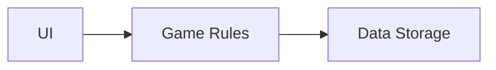
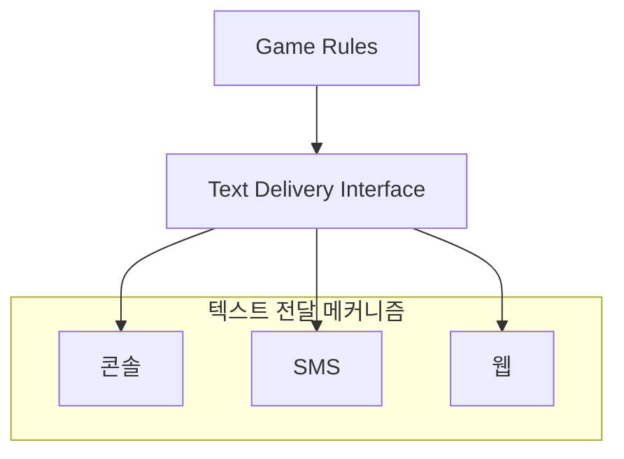
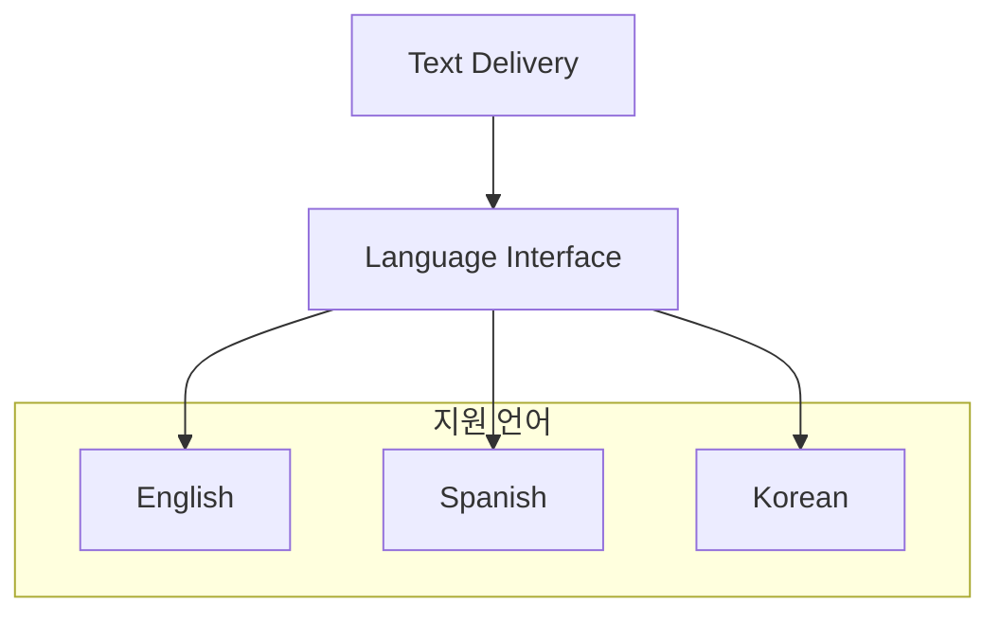
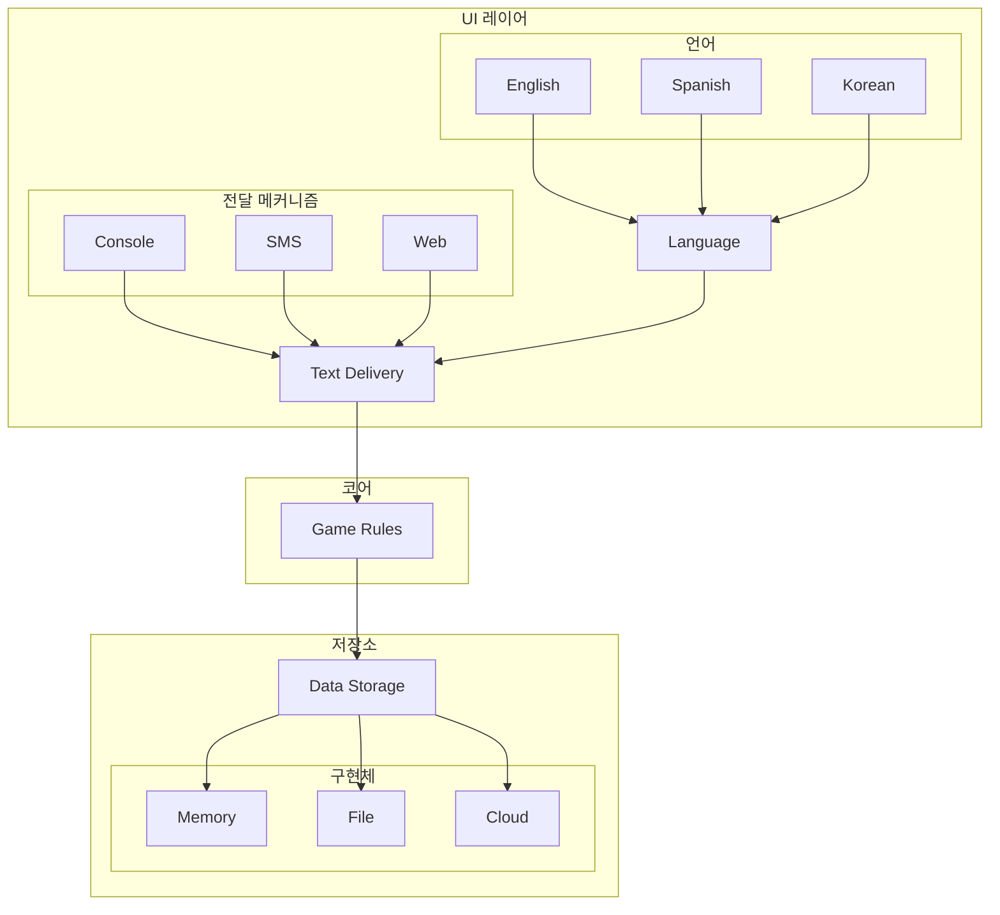
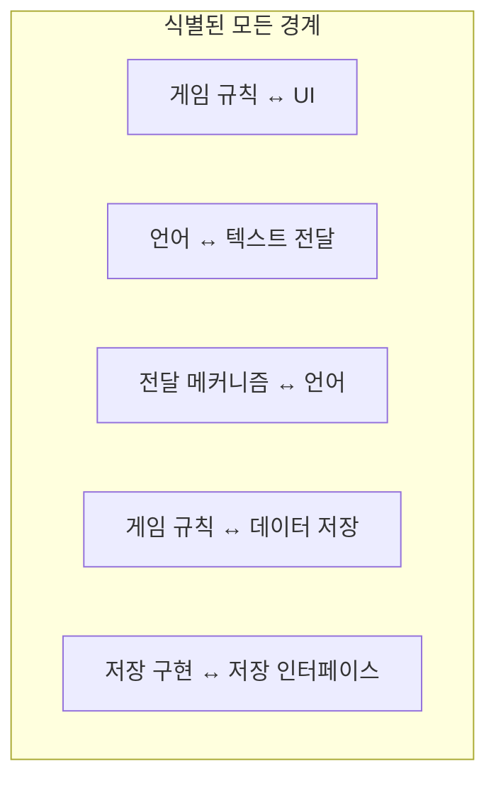
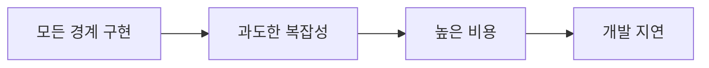
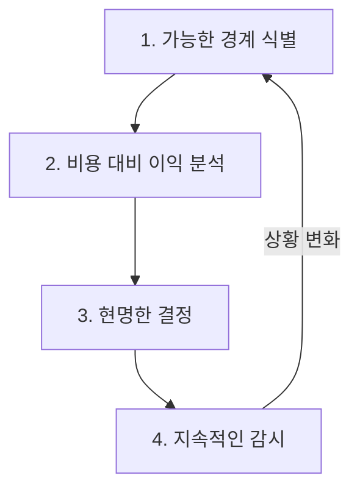
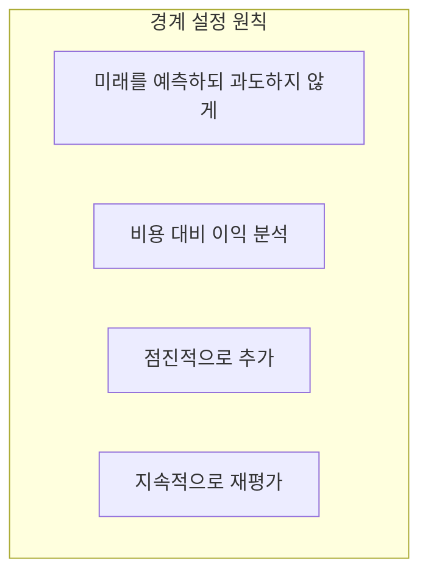

지금까지 경계의 개념을 배웠다. 이 장에서는 **실제 시스템**에서 경계를 어떻게 설정하는지 살펴본다.

## Hunt the Wumpus

마틴은 **Hunt the Wumpus**라는 간단한 텍스트 기반 게임을 예로 든다.

```
동굴에 들어갔습니다.
어둡고 습합니다.
왼쪽에서 바람이 불어옵니다.
> go left
구멍에 빠졌습니다!
게임 오버.
```

## 첫 번째 분석: 단순한 구조



단순해 보인다. 하지만 **더 깊이** 보면...

## UI를 자세히 보기

UI를 자세히 분석하면 여러 경계가 보인다.

### 텍스트 전달 (Text Delivery)

메시지를 어떻게 전달할 것인가?



### 언어 (Language)

어떤 언어로 표시할 것인가?



## 더 복잡한 구조



## 언어 경계

```java
// 언어 인터페이스
public interface Language {
    String getMessage(MessageKey key);
}

// 영어 구현
public class English implements Language {
    public String getMessage(MessageKey key) {
        return switch (key) {
            case ENTER_CAVE -> "You enter the cave.";
            case HEAR_WIND -> "You hear wind from the left.";
            case GAME_OVER -> "Game Over!";
        };
    }
}

// 한국어 구현
public class Korean implements Language {
    public String getMessage(MessageKey key) {
        return switch (key) {
            case ENTER_CAVE -> "동굴에 들어갔습니다.";
            case HEAR_WIND -> "왼쪽에서 바람이 불어옵니다.";
            case GAME_OVER -> "게임 오버!";
        };
    }
}
```

## 전달 메커니즘 경계

```java
// 텍스트 전달 인터페이스
public interface TextDelivery {
    void send(String message);
    String receive();
}

// 콘솔 구현
public class ConsoleDelivery implements TextDelivery {
    public void send(String message) {
        System.out.println(message);
    }
    
    public String receive() {
        return scanner.nextLine();
    }
}

// SMS 구현
public class SmsDelivery implements TextDelivery {
    public void send(String message) {
        smsGateway.send(phoneNumber, message);
    }
    
    public String receive() {
        return smsGateway.waitForReply();
    }
}

// 웹 구현
public class WebDelivery implements TextDelivery {
    public void send(String message) {
        webSocket.send(message);
    }
    
    public String receive() {
        return webSocket.receive();
    }
}
```

## 데이터 저장 경계

```java
// 데이터 저장 인터페이스
public interface GameStorage {
    void saveState(GameState state);
    GameState loadState(String gameId);
}

// 메모리 구현
public class InMemoryStorage implements GameStorage {
    private final Map<String, GameState> states = new HashMap<>();
    
    public void saveState(GameState state) {
        states.put(state.getGameId(), state);
    }
}

// 파일 구현
public class FileStorage implements GameStorage {
    public void saveState(GameState state) {
        Files.write(
            Paths.get("games/" + state.getGameId()),
            serialize(state)
        );
    }
}

// 클라우드 구현
public class CloudStorage implements GameStorage {
    public void saveState(GameState state) {
        s3Client.putObject(bucket, state.getGameId(), serialize(state));
    }
}
```

## 경계가 어디에나

단순한 게임에서도 **여러 경계**가 존재한다:



| 경계 | 한쪽 | 다른 쪽 |
|------|------|---------|
| UI 경계 | 게임 규칙 | 텍스트 전달 |
| 언어 경계 | 텍스트 전달 | 언어 구현 |
| 전달 경계 | 언어 | 전달 메커니즘 |
| 저장 경계 | 게임 규칙 | 데이터 저장 |
| 저장 구현 경계 | 저장 인터페이스 | 저장 구현체 |

## 경계를 얼마나 만들 것인가?

### 과도한 경계의 문제



### 경계 부족의 문제


## 아키텍트의 결정

아키텍트는 다음을 수행해야 한다:



### 결정 매트릭스

| 경계 | 변경 가능성 | 비용 | 결정 |
|------|------------|------|------|
| 게임 규칙 ↔ UI | 높음 | 중간 | **구현** |
| 언어 지원 | 중간 | 낮음 | **구현** |
| 전달 메커니즘 | 낮음 | 중간 | 부분적 |
| 저장소 | 중간 | 중간 | **구현** |
| 저장 구현체 | 낮음 | 높음 | 지연 |

## 경계 설정 원칙

```java
// 1. 먼저 핵심 경계 설정
public class WumpusGame {
    private final GameRules rules;          // 핵심
    private final TextDelivery delivery;    // UI 경계
    private final GameStorage storage;      // 저장 경계
}

// 2. 필요시 세부 경계 추가
public class TextDeliveryImpl implements TextDelivery {
    private final Language language;        // 언어 경계 (필요시 추가)
    private final DeliveryMechanism mechanism;  // 전달 경계 (필요시 추가)
}
```

## 핵심 요약



| 원칙 | 설명 |
|------|------|
| 식별 | 가능한 모든 경계 식별 |
| 분석 | 각 경계의 비용과 이익 분석 |
| 결정 | 현명하게 선택 |
| 감시 | 상황 변화에 따라 재평가 |

> **"아키텍트는 미래를 내다봐야 한다. 어디에 경계가 필요할지, 언제 필요할지 예측하고 비용을 고려해야 한다."**
> — Robert C. Martin
