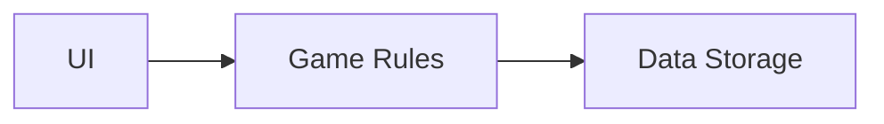
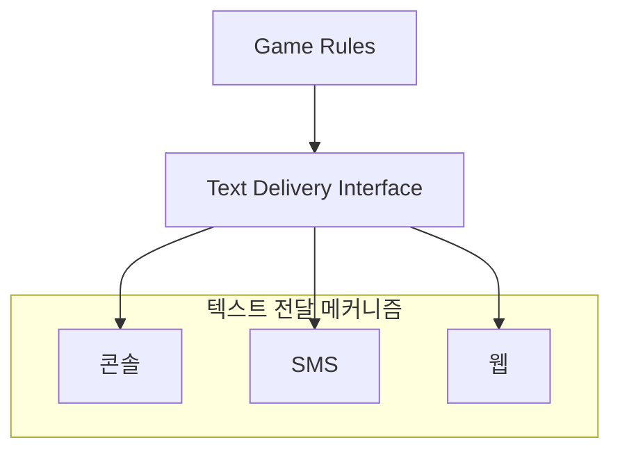
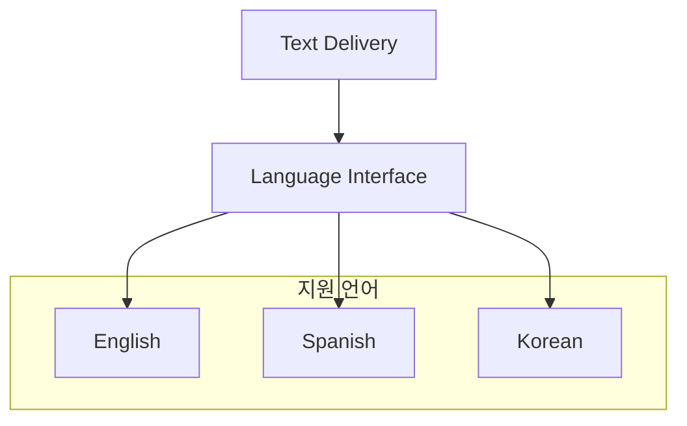
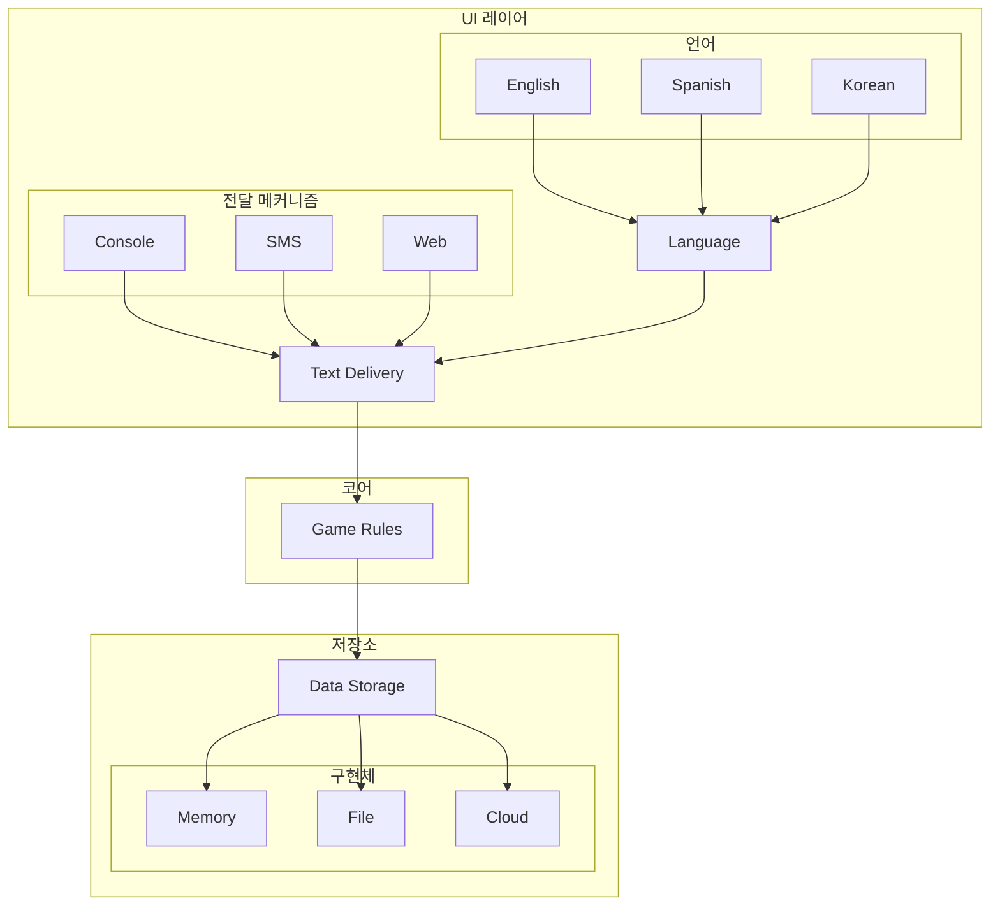
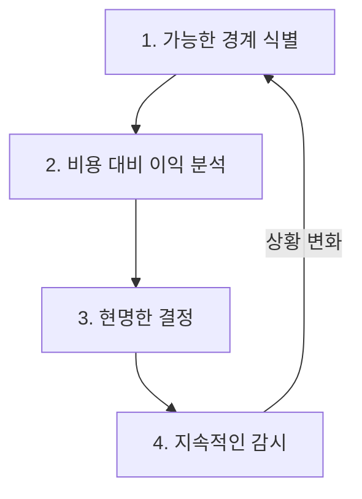

지금까지 경계의 개념을 배웠다. 이 장에서는 **실제 시스템**에서 경계를 어떻게 설정하는지 살펴본다.

## Hunt the Wumpus

마틴은 **Hunt the Wumpus**라는 간단한 텍스트 기반 게임을 예로 든다.

```
동굴에 들어갔습니다.
어둡고 습합니다.
왼쪽에서 바람이 불어옵니다.
> go left
구멍에 빠졌습니다!
게임 오버.
```

## 첫 번째 분석: 단순한 구조


```mermaid
flowchart LR
    UI[UI] --> GR[Game Rules] --> DS[Data Storage]
```

단순해 보인다. 하지만 **더 깊이** 보면...

## UI를 자세히 보기

UI를 자세히 분석하면 여러 경계가 보인다.

### 텍스트 전달 (Text Delivery)

메시지를 어떻게 전달할 것인가?


```mermaid
flowchart TB
    subgraph Delivery [텍스트 전달 메커니즘]
        CONSOLE[콘솔]
        SMS[SMS]
        WEB[웹]
    end
    
    GR[Game Rules] --> TD[Text Delivery Interface]
    TD --> CONSOLE
    TD --> SMS
    TD --> WEB
```

### 언어 (Language)

어떤 언어로 표시할 것인가?


```mermaid
flowchart TB
    subgraph Languages [지원 언어]
        EN[English]
        ES[Spanish]
        KO[Korean]
    end
    
    TD[Text Delivery] --> LANG[Language Interface]
    LANG --> EN
    LANG --> ES
    LANG --> KO
```

## 더 복잡한 구조


```mermaid
flowchart TB
    subgraph UI [UI 레이어]
        TD[Text Delivery]
        LANG[Language]
        
        subgraph Mechanisms [전달 메커니즘]
            CONSOLE[Console]
            SMS[SMS]
            WEB[Web]
        end
        
        subgraph Translations [언어]
            EN[English]
            ES[Spanish]
            KO[Korean]
        end
    end
    
    subgraph Core [코어]
        GR[Game Rules]
    end
    
    subgraph Storage [저장소]
        DS[Data Storage]
        
        subgraph Implementations [구현체]
            MEM[Memory]
            FILE[File]
            CLOUD[Cloud]
        end
    end
    
    CONSOLE --> TD
    SMS --> TD
    WEB --> TD
    
    EN --> LANG
    ES --> LANG
    KO --> LANG
    
    TD --> GR
    LANG --> TD
    
    GR --> DS
    
    DS --> MEM
    DS --> FILE
    DS --> CLOUD
```

## 언어 경계

게임 규칙(`GameRules`)은 "동굴에 들어갔다"는 사건은 알아도, 그 사건을 어떤 언어의 문장으로 표현할지는 몰라야 한다. 이 지식을 `Language` 인터페이스 뒤로 감추면, 게임 규칙 코드를 전혀 건드리지 않고도 지원 언어를 추가할 수 있다. 앞서 다이어그램에서 예로 든 English·Spanish·Korean 세 구현을 실제 코드로 보면 다음과 같다:

```java
enum MessageKey { ENTER_CAVE, HEAR_WIND, GAME_OVER }

// 언어 인터페이스
interface Language {
    String getMessage(MessageKey key);
}

// 영어 구현
public class English implements Language {
    public String getMessage(MessageKey key) {
        return switch (key) {
            case ENTER_CAVE -> "You enter the cave.";
            case HEAR_WIND -> "You hear wind from the left.";
            case GAME_OVER -> "Game Over!";
        };
    }
}
```

```java
enum MessageKey { ENTER_CAVE, HEAR_WIND, GAME_OVER }
interface Language { String getMessage(MessageKey key); }

// 스페인어 구현
public class Spanish implements Language {
    public String getMessage(MessageKey key) {
        return switch (key) {
            case ENTER_CAVE -> "Entras en la cueva.";
            case HEAR_WIND -> "Oyes viento desde la izquierda.";
            case GAME_OVER -> "¡Fin del juego!";
        };
    }
}
```

```java
enum MessageKey { ENTER_CAVE, HEAR_WIND, GAME_OVER }
interface Language { String getMessage(MessageKey key); }

// 한국어 구현
public class Korean implements Language {
    public String getMessage(MessageKey key) {
        return switch (key) {
            case ENTER_CAVE -> "동굴에 들어갔습니다.";
            case HEAR_WIND -> "왼쪽에서 바람이 불어옵니다.";
            case GAME_OVER -> "게임 오버!";
        };
    }
}
```

## 전달 메커니즘 경계

같은 게임 로직을 콘솔, SMS, 웹 중 어떤 방식으로 주고받을지도 게임 규칙과는 무관한 결정이다. `TextDelivery` 인터페이스가 "메시지를 보내고 받는다"는 동작만 약속하면, 그 뒤에 콘솔 입출력이든 SMS 게이트웨이든 웹소켓이든 원하는 구현을 끼워 넣을 수 있다. 아래 언어·전달·저장 절의 코드는 각 경계가 실제로 어떻게 인터페이스로 표현되는지 보여주는 예시이며, 이 세 구현을 전부 지금 만들어야 한다는 뜻은 아니다 — 뒤의 "결정 매트릭스"가 그중 지금 당장 구현할 가치가 있는 것과 미룰 것을 가른다:

```java
import java.util.Scanner;

// 텍스트 전달 인터페이스
interface TextDelivery {
    void send(String message);
    String receive();
}

// 콘솔 구현
public class ConsoleDelivery implements TextDelivery {
    private final Scanner scanner = new Scanner(System.in);

    public void send(String message) {
        System.out.println(message);
    }

    public String receive() {
        return scanner.nextLine();
    }
}
```

```java
interface TextDelivery {
    void send(String message);
    String receive();
}
interface SmsGateway {
    void send(String phoneNumber, String message);
    String waitForReply();
}

// SMS 구현(실제로는 Twilio 같은 SMS 게이트웨이 SDK를 사용한다)
public class SmsDelivery implements TextDelivery {
    private final SmsGateway smsGateway;
    private final String phoneNumber;

    public SmsDelivery(SmsGateway smsGateway, String phoneNumber) {
        this.smsGateway = smsGateway;
        this.phoneNumber = phoneNumber;
    }

    public void send(String message) {
        smsGateway.send(phoneNumber, message);
    }

    public String receive() {
        return smsGateway.waitForReply();
    }
}
```

```java
interface TextDelivery {
    void send(String message);
    String receive();
}
interface WebSocketChannel {
    void send(String message);
    String receive();
}

// 웹 구현(실제로는 WebSocket 세션 객체를 사용한다)
public class WebDelivery implements TextDelivery {
    private final WebSocketChannel webSocket;

    public WebDelivery(WebSocketChannel webSocket) { this.webSocket = webSocket; }

    public void send(String message) {
        webSocket.send(message);
    }

    public String receive() {
        return webSocket.receive();
    }
}
```

## 데이터 저장 경계

게임 상태를 어디에 저장할지(메모리, 파일, 클라우드)도 게임 규칙 입장에서는 세부사항이다. `GameStorage` 인터페이스가 "상태를 저장하고 불러온다"는 계약만 제공하면, 개발 중에는 메모리 구현으로 빠르게 테스트하다가 운영 환경에서는 클라우드 구현으로 교체할 수 있다:

```java
import java.util.Map;
import java.util.HashMap;

class GameState {
    private final String gameId;
    GameState(String gameId) { this.gameId = gameId; }
    String getGameId() { return gameId; }
}

// 데이터 저장 인터페이스
interface GameStorage {
    void saveState(GameState state);
    GameState loadState(String gameId);
}

// 메모리 구현
public class InMemoryStorage implements GameStorage {
    private final Map<String, GameState> states = new HashMap<>();

    public void saveState(GameState state) {
        states.put(state.getGameId(), state);
    }

    public GameState loadState(String gameId) {
        return states.get(gameId);
    }
}
```

```java
import java.nio.file.Files;
import java.nio.file.Paths;
import java.io.IOException;

class GameState {
    private final String gameId;
    GameState(String gameId) { this.gameId = gameId; }
    String getGameId() { return gameId; }
}
interface GameStorage {
    void saveState(GameState state);
    GameState loadState(String gameId);
}

// 파일 구현
public class FileStorage implements GameStorage {
    public void saveState(GameState state) {
        try {
            Files.write(Paths.get("games/" + state.getGameId()), serialize(state));
        } catch (IOException e) {
            throw new RuntimeException(e);
        }
    }

    public GameState loadState(String gameId) {
        return new GameState(gameId); // 실제로는 파일에서 역직렬화한다
    }

    private byte[] serialize(GameState state) {
        return state.getGameId().getBytes();
    }
}
```

```java
class GameState {
    private final String gameId;
    GameState(String gameId) { this.gameId = gameId; }
    String getGameId() { return gameId; }
}
interface GameStorage {
    void saveState(GameState state);
    GameState loadState(String gameId);
}
interface S3Client {
    void putObject(String bucket, String key, byte[] data);
    byte[] getObject(String bucket, String key);
}

// 클라우드 구현
public class CloudStorage implements GameStorage {
    private final S3Client s3Client;
    private final String bucket;

    public CloudStorage(S3Client s3Client, String bucket) {
        this.s3Client = s3Client;
        this.bucket = bucket;
    }

    public void saveState(GameState state) {
        s3Client.putObject(bucket, state.getGameId(), serialize(state));
    }

    public GameState loadState(String gameId) {
        return new GameState(gameId); // 실제로는 S3에서 역직렬화한다
    }

    private byte[] serialize(GameState state) {
        return state.getGameId().getBytes();
    }
}
```

## 경계가 어디에나

단순한 게임에서도 **여러 경계**가 존재한다:


```mermaid
flowchart TB
    subgraph AllBoundaries [식별된 모든 경계]
        B1[게임 규칙 ↔ UI]
        B2[언어 ↔ 텍스트 전달]
        B3[전달 메커니즘 ↔ 언어]
        B4[게임 규칙 ↔ 데이터 저장]
        B5[저장 구현 ↔ 저장 인터페이스]
    end
```

| 경계 | 한쪽 | 다른 쪽 |
|------|------|---------|
| UI 경계 | 게임 규칙 | 텍스트 전달 |
| 언어 경계 | 텍스트 전달 | 언어 구현 |
| 전달 경계 | 언어 | 전달 메커니즘 |
| 저장 경계 | 게임 규칙 | 데이터 저장 |
| 저장 구현 경계 | 저장 인터페이스 | 저장 구현체 |

## 경계를 얼마나 만들 것인가?

### 과도한 경계의 문제

식별된 5개 경계를 전부 인터페이스로 분리하고 각각에 여러 구현체를 준비하면, 코드는 실제로 필요한 것보다 훨씬 많은 추상화 계층을 갖게 된다. 각 계층은 그 자체로 이해하고 유지보수해야 할 대상이므로, 당장 아무도 쓰지 않는 경계까지 다 구현하면 복잡성만 늘고 정작 필요한 기능 개발은 늦어진다:


```mermaid
flowchart LR
    OVER[모든 경계 구현] --> COMPLEX[과도한 복잡성]
    COMPLEX --> COST[높은 비용]
    COST --> SLOW[개발 지연]
```

### 경계 부족의 문제

반대로 경계를 전혀 두지 않고 게임 규칙이 콘솔 출력·파일 저장 코드를 직접 호출하도록 짜면, 나중에 웹 UI나 클라우드 저장소로 바꾸고 싶을 때 게임 규칙 코드 자체를 뜯어고쳐야 한다. 변경이 필요해질 때마다 이런 수정을 반복하다 보면 코드는 점점 더 얽히고, 그 얽힘 자체가 다음 변경을 더 어렵게 만드는 기술 부채로 쌓인다:


```mermaid
flowchart LR
    UNDER[경계 없음] --> RIGID[유연성 부족]
    RIGID --> CHANGE[변경 어려움]
    CHANGE --> DEBT[기술 부채]
```

## 아키텍트의 결정

아키텍트는 다음을 수행해야 한다:


```mermaid
flowchart TB
    A1[1. 가능한 경계 식별]
    A2[2. 비용 대비 이익 분석]
    A3[3. 현명한 결정]
    A4[4. 지속적인 감시]
    
    A1 --> A2 --> A3 --> A4
    A4 -->|상황 변화| A1
```

### 결정 매트릭스

| 경계 | 변경 가능성 | 비용 | 결정 |
|------|------------|------|------|
| 게임 규칙 ↔ UI | 높음 | 중간 | **구현** |
| 언어 지원 | 중간 | 낮음 | **구현** |
| 전달 메커니즘 | 낮음 | 중간 | 부분적 |
| 저장소 | 중간 | 중간 | **구현** |
| 저장 구현체 | 낮음 | 높음 | 지연 |

## 경계 설정 원칙

결정 매트릭스에서 "구현"으로 판정된 경계부터 코드에 반영하고, 나머지는 필드를 아예 만들지 않은 채로 남겨 둔다. 이는 YAGNI("You Aren't Gonna Need It", 필요해지기 전에는 만들지 않는다) 원칙과 정확히 같은 방향이다 — 언어 경계와 저장 경계처럼 지금 필요성이 확실한 것만 먼저 인터페이스로 분리하고, 전달 메커니즘 안의 세부 경계(언어/전달 하위 구분)처럼 확신이 서지 않는 것은 필요해질 때 추가한다:

```java
interface GameRules {
    void processCommand(String command);
}
interface TextDelivery {
    void send(String message);
    String receive();
}
interface GameStorage {
    void saveState(GameState state);
    GameState loadState(String gameId);
}
class GameState {
    private final String gameId;
    GameState(String gameId) { this.gameId = gameId; }
}

// 1. 먼저 핵심 경계 설정
public class WumpusGame {
    private final GameRules rules;          // 핵심
    private final TextDelivery delivery;    // UI 경계
    private final GameStorage storage;      // 저장 경계

    public WumpusGame(GameRules rules, TextDelivery delivery, GameStorage storage) {
        this.rules = rules;
        this.delivery = delivery;
        this.storage = storage;
    }
}
```

```java
interface Language { String getMessage(Object key); }
interface DeliveryMechanism {
    void send(String message);
    String receive();
}
interface TextDelivery {
    void send(String message);
    String receive();
}

// 2. 필요시 세부 경계 추가
public class TextDeliveryImpl implements TextDelivery {
    private final Language language;        // 언어 경계 (필요시 추가)
    private final DeliveryMechanism mechanism;  // 전달 경계 (필요시 추가)

    public TextDeliveryImpl(Language language, DeliveryMechanism mechanism) {
        this.language = language;
        this.mechanism = mechanism;
    }

    public void send(String message) { mechanism.send(message); }
    public String receive() { return mechanism.receive(); }
}
```

## 흔한 오해

"경계가 어디에나 있다"를 "모든 경계를 다 구현해야 한다"는 뜻으로 오해하기 쉽다. 정확히는 정반대다 — Hunt the Wumpus처럼 단순한 게임에서도 UI 경계, 언어 경계, 전달 메커니즘 경계, 저장 경계, 저장 구현 경계까지 5개의 잠재적 경계가 식별되지만, "결정 매트릭스" 절에서 보듯 실제로 지금 구현할 가치가 있는 경계는 그중 일부(변경 가능성이 높고 비용이 감당할 만한 것)뿐이다. 나머지는 부분적으로만 준비하거나(34장의 부분적 경계 전략 참고) 아예 지연시킨다. 또 다른 오해는 이 결정이 프로젝트 초기에 한 번만 이루어진다고 여기는 것이다. "아키텍트의 결정" 절의 순환 다이어그램(식별→분석→결정→감시→다시 식별)이 보여주듯, 경계 결정은 시스템이 진화하면서 반복적으로 재평가해야 하는 지속적인 과정이다.

## 학습 목표

이 장을 읽은 후 다음을 스스로 점검한다.

- Hunt the Wumpus처럼 단순해 보이는 시스템에서도 여러 경계가 숨어 있을 수 있다는 것을 구체적으로 설명할 수 있는가?
- 모든 경계를 구현하는 것과 경계를 전혀 두지 않는 것 각각의 문제를 설명할 수 있는가?
- "결정 매트릭스"에서 변경 가능성과 비용이라는 두 축이 왜 경계 구현 여부를 가르는 기준이 되는지 설명할 수 있는가?
- 경계 결정이 일회성이 아니라 지속적으로 재평가해야 하는 과정이라는 것을 설명할 수 있는가?

## 판단 기준

결정 매트릭스로 변경 가능성·비용을 따진 뒤에도 남는, 그 판정을 뒤집을 만한 질문들을 확인한다.

- 이 경계가 없어서 겪는 고통(변경이 어려움, 테스트가 어려움)이 실제로 나타나고 있는가, 아니면 아직 가상의 시나리오일 뿐인가?
- 이 경계를 지금 만들지 않기로 했을 때, 나중에 그 결정을 되돌리기가 어려운가(예: 이미 여러 곳에서 구체 클래스를 직접 참조하게 됐는가), 아니면 언제든 쉽게 추가할 수 있는가?
- 34장의 부분적 경계 전략(마지막 단계 건너뛰기 등)으로 지금 당장의 비용을 낮추면서도 나중 확장 여지를 남길 수 있는가?

## 참고 자료

- Robert C. Martin, 『Clean Architecture』(2017), 25장 — Hunt the Wumpus 예제와 경계 식별·결정 원칙의 원출처.

## 핵심 요약

| 이 장에서 만든 산출물 | 역할 |
|----------------------|------|
| 경계 목록(5개) | Hunt the Wumpus에서 식별 가능한 모든 경계를 나열 |
| 결정 매트릭스 | 변경 가능성·비용을 기준으로 지금 구현할 경계를 가림 |
| YAGNI 원칙 | 확신이 서지 않는 경계는 필요해질 때까지 만들지 않음 |
| 언어·전달·저장 예시 코드 | 경계가 실제 인터페이스로 어떻게 표현되는지 보여주는 참고 구현 |

> "O Software Architect, you must see the future. You must guess—intelligently. You must weigh the costs and determine where the architectural boundaries lie, and which should be fully implemented, and which should be partially implemented, and which should be ignored."
> — Robert C. Martin, 『Clean Architecture』(2017), 25장
