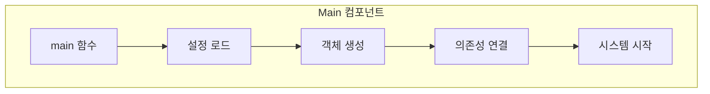
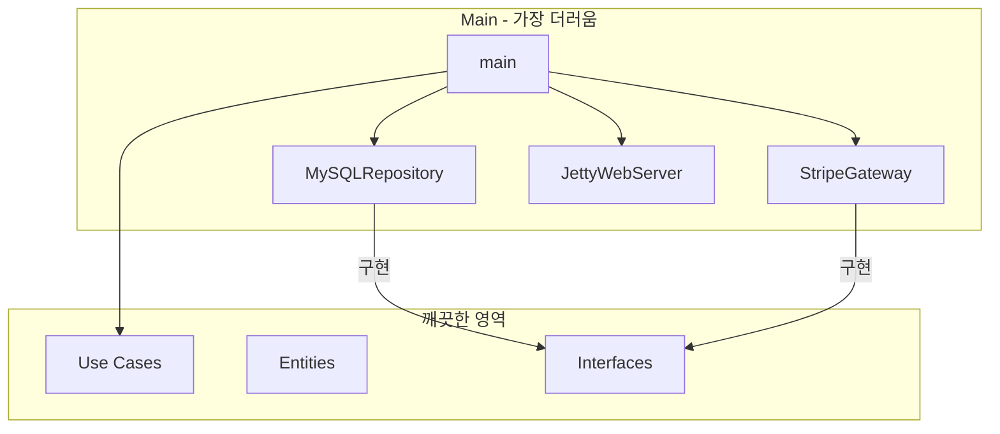
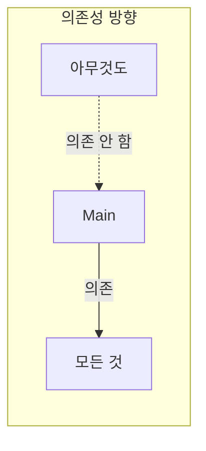
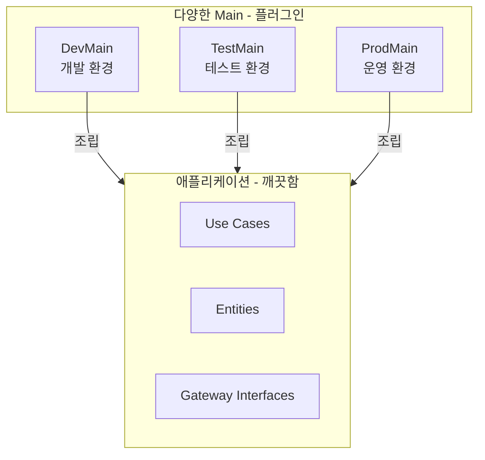
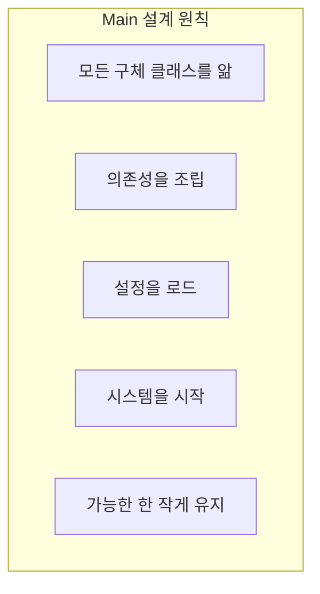
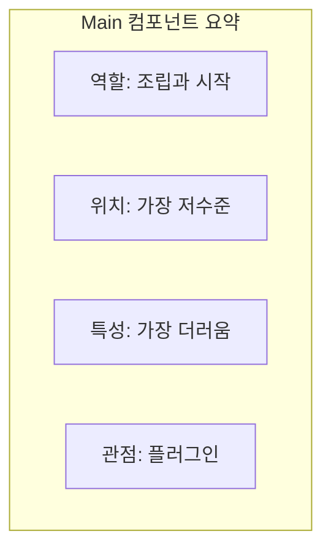

**Main**은 시스템의 **초기 진입점**이다. Clean Architecture에서 Main은 가장 **저수준의 정책**이며, 가장 **더러운** 컴포넌트다.

## Main의 역할

Main은 **모든 구체 클래스를 알고 조립**한다.



### 상세 코드 예시

```java
public class Main {
    public static void main(String[] args) {
        // 1. 설정 로드
        AppConfig config = loadConfig();
        
        // 2. 구체 클래스들을 알고 있음 (인프라)
        DataSource dataSource = new HikariDataSource(
            new HikariConfig()
                .setJdbcUrl(config.getDatabaseUrl())
                .setUsername(config.getDatabaseUser())
                .setPassword(config.getDatabasePassword())
        );
        
        // 3. Repository 생성 (구체 구현)
        OrderRepository orderRepo = new MySQLOrderRepository(dataSource);
        ProductRepository productRepo = new MySQLProductRepository(dataSource);
        
        // 4. 외부 서비스 게이트웨이 생성
        PaymentGateway paymentGateway = new StripePaymentGateway(
            config.getStripeApiKey()
        );
        
        NotificationGateway notificationGateway = new SesNotificationGateway(
            config.getAwsRegion(),
            config.getAwsAccessKey(),
            config.getAwsSecretKey()
        );
        
        // 5. 프레젠터 생성
        OrderPresenter orderPresenter = new JsonOrderPresenter();
        
        // 6. 유스케이스 조립 (의존성 주입)
        PlaceOrderUseCase placeOrder = new PlaceOrderUseCase(
            orderRepo, productRepo, paymentGateway, 
            notificationGateway, orderPresenter
        );
        
        CancelOrderUseCase cancelOrder = new CancelOrderUseCase(
            orderRepo, paymentGateway, notificationGateway
        );
        
        // 7. 컨트롤러 생성
        OrderController orderController = new OrderController(
            placeOrder, cancelOrder
        );
        
        // 8. 웹 서버 시작
        WebServer server = new JettyWebServer();
        server.route("/orders", orderController);
        server.start(config.getServerPort());
        
        System.out.println("Server started on port " + config.getServerPort());
    }
    
    private static AppConfig loadConfig() {
        String env = System.getenv("APP_ENV");
        return switch (env) {
            case "production" -> new ProductionConfig();
            case "staging" -> new StagingConfig();
            default -> new DevelopmentConfig();
        };
    }
}
```

## 가장 더러운 컴포넌트

Main은 의존성 역전 원칙(DIP)을 **위반해도 된다**.



### Main이 알아야 하는 것들

| 구분 | 알아야 하는 것 |
|------|--------------|
| 인프라 | DataSource, Connection Pool |
| 구현체 | MySQLRepository, MongoRepository |
| 외부 서비스 | StripeGateway, SesGateway |
| 프레임워크 | JettyServer, SpringMVC |
| 설정 | 환경 변수, 설정 파일 |

### 왜 괜찮은가?



- Main에 **아무것도 의존하지 않음**
- Main은 시스템의 **가장 외곽**에 위치
- Main은 **플러그인**과 같은 역할

## Main은 플러그인

Main은 시스템에 **끼워 넣는** 플러그인이다.



### 환경별 Main

```java
// 개발 환경 Main
public class DevMain {
    public static void main(String[] args) {
        OrderRepository repo = new InMemoryOrderRepository();
        PaymentGateway payment = new MockPaymentGateway();
        // ... 개발 환경 설정
    }
}

// 테스트 환경 Main
public class TestMain {
    public static void main(String[] args) {
        OrderRepository repo = new H2OrderRepository();
        PaymentGateway payment = new SandboxStripeGateway();
        // ... 테스트 환경 설정
    }
}

// 운영 환경 Main
public class ProdMain {
    public static void main(String[] args) {
        OrderRepository repo = new MySQLOrderRepository();
        PaymentGateway payment = new StripeGateway();
        // ... 운영 환경 설정
    }
}
```

| 환경 | Repository | Payment | 특징 |
|------|-----------|---------|------|
| 개발 | InMemory | Mock | 빠른 시작 |
| 테스트 | H2 | Sandbox | 실제와 유사 |
| 운영 | MySQL | Stripe | 실제 환경 |

## 프레임워크와 Main

Spring 같은 프레임워크가 Main 역할 일부를 담당한다.

```java
// Spring의 경우: @Configuration이 Main 역할
@Configuration
public class AppConfig {
    
    @Bean
    public DataSource dataSource() {
        return new HikariDataSource(
            // 구체적인 DataSource 설정
        );
    }
    
    @Bean
    public OrderRepository orderRepository(DataSource dataSource) {
        return new MySQLOrderRepository(dataSource);
    }
    
    @Bean
    public PaymentGateway paymentGateway(
            @Value("${stripe.api.key}") String apiKey) {
        return new StripePaymentGateway(apiKey);
    }
    
    @Bean
    public PlaceOrderUseCase placeOrderUseCase(
            OrderRepository repo,
            PaymentGateway gateway) {
        return new PlaceOrderUseCase(repo, gateway);
    }
}

// Spring이 Main 역할 수행
@SpringBootApplication
public class Application {
    public static void main(String[] args) {
        SpringApplication.run(Application.class, args);
        // Spring이 @Configuration을 읽어 조립
    }
}
```

### 원칙은 동일

프레임워크를 사용하더라도 원칙은 동일하다:

| 원칙 | 직접 Main | 프레임워크 |
|------|----------|-----------|
| 구체 클래스 앎 | main()에서 직접 | @Bean에서 |
| 의존성 조립 | new로 생성 | DI Container |
| 설정 로드 | 직접 파싱 | @Value, @ConfigurationProperties |

## Main의 설계 원칙



### Main을 작게 유지하기

```java
// 나쁜 예: Main에 로직이 있음
public class Main {
    public static void main(String[] args) {
        // 설정 로드
        // 객체 생성
        // 조립
        // 비즈니스 로직 일부?! ← 안 됨!
    }
}

// 좋은 예: Main은 조립만
public class Main {
    public static void main(String[] args) {
        // 설정 로드 → ConfigLoader에 위임
        AppConfig config = ConfigLoader.load();
        
        // 객체 생성과 조립 → Factory에 위임
        Application app = ApplicationFactory.create(config);
        
        // 시작
        app.run();
    }
}
```

## 핵심 요약



| 원칙 | 설명 |
|------|------|
| 역할 | 구체 클래스를 알고 조립 |
| 위치 | 가장 저수준의 정책 |
| 특성 | DIP 위반해도 됨 |
| 의존성 | 아무것도 Main에 의존 안 함 |
| 관점 | 시스템에 끼워 넣는 플러그인 |

> **"Main은 궁극적인 세부사항이다. 가장 저수준의 정책이며, 플러그인처럼 시스템에 끼워 넣는다."**
> — Robert C. Martin
