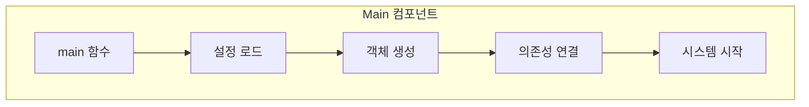
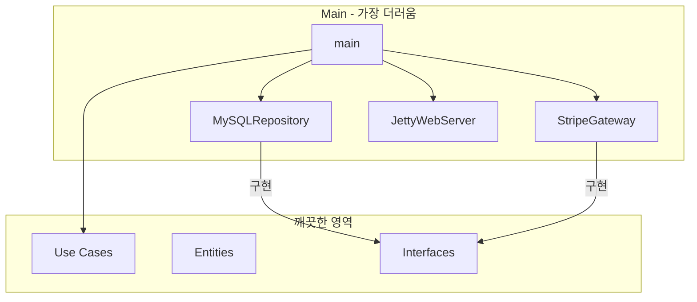
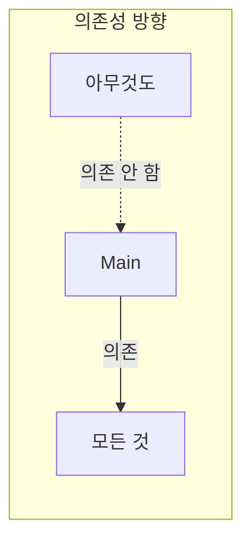
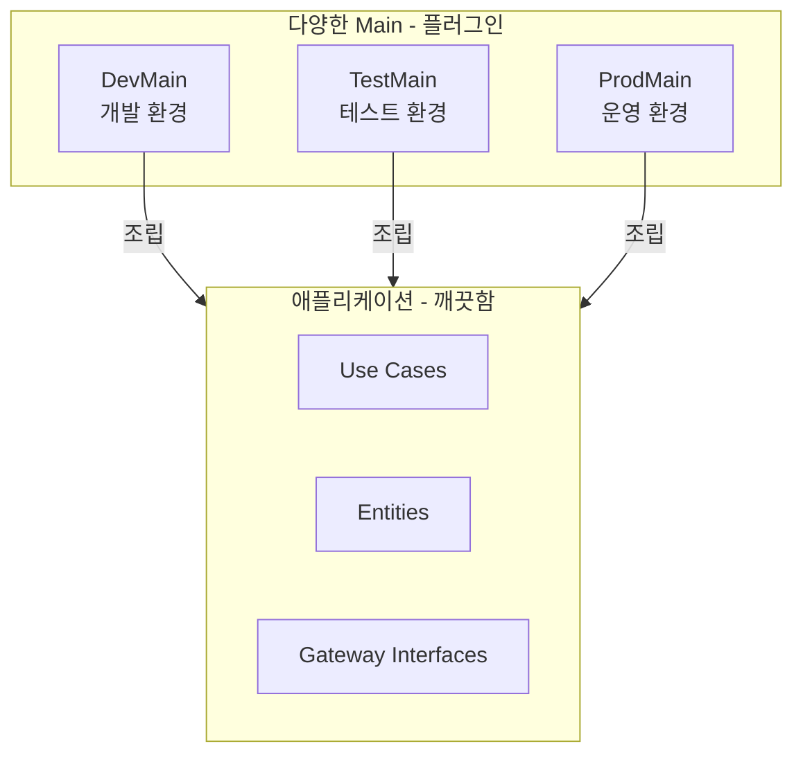
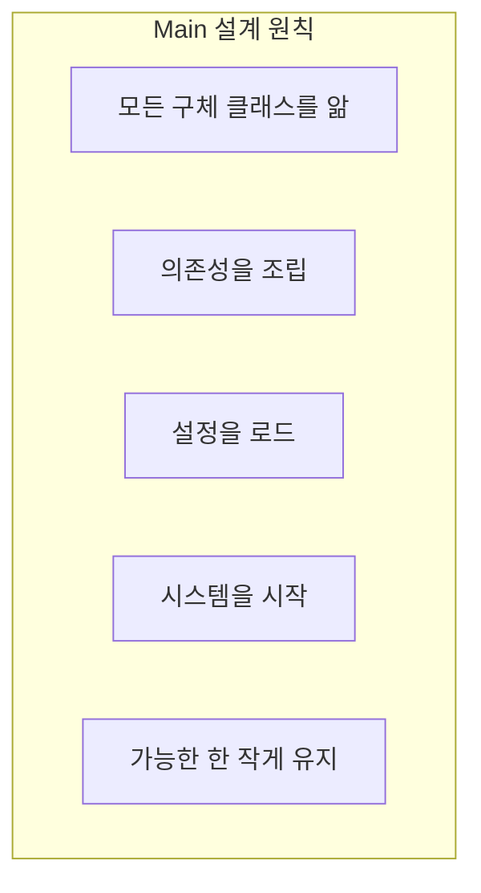
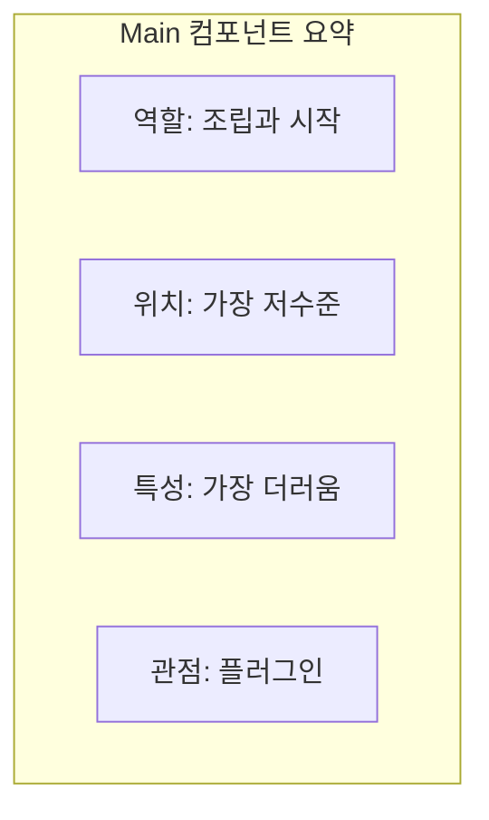

**Main**은 시스템의 **초기 진입점**이다. Clean Architecture에서 Main은 가장 **저수준의 정책**이며, 가장 **더러운** 컴포넌트다.

## Main의 역할

Main은 **모든 구체 클래스를 알고 조립**한다.


```mermaid
flowchart TB
    subgraph Main [Main 컴포넌트]
        M[main 함수]
        CFG[설정 로드]
        CREATE[객체 생성]
        WIRE[의존성 연결]
        START[시스템 시작]
    end
    
    M --> CFG --> CREATE --> WIRE --> START
```

### 상세 코드 예시

```java
class AppConfig {
    String getDatabaseUrl() { return "jdbc:mysql://localhost/orders"; }
    String getDatabaseUser() { return "app"; }
    String getDatabasePassword() { return "secret"; }
    String getStripeApiKey() { return "sk_test_placeholder"; }
    int getServerPort() { return 8080; }
}
class ProductionConfig extends AppConfig {}
class StagingConfig extends AppConfig {}
class DevelopmentConfig extends AppConfig {}

class Order {}
interface DataSource {}
class HikariDataSource implements DataSource {
    HikariDataSource(String jdbcUrl, String username, String password) {}
}
interface OrderRepository { void save(Order order); }
class MySQLOrderRepository implements OrderRepository {
    MySQLOrderRepository(DataSource dataSource) {}
    public void save(Order order) {}
}
interface PaymentGateway {}
class StripePaymentGateway implements PaymentGateway {
    StripePaymentGateway(String apiKey) {}
}
interface OrderPresenter {}
class JsonOrderPresenter implements OrderPresenter {}
class PlaceOrderUseCase {
    PlaceOrderUseCase(OrderRepository repo, PaymentGateway gateway, OrderPresenter presenter) {}
}
class CancelOrderUseCase {
    CancelOrderUseCase(OrderRepository repo, PaymentGateway gateway) {}
}
class OrderController {
    OrderController(PlaceOrderUseCase placeOrder, CancelOrderUseCase cancelOrder) {}
}
interface WebServer {
    void route(String path, OrderController controller);
    void start(int port);
}
class JettyWebServer implements WebServer {
    public void route(String path, OrderController controller) {}
    public void start(int port) {}
}

public class Main {
    public static void main(String[] args) {
        // 1. 설정 로드
        AppConfig config = loadConfig();

        // 2. 구체 클래스들을 알고 있음 (인프라)
        DataSource dataSource = new HikariDataSource(
            config.getDatabaseUrl(),
            config.getDatabaseUser(),
            config.getDatabasePassword()
        );

        // 3. Repository 생성 (구체 구현)
        OrderRepository orderRepo = new MySQLOrderRepository(dataSource);

        // 4. 외부 서비스 게이트웨이 생성
        PaymentGateway paymentGateway = new StripePaymentGateway(
            config.getStripeApiKey()
        );

        // 5. 프레젠터 생성
        OrderPresenter orderPresenter = new JsonOrderPresenter();

        // 6. 유스케이스 조립 (의존성 주입)
        PlaceOrderUseCase placeOrder = new PlaceOrderUseCase(
            orderRepo, paymentGateway, orderPresenter
        );

        CancelOrderUseCase cancelOrder = new CancelOrderUseCase(
            orderRepo, paymentGateway
        );

        // 7. 컨트롤러 생성
        OrderController orderController = new OrderController(
            placeOrder, cancelOrder
        );

        // 8. 웹 서버 시작
        WebServer server = new JettyWebServer();
        server.route("/orders", orderController);
        server.start(config.getServerPort());

        System.out.println("Server started on port " + config.getServerPort());
    }

    private static AppConfig loadConfig() {
        String env = System.getenv("APP_ENV");
        if (env == null) env = "development";
        return switch (env) {
            case "production" -> new ProductionConfig();
            case "staging" -> new StagingConfig();
            default -> new DevelopmentConfig();
        };
    }
}
```

## 가장 더러운 컴포넌트

Main은 의존성 역전 원칙(DIP)을 **위반해도 된다**.


```mermaid
flowchart TB
    subgraph Main [Main - 가장 더러움]
        M[main]
        MYSQL[MySQLRepository]
        STRIPE[StripeGateway]
        JETTY[JettyWebServer]
    end
    
    subgraph Clean [깨끗한 영역]
        UC[Use Cases]
        ENT[Entities]
        INTF[Interfaces]
    end
    
    M --> MYSQL
    M --> STRIPE
    M --> JETTY
    M --> UC
    
    MYSQL -->|구현| INTF
    STRIPE -->|구현| INTF
```

### Main이 알아야 하는 것들

| 구분 | 알아야 하는 것 |
|------|--------------|
| 인프라 | DataSource, Connection Pool |
| 구현체 | MySQLRepository, MongoRepository |
| 외부 서비스 | StripeGateway, SesGateway |
| 프레임워크 | JettyServer, SpringMVC |
| 설정 | 환경 변수, 설정 파일 |

### 왜 괜찮은가?


```mermaid
flowchart LR
    subgraph Dependencies [의존성 방향]
        NOTHING[아무것도] -.->|의존 안 함| MAIN[Main]
        MAIN -->|의존| EVERYTHING[모든 것]
    end
```

- Main에 **아무것도 의존하지 않음**
- Main은 시스템의 **가장 외곽**에 위치
- Main은 **플러그인**과 같은 역할

## Main은 플러그인

Main은 시스템에 **끼워 넣는** 플러그인이다.


```mermaid
flowchart TB
    subgraph Application [애플리케이션 - 깨끗함]
        UC[Use Cases]
        E[Entities]
        GW[Gateway Interfaces]
    end
    
    subgraph Mains [다양한 Main - 플러그인]
        DEV[DevMain<br/>개발 환경]
        TEST[TestMain<br/>테스트 환경]
        PROD[ProdMain<br/>운영 환경]
    end
    
    DEV -->|조립| Application
    TEST -->|조립| Application
    PROD -->|조립| Application
```

### 환경별 Main

```java
interface OrderRepository { void save(Order order); }
interface PaymentGateway {}
class Order {}
class InMemoryOrderRepository implements OrderRepository {
    public void save(Order order) {}
}
class MockPaymentGateway implements PaymentGateway {}

// 개발 환경 Main
public class DevMain {
    public static void main(String[] args) {
        OrderRepository repo = new InMemoryOrderRepository();
        PaymentGateway payment = new MockPaymentGateway();
        // ... 개발 환경 설정
    }
}
```

```java
interface OrderRepository { void save(Order order); }
interface PaymentGateway {}
class Order {}
class H2OrderRepository implements OrderRepository {
    public void save(Order order) {}
}
class SandboxStripeGateway implements PaymentGateway {}

// 테스트 환경 Main
public class TestMain {
    public static void main(String[] args) {
        OrderRepository repo = new H2OrderRepository();
        PaymentGateway payment = new SandboxStripeGateway();
        // ... 테스트 환경 설정
    }
}
```

```java
interface OrderRepository { void save(Order order); }
interface PaymentGateway {}
class Order {}
class MySQLOrderRepository implements OrderRepository {
    public void save(Order order) {}
}
class StripePaymentGateway implements PaymentGateway {}

// 운영 환경 Main
public class ProdMain {
    public static void main(String[] args) {
        OrderRepository repo = new MySQLOrderRepository();
        PaymentGateway payment = new StripePaymentGateway();
        // ... 운영 환경 설정
    }
}
```

| 환경 | Repository | Payment | 특징 |
|------|-----------|---------|------|
| 개발 | InMemory | Mock | 빠른 시작 |
| 테스트 | H2 | Sandbox | 실제와 유사 |
| 운영 | MySQL | Stripe | 실제 환경 |

## 프레임워크와 Main

Spring 같은 프레임워크가 Main 역할 일부를 담당한다.

```java
import org.springframework.context.annotation.Configuration;
import org.springframework.context.annotation.Bean;
import org.springframework.beans.factory.annotation.Value;

interface DataSource {}
class HikariDataSource implements DataSource {}
class Order {}
interface OrderRepository { void save(Order order); }
class MySQLOrderRepository implements OrderRepository {
    MySQLOrderRepository(DataSource dataSource) {}
    public void save(Order order) {}
}
interface PaymentGateway {}
class StripePaymentGateway implements PaymentGateway {
    StripePaymentGateway(String apiKey) {}
}
class PlaceOrderUseCase {
    PlaceOrderUseCase(OrderRepository repo, PaymentGateway gateway) {}
}

// Spring의 경우: @Configuration이 Main 역할
@Configuration
public class SpringAppConfig {

    @Bean
    public DataSource dataSource() {
        return new HikariDataSource();
        // 실제로는 여기서 HikariConfig 값을 채운다
    }

    @Bean
    public OrderRepository orderRepository(DataSource dataSource) {
        return new MySQLOrderRepository(dataSource);
    }

    @Bean
    public PaymentGateway paymentGateway(
            @Value("${stripe.api.key}") String apiKey) {
        return new StripePaymentGateway(apiKey);
    }

    @Bean
    public PlaceOrderUseCase placeOrderUseCase(
            OrderRepository repo,
            PaymentGateway gateway) {
        return new PlaceOrderUseCase(repo, gateway);
    }
}
```

```java
import org.springframework.boot.SpringApplication;
import org.springframework.boot.autoconfigure.SpringBootApplication;

// Spring이 Main 역할 수행
@SpringBootApplication
public class Application {
    public static void main(String[] args) {
        SpringApplication.run(Application.class, args);
        // Spring이 @Configuration을 읽어 조립
    }
}
```

### 원칙은 동일

프레임워크를 사용하더라도 원칙은 동일하다:

| 원칙 | 직접 Main | 프레임워크 |
|------|----------|-----------|
| 구체 클래스 앎 | main()에서 직접 | @Bean에서 |
| 의존성 조립 | new로 생성 | DI Container |
| 설정 로드 | 직접 파싱 | @Value, @ConfigurationProperties |

## Main의 설계 원칙


```mermaid
flowchart TB
    subgraph Principles [Main 설계 원칙]
        P1[모든 구체 클래스를 앎]
        P2[의존성을 조립]
        P3[설정을 로드]
        P4[시스템을 시작]
        P5[가능한 한 작게 유지]
    end
```

### Main을 작게 유지하기

```java
class AppConfig {}
class Order {}

// 나쁜 예: Main에 로직이 있음
public class BadMain {
    public static void main(String[] args) {
        // 설정 로드
        // 객체 생성
        // 조립
        double total = 0;
        for (Order order : new Order[0]) {
            total += 1; // 비즈니스 로직 일부?! ← 안 됨!
        }
    }
}
```

```java
class AppConfig {}
class Application {
    void run() { /* 애플리케이션 시작 */ }
}
class ConfigLoader {
    static AppConfig load() { return new AppConfig(); }
}
class ApplicationFactory {
    static Application create(AppConfig config) { return new Application(); }
}

// 좋은 예: Main은 조립만
public class GoodMain {
    public static void main(String[] args) {
        // 설정 로드 → ConfigLoader에 위임
        AppConfig config = ConfigLoader.load();

        // 객체 생성과 조립 → Factory에 위임
        Application app = ApplicationFactory.create(config);

        // 시작
        app.run();
    }
}
```

## 흔한 오해

Main이 DIP를 위반해도 된다는 것을 "Main은 아무렇게나 짜도 된다"는 뜻으로 오해하기 쉽다. 정확히는 정반대다 — Main이 모든 구체 클래스를 직접 참조하는 것은 허용되지만("나쁜 예"/"좋은 예" 절 참고), 비즈니스 로직 자체가 Main에 섞여 들어가는 것은 여전히 금지된다. Main의 유일한 책임은 설정을 읽고, 구체 클래스를 생성하고, 인터페이스에 주입해 시스템을 시작하는 것뿐이다. 또 다른 오해는 Spring 같은 DI 프레임워크를 쓰면 Main의 책임 자체가 사라진다고 여기는 것이다. "프레임워크와 Main" 절에서 보듯, `@Configuration`/`@Bean`이 하는 일은 `new`로 직접 조립하던 것을 프레임워크에 위임한 것일 뿐, "구체 클래스를 알고 조립한다"는 Main의 역할 자체는 그대로 남는다.

## 학습 목표

이 장을 읽은 후 다음을 스스로 점검한다.

- Main이 의존성 역전 원칙을 위반해도 되는 이유를, "아무것도 Main에 의존하지 않는다"는 사실과 연결해 설명할 수 있는가?
- Main이 "플러그인"이라고 불리는 이유를 DevMain/TestMain/ProdMain 예시로 설명할 수 있는가?
- Spring 같은 DI 프레임워크를 쓸 때도 Main의 역할(구체 클래스를 알고 조립)이 왜 사라지지 않는지 설명할 수 있는가?
- "나쁜 예"의 `BadMain`에 비즈니스 로직이 섞여 있으면 안 되는 이유를 설명할 수 있는가?

## 판단 기준

새 코드를 Main에 둘지, 아니면 애플리케이션 내부(유스케이스·엔터티)에 둘지 판단할 때 다음을 확인한다.

- 이 코드가 "무엇을 어떤 구현으로 조립할지" 결정하는 것인가(Main), 아니면 "그 결과로 무엇을 계산할지" 결정하는 것인가(애플리케이션)?
- 이 코드가 구체 클래스(`MySQLOrderRepository` 등)의 이름을 직접 언급해야만 하는가? 그렇다면 Main이나 Main에 가까운 조립 계층이다.
- 배포 환경(개발/테스트/운영)에 따라 이 코드가 통째로 바뀌어야 하는가? 그렇다면 여러 개의 Main으로 분리할 후보다.

## 참고 자료

- Robert C. Martin, 『Clean Architecture』(2017), 26장 — Main 컴포넌트의 역할과 위치의 원출처.

## 핵심 요약


```mermaid
flowchart TB
    subgraph MainSummary [Main 컴포넌트 요약]
        ROLE[역할: 조립과 시작]
        LEVEL[위치: 가장 저수준]
        DIRTY[특성: 가장 더러움]
        PLUGIN[관점: 플러그인]
    end
```

| 원칙 | 설명 |
|------|------|
| 역할 | 구체 클래스를 알고 조립 |
| 위치 | 가장 저수준의 정책 |
| 특성 | DIP 위반해도 됨 |
| 의존성 | 아무것도 Main에 의존 안 함 |
| 관점 | 시스템에 끼워 넣는 플러그인 |

> "The Main component is the ultimate detail—the lowest-level policy."
> — Robert C. Martin, 『Clean Architecture』(2017), 26장
