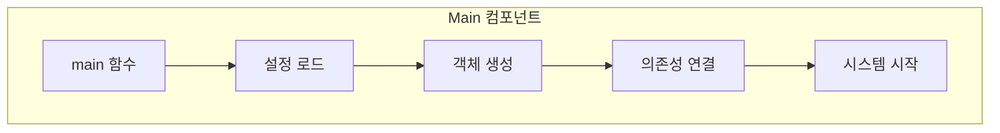
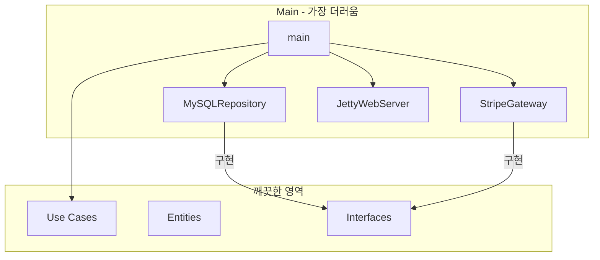
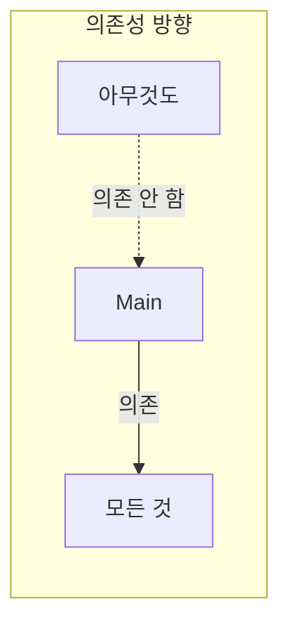
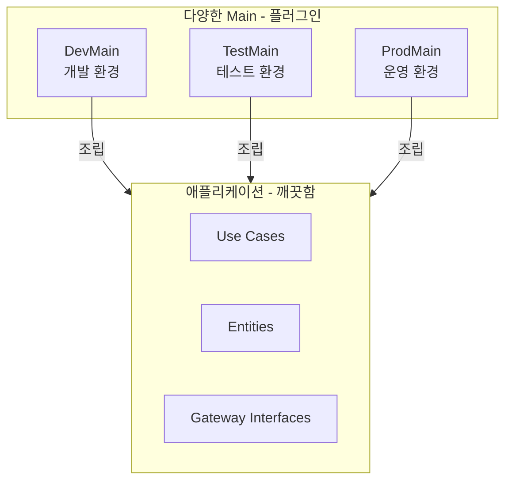
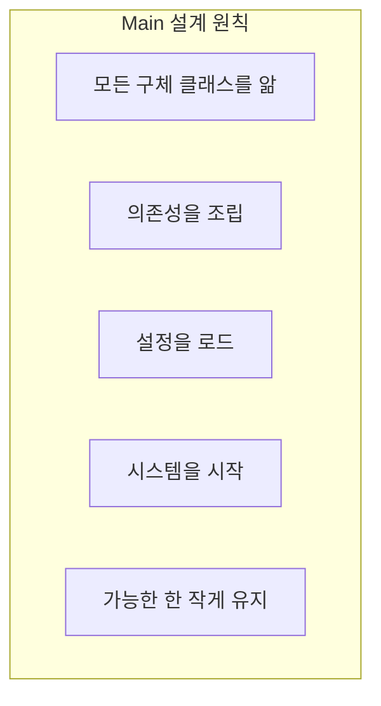

**Main**은 시스템의 **초기 진입점**이다. Clean Architecture에서 Main은 가장 **저수준의 정책**이며, 가장 **더러운** 컴포넌트다.

## Main의 역할

Main은 **모든 구체 클래스를 알고 조립**한다. 유스케이스·엔터티·인터페이스 어댑터는 서로 인터페이스로만 통신하도록 설계했지만, 그 인터페이스 뒤에 어떤 구체 클래스(MySQL인지 몽고DB인지, Stripe인지 PayPal인지)를 실제로 연결할지는 누군가 결정해야 한다. 그 결정을 내리고 실행하는 것이 Main의 유일한 일이다 — 설정을 읽고, 구체 클래스를 생성하고, 인터페이스에 주입한 뒤, 준비된 시스템을 실행에 넘긴다:


```mermaid
flowchart TB
    subgraph Main [Main 컴포넌트]
        M[main 함수]
        CFG[설정 로드]
        CREATE[객체 생성]
        WIRE[의존성 연결]
        START[시스템 시작]
    end
    
    M --> CFG --> CREATE --> WIRE --> START
```

### 상세 코드 예시

아래 코드는 이 네 단계(설정 로드 → 객체 생성 → 의존성 연결 → 시작)가 실제로 어떻게 이어지는지 보여준다. `PlaceOrderUseCase`나 `OrderController`는 `OrderRepository`·`PaymentGateway` 같은 인터페이스만 알지만, `Main`은 그 인터페이스를 구현하는 `MySQLOrderRepository`·`StripePaymentGateway`의 실제 클래스명을 직접 언급한다:

```java
class AppConfig {
    String getDatabaseUrl() { return "jdbc:mysql://localhost/orders"; }
    String getDatabaseUser() { return "app"; }
    String getDatabasePassword() { return "secret"; }
    String getStripeApiKey() { return "sk_test_placeholder"; }
    int getServerPort() { return 8080; }
}
class ProductionConfig extends AppConfig {}
class StagingConfig extends AppConfig {}
class DevelopmentConfig extends AppConfig {}

class Order {}
interface DataSource {}
class HikariDataSource implements DataSource {
    HikariDataSource(String jdbcUrl, String username, String password) {}
}
interface OrderRepository { void save(Order order); }
class MySQLOrderRepository implements OrderRepository {
    MySQLOrderRepository(DataSource dataSource) {}
    public void save(Order order) {}
}
interface PaymentGateway {}
class StripePaymentGateway implements PaymentGateway {
    StripePaymentGateway(String apiKey) {}
}
interface OrderPresenter {}
class JsonOrderPresenter implements OrderPresenter {}
class PlaceOrderUseCase {
    PlaceOrderUseCase(OrderRepository repo, PaymentGateway gateway, OrderPresenter presenter) {}
}
class CancelOrderUseCase {
    CancelOrderUseCase(OrderRepository repo, PaymentGateway gateway) {}
}
class OrderController {
    OrderController(PlaceOrderUseCase placeOrder, CancelOrderUseCase cancelOrder) {}
}
interface WebServer {
    void route(String path, OrderController controller);
    void start(int port);
}
class JettyWebServer implements WebServer {
    public void route(String path, OrderController controller) {}
    public void start(int port) {}
}

public class Main {
    public static void main(String[] args) {
        // 1. 설정 로드
        AppConfig config = loadConfig();

        // 2. 구체 클래스들을 알고 있음 (인프라)
        DataSource dataSource = new HikariDataSource(
            config.getDatabaseUrl(),
            config.getDatabaseUser(),
            config.getDatabasePassword()
        );

        // 3. Repository 생성 (구체 구현)
        OrderRepository orderRepo = new MySQLOrderRepository(dataSource);

        // 4. 외부 서비스 게이트웨이 생성
        PaymentGateway paymentGateway = new StripePaymentGateway(
            config.getStripeApiKey()
        );

        // 5. 프레젠터 생성
        OrderPresenter orderPresenter = new JsonOrderPresenter();

        // 6. 유스케이스 조립 (의존성 주입)
        PlaceOrderUseCase placeOrder = new PlaceOrderUseCase(
            orderRepo, paymentGateway, orderPresenter
        );

        CancelOrderUseCase cancelOrder = new CancelOrderUseCase(
            orderRepo, paymentGateway
        );

        // 7. 컨트롤러 생성
        OrderController orderController = new OrderController(
            placeOrder, cancelOrder
        );

        // 8. 웹 서버 시작
        WebServer server = new JettyWebServer();
        server.route("/orders", orderController);
        server.start(config.getServerPort());

        System.out.println("Server started on port " + config.getServerPort());
    }

    private static AppConfig loadConfig() {
        String env = System.getenv("APP_ENV");
        if (env == null) env = "development";
        return switch (env) {
            case "production" -> new ProductionConfig();
            case "staging" -> new StagingConfig();
            default -> new DevelopmentConfig();
        };
    }
}
```

## 가장 더러운 컴포넌트

Main은 의존성 역전 원칙(DIP)을 **위반해도 된다**. 안쪽 계층(엔터티·유스케이스)이 바깥쪽 세부사항의 이름을 알아서는 안 된다는 것이 지금까지의 규칙이었지만, Main은 그 규칙이 적용되는 "안쪽 계층"에 아예 속하지 않는다. 오히려 Main이 존재하는 이유 자체가 구체 클래스의 이름을 알아야 하는 유일한 곳을 한 군데로 모으는 것이다 — 그래야 나머지 코드 전부가 인터페이스만 알고 깨끗하게 남을 수 있다.


```mermaid
flowchart TB
    subgraph Main [Main - 가장 더러움]
        M[main]
        MYSQL[MySQLRepository]
        STRIPE[StripeGateway]
        JETTY[JettyWebServer]
    end
    
    subgraph Clean [깨끗한 영역]
        UC[Use Cases]
        ENT[Entities]
        INTF[Interfaces]
    end
    
    M --> MYSQL
    M --> STRIPE
    M --> JETTY
    M --> UC
    
    MYSQL -->|구현| INTF
    STRIPE -->|구현| INTF
```

### Main이 알아야 하는 것들

| 구분 | 알아야 하는 것 |
|------|--------------|
| 인프라 | DataSource, Connection Pool |
| 구현체 | MySQLRepository, MongoRepository |
| 외부 서비스 | StripeGateway, SesGateway |
| 프레임워크 | JettyServer, SpringMVC |
| 설정 | 환경 변수, 설정 파일 |

### 왜 괜찮은가?

의존성 규칙이 걱정하는 것은 "안쪽 코드가 바깥쪽의 구체적인 이름에 얽매이는 것"이다. Main이 아무리 지저분해도, 그 지저분함이 바깥으로 새어나가 다른 코드를 오염시키지만 않으면 문제가 되지 않는다. 이를 보장하는 것이 바로 의존성의 방향이다 — 시스템의 어떤 코드도 `Main`이라는 이름을 참조하지 않으므로, Main을 통째로 다른 것으로 갈아 끼워도 나머지 코드는 전혀 알아채지 못한다:


```mermaid
flowchart LR
    subgraph Dependencies [의존성 방향]
        NOTHING[아무것도] -.->|의존 안 함| MAIN[Main]
        MAIN -->|의존| EVERYTHING[모든 것]
    end
```

Main에 아무것도 의존하지 않기 때문에, Main은 시스템의 가장 외곽에 위치하면서도 언제든 다른 것으로 교체할 수 있는 플러그인과 같은 역할을 한다.

## Main은 플러그인

Main은 시스템에 **끼워 넣는** 플러그인이다. 플러그인이라는 관점을 받아들이면 자연스러운 결론이 하나 나온다 — 하드웨어의 USB 포트에 여러 장치를 번갈아 꽂을 수 있듯이, 같은 애플리케이션 코어에 서로 다른 Main을 번갈아 끼워 넣을 수 있다는 것이다. 개발 환경에서는 가짜 구현으로 빠르게 반복하고, 운영 환경에서는 실제 MySQL과 Stripe로 조립하는 식이다:


```mermaid
flowchart TB
    subgraph Application [애플리케이션 - 깨끗함]
        UC[Use Cases]
        E[Entities]
        GW[Gateway Interfaces]
    end
    
    subgraph Mains [다양한 Main - 플러그인]
        DEV[DevMain<br/>개발 환경]
        TEST[TestMain<br/>테스트 환경]
        PROD[ProdMain<br/>운영 환경]
    end
    
    DEV -->|조립| Application
    TEST -->|조립| Application
    PROD -->|조립| Application
```

### 환경별 Main

세 Main은 조립 절차 자체는 동일하지만("리포지토리를 만들고, 게이트웨이를 만들고, 주입한다"), 그 자리에 어떤 구체 클래스를 끼우는지만 다르다. 먼저 개발 환경에서는 DB·외부 API 없이 즉시 실행할 수 있도록 인메모리·목(mock) 구현을 사용한다:

```java
interface OrderRepository { void save(Order order); }
interface PaymentGateway {}
class Order {}
class InMemoryOrderRepository implements OrderRepository {
    public void save(Order order) {}
}
class MockPaymentGateway implements PaymentGateway {}

// 개발 환경 Main
public class DevMain {
    public static void main(String[] args) {
        OrderRepository repo = new InMemoryOrderRepository();
        PaymentGateway payment = new MockPaymentGateway();
        // ... 개발 환경 설정
    }
}
```

개발 환경 다음으로, 테스트 환경 Main은 인메모리 대신 실제 SQL 문법을 검증할 수 있는 H2(내장 DB)를, 진짜 Stripe 대신 결제가 실제로 청구되지 않는 샌드박스 모드를 사용한다 — 운영 환경에 더 가까운 조건에서 검증하면서도 여전히 실제 비용은 치르지 않는다:

```java
interface OrderRepository { void save(Order order); }
interface PaymentGateway {}
class Order {}
class H2OrderRepository implements OrderRepository {
    public void save(Order order) {}
}
class SandboxStripeGateway implements PaymentGateway {}

// 테스트 환경 Main
public class TestMain {
    public static void main(String[] args) {
        OrderRepository repo = new H2OrderRepository();
        PaymentGateway payment = new SandboxStripeGateway();
        // ... 테스트 환경 설정
    }
}
```

테스트 환경은 개발 환경보다 실제 운영에 가깝지만 여전히 진짜 비용은 치르지 않는다 — 인메모리 대신 실제 SQL을 검증할 수 있는 H2(내장 DB)를, 실제 Stripe 대신 결제가 실제로 청구되지 않는 샌드박스 모드를 사용한다. 마지막으로 운영 환경은 실제 인프라를 그대로 사용한다:

```java
interface OrderRepository { void save(Order order); }
interface PaymentGateway {}
class Order {}
class MySQLOrderRepository implements OrderRepository {
    public void save(Order order) {}
}
class StripePaymentGateway implements PaymentGateway {}

// 운영 환경 Main
public class ProdMain {
    public static void main(String[] args) {
        OrderRepository repo = new MySQLOrderRepository();
        PaymentGateway payment = new StripePaymentGateway();
        // ... 운영 환경 설정
    }
}
```

세 환경 모두 `PlaceOrderUseCase`나 `OrderController` 같은 애플리케이션 코드는 단 한 줄도 바뀌지 않는다 — 바뀌는 것은 오직 Main이 어떤 구체 클래스를 선택하느냐뿐이다:

| 환경 | Repository | Payment | 특징 |
|------|-----------|---------|------|
| 개발 | InMemory | Mock | 빠른 시작 |
| 테스트 | H2 | Sandbox | 실제와 유사 |
| 운영 | MySQL | Stripe | 실제 환경 |

## 프레임워크와 Main

Spring 같은 프레임워크가 Main 역할 일부를 담당한다. 마틴은 DI 프레임워크를 쓰더라도 그 프레임워크에 대한 지식은 Main(또는 Main에 준하는 조립 계층)에만 국한되어야 한다고 못박는다 — 일단 의존성이 Main을 통해 주입되고 나면, 나머지 코드는 평범한 방식으로 그 의존성을 사용해야지 프레임워크의 어노테이션이나 API를 여기저기서 다시 참조해서는 안 된다.

> "It is in this Main component that dependencies should be injected by a Dependency Injection framework. Once they are injected into Main, Main should distribute those dependencies normally, without using the framework."
> — Robert C. Martin, 『Clean Architecture』(2017), 26장

```java
import org.springframework.context.annotation.Configuration;
import org.springframework.context.annotation.Bean;
import org.springframework.beans.factory.annotation.Value;

interface DataSource {}
class HikariDataSource implements DataSource {}
class Order {}
interface OrderRepository { void save(Order order); }
class MySQLOrderRepository implements OrderRepository {
    MySQLOrderRepository(DataSource dataSource) {}
    public void save(Order order) {}
}
interface PaymentGateway {}
class StripePaymentGateway implements PaymentGateway {
    StripePaymentGateway(String apiKey) {}
}
class PlaceOrderUseCase {
    PlaceOrderUseCase(OrderRepository repo, PaymentGateway gateway) {}
}

// Spring의 경우: @Configuration이 Main 역할
@Configuration
public class SpringAppConfig {

    @Bean
    public DataSource dataSource() {
        return new HikariDataSource();
        // 실제로는 여기서 HikariConfig 값을 채운다
    }

    @Bean
    public OrderRepository orderRepository(DataSource dataSource) {
        return new MySQLOrderRepository(dataSource);
    }

    @Bean
    public PaymentGateway paymentGateway(
            @Value("${stripe.api.key}") String apiKey) {
        return new StripePaymentGateway(apiKey);
    }

    @Bean
    public PlaceOrderUseCase placeOrderUseCase(
            OrderRepository repo,
            PaymentGateway gateway) {
        return new PlaceOrderUseCase(repo, gateway);
    }
}
```

`SpringAppConfig`가 "무엇을 어떻게 조립할지"를 선언하는 설정이라면, 실제로 그 설정을 읽어 애플리케이션을 기동하는 진입점은 별도의 `Application` 클래스다. `main()` 메서드 자체는 단 한 줄로 줄어들지만, `@Configuration` 클래스 전체가 여전히 "구체 클래스를 알고 조립하는" Main의 책임을 수행하고 있다는 점은 변하지 않는다:

```java
import org.springframework.boot.SpringApplication;
import org.springframework.boot.autoconfigure.SpringBootApplication;

// Spring이 Main 역할 수행
@SpringBootApplication
public class Application {
    public static void main(String[] args) {
        SpringApplication.run(Application.class, args);
        // Spring이 @Configuration을 읽어 조립
    }
}
```

### 원칙은 동일

프레임워크를 사용하더라도 원칙은 동일하다:

| 원칙 | 직접 Main | 프레임워크 |
|------|----------|-----------|
| 구체 클래스 앎 | main()에서 직접 | @Bean에서 |
| 의존성 조립 | new로 생성 | DI Container |
| 설정 로드 | 직접 파싱 | @Value, @ConfigurationProperties |

## Main의 설계 원칙

지금까지 살펴본 예제들을 종합하면 Main이 지켜야 할 원칙은 5가지로 정리된다 — 무엇을 알아야 하는지(1–4)와 그것을 어떻게 유지해야 하는지(5)다:


```mermaid
flowchart TB
    subgraph Principles [Main 설계 원칙]
        P1[모든 구체 클래스를 앎]
        P2[의존성을 조립]
        P3[설정을 로드]
        P4[시스템을 시작]
        P5[가능한 한 작게 유지]
    end
```

### Main을 작게 유지하기

5번째 원칙("가능한 한 작게 유지")이 가장 어기기 쉽다. 조립 코드를 작성하다 보면 "이왕 여기 있으니" 하고 계산이나 검증 같은 로직을 슬쩍 끼워 넣고 싶어지는데, 이렇게 시작된 로직은 테스트하기도 재사용하기도 어려운 채로 Main에 갇혀버린다:

```java
class AppConfig {}
class Order {}

// 나쁜 예: Main에 로직이 있음
public class BadMain {
    public static void main(String[] args) {
        // 설정 로드
        // 객체 생성
        // 조립
        double total = 0;
        for (Order order : new Order[0]) {
            total += 1; // 비즈니스 로직 일부?! ← 안 됨!
        }
    }
}
```

`BadMain`의 `for` 루프는 계산 로직이 Main 안에 스며든 순간을 보여준다. 이 로직을 테스트하려면 `main()` 전체를 실행해야 하고, 다른 곳에서 재사용할 수도 없다. 로드·생성·조립 각 단계를 전담 클래스로 위임하면 Main은 다시 "무엇을, 어떤 순서로 조립할지"만 남는다:

```java
class AppConfig {}
class Application {
    void run() { /* 애플리케이션 시작 */ }
}
class ConfigLoader {
    static AppConfig load() { return new AppConfig(); }
}
class ApplicationFactory {
    static Application create(AppConfig config) { return new Application(); }
}

// 좋은 예: Main은 조립만
public class GoodMain {
    public static void main(String[] args) {
        // 설정 로드 → ConfigLoader에 위임
        AppConfig config = ConfigLoader.load();

        // 객체 생성과 조립 → Factory에 위임
        Application app = ApplicationFactory.create(config);

        // 시작
        app.run();
    }
}
```

## 흔한 오해

Main이 DIP를 위반해도 된다는 것을 "Main은 아무렇게나 짜도 된다"는 뜻으로 오해하기 쉽다. 정확히는 정반대다 — Main이 모든 구체 클래스를 직접 참조하는 것은 허용되지만("나쁜 예"/"좋은 예" 절 참고), 비즈니스 로직 자체가 Main에 섞여 들어가는 것은 여전히 금지된다. Main의 유일한 책임은 설정을 읽고, 구체 클래스를 생성하고, 인터페이스에 주입해 시스템을 시작하는 것뿐이다. 또 다른 오해는 Spring 같은 DI 프레임워크를 쓰면 Main의 책임 자체가 사라진다고 여기는 것이다. "프레임워크와 Main" 절에서 보듯, `@Configuration`/`@Bean`이 하는 일은 `new`로 직접 조립하던 것을 프레임워크에 위임한 것일 뿐, "구체 클래스를 알고 조립한다"는 Main의 역할 자체는 그대로 남는다.

## 학습 목표

이 장을 읽은 후 다음을 스스로 점검한다.

- Main이 의존성 역전 원칙을 위반해도 되는 이유를, "아무것도 Main에 의존하지 않는다"는 사실과 연결해 설명할 수 있는가?
- Main이 "플러그인"이라고 불리는 이유를 DevMain/TestMain/ProdMain 예시로 설명할 수 있는가?
- Spring 같은 DI 프레임워크를 쓸 때도 Main의 역할(구체 클래스를 알고 조립)이 왜 사라지지 않는지 설명할 수 있는가?
- "나쁜 예"의 `BadMain`에 비즈니스 로직이 섞여 있으면 안 되는 이유를 설명할 수 있는가?

## 판단 기준

새 코드를 Main에 둘지, 아니면 애플리케이션 내부(유스케이스·엔터티)에 둘지 판단할 때 다음을 확인한다.

- 이 코드가 "무엇을 어떤 구현으로 조립할지" 결정하는 것인가(Main), 아니면 "그 결과로 무엇을 계산할지" 결정하는 것인가(애플리케이션)?
- 이 코드가 구체 클래스(`MySQLOrderRepository` 등)의 이름을 직접 언급해야만 하는가? 그렇다면 Main이나 Main에 가까운 조립 계층이다.
- 배포 환경(개발/테스트/운영)에 따라 이 코드가 통째로 바뀌어야 하는가? 그렇다면 여러 개의 Main으로 분리할 후보다.

## 참고 자료

- Robert C. Martin, 『Clean Architecture』(2017), 26장 — Main 컴포넌트의 역할과 위치의 원출처.

## 핵심 요약

| 원칙 | 설명 |
|------|------|
| 역할 | 구체 클래스를 알고 조립 |
| 위치 | 가장 저수준의 정책 |
| 특성 | DIP 위반해도 됨 |
| 의존성 | 아무것도 Main에 의존 안 함 |
| 관점 | 시스템에 끼워 넣는 플러그인 |

> "The Main component is the ultimate detail—the lowest-level policy."
> — Robert C. Martin, 『Clean Architecture』(2017), 26장
