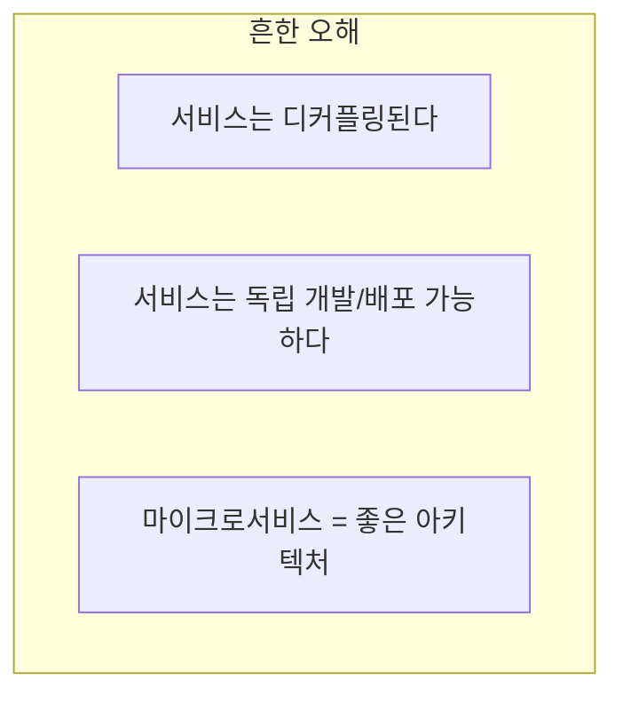
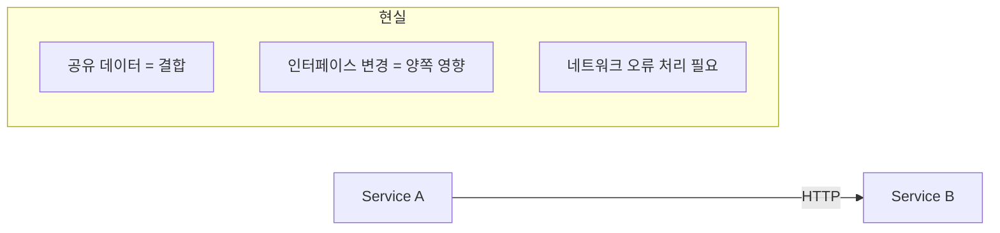
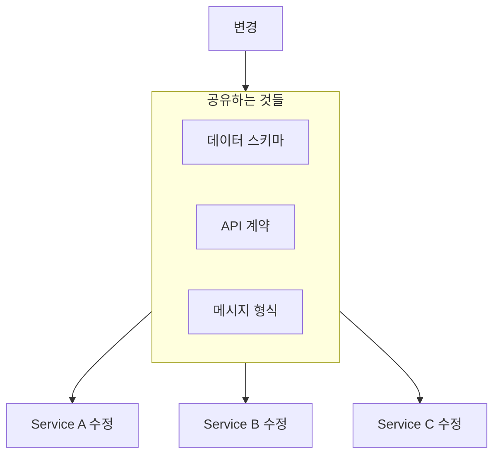
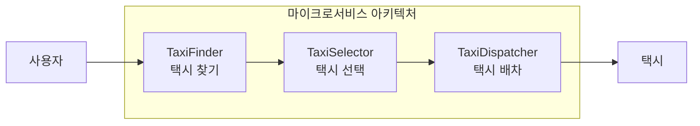
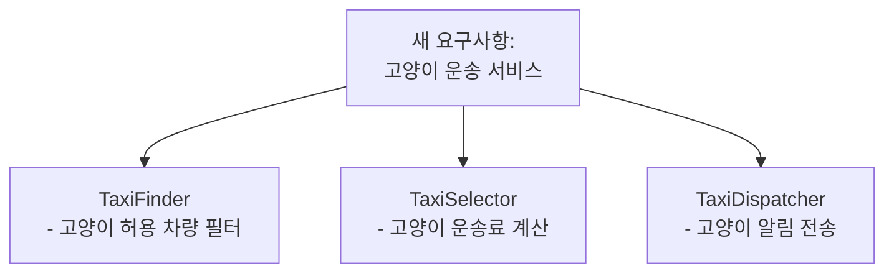
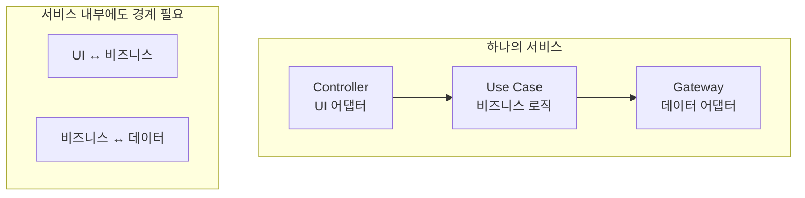
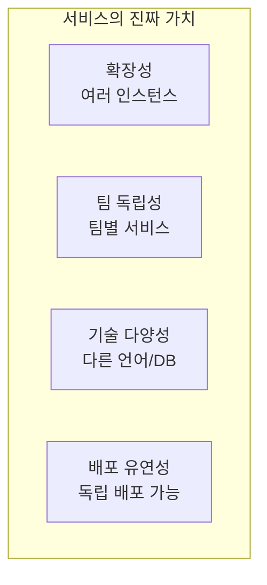

서비스는 아키텍처에서 특별한 위치를 차지하는가? 마틴은 **서비스에 대한 오해**를 지적한다.

## 서비스에 대한 흔한 오해

마이크로서비스가 인기를 얻으면서 많은 오해가 생겼다.



### 오해 1: 서비스는 디커플링된다

네트워크로 분리되어 있으니 디커플링된 것인가?



```java
// Service A
@RestController
public class OrderController {
    @PostMapping("/orders")
    public OrderResponse createOrder(@RequestBody OrderRequest request) {
        // Service B 호출
        CustomerResponse customer = customerClient.getCustomer(
            request.getCustomerId()
        );
        
        // CustomerResponse의 구조에 의존!
        if (customer.getStatus().equals("ACTIVE")) {
            // ...
        }
    }
}

// Service B의 응답 형식이 바뀌면?
// → Service A도 수정 필요!
// → 디커플링이 아님
```

**실제 결합 요소:**

| 결합 유형 | 설명 | 영향 |
|----------|------|------|
| 데이터 결합 | 같은 DB 공유 | 스키마 변경 시 함께 변경 |
| API 결합 | 서비스 간 API 호출 | 인터페이스 변경 시 소비자 영향 |
| 의미 결합 | 같은 개념(Customer 등) 공유 | 비즈니스 로직 변경 시 영향 |

### 오해 2: 서비스는 독립 개발/배포된다

실제로는:



```java
// 공유 데이터 스키마
CREATE TABLE orders (
    customer_id INT REFERENCES customers(id),
    -- customers 테이블이 바뀌면?
    -- 모든 서비스가 영향 받음!
);
```

| 공유 항목 | 변경 시 영향 |
|----------|-------------|
| 데이터 스키마 | 모든 서비스 함께 변경 |
| API 계약 | 모든 소비자 영향 |
| 메시지 형식 | 모든 구독자 영향 |
| 공유 라이브러리 | 모든 사용처 재배포 |

## 택시 집계 예제

마틴은 **택시 배차 시스템**을 예로 든다.

### 초기 설계



각 서비스가 독립적으로 보인다...

### 새 요구사항: "고양이 운송 서비스 추가"



**모든 서비스가 변경 필요!** 왜?

```java
// 횡단 관심사: "고양이 운송"
// TaxiFinder 변경
public class TaxiFinder {
    List<Taxi> findAvailable(RideRequest request) {
        // 새로운 조건 추가
        if (request.hasCat()) {
            taxis = filterCatFriendly(taxis);
        }
    }
}

// TaxiSelector 변경
public class TaxiSelector {
    Taxi select(List<Taxi> taxis, RideRequest request) {
        // 새로운 요금 계산
        if (request.hasCat()) {
            price += catSurcharge;
        }
    }
}

// TaxiDispatcher 변경
public class TaxiDispatcher {
    void dispatch(Taxi taxi, RideRequest request) {
        // 새로운 알림
        if (request.hasCat()) {
            notifyDriver("승객이 고양이와 함께합니다");
        }
    }
}
```

> "서비스가 **횡단 관심사**를 공유하기 때문에, 기능이 여러 서비스에 걸쳐 흩어진다."

## 서비스 vs 아키텍처 경계

**중요한 통찰**: 서비스는 **프로세스 경계**이지, **아키텍처 경계**가 아니다.



### 서비스 안에서도 Clean Architecture

```java
// 서비스 내부에도 아키텍처 경계가 있어야 함
@Service
public class TaxiFinderService {
    
    // Controller (외부 경계)
    @GetMapping("/taxis")
    public List<TaxiDTO> findTaxis(RideRequestDTO dto) {
        // DTO → 도메인 객체 변환
        RideRequest request = toRideRequest(dto);
        
        // Use Case 호출 (내부 경계)
        List<Taxi> taxis = findTaxisUseCase.execute(request);
        
        // 도메인 객체 → DTO 변환
        return toTaxiDTOs(taxis);
    }
}

// Use Case (핵심 비즈니스)
public class FindTaxisUseCase {
    private final TaxiGateway gateway;  // 인터페이스
    
    public List<Taxi> execute(RideRequest request) {
        // 비즈니스 로직
        List<Taxi> available = gateway.findAvailable(request.getLocation());
        return filterByCapacity(available, request.getPassengers());
    }
}
```

## 서비스의 진짜 가치

서비스가 제공하는 **진짜** 가치:



| 가치 | 설명 |
|------|------|
| 확장성 | 필요한 서비스만 인스턴스 추가 |
| 팀 독립성 | 각 팀이 자신의 서비스 소유 |
| 기술 다양성 | 서비스별 다른 기술 스택 가능 |
| 배포 유연성 | 전체 재배포 없이 일부만 |

### 하지만...


- **확장성**: 컴포넌트 분리로도 가능
- **팀 독립성**: 모듈 분리로도 가능
- **기술 다양성**: 플러그인으로도 가능

## 결론: 서비스와 아키텍처

```java
// 나쁜 예: 서비스만 믿고 내부 아키텍처 무시
@RestController
public class OrderService {
    @Autowired
    private JdbcTemplate jdbc;  // DB 직접 접근
    
    @PostMapping("/orders")
    public String create(@RequestBody Map<String, Object> body) {
        // SQL이 컨트롤러에!
        jdbc.update("INSERT INTO orders ...");
        return "OK";
    }
}

// 좋은 예: 서비스 내부에도 Clean Architecture
@RestController
public class OrderController {
    private final CreateOrderUseCase createOrder;
    
    @PostMapping("/orders")
    public OrderResponse create(@RequestBody OrderRequest request) {
        Order order = createOrder.execute(request.toDomain());
        return OrderResponse.from(order);
    }
}
```

## 핵심 요약

| 오해 | 진실 |
|------|------|
| 서비스 = 디커플링 | 공유 데이터/API로 결합됨 |
| 서비스 = 독립 배포 | 공유 요소 변경 시 함께 배포 |
| 서비스 = 아키텍처 경계 | 프로세스 경계일 뿐 |
| 마이크로서비스 = 좋은 아키텍처 | 내부 아키텍처가 더 중요 |

> **"서비스는 프로세스 경계이지, 아키텍처 경계가 아니다. 서비스 안에서도 Clean Architecture가 필요하다."**
> — Robert C. Martin
