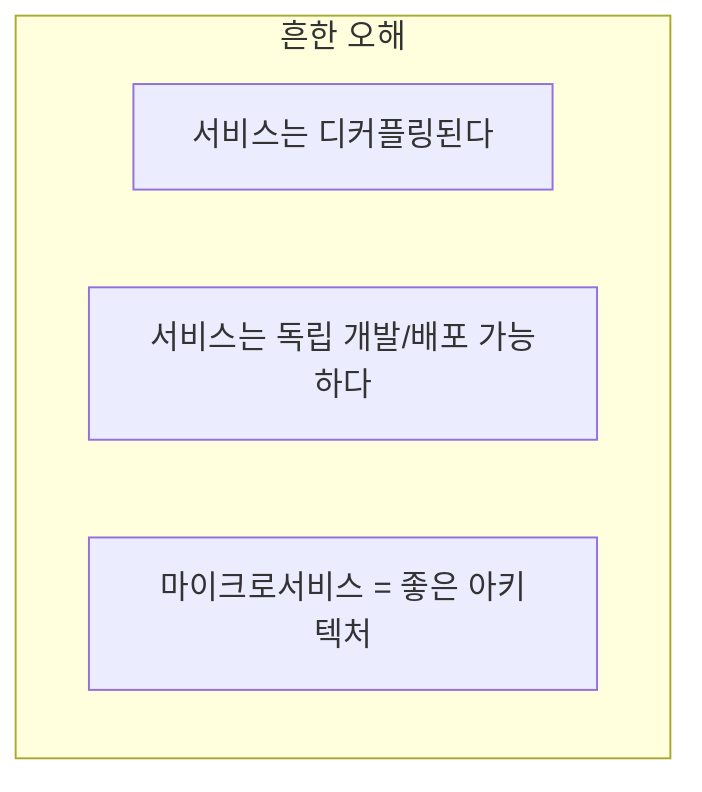
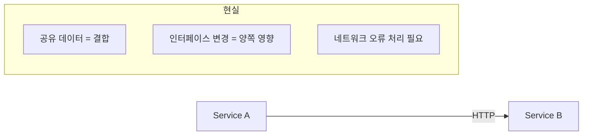
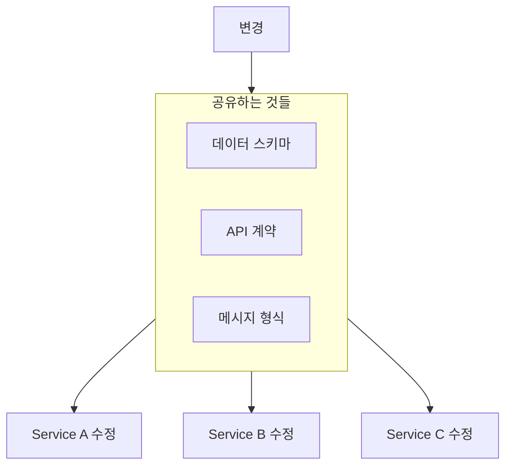
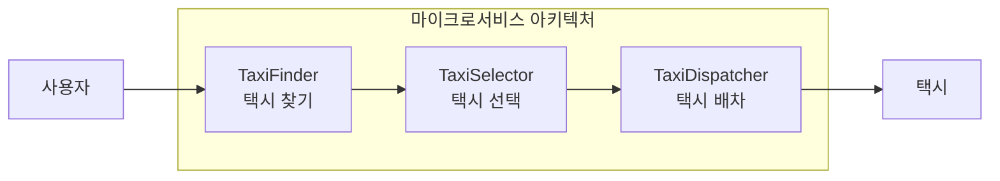
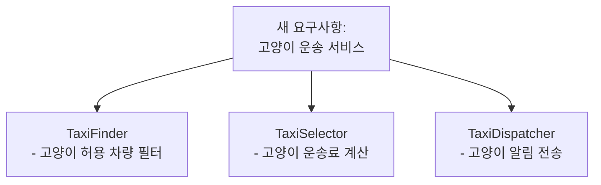
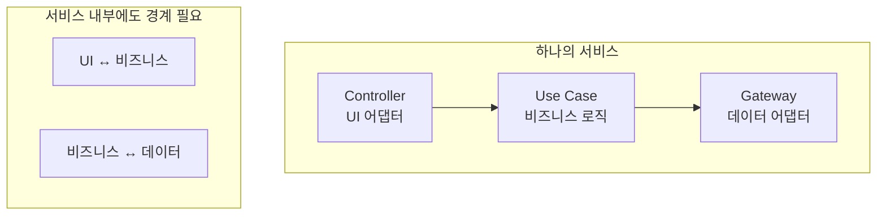
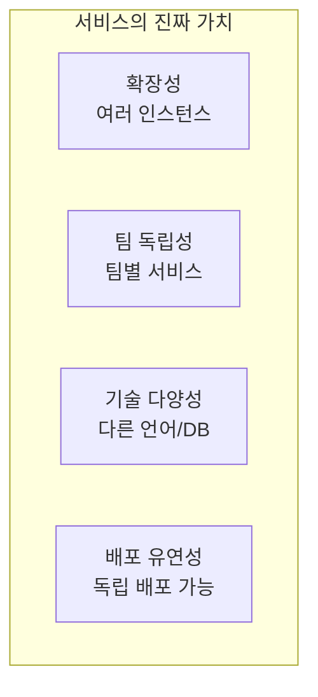
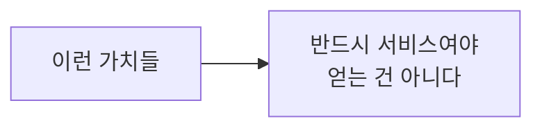

서비스는 아키텍처에서 특별한 위치를 차지하는가? 마틴은 **서비스에 대한 오해**를 지적한다.

## 서비스에 대한 흔한 오해

마이크로서비스가 인기를 얻으면서 많은 오해가 생겼다.


```mermaid
flowchart TB
    subgraph Misconceptions [흔한 오해]
        M1[서비스는 디커플링된다]
        M2[서비스는 독립 개발/배포 가능하다]
        M3[마이크로서비스 = 좋은 아키텍처]
    end
```

### 오해 1: 서비스는 디커플링된다

네트워크로 분리되어 있으니 디커플링된 것인가?


```mermaid
flowchart LR
    SA[Service A] -->|HTTP| SB[Service B]
    
    subgraph Reality [현실]
        R1[공유 데이터 = 결합]
        R2[인터페이스 변경 = 양쪽 영향]
        R3[네트워크 오류 처리 필요]
    end
```

```java
import org.springframework.web.bind.annotation.*;

class OrderRequest { String getCustomerId() { return "c-1"; } }
class OrderResponse {}
class CustomerResponse {
    String getStatus() { return "ACTIVE"; }
}
interface CustomerClient { CustomerResponse getCustomer(String customerId); }

// Service A
@RestController
public class OrderController {
    private final CustomerClient customerClient;

    public OrderController(CustomerClient customerClient) {
        this.customerClient = customerClient;
    }

    @PostMapping("/orders")
    public OrderResponse createOrder(@RequestBody OrderRequest request) {
        // Service B 호출
        CustomerResponse customer = customerClient.getCustomer(
            request.getCustomerId()
        );

        // CustomerResponse의 구조에 의존!
        if (customer.getStatus().equals("ACTIVE")) {
            // ...
        }
        return new OrderResponse();
    }
}

// Service B의 응답 형식이 바뀌면?
// → Service A도 수정 필요!
// → 디커플링이 아님
```

**실제 결합 요소:**

| 결합 유형 | 설명 | 영향 |
|----------|------|------|
| 데이터 결합 | 같은 DB 공유 | 스키마 변경 시 함께 변경 |
| API 결합 | 서비스 간 API 호출 | 인터페이스 변경 시 소비자 영향 |
| 의미 결합 | 같은 개념(Customer 등) 공유 | 비즈니스 로직 변경 시 영향 |

### 오해 2: 서비스는 독립 개발/배포된다

실제로는:


```mermaid
flowchart TB
    subgraph SharedThings [공유하는 것들]
        SCHEMA[데이터 스키마]
        API[API 계약]
        MSG[메시지 형식]
    end
    
    CHANGE[변경] --> SharedThings
    SharedThings --> S1[Service A 수정]
    SharedThings --> S2[Service B 수정]
    SharedThings --> S3[Service C 수정]
```

```sql
-- 공유 데이터 스키마
CREATE TABLE orders (
    customer_id INT REFERENCES customers(id)
    -- customers 테이블이 바뀌면?
    -- 모든 서비스가 영향 받음!
);
```

| 공유 항목 | 변경 시 영향 |
|----------|-------------|
| 데이터 스키마 | 모든 서비스 함께 변경 |
| API 계약 | 모든 소비자 영향 |
| 메시지 형식 | 모든 구독자 영향 |
| 공유 라이브러리 | 모든 사용처 재배포 |

## 택시 집계 예제

마틴은 **택시 배차 시스템**을 예로 든다.

### 초기 설계


```mermaid
flowchart LR
    subgraph Microservices [마이크로서비스 아키텍처]
        TF[TaxiFinder<br/>택시 찾기]
        TS[TaxiSelector<br/>택시 선택]
        TD[TaxiDispatcher<br/>택시 배차]
    end
    
    USER[사용자] --> TF --> TS --> TD --> TAXI[택시]
```

각 서비스가 독립적으로 보인다...

### 새 요구사항: "고양이 운송 서비스 추가"


```mermaid
flowchart TB
    REQ[새 요구사항:<br/>고양이 운송 서비스]
    
    TF[TaxiFinder<br/>- 고양이 허용 차량 필터]
    TS[TaxiSelector<br/>- 고양이 운송료 계산]
    TD[TaxiDispatcher<br/>- 고양이 알림 전송]
    
    REQ --> TF
    REQ --> TS
    REQ --> TD
```

**모든 서비스가 변경 필요!** 왜?

```java
import java.util.List;
import java.math.BigDecimal;

class Taxi { boolean catFriendly; }
class RideRequest {
    boolean hasCat() { return false; }
}

// 횡단 관심사: "고양이 운송"
// TaxiFinder 변경
class TaxiFinder {
    List<Taxi> findAvailable(RideRequest request) {
        List<Taxi> taxis = queryAvailableTaxis();
        // 새로운 조건 추가
        if (request.hasCat()) {
            taxis = filterCatFriendly(taxis);
        }
        return taxis;
    }
    private List<Taxi> queryAvailableTaxis() { return List.of(); }
    private List<Taxi> filterCatFriendly(List<Taxi> taxis) {
        return taxis.stream().filter(t -> t.catFriendly).toList();
    }
}
```

```java
import java.util.List;
import java.math.BigDecimal;

class Taxi {}
class RideRequest {
    boolean hasCat() { return false; }
}

// TaxiSelector 변경
class TaxiSelector {
    private static final BigDecimal catSurcharge = new BigDecimal("2000");

    Taxi select(List<Taxi> taxis, RideRequest request) {
        BigDecimal price = basePrice(taxis, request);
        // 새로운 요금 계산
        if (request.hasCat()) {
            price = price.add(catSurcharge);
        }
        return taxis.get(0);
    }
    private BigDecimal basePrice(List<Taxi> taxis, RideRequest request) { return BigDecimal.ZERO; }
}
```

```java
class Taxi {}
class RideRequest {
    boolean hasCat() { return false; }
}
interface DriverNotifier { void notifyDriver(String message); }

// TaxiDispatcher 변경
class TaxiDispatcher {
    private final DriverNotifier notifier;

    TaxiDispatcher(DriverNotifier notifier) { this.notifier = notifier; }

    void dispatch(Taxi taxi, RideRequest request) {
        // 새로운 알림
        if (request.hasCat()) {
            notifier.notifyDriver("승객이 고양이와 함께합니다");
        }
    }
}
```

마틴은 이런 문제를 **횡단 관심사(cross-cutting concern)**라고 부른다. "고양이 운송"이라는 요구사항은 어느 한 서비스에도 깔끔하게 속하지 않고, 택시 검색·선택·배차라는 기존 서비스 경계를 가로질러 흩어진다. 서비스 경계를 아무리 잘 나눠도, 그 경계와 어긋나는 요구사항이 등장하면 여러 서비스를 동시에 고쳐야 하는 상황은 피할 수 없다(Martin, 『Clean Architecture』, 2017, 27장).

## 서비스 vs 아키텍처 경계

**중요한 통찰**: 서비스는 **프로세스 경계**이지, **아키텍처 경계**가 아니다.


```mermaid
flowchart TB
    subgraph Service [하나의 서비스]
        CTRL[Controller<br/>UI 어댑터]
        UC[Use Case<br/>비즈니스 로직]
        GW[Gateway<br/>데이터 어댑터]
        
        CTRL --> UC --> GW
    end
    
    subgraph Inside [서비스 내부에도 경계 필요]
        B1[UI ↔ 비즈니스]
        B2[비즈니스 ↔ 데이터]
    end
```

### 서비스 안에서도 Clean Architecture

```java
import java.util.List;
import org.springframework.web.bind.annotation.*;
import org.springframework.stereotype.Service;

class Taxi { int capacity; }
class RideRequest {
    String getLocation() { return "seoul"; }
    int getPassengers() { return 1; }
}
class RideRequestDTO {}
class TaxiDTO {}
interface TaxiGateway { List<Taxi> findAvailable(String location); }

// Use Case (핵심 비즈니스)
class FindTaxisUseCase {
    private final TaxiGateway gateway;  // 인터페이스

    FindTaxisUseCase(TaxiGateway gateway) { this.gateway = gateway; }

    public List<Taxi> execute(RideRequest request) {
        // 비즈니스 로직
        List<Taxi> available = gateway.findAvailable(request.getLocation());
        return filterByCapacity(available, request.getPassengers());
    }
    private List<Taxi> filterByCapacity(List<Taxi> taxis, int passengers) {
        return taxis.stream().filter(t -> t.capacity >= passengers).toList();
    }
}

// 서비스 내부에도 아키텍처 경계가 있어야 함
@Service
public class TaxiFinderService {
    private final FindTaxisUseCase findTaxisUseCase;

    public TaxiFinderService(FindTaxisUseCase findTaxisUseCase) {
        this.findTaxisUseCase = findTaxisUseCase;
    }

    // Controller (외부 경계)
    @GetMapping("/taxis")
    public List<TaxiDTO> findTaxis(RideRequestDTO dto) {
        // DTO → 도메인 객체 변환
        RideRequest request = toRideRequest(dto);

        // Use Case 호출 (내부 경계)
        List<Taxi> taxis = findTaxisUseCase.execute(request);

        // 도메인 객체 → DTO 변환
        return toTaxiDTOs(taxis);
    }

    private RideRequest toRideRequest(RideRequestDTO dto) { return new RideRequest(); }
    private List<TaxiDTO> toTaxiDTOs(List<Taxi> taxis) { return taxis.stream().map(t -> new TaxiDTO()).toList(); }
}
```

## 서비스의 진짜 가치

서비스가 제공하는 **진짜** 가치:


```mermaid
flowchart TB
    subgraph RealValue [서비스의 진짜 가치]
        SCALE[확장성<br/>여러 인스턴스]
        TEAM[팀 독립성<br/>팀별 서비스]
        TECH[기술 다양성<br/>다른 언어/DB]
        DEPLOY[배포 유연성<br/>독립 배포 가능]
    end
```

| 가치 | 설명 |
|------|------|
| 확장성 | 필요한 서비스만 인스턴스 추가 |
| 팀 독립성 | 각 팀이 자신의 서비스 소유 |
| 기술 다양성 | 서비스별 다른 기술 스택 가능 |
| 배포 유연성 | 전체 재배포 없이 일부만 |

### 하지만...


```mermaid
flowchart LR
    VALUE[이런 가치들] 
    MUST["반드시 서비스여야</br>얻는 건 아니다"]
    
    VALUE --> MUST
```

- **확장성**: 컴포넌트 분리로도 가능
- **팀 독립성**: 모듈 분리로도 가능
- **기술 다양성**: 플러그인으로도 가능

## 결론: 서비스와 아키텍처

```java
import java.util.Map;
import org.springframework.web.bind.annotation.*;
import org.springframework.beans.factory.annotation.Autowired;
import org.springframework.jdbc.core.JdbcTemplate;

// 나쁜 예: 서비스만 믿고 내부 아키텍처 무시
@RestController
public class BadOrderService {
    @Autowired
    private JdbcTemplate jdbc;  // DB 직접 접근

    @PostMapping("/orders")
    public String create(@RequestBody Map<String, Object> body) {
        // SQL이 컨트롤러에!
        jdbc.update("INSERT INTO orders ...");
        return "OK";
    }
}
```

```java
import org.springframework.web.bind.annotation.*;

class Order {}
class OrderRequest {
    Order toDomain() { return new Order(); }
}
class OrderResponse {
    static OrderResponse from(Order order) { return new OrderResponse(); }
}
interface CreateOrderUseCase { Order execute(Order order); }

// 좋은 예: 서비스 내부에도 Clean Architecture
@RestController
public class OrderController {
    private final CreateOrderUseCase createOrder;

    public OrderController(CreateOrderUseCase createOrder) {
        this.createOrder = createOrder;
    }

    @PostMapping("/orders")
    public OrderResponse create(@RequestBody OrderRequest request) {
        Order order = createOrder.execute(request.toDomain());
        return OrderResponse.from(order);
    }
}
```

## 흔한 오해

"서비스가 아키텍처 경계가 아니다"를 "마이크로서비스는 쓸모없다"는 뜻으로 오해하기 쉽다. 정확히는 정반대다 — "서비스의 진짜 가치" 절에서 보듯 확장성·팀 독립성·기술 다양성·배포 유연성은 실재하는 이점이며, 마이크로서비스는 이를 얻는 유효한 방법 중 하나다. 마틴이 지적하는 것은 "서비스로 나누기만 하면 저절로 좋은 아키텍처가 된다"는 착각이다. 서비스 경계는 프로세스가 어디서 끝나는지를 정할 뿐, 그 프로세스 내부의 코드가 UI·비즈니스 로직·데이터 접근을 뒤섞어 놓았다면 서비스로 나눈 것은 그 뒤섞임을 여러 프로세스에 복제한 것에 지나지 않는다. 또 다른 오해는 서비스 간 HTTP 호출이 있으면 자동으로 디커플링됐다고 여기는 것이다. "오해 1" 절의 `OrderController` 예시처럼, `CustomerResponse`의 필드 구조 자체가 여전히 두 서비스를 묶어 놓은 결합이다.

## 학습 목표

이 장을 읽은 후 다음을 스스로 점검한다.

- 서비스가 "프로세스 경계"와 "아키텍처 경계"가 왜 다른 개념인지, 택시 예제의 횡단 관심사로 설명할 수 있는가?
- 네트워크로 분리된 두 서비스가 여전히 결합될 수 있는 세 가지 방식(데이터·API·의미 결합)을 설명할 수 있는가?
- 서비스의 진짜 가치(확장성·팀 독립성·기술 다양성·배포 유연성)가 왜 컴포넌트·모듈 분리로도 얻을 수 있는 것인지 설명할 수 있는가?
- `BadOrderService`와 `OrderController` 중 어느 쪽이 "서비스 안에도 Clean Architecture가 필요하다"는 원칙을 따르는지, 그리고 그 이유를 설명할 수 있는가?

## 판단 기준

기능을 여러 서비스로 나눌지 판단할 때 다음을 확인한다.

- 이 기능이 정말 독립적으로 확장·배포·팀 소유될 필요가 있는가, 아니면 같은 프로세스 안에서 모듈로 분리해도 충분한가?
- 새 요구사항이 등장했을 때, 그 요구사항이 기존 서비스 경계 하나에 깔끔하게 들어가는가, 아니면 여러 서비스를 동시에 건드리는 횡단 관심사인가?
- 이 서비스 내부에도 UI 어댑터·유스케이스·데이터 어댑터 사이의 경계가 별도로 존재하는가, 아니면 서비스 경계 하나만 믿고 내부는 뒤섞여 있는가?

## 참고 자료

- Robert C. Martin, 『Clean Architecture』(2017), 27장 — 서비스와 아키텍처 경계의 구분, 택시 배차 예제의 원출처.

## 핵심 요약

| 오해 | 진실 |
|------|------|
| 서비스 = 디커플링 | 공유 데이터/API로 결합됨 |
| 서비스 = 독립 배포 | 공유 요소 변경 시 함께 배포 |
| 서비스 = 아키텍처 경계 | 프로세스 경계일 뿐 |
| 마이크로서비스 = 좋은 아키텍처 | 내부 아키텍처가 더 중요 |

마틴은 서비스가 시스템의 아키텍처 경계를 정의하는 것이 아니라, 그 서비스 안에 있는 컴포넌트들이 아키텍처 경계를 정의한다고 말한다(Martin, 『Clean Architecture』, 2017, 27장).
