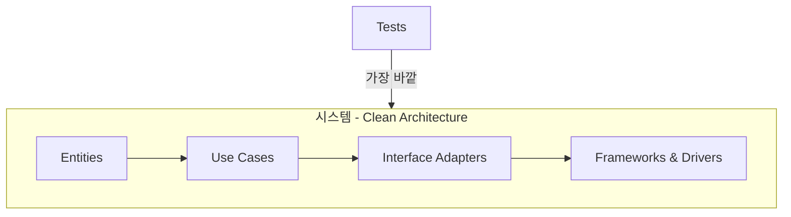
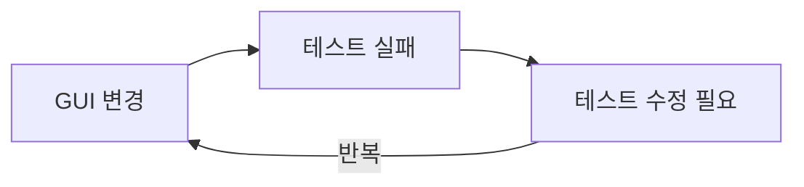
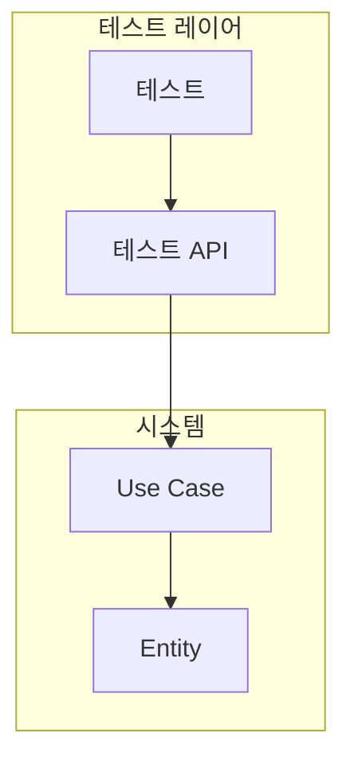
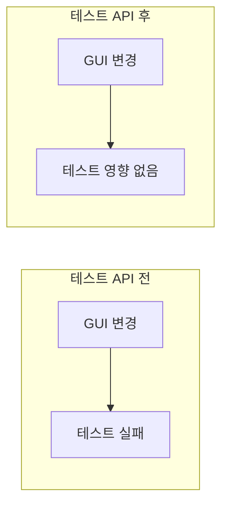
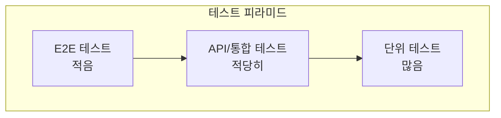
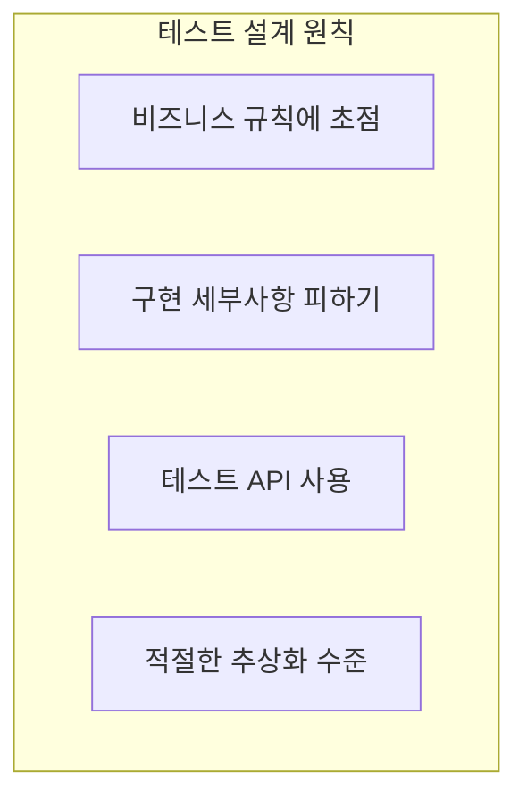

테스트는 시스템의 **일부**다. 아키텍처에서 테스트를 어떻게 다뤄야 하는가?

## 테스트의 아키텍처적 위치



테스트는 **가장 바깥쪽 원**에 위치한다.

### 테스트의 특징

| 특징 | 설명 |
|------|------|
| 위치 | 가장 바깥쪽 |
| 의존성 | 시스템에 의존 |
| 역의존성 | 아무것도 테스트에 의존 안 함 |
| 배포 | 보통 운영에 배포 안 함 |

```java
// 테스트는 시스템에 의존
public class PlaceOrderUseCaseTest {
    // Use Case에 의존
    private PlaceOrderUseCase useCase;
    
    @Test
    void shouldCreateOrder() {
        // 시스템 코드 호출
        Order order = useCase.execute(request);
        assertThat(order).isNotNull();
    }
}

// 하지만 시스템 코드는 테스트에 의존하지 않음
public class PlaceOrderUseCase {
    // 테스트에 대한 의존성 없음
}
```

## 깨지기 쉬운 테스트 (Fragile Tests)

### 문제: GUI에 결합된 테스트

```java
// GUI에 결합된 테스트 - 나쁜 예
@Test
void shouldShowOrderConfirmation() {
    // UI 요소에 직접 의존
    driver.findElement(By.id("customer-name")).sendKeys("John");
    driver.findElement(By.id("product-id")).sendKeys("PROD-001");
    driver.findElement(By.id("quantity")).sendKeys("2");
    
    // 버튼 클릭
    driver.findElement(By.cssSelector(".btn-primary")).click();
    
    // 결과 확인 - UI 요소에 의존
    String message = driver.findElement(By.id("success-message")).getText();
    assertThat(message).contains("Order placed successfully");
}
```

**문제점:**



| 변경 | 테스트 영향 |
|------|-----------|
| 버튼 ID 변경 | 테스트 실패 |
| CSS 클래스 변경 | 테스트 실패 |
| 레이아웃 변경 | 테스트 실패 |
| 메시지 문구 변경 | 테스트 실패 |

### 구조적 결합의 위험

테스트가 **구현 세부사항**에 결합되면:

```java
// 구조적 결합 - 나쁜 예
@Test
void shouldProcessOrder() {
    // 내부 메서드에 직접 의존
    order.validateInventory();  // private 메서드 테스트?
    order.calculateDiscount();  // 내부 구현에 결합
    order.applyTax();
    
    // 내부 상태 직접 확인
    assertThat(order.getInternalState()).isEqualTo(OrderState.PROCESSED);
}
```

| 문제 | 결과 |
|------|------|
| 리팩토링할 때마다 테스트 수정 | 리팩토링 기피 |
| 테스트가 변경을 **방해** | 생산성 저하 |
| 테스트 유지보수 비용 증가 | 테스트 폐기 |

## 해결책: 테스트 API

비즈니스 규칙을 테스트하는 **전용 API**를 만든다.



### 테스트 API 구현

```java
// 테스트 전용 API - 시스템의 일부로 설계
public class OrderTestAPI {
    private final PlaceOrderUseCase placeOrder;
    private final CancelOrderUseCase cancelOrder;
    private final GetOrderUseCase getOrder;
    
    // 비즈니스 동작을 표현하는 메서드
    public OrderTestResult placeOrder(
            String customerId, 
            List<OrderItem> items) {
        PlaceOrderRequest request = new PlaceOrderRequest(customerId, items);
        try {
            Order order = placeOrder.execute(request);
            return OrderTestResult.success(order);
        } catch (BusinessException e) {
            return OrderTestResult.failure(e.getMessage());
        }
    }
    
    public boolean cancelOrder(Long orderId, String reason) {
        try {
            cancelOrder.execute(new CancelOrderRequest(orderId, reason));
            return true;
        } catch (Exception e) {
            return false;
        }
    }
    
    public OrderStatus getOrderStatus(Long orderId) {
        return getOrder.execute(orderId).getStatus();
    }
}
```

### 테스트 API를 사용한 테스트

```java
class OrderBusinessRulesTest {
    private OrderTestAPI api;
    
    @BeforeEach
    void setup() {
        // 테스트 API 초기화 (실제 구현 또는 목)
        api = new OrderTestAPI(
            new PlaceOrderUseCase(...),
            new CancelOrderUseCase(...),
            new GetOrderUseCase(...)
        );
    }
    
    @Test
    void shouldPlaceOrderSuccessfully() {
        // Given
        String customerId = "CUST-001";
        List<OrderItem> items = List.of(
            new OrderItem("PROD-001", 2),
            new OrderItem("PROD-002", 1)
        );
        
        // When - 테스트 API 사용
        OrderTestResult result = api.placeOrder(customerId, items);
        
        // Then
        assertThat(result.isSuccess()).isTrue();
        assertThat(result.getOrder().getTotalItems()).isEqualTo(3);
    }
    
    @Test
    void shouldRejectOrderForInactiveCustomer() {
        // Given
        String inactiveCustomerId = "INACTIVE-001";
        List<OrderItem> items = List.of(new OrderItem("PROD-001", 1));
        
        // When
        OrderTestResult result = api.placeOrder(inactiveCustomerId, items);
        
        // Then
        assertThat(result.isSuccess()).isFalse();
        assertThat(result.getError()).contains("inactive customer");
    }
    
    @Test
    void shouldAllowCancellationWithinTimeLimit() {
        // Given
        OrderTestResult placeResult = api.placeOrder("CUST-001", items);
        Long orderId = placeResult.getOrder().getId();
        
        // When
        boolean cancelled = api.cancelOrder(orderId, "Changed my mind");
        
        // Then
        assertThat(cancelled).isTrue();
        assertThat(api.getOrderStatus(orderId)).isEqualTo(OrderStatus.CANCELLED);
    }
}
```

### 이점



| 이전 | 이후 |
|------|------|
| GUI 변경 → 테스트 실패 | GUI 변경 → 테스트 영향 없음 |
| UI 요소에 결합 | **비즈니스 규칙**만 테스트 |
| 깨지기 쉬움 | **안정적** |
| 유지보수 어려움 | 유지보수 쉬움 |

## 테스트 계층



| 계층 | 대상 | 결합도 | 속도 |
|------|------|--------|------|
| 단위 테스트 | 클래스/함수 | 높음 | 빠름 |
| 통합 테스트 | 컴포넌트 | 중간 | 중간 |
| API 테스트 | 유스케이스 | 낮음 | 중간 |
| E2E 테스트 | 전체 시스템 | 최저 | 느림 |

### 각 계층의 테스트 예시

```java
// 단위 테스트 - 클래스에 결합
@Test
void shouldCalculateOrderTotal() {
    Order order = new Order();
    order.addItem(new OrderItem("PROD-1", 100, 2));
    order.addItem(new OrderItem("PROD-2", 50, 1));
    
    assertThat(order.getTotal()).isEqualTo(250);
}

// API 테스트 - 유스케이스에 결합
@Test
void shouldPlaceOrderThroughAPI() {
    OrderTestResult result = api.placeOrder("CUST-1", items);
    assertThat(result.isSuccess()).isTrue();
}

// E2E 테스트 - 전체 시스템
@Test
void shouldCompleteOrderFlow() {
    // 주문 생성 → 결제 → 배송 전체 플로우
}
```

## 테스트 설계 원칙



## 핵심 요약

| 원칙 | 설명 |
|------|------|
| 테스트 = 시스템 일부 | 아키텍처로 설계해야 함 |
| 깨지기 쉬운 테스트 | GUI/구현에 결합된 테스트 |
| 해결책 | 테스트 API로 추상화 |
| 목표 | 비즈니스 규칙만 테스트 |

> **"테스트도 시스템의 일부로 설계해야 한다. 변경에 강하고 유지보수하기 쉬운 테스트를 위해 테스트 API를 만들어라."**
> — Robert C. Martin
