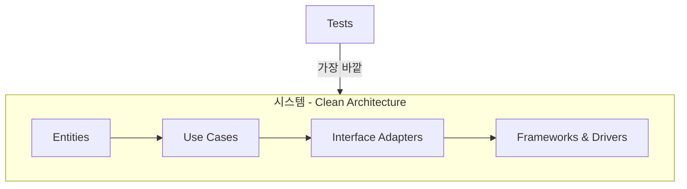
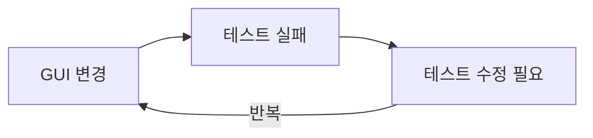
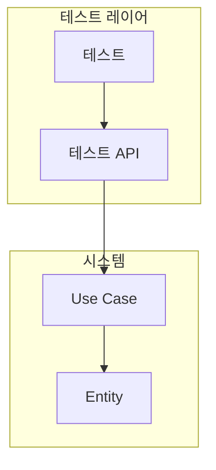
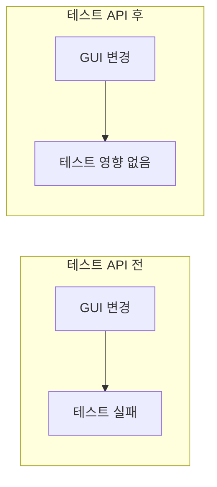
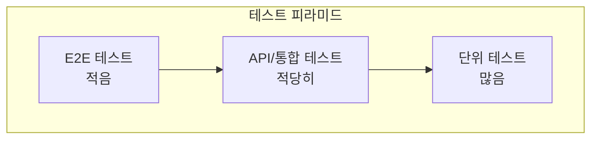
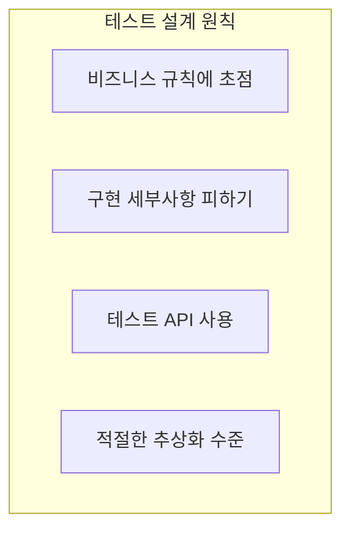

테스트는 시스템의 **일부**다. 아키텍처에서 테스트를 어떻게 다뤄야 하는가?

## 테스트의 아키텍처적 위치


```mermaid
flowchart TB
    subgraph System [시스템 - Clean Architecture]
        ENT[Entities]
        UC[Use Cases]
        IA[Interface Adapters]
        FW[Frameworks & Drivers]
    end
    
    TEST[Tests] -->|가장 바깥| System
    
    ENT --> UC --> IA --> FW
```

테스트는 **가장 바깥쪽 원**에 위치한다.

### 테스트의 특징

| 특징 | 설명 |
|------|------|
| 위치 | 가장 바깥쪽 |
| 의존성 | 시스템에 의존 |
| 역의존성 | 아무것도 테스트에 의존 안 함 |
| 배포 | 보통 운영에 배포 안 함 |

```java
import static org.assertj.core.api.Assertions.assertThat;
import org.junit.jupiter.api.Test;
import java.util.List;

class Order {}
class OrderItem { OrderItem(String productId, int quantity) {} }
class PlaceOrderRequest {
    PlaceOrderRequest(String customerId, List<OrderItem> items) {}
}
interface PlaceOrderUseCase {
    // 테스트에 대한 의존성 없음
    Order execute(PlaceOrderRequest request);
}
class FakePlaceOrderUseCase implements PlaceOrderUseCase {
    public Order execute(PlaceOrderRequest request) { return new Order(); }
}

// 테스트는 시스템에 의존
class PlaceOrderUseCaseTest {
    // Use Case에 의존
    private PlaceOrderUseCase useCase = new FakePlaceOrderUseCase();

    @Test
    void shouldCreateOrder() {
        PlaceOrderRequest request = new PlaceOrderRequest(
            "CUST-001", List.of(new OrderItem("PROD-001", 1))
        );
        // 시스템 코드 호출
        Order order = useCase.execute(request);
        assertThat(order).isNotNull();
    }
}
```

## 깨지기 쉬운 테스트 (Fragile Tests)

### 문제: GUI에 결합된 테스트

```java
import org.openqa.selenium.WebDriver;
import org.openqa.selenium.By;
import org.junit.jupiter.api.Test;
import static org.assertj.core.api.Assertions.assertThat;

class FragileGuiTest {
    private WebDriver driver;

// GUI에 결합된 테스트 - 나쁜 예
@Test
void shouldShowOrderConfirmation() {
    // UI 요소에 직접 의존
    driver.findElement(By.id("customer-name")).sendKeys("John");
    driver.findElement(By.id("product-id")).sendKeys("PROD-001");
    driver.findElement(By.id("quantity")).sendKeys("2");
    
    // 버튼 클릭
    driver.findElement(By.cssSelector(".btn-primary")).click();
    
    // 결과 확인 - UI 요소에 의존
    String message = driver.findElement(By.id("success-message")).getText();
    assertThat(message).contains("Order placed successfully");
}
}
```

**문제점:**


```mermaid
flowchart LR
    GUI_CHANGE[GUI 변경]
    TEST_BREAK[테스트 실패]
    FIX_TEST[테스트 수정 필요]
    
    GUI_CHANGE --> TEST_BREAK --> FIX_TEST
    FIX_TEST -->|반복| GUI_CHANGE
```

| 변경 | 테스트 영향 |
|------|-----------|
| 버튼 ID 변경 | 테스트 실패 |
| CSS 클래스 변경 | 테스트 실패 |
| 레이아웃 변경 | 테스트 실패 |
| 메시지 문구 변경 | 테스트 실패 |

### 구조적 결합의 위험

테스트가 **구현 세부사항**에 결합되면:

```java
import org.junit.jupiter.api.Test;
import static org.assertj.core.api.Assertions.assertThat;

enum OrderState { NEW, PROCESSED }
class Order {
    OrderState internalState = OrderState.NEW;
    void validateInventory() {}
    void calculateDiscount() {}
    void applyTax() { internalState = OrderState.PROCESSED; }
    OrderState getInternalState() { return internalState; }
}

class StructurallyCoupledTest {
    private Order order = new Order();

    // 구조적 결합 - 나쁜 예
    @Test
    void shouldProcessOrder() {
        // 내부 메서드에 직접 의존
        order.validateInventory();  // private 메서드 테스트?
        order.calculateDiscount();  // 내부 구현에 결합
        order.applyTax();

        // 내부 상태 직접 확인
        assertThat(order.getInternalState()).isEqualTo(OrderState.PROCESSED);
    }
}
```

| 문제 | 결과 |
|------|------|
| 리팩토링할 때마다 테스트 수정 | 리팩토링 기피 |
| 테스트가 변경을 **방해** | 생산성 저하 |
| 테스트 유지보수 비용 증가 | 테스트 폐기 |

## 해결책: 테스트 API

비즈니스 규칙을 테스트하는 **전용 API**를 만든다.


```mermaid
flowchart TB
    subgraph TestLayer [테스트 레이어]
        TEST[테스트]
        TAPI[테스트 API]
    end
    
    subgraph System [시스템]
        UC[Use Case]
        ENT[Entity]
    end
    
    TEST --> TAPI --> UC --> ENT
```

### 테스트 API 구현

```java
import java.util.List;

class Order {
    private Long id = 1L;
    private int totalItems;
    private OrderStatus status = OrderStatus.PLACED;
    void setTotalItems(int n) { totalItems = n; }
    int getTotalItems() { return totalItems; }
    Long getId() { return id; }
    OrderStatus getStatus() { return status; }
    void setStatus(OrderStatus s) { status = s; }
}
enum OrderStatus { PLACED, CANCELLED }
class OrderItem {
    OrderItem(String productId, int quantity) {}
}
class BusinessException extends RuntimeException {
    BusinessException(String message) { super(message); }
}
class PlaceOrderRequest {
    PlaceOrderRequest(String customerId, List<OrderItem> items) {}
}
class CancelOrderRequest {
    CancelOrderRequest(Long orderId, String reason) {}
}
class OrderTestResult {
    private final boolean success;
    private final Order order;
    private final String error;
    private OrderTestResult(boolean success, Order order, String error) {
        this.success = success; this.order = order; this.error = error;
    }
    static OrderTestResult success(Order order) { return new OrderTestResult(true, order, null); }
    static OrderTestResult failure(String error) { return new OrderTestResult(false, null, error); }
    boolean isSuccess() { return success; }
    Order getOrder() { return order; }
    String getError() { return error; }
}
interface PlaceOrderUseCase { Order execute(PlaceOrderRequest request); }
interface CancelOrderUseCase { void execute(CancelOrderRequest request); }
interface GetOrderUseCase { Order execute(Long orderId); }

// 테스트 전용 API - 시스템의 일부로 설계
public class OrderTestAPI {
    private final PlaceOrderUseCase placeOrder;
    private final CancelOrderUseCase cancelOrder;
    private final GetOrderUseCase getOrder;

    public OrderTestAPI(PlaceOrderUseCase placeOrder, CancelOrderUseCase cancelOrder, GetOrderUseCase getOrder) {
        this.placeOrder = placeOrder;
        this.cancelOrder = cancelOrder;
        this.getOrder = getOrder;
    }

    // 비즈니스 동작을 표현하는 메서드
    public OrderTestResult placeOrder(
            String customerId,
            List<OrderItem> items) {
        PlaceOrderRequest request = new PlaceOrderRequest(customerId, items);
        try {
            Order order = placeOrder.execute(request);
            order.setTotalItems(items.size());
            return OrderTestResult.success(order);
        } catch (BusinessException e) {
            return OrderTestResult.failure(e.getMessage());
        }
    }

    public boolean cancelOrder(Long orderId, String reason) {
        try {
            cancelOrder.execute(new CancelOrderRequest(orderId, reason));
            return true;
        } catch (Exception e) {
            return false;
        }
    }

    public OrderStatus getOrderStatus(Long orderId) {
        return getOrder.execute(orderId).getStatus();
    }
}
```

### 테스트 API를 사용한 테스트

앞서 정의한 `OrderTestAPI`와 `PlaceOrderUseCase` 등 유스케이스 인터페이스를 그대로 이어서 사용한다. 실제 테스트에서는 진짜 유스케이스 구현 대신, 아래처럼 각 유스케이스 인터페이스의 간단한 가짜(Fake) 구현을 주입한다:

```java
import java.util.List;
import java.math.BigDecimal;
import org.junit.jupiter.api.BeforeEach;
import org.junit.jupiter.api.Test;
import static org.assertj.core.api.Assertions.assertThat;

class Order {
    private Long id = 1L;
    private int totalItems;
    private OrderStatus status = OrderStatus.PLACED;
    void setTotalItems(int n) { totalItems = n; }
    int getTotalItems() { return totalItems; }
    Long getId() { return id; }
    OrderStatus getStatus() { return status; }
    void setStatus(OrderStatus s) { status = s; }
}
enum OrderStatus { PLACED, CANCELLED }
class OrderItem {
    OrderItem(String productId, int quantity) {}
}
class BusinessException extends RuntimeException {
    BusinessException(String message) { super(message); }
}
class PlaceOrderRequest {
    PlaceOrderRequest(String customerId, List<OrderItem> items) {}
}
class CancelOrderRequest {
    CancelOrderRequest(Long orderId, String reason) {}
}
class OrderTestResult {
    private final boolean success;
    private final Order order;
    private final String error;
    private OrderTestResult(boolean success, Order order, String error) {
        this.success = success; this.order = order; this.error = error;
    }
    static OrderTestResult success(Order order) { return new OrderTestResult(true, order, null); }
    static OrderTestResult failure(String error) { return new OrderTestResult(false, null, error); }
    boolean isSuccess() { return success; }
    Order getOrder() { return order; }
    String getError() { return error; }
}
interface PlaceOrderUseCase { Order execute(PlaceOrderRequest request); }
interface CancelOrderUseCase { void execute(CancelOrderRequest request); }
interface GetOrderUseCase { Order execute(Long orderId); }
class OrderTestAPI {
    private final PlaceOrderUseCase placeOrder;
    private final CancelOrderUseCase cancelOrder;
    private final GetOrderUseCase getOrder;

    OrderTestAPI(PlaceOrderUseCase placeOrder, CancelOrderUseCase cancelOrder, GetOrderUseCase getOrder) {
        this.placeOrder = placeOrder;
        this.cancelOrder = cancelOrder;
        this.getOrder = getOrder;
    }
    OrderTestResult placeOrder(String customerId, List<OrderItem> items) {
        try {
            Order order = placeOrder.execute(new PlaceOrderRequest(customerId, items));
            order.setTotalItems(items.size());
            return OrderTestResult.success(order);
        } catch (BusinessException e) {
            return OrderTestResult.failure(e.getMessage());
        }
    }
    boolean cancelOrder(Long orderId, String reason) {
        try {
            cancelOrder.execute(new CancelOrderRequest(orderId, reason));
            return true;
        } catch (Exception e) {
            return false;
        }
    }
    OrderStatus getOrderStatus(Long orderId) {
        return getOrder.execute(orderId).getStatus();
    }
}

class FakePlaceOrderUseCase implements PlaceOrderUseCase {
    public Order execute(PlaceOrderRequest request) {
        // 실제로는 request에서 고객 활성 상태 등을 검증한다
        return new Order();
    }
}
class FakeCancelOrderUseCase implements CancelOrderUseCase {
    public void execute(CancelOrderRequest request) {}
}
class FakeGetOrderUseCase implements GetOrderUseCase {
    public Order execute(Long orderId) {
        Order order = new Order();
        order.setStatus(OrderStatus.CANCELLED);
        return order;
    }
}

class OrderBusinessRulesTest {
    private OrderTestAPI api;

    @BeforeEach
    void setup() {
        // 테스트 API 초기화 (실제 구현 또는 목)
        api = new OrderTestAPI(
            new FakePlaceOrderUseCase(),
            new FakeCancelOrderUseCase(),
            new FakeGetOrderUseCase()
        );
    }

    @Test
    void shouldPlaceOrderSuccessfully() {
        // Given
        String customerId = "CUST-001";
        List<OrderItem> items = List.of(
            new OrderItem("PROD-001", 2),
            new OrderItem("PROD-002", 1)
        );

        // When - 테스트 API 사용
        OrderTestResult result = api.placeOrder(customerId, items);

        // Then
        assertThat(result.isSuccess()).isTrue();
        assertThat(result.getOrder().getTotalItems()).isEqualTo(2);
    }

    @Test
    void shouldAllowCancellationWithinTimeLimit() {
        // Given
        List<OrderItem> items = List.of(new OrderItem("PROD-001", 1));
        OrderTestResult placeResult = api.placeOrder("CUST-001", items);
        Long orderId = placeResult.getOrder().getId();

        // When
        boolean cancelled = api.cancelOrder(orderId, "Changed my mind");

        // Then
        assertThat(cancelled).isTrue();
        assertThat(api.getOrderStatus(orderId)).isEqualTo(OrderStatus.CANCELLED);
    }
}
```

### 이점


```mermaid
flowchart LR
    subgraph Before [테스트 API 전]
        B1[GUI 변경]
        B2[테스트 실패]
    end
    
    subgraph After [테스트 API 후]
        A1[GUI 변경]
        A2[테스트 영향 없음]
    end
    
    B1 --> B2
    A1 --> A2
```

| 이전 | 이후 |
|------|------|
| GUI 변경 → 테스트 실패 | GUI 변경 → 테스트 영향 없음 |
| UI 요소에 결합 | **비즈니스 규칙**만 테스트 |
| 깨지기 쉬움 | **안정적** |
| 유지보수 어려움 | 유지보수 쉬움 |

## 테스트 계층


```mermaid
flowchart TB
    subgraph TestPyramid [테스트 피라미드]
        E2E[E2E 테스트<br/>적음]
        API[API/통합 테스트<br/>적당히]
        UNIT[단위 테스트<br/>많음]
    end
    
    E2E --> API --> UNIT
```

| 계층 | 대상 | 결합도 | 속도 |
|------|------|--------|------|
| 단위 테스트 | 클래스/함수 | 높음 | 빠름 |
| 통합 테스트 | 컴포넌트 | 중간 | 중간 |
| API 테스트 | 유스케이스 | 낮음 | 중간 |
| E2E 테스트 | 전체 시스템 | 최저 | 느림 |

### 각 계층의 테스트 예시

```java
import java.util.ArrayList;
import java.util.List;
import org.junit.jupiter.api.Test;
import static org.assertj.core.api.Assertions.assertThat;

class PricedOrderItem {
    String productId; int unitPrice; int quantity;
    PricedOrderItem(String productId, int unitPrice, int quantity) {
        this.productId = productId; this.unitPrice = unitPrice; this.quantity = quantity;
    }
}
class PricedOrder {
    private final List<PricedOrderItem> items = new ArrayList<>();
    void addItem(PricedOrderItem item) { items.add(item); }
    int getTotal() { return items.stream().mapToInt(i -> i.unitPrice * i.quantity).sum(); }
}

class Order {
    private Long id = 1L;
    private int totalItems;
    private OrderStatus status = OrderStatus.PLACED;
    void setTotalItems(int n) { totalItems = n; }
    int getTotalItems() { return totalItems; }
    Long getId() { return id; }
    OrderStatus getStatus() { return status; }
    void setStatus(OrderStatus s) { status = s; }
}
enum OrderStatus { PLACED, CANCELLED }
class OrderItem {
    OrderItem(String productId, int quantity) {}
}
class BusinessException extends RuntimeException {
    BusinessException(String message) { super(message); }
}
class PlaceOrderRequest {
    PlaceOrderRequest(String customerId, List<OrderItem> items) {}
}
class CancelOrderRequest {
    CancelOrderRequest(Long orderId, String reason) {}
}
class OrderTestResult {
    private final boolean success;
    private final Order order;
    private final String error;
    private OrderTestResult(boolean success, Order order, String error) {
        this.success = success; this.order = order; this.error = error;
    }
    static OrderTestResult success(Order order) { return new OrderTestResult(true, order, null); }
    static OrderTestResult failure(String error) { return new OrderTestResult(false, null, error); }
    boolean isSuccess() { return success; }
    Order getOrder() { return order; }
    String getError() { return error; }
}
interface PlaceOrderUseCase { Order execute(PlaceOrderRequest request); }
interface CancelOrderUseCase { void execute(CancelOrderRequest request); }
interface GetOrderUseCase { Order execute(Long orderId); }
class OrderTestAPI {
    private final PlaceOrderUseCase placeOrder;
    private final CancelOrderUseCase cancelOrder;
    private final GetOrderUseCase getOrder;

    OrderTestAPI(PlaceOrderUseCase placeOrder, CancelOrderUseCase cancelOrder, GetOrderUseCase getOrder) {
        this.placeOrder = placeOrder;
        this.cancelOrder = cancelOrder;
        this.getOrder = getOrder;
    }
    OrderTestResult placeOrder(String customerId, List<OrderItem> items) {
        try {
            Order order = placeOrder.execute(new PlaceOrderRequest(customerId, items));
            order.setTotalItems(items.size());
            return OrderTestResult.success(order);
        } catch (BusinessException e) {
            return OrderTestResult.failure(e.getMessage());
        }
    }
    boolean cancelOrder(Long orderId, String reason) {
        try {
            cancelOrder.execute(new CancelOrderRequest(orderId, reason));
            return true;
        } catch (Exception e) {
            return false;
        }
    }
    OrderStatus getOrderStatus(Long orderId) {
        return getOrder.execute(orderId).getStatus();
    }
}
class FakePlaceOrderUseCase implements PlaceOrderUseCase {
    public Order execute(PlaceOrderRequest request) { return new Order(); }
}
class FakeCancelOrderUseCase implements CancelOrderUseCase {
    public void execute(CancelOrderRequest request) {}
}
class FakeGetOrderUseCase implements GetOrderUseCase {
    public Order execute(Long orderId) { return new Order(); }
}

class TestLayerExamples {
    // 단위 테스트 - 클래스에 결합
    @Test
    void shouldCalculateOrderTotal() {
        PricedOrder order = new PricedOrder();
        order.addItem(new PricedOrderItem("PROD-1", 100, 2));
        order.addItem(new PricedOrderItem("PROD-2", 50, 1));

        assertThat(order.getTotal()).isEqualTo(250);
    }

    // API 테스트 - 유스케이스에 결합
    @Test
    void shouldPlaceOrderThroughAPI() {
        OrderTestAPI api = new OrderTestAPI(
            new FakePlaceOrderUseCase(),
            new FakeCancelOrderUseCase(),
            new FakeGetOrderUseCase()
        );
        List<OrderItem> items = List.of(new OrderItem("PROD-1", 1));

        OrderTestResult result = api.placeOrder("CUST-1", items);
        assertThat(result.isSuccess()).isTrue();
    }

    // E2E 테스트 - 전체 시스템
    @Test
    void shouldCompleteOrderFlow() {
        // 주문 생성 → 결제 → 배송 전체 플로우
    }
}
```

## 테스트 설계 원칙


```mermaid
flowchart TB
    subgraph Principles [테스트 설계 원칙]
        P1[비즈니스 규칙에 초점]
        P2[구현 세부사항 피하기]
        P3[테스트 API 사용]
        P4[적절한 추상화 수준]
    end
```

## 흔한 오해

"테스트가 시스템의 일부"라는 말을 "테스트도 운영 코드처럼 배포해야 한다"는 뜻으로 오해하기 쉽다. 정확히는 정반대다 — "테스트의 특징" 표에서 보듯 테스트는 시스템에 의존하지만 시스템은 테스트에 전혀 의존하지 않으며, 보통 운영 환경에는 배포되지 않는다. "시스템의 일부"라는 말의 의미는 테스트도 아키텍처 설계의 대상이라는 것이다 — 아무렇게나 짜도 되는 부산물이 아니라, 변경에 강하도록 의도적으로 구조를 설계해야 하는 컴포넌트라는 뜻이다. 또 다른 오해는 깨지기 쉬운 테스트 문제를 "테스트를 적게 짜면 해결된다"고 여기는 것이다. 실제 해법은 테스트 수를 줄이는 것이 아니라, 테스트가 결합되는 대상을 UI·내부 구현에서 테스트 API로 옮기는 것이다.

## 학습 목표

이 장을 읽은 후 다음을 스스로 점검한다.

- 테스트가 "시스템에 의존하지만 시스템은 테스트에 의존하지 않는다"는 단방향 의존성을 설명할 수 있는가?
- 깨지기 쉬운 테스트 문제가 왜 생기는지, GUI 결합과 구조적 결합 두 가지 사례로 설명할 수 있는가?
- 테스트 API가 왜 "GUI 변경 → 테스트 영향 없음"을 가능하게 하는지 설명할 수 있는가?
- 단위·API·E2E 테스트가 결합도와 속도 면에서 어떤 트레이드오프를 갖는지 설명할 수 있는가?

## 판단 기준

새 테스트를 작성할 때 다음을 확인한다.

- 이 테스트가 UI 요소(버튼 ID, CSS 클래스)나 클래스 내부 구현(private 메서드, 내부 상태)에 직접 의존하는가? 그렇다면 리팩토링할 때마다 깨질 위험이 있다.
- 이 테스트가 검증하려는 것이 비즈니스 규칙인가, 아니면 특정 구현 방식인가? 후자라면 테스트 API 뒤로 옮길 수 있는지 검토한다.
- 이 테스트의 계층(단위/API/E2E)이 검증 대상의 범위와 맞는가? 비즈니스 규칙 하나를 검증하려고 E2E 테스트를 쓰고 있지는 않은가?

## 참고 자료

- Robert C. Martin, 『Clean Architecture』(2017), 28장 — 테스트 경계와 깨지기 쉬운 테스트 문제, 테스트 API의 원출처.

## 핵심 요약

| 원칙 | 설명 |
|------|------|
| 테스트 = 시스템 일부 | 아키텍처로 설계해야 함 |
| 깨지기 쉬운 테스트 | GUI/구현에 결합된 테스트 |
| 해결책 | 테스트 API로 추상화 |
| 목표 | 비즈니스 규칙만 테스트 |

마틴은 테스트가 시스템에서 가장 바깥쪽에 위치하면서도 여전히 아키텍처의 일부이며, 테스트 API로 프로덕션 코드의 구조를 감춰야 깨지기 쉬운 테스트 문제를 피할 수 있다고 말한다(Martin, 『Clean Architecture』, 2017, 28장).
